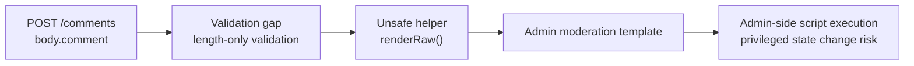
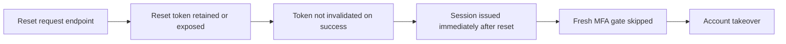
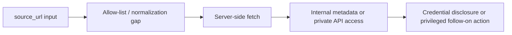
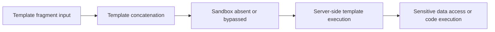
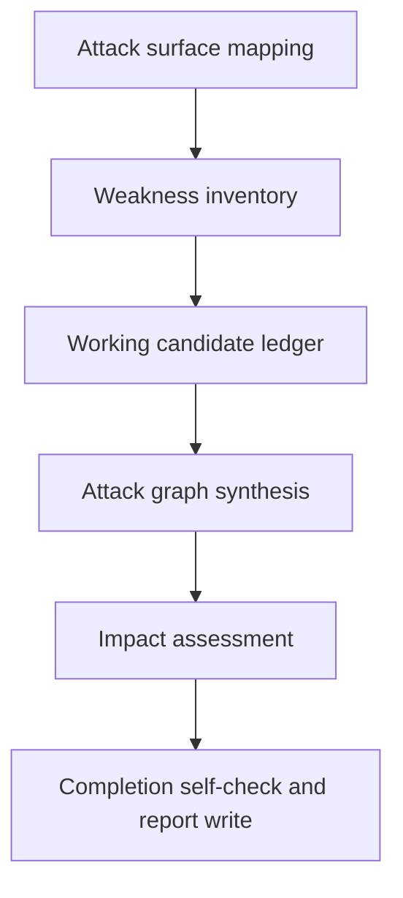
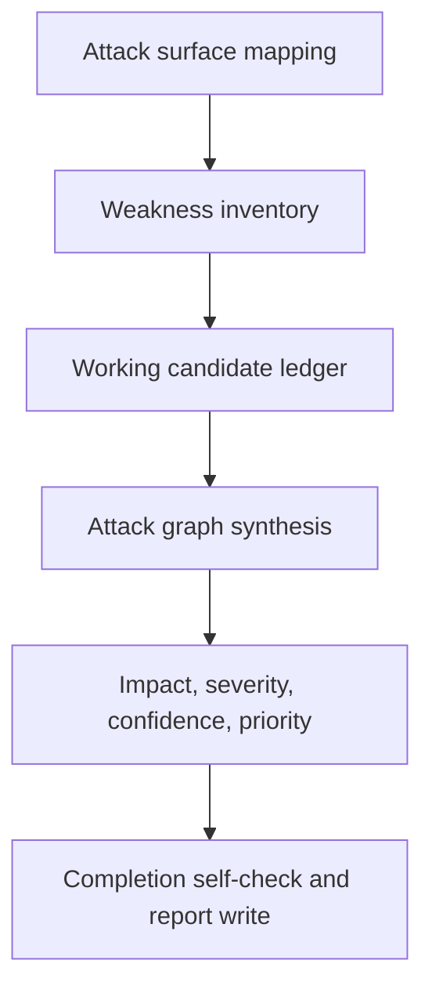
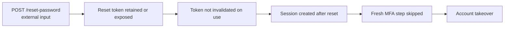

# Improving CodeGopher Chained Vulnerability Static Audit

## Executive Summary

The current `Chained Vulnerability Static Audit` skill already has a strong foundation: it keeps the audit strictly static-only, structures the review into six phases, requires full repository-relative evidence with symbols and line ranges, and already expects Mermaid attack graphs plus a machine-readable JSON candidate ledger in `docs/security/CHAINED_VULNERABILITIES_REVIEW.md`. The most useful revision is therefore not a conceptual rewrite, but an operational upgrade: preserve the boundary and six-phase flow, then add explicit phase outputs, numeric confidence and severity formulas, worked examples, tighter completion gates, and CI-oriented regression checks. Your own benchmark artifacts point in the same direction: the model-performance report shows that complete-chain recall and ledger validity do not move together, and the opportunities report explicitly recommends a final ledger-repair pass, compact episode state, and earlier source-hop-sink checkpoints. citeturn30view1turn30view2turn1view1turn2view0

The external research base supports exactly those changes. OWASP ASVS 5.0 is now the current stable ASVS release and provides a maintained control taxonomy for application verification; OWASP Risk Rating and CVSS v4 both reinforce metric-based scoring; classic static-analysis papers by Livshits and Lam, FlowDroid, and Yamaguchi et al. reinforce the value of source-sink modeling, precision controls, and graph-based reasoning; and the official CodeQL, Semgrep, Joern, and Pysa documentation now makes it practical to turn multi-stage chains into path queries, taint labels/flow states, graph traversals, and testable CI rules. citeturn15view1turn14view0turn14view2turn14view3turn14view14turn14view15turn14view16turn14view4turn21view0turn19view0turn14view7turn20view0turn14view9turn14view11

## Current Skill Assessment

The existing file already captures the right audit skeleton. It defines the six phases as attack-surface mapping, weakness inventory, working candidate ledger, attack-graph synthesis, impact assessment, and completion self-check; it requires negative evidence and explicit safe-control classification; and it already mandates a summary dashboard, Mermaid graphs, detailed chain breakdowns, and a fenced JSON block for `candidate_chains`. What it does not yet provide is a numeric scoring rubric, per-phase machine-readable schemas, worked examples, or concrete analyzer integrations with regression tests. citeturn30view1turn30view2turn30view3

The repo’s own benchmark notes sharpen the priority order. The performance summary shows the best component recall came from one model while the best valid-ledger count came from another, which is a strong signal that discovery and structured reporting should be treated as separate optimization problems. The opportunities report then proposes exactly the additions this revision adopts: a dedicated ledger-repair pass, compact episodic state containing inspected files and missing evidence, and a checkpoint that forces at least one source-hop-sink candidate per reviewed high-risk family before final report writing. citeturn1view1turn2view0

The recommended changes are summarized below. These are synthesized from the current skill and the provided benchmark reports. citeturn30view1turn30view2turn1view1turn2view0

| Area | Keep | Add |
|---|---|---|
| Static boundary | Source-only review, no live probing, no exploit generation | Explicit prohibition on environment-dependent model generation during strict static runs |
| Six phases | Preserve all six phases exactly | Add exit criteria, checklists, and machine-readable outputs for each phase |
| Candidate ledger | Preserve incomplete/rejected/plausible chains and negative evidence | Add numeric state fields, checkpoint gates, and ledger-repair pass |
| Confidence | Preserve qualitative “High/Medium/Low” intent | Add scored formula with runtime-gap penalties and rejection threshold |
| Severity | Preserve impact/reachability language | Add impact/likelihood weights, thresholds, and priority score |
| Reporting | Preserve Markdown report + Mermaid + JSON appendix | Add dashboard schema, risk matrix, sample tables, and CI regression requirements |
| Examples | Preserve generic source-to-sink recipes | Add worked chains for web flow, credential flow, SSRF, and template injection |

## Revised SKILL.md

The revised file below is ready to drop into the repository. It preserves the original static-only mission, six-phase method, report path, and evidence requirements, while incorporating the scoring, checkpointing, examples, tool guidance, and regression-test guardrails justified by the standards, research literature, official tool docs, and your own benchmark notes. citeturn30view1turn30view2turn1view1turn2view0turn15view1turn14view2turn14view3turn21view0turn14view7turn14view9turn14view11

````markdown
---
name: Chained Vulnerability Static Audit
description: >
  Perform an authorized static-only security audit that models source-to-hop-to-sink
  attack chains, scores severity and confidence, maintains machine-readable audit state,
  and writes an evidence-rich report to docs/security/CHAINED_VULNERABILITIES_REVIEW.md.
keywords:
  - chained vulnerabilities
  - exploit chain
  - attack graph
  - source to sink
  - static security audit
  - account takeover
  - lateral movement
  - database exfiltration
  - static taint analysis
---

# Chained Vulnerability Static Audit

Use this skill for an authorized, source-only review of chained security weaknesses.

A chained vulnerability is a path in which individually modest weaknesses combine into a higher-impact outcome such as account takeover, cross-tenant data access, privileged state change, lateral movement, sensitive data exfiltration, or remote code execution.

## Mission

Your job is to:

1. Review only visible repository material.
2. Build evidence-backed source-hop-sink chains using static proof.
3. Maintain a machine-readable working ledger while auditing.
4. Write the final report to `docs/security/CHAINED_VULNERABILITIES_REVIEW.md` when a report-writing tool is available.
5. Always write the report when the report-writing tool is available, even if no complete chains are found.

If the mission contract reports missing gates, continue from the current state and complete only the missing gates. Do not restart the full audit unless the user asks.

## Static-Only Boundary

Allowed inputs:

- Repository files
- Tests and fixtures
- Routes/controllers/handlers
- Services, repositories, query builders, serializers
- Templates, components, mailers, exporters
- Middleware, auth/session code, policy checks
- Configuration, manifests, infrastructure-as-code, workflow files
- Existing project documentation within the workspace

Forbidden actions:

- No live HTTP probing, fuzzing, browser testing, credential attacks, dynamic scanners, exploit scripts, SSRF probes, SQL payloads, port scans, or external network tests
- No executable payload generation
- No operational abuse instructions
- No searches for hidden evaluator metadata, removed manifests, parent directories, benchmark harness files, or unrelated hidden files
- Do not rely on a running environment for audit completion
- Do not invoke model-generation steps that import or execute application code when operating under this strict static-only contract

Use only evidence visible in the current workspace. External framework behavior is not authoritative unless it is represented in repository code, repository tests, configuration, vendored source, or audited static models already committed to the repo.

## Working State

Use the session TODO ledger as the source of truth. Treat it as active task state, not long-term memory. Do not save audit progress to persistent memory unless the user explicitly asks.

Maintain these top-level machine-readable objects in the working state:

```json
{
  "review_scope": {},
  "attack_surface": [],
  "weakness_inventory": [],
  "candidate_chains": [],
  "coverage": {},
  "unknowns": [],
  "not_reviewed": [],
  "suggested_tests": []
}
```

## Evidence Standard

Every final source, hop, sink, and safe control must include:

- Full repository-relative `path`
- Exact `symbol`
- `line` or `line_range`
- `kind` such as `source`, `hop`, `sink`, `control`, `test`, `config`, `template`, or `manifest`
- A short `why_it_matters` note

Use full repository-relative paths in final evidence. Do not abbreviate to file basename when the full path is known.

Preferred evidence notation in prose and tables:

`relative/path.ext:12-18::ExactSymbolName`

When a file-reading tool supports it, use `include_line_numbers=true` for final evidence collection. If a search result provides line numbers, preserve them.

## Chain Model

Each candidate chain must track:

- `id`
- `status`: `complete`, `plausible`, `incomplete`, or `rejected`
- `family`
- `source`
- `hops`
- `sink`
- `impact`
- `preconditions`
- `assumptions`
- `safe_controls`
- `negative_evidence`
- `reviewed_files`
- `confidence`
- `severity`
- `priority`
- `recommended_breakpoints`

A safe control must include a `classification` set to exactly one of:

- `same_path_blocker`
- `nearby_only`
- `not_applicable`
- `unknown`

Do not present speculation as a confirmed chain.

## Confidence Scoring

Confidence measures **evidentiary strength**, not harm.

### Link evidence levels

Assign each required chain link an evidence level from `0` to `4`:

- `4` = exact static proof from cited code/config/tests/templates and an explicit source-to-next-link relation
- `3` = exact location plus one bounded local inference, such as a thin helper wrapper or framework convention reinforced by nearby tests/config
- `2` = likely relation but one important propagation step crosses hidden library/runtime behavior not fully visible in audited source
- `1` = weak hypothesis or pattern match without a proved end-to-end relation
- `0` = disproven, blocked, or absent

Required links are:

- source
- every intermediate hop
- sink

### Supporting factors

Score these supporting fields:

- `preconditions_visible` = `0`, `0.5`, or `1`
- `test_or_config_corroboration` = `0`, `0.5`, or `1`
- `negative_evidence_quality` = `0`, `0.5`, or `1`

Set `runtime_gap_penalty` to one of:

- `0.00` = no material runtime gap
- `0.05` = one low-risk framework/runtime assumption
- `0.15` = one material unresolved runtime/library dispatch step
- `0.30` = chain depends on a critical runtime-only behavior not statically proven

### Formula

Let:

- `Eavg = average(link_evidence) / 4`
- `Emin = min(link_evidence) / 4`

Then compute:

```text
ConfidenceScore =
  round(
    100 * clamp(
      0.45*Eavg +
      0.25*Emin +
      0.10*preconditions_visible +
      0.10*test_or_config_corroboration +
      0.10*negative_evidence_quality -
      runtime_gap_penalty,
      0,
      1
    )
  )
```

### Bands

- `80-100` = High
- `55-79` = Medium
- `30-54` = Low
- `<30` = Hypothesis only; do not report as a complete or plausible chain

## Severity Scoring

Severity measures **impact and exploitability if the chain is real**. It is separate from confidence.

### Impact factors

Score each from `0` to `4`:

- `Confidentiality`
- `Integrity`
- `Availability`
- `PrivilegeIdentityImpact`
- `ScopeBlastRadius`

Compute:

```text
ImpactScore =
  round(
    100 * (
      0.25*Confidentiality +
      0.25*Integrity +
      0.15*Availability +
      0.20*PrivilegeIdentityImpact +
      0.15*ScopeBlastRadius
    ) / 4
  )
```

### Likelihood factors

Score each from `0` to `4`:

- `Exposure`
  - 0 = unreachable/internal dead path
  - 1 = tightly admin-only
  - 2 = authenticated user only
  - 3 = low-privilege external user
  - 4 = unauthenticated external user
- `PreconditionBurden`
  - 0 = highly constrained/rare state
  - 4 = straightforward and repeatable
- `MitigationGap`
  - 0 = strong compensating controls
  - 4 = no meaningful compensating controls
- `Repeatability`
  - 0 = one-off/manual
  - 4 = automatable/replayable/at scale

Compute:

```text
LikelihoodScore =
  round(
    100 * (
      0.35*Exposure +
      0.25*PreconditionBurden +
      0.20*MitigationGap +
      0.20*Repeatability
    ) / 4
  )
```

### Severity formula

```text
SeverityScore = round(0.60*ImpactScore + 0.40*LikelihoodScore)
```

### Severity bands

- `80-100` = Critical
- `60-79` = High
- `40-59` = Medium
- `20-39` = Low
- `0-19` = Informational

## Priority Scoring

Priority combines severity and confidence for remediation planning.

```text
PriorityScore = round(0.65*SeverityScore + 0.35*ConfidenceScore)
```

Priority bands:

- `85-100` = `P0` immediate
- `70-84` = `P1` next sprint
- `55-69` = `P2` scheduled remediation
- `40-54` = `P3` hardening/backlog
- `<40` = `P4` monitor or reject

Do not lower the **severity** band because of low confidence. Lower the **priority** if evidence is weak.

## High-Risk Families

Before a “no complete chains” conclusion, verify review coverage across these families:

- controllers, routes, RPC handlers, webhooks
- auth, session, token issuance, MFA, password reset, invite flows
- authorization and tenant/ownership enforcement
- validators, serializers, file upload handlers
- query builders, raw SQL/NoSQL/search expressions
- outbound fetch, callbacks, webhook delivery, URL parsers
- templates, renderers, mail preview, export generators
- deserialization, archive/path handling, filesystem writes
- background jobs, delayed tasks, race/state transitions
- workflow files, repo automation, deployment scripts when security-relevant

If these families were not reviewed, discovery is incomplete.

## Six-Phase Method

### Attack Surface Mapping

Goal: enumerate reachable sources, trust boundaries, state transitions, and valuable sinks.

Concrete steps:

1. Enumerate routes, handlers, webhooks, workers, cron jobs, CLI admin commands, importer/exporter paths, and workflow-triggered code.
2. Mark user-controlled inputs by origin:
   - path
   - query
   - header
   - cookie
   - body/form
   - uploaded file
   - message queue payload
   - webhook body
   - environment/config
   - repository event metadata
3. Mark authn/authz expectations and whether the endpoint changes state.
4. Mark adjacent sinks:
   - session creation
   - token verification
   - role change
   - ORM/raw query
   - template rendering
   - outbound fetch
   - filesystem write
   - archive extraction
   - parser/interpreter invocation
5. Record exact evidence.

Machine-readable output:

```json
{
  "attack_surface": [
    {
      "id": "AS-001",
      "kind": "http_route|worker|webhook|cli|template|workflow",
      "entrypoint": "POST /reset-password",
      "authn": "none|optional|required|admin",
      "state_change": true,
      "sources": [
        {
          "name": "body.email",
          "kind": "body",
          "evidence": {
            "path": "src/web/reset_controller.ext",
            "symbol": "ResetController.requestReset",
            "line_range": "14-34",
            "kind": "source",
            "why_it_matters": "Accepts external email input"
          }
        }
      ],
      "adjacent_sinks": ["token_generation", "session_creation"],
      "evidence": []
    }
  ]
}
```

Exit criteria:

- major entrypoint families mapped
- trust boundaries identified
- at least one source recorded for each reviewed family

### Weakness Inventory

Goal: inventory low/medium weaknesses that can become chain links.

Concrete steps:

1. Inspect validation, normalization, allow-lists, escaping, sanitization, token lifecycle, ownership checks, and state-transition guards.
2. Record weaknesses even if they do not yet form a complete chain.
3. Record positive controls and nearby controls that may be decoys.
4. Tag each weakness with likely families, CWE/OWASP mapping if obvious, and candidate downstream sinks.

Machine-readable output:

```json
{
  "weakness_inventory": [
    {
      "id": "W-001",
      "family": "csrf|xss|idor|ssrf|sqli|ssti|authz|deserialization|path|archive|session",
      "title": "State-changing endpoint lacks anti-CSRF validation",
      "source_ids": ["AS-002"],
      "related_sinks": ["privileged_mutation"],
      "controls_present": [],
      "controls_missing": ["csrf_token_validation"],
      "evidence": [],
      "notes": ""
    }
  ]
}
```

Exit criteria:

- weaknesses recorded with evidence
- safe controls captured beside missing controls
- downstream sink candidates attached where possible

### Working Candidate Ledger

Goal: continuously maintain candidate chains and their current proof state.

Statuses:

- `complete` = end-to-end statically proved with High or Medium confidence
- `plausible` = end-to-end path exists but confidence is still Medium and not all edges are equally strong
- `incomplete` = interesting partial chain lacking a proved link
- `rejected` = disproven or blocked by a same-path control

Concrete steps:

1. Create a candidate when a source can reasonably connect to a weakness family and a sink family.
2. Record both positive and negative evidence immediately.
3. Record the exact control that blocks a path when rejecting it.
4. Record missing evidence explicitly rather than relying on memory.
5. Keep candidate IDs stable across corrective passes.

Machine-readable output:

```json
{
  "candidate_chains": [
    {
      "id": "CH-001",
      "status": "incomplete",
      "family": "reset-token -> session",
      "source": {},
      "hops": [],
      "sink": {},
      "safe_controls": [],
      "negative_evidence": [],
      "missing_evidence": [
        "Could not prove token invalidation after successful reset"
      ],
      "reviewed_files": []
    }
  ]
}
```

Exit criteria:

- every meaningful path has a candidate or explicit rejection
- every rejection has a blocker and evidence
- every incomplete candidate has missing-evidence notes

### Attack Graph Synthesis

Goal: turn findings into concrete source-hop-sink graphs.

Concrete steps:

1. Join attack-surface entries, weakness entries, and candidate chains.
2. Prefer proven control-flow, data-flow, authorization-flow, and state-transition edges.
3. Model chain edges explicitly:
   - external input -> parser/validator gap
   - token/identifier -> lookup or trust transition
   - weak render/fetch/query helper -> dangerous sink
   - dangerous sink -> business/technical impact
4. Run an early checkpoint:
   - for every reviewed high-risk family, require at least one candidate source-hop-sink path or an explicit reviewed-and-rejected statement
5. If recall seems strong but the ledger is malformed or incomplete, run a ledger-repair pass before finalizing.

Machine-readable output:

```json
{
  "candidate_chains": [
    {
      "id": "CH-003",
      "graph": {
        "nodes": [],
        "edges": []
      }
    }
  ],
  "coverage": {
    "reviewed_families": [],
    "families_with_candidates": [],
    "families_only_rejected": [],
    "families_not_reviewed": []
  }
}
```

Exit criteria:

- at least one candidate or explicit rejection per reviewed high-risk family
- every complete/plausible chain has a graph
- shallow “no chain” conclusions blocked until coverage is adequate

### Impact Assessment

Goal: compute confidence, severity, priority, and the easiest breakpoint.

Concrete steps:

1. Assign link-evidence levels.
2. Compute confidence from the formula above.
3. Compute severity from impact and likelihood factors.
4. Compute priority.
5. Identify the cheapest robust breakpoint:
   - earlier trust-boundary validation
   - safer default renderer/query/fetch helper
   - token/session lifecycle fix
   - authorization guard at shared abstraction layer
6. Prefer systemic breakpoints that eliminate multiple candidate chains.

Machine-readable output:

```json
{
  "candidate_chains": [
    {
      "id": "CH-003",
      "confidence": {
        "score": 78,
        "band": "Medium",
        "link_evidence": [4, 3, 3, 4],
        "runtime_gap_penalty": 0.05
      },
      "severity": {
        "impact_score": 71,
        "likelihood_score": 89,
        "score": 78,
        "band": "High"
      },
      "priority": {
        "score": 82,
        "band": "P1"
      },
      "recommended_breakpoints": [
        "Invalidate reset token on success and require a fresh MFA step before session issuance"
      ]
    }
  ]
}
```

Exit criteria:

- every complete/plausible candidate scored
- every incomplete/rejected candidate has confidence or rejection rationale
- every reported chain has at least one remediation breakpoint

### Completion Self-Check

Goal: block weak reports and finish a report that is both readable and machine-checkable.

Concrete steps:

1. Verify every reported source/hop/sink/control has full path, symbol, and line or line range.
2. Verify every rejection cites a blocker and not merely a guess.
3. Verify incomplete candidates preserve negative evidence and missing links.
4. Verify at least three broad sweeps were completed before “no chain”.
5. Run a final ledger-repair pass:
   - ensure candidate IDs are stable
   - fill required JSON fields
   - normalize statuses
   - ensure safe-control classification values are valid
6. Write the report to `docs/security/CHAINED_VULNERABILITIES_REVIEW.md`.

Exit criteria:

- no missing evidence keys in final JSON
- no reported complete/plausible chain with `ConfidenceScore < 30`
- no “no chains detected” report without reviewed-area coverage plus at least one incomplete or rejected candidate

## Required Broad Sweeps Before “No Chains”

Complete and record at least these sweeps:

1. identifier / tenant / ownership chains across routes, services, repositories, and templates
2. quiet prerequisite helpers such as generated IDs, predictable references, reset or invite tokens, summary builders, raw-label helpers, preview renderers, export helpers
3. injection / SSRF / redirect / outbound-fetch / webhook / template / archive / path / deserialization chains
4. reset / session / invite / token / MFA / verbose-error / config exposure / race / background-job chains

## Worked Examples

These are illustrative only. Do not convert them into exploit instructions.

### Example: Web App Flow With Stored Admin-Side Script Execution

| Element | Example evidence |
|---|---|
| Source | `web/routes/comments.ext:41-58::postComment` accepts `body.comment` |
| Hop | `web/validation/comments.ext:12-27::validateComment` enforces length but no HTML neutralization |
| Hop | `web/templates/helpers.ext:88-96::renderRaw` bypasses default escaping |
| Sink | `web/templates/admin/moderation.ext:31-31::<template>` renders raw comment body in admin moderation page |
| Impact | privileged user browser context can be abused for admin-side actions and session compromise |
| Confidence | link evidence `[4,4,4,4]`, no runtime gap |
| Severity | high integrity and privilege impact; authenticated external exposure |



### Example: Credential Flow With Reset Token Replay And MFA Bypass

| Element | Example evidence |
|---|---|
| Source | `auth/reset_request.ext:19-42::requestReset` issues reset tokens for user email |
| Hop | `auth/reset_store.ext:10-28::saveResetToken` stores token as retrievable plaintext or logs it |
| Hop | `auth/reset_complete.ext:55-92::completeReset` verifies token but does not mark it used |
| Hop | `auth/session.ext:41-67::issueSessionAfterReset` creates session immediately after reset |
| Sink | `auth/mfa_gate.ext:18-25::requiresFreshMfa` is not invoked on reset-complete path |
| Impact | account takeover through reset flow without fresh MFA assurance |
| Confidence | exact source and sink; one trust-transition path may depend on framework session middleware |
| Severity | direct identity compromise with high repeatability |



### Example: SSRF Flow To Internal Metadata Or Private Service

| Element | Example evidence |
|---|---|
| Source | `integrations/import_preview.ext:21-49::previewImport` accepts `body.source_url` |
| Hop | `net/url_guard.ext:11-37::isAllowedUrl` checks hostname textually but not resolved IP / protocol transitions |
| Hop | `net/fetcher.ext:44-71::fetchRemote` performs server-side fetch to arbitrary URL-ish input |
| Sink | `cloud/credentials.ext:9-16::loadInstanceCredentials` or internal admin API client becomes reachable from fetched response/context |
| Impact | internal resource access, metadata disclosure, follow-on privileged API use |
| Confidence | exact source and fetch sink; confidence reduced if private-network routing is not fully visible in repo |
| Severity | very high confidentiality, privilege, and scope impact |



### Example: Template Injection Flow In Preview Or Mail Rendering

| Element | Example evidence |
|---|---|
| Source | `mailer/preview_route.ext:16-36::previewTemplate` accepts user-controlled template fragment |
| Hop | `templating/compiler.ext:24-51::compileTemplate` concatenates user input into a server-side template |
| Hop | `templating/sandbox.ext:8-18::sandboxDisabled` disabled or not applied on preview path |
| Sink | `mailer/render.ext:63-84::renderPreview` executes template engine with powerful objects in scope |
| Impact | sensitive file/data access or server-side code execution depending on engine capabilities |
| Confidence | exact source and render path; sandbox semantics may require runtime-gap penalty if locally undocumented |
| Severity | critical if privileged objects or unrestricted engine features are exposed |



## Optional Tool Integrations

Use tooling only to strengthen static evidence. Tool output does not replace cited code evidence.

### CodeQL

Use for:

- interprocedural path queries
- framework-aware data flow
- flow-state modeling when danger depends on multiple properties
- custom query packs and regression tests

Illustrative path-query skeleton:

```ql
/**
 * @name User-controlled value reaches dangerous sink
 * @kind path-problem
 * @id custom/chained/source-to-sink
 */
import <language>
/* import the language-specific dataflow library when required */

module Flow = TaintTracking::Global<MyConfiguration>;
import Flow::PathGraph

from Flow::PathNode source, Flow::PathNode sink
where Flow::flowPath(source, sink)
select sink.getNode(), source, sink, "User-controlled value reaches dangerous sink."
```

Use flow-state variants when a chain depends on multiple taint kinds or partial sanitization.

### Semgrep

Use for:

- high-recall weakness inventory
- fast taint rules for common source/sink families
- lightweight custom policies in CI
- optional cross-file joins where supported and appropriate

Illustrative taint rule:

```yaml
rules:
  - id: user-controlled-url-to-fetch
    mode: taint
    languages: [javascript, typescript]
    message: User-controlled URL reaches outbound fetch
    severity: WARNING
    pattern-sources:
      - pattern-either:
          - pattern: req.query[$X]
          - pattern: req.params[$X]
          - pattern: req.body[$X]
    pattern-sanitizers:
      - pattern: allowlistedUrl(...)
    pattern-sinks:
      - patterns:
          - pattern-either:
              - pattern: fetch($URL, ...)
              - pattern: axios.get($URL, ...)
          - focus-metavariable: $URL
```

Use taint labels when data becomes dangerous only after multiple stages.

### Joern

Use for:

- graph-centric exploration
- cross-language code-property-graph queries
- path exploration from source families to sink families

Illustrative traversal sketch:

```scala
val src =
  cpg.call.name("(?i).*(param|query|body|header|cookie|form).*").argument

val sink =
  cpg.call.name("(?i).*(render|fetch|get|post|exec|queryRaw|fromString).*").argument

sink.reachableByFlows(src).p
```

### Pysa

Use only for Python-heavy repos when static models are sufficient.

Use for:

- Python taint analysis with explicit sources, sinks, and rules
- JSON result export and taint model inspection
- narrowing or confirming candidate chains in Python services

Avoid environment-dependent model generators during strict static-only runs.

### Optional stack hints

Node / TypeScript:

- common sources: `req.params`, `req.query`, `req.body`, headers, cookies
- common sinks: raw template helpers, `res.render`, `fetch`/`axios`, raw ORM queries, `child_process`

Python:

- common sources: `request.args`, `request.form`, `request.headers`, task payloads
- common sinks: `render_template_string`, outbound `requests`, raw SQL, `subprocess`, template compilation

Go:

- common sources: `r.URL.Query()`, `r.FormValue`, headers, JSON decode targets
- common sinks: `http.Get`, `template.Parse`, `exec.Command`, raw SQL format strings

## False-Positive Mitigation

Always perform these checks before confirming a chain:

- Search for same-path blockers near the sink and along the source path
- Verify whether default escaping / CSRF / authz / allow-list behavior is explicitly enabled in repo config
- Look for tests that prove either the dangerous path or the defensive path
- Distinguish “nearby_only” controls from controls actually covering the audited path
- Downgrade confidence when key propagation crosses reflection, plugin wiring, code generation, complex framework magic, or hidden dependency code
- If tool output and code evidence disagree, prefer code evidence and keep the candidate incomplete unless resolved

## Verification Steps

For each complete or plausible chain:

1. Re-open every source, hop, sink, and control citation.
2. Re-check symbol names and line ranges.
3. Ensure the impact statement follows from the cited trust transition or dangerous sink.
4. Ensure negative evidence is present for every unresolved adjacent branch.
5. Recompute confidence and severity after any evidence update.
6. Confirm the cheapest robust breakpoint is correctly identified.

## Report Output

Write the final report to:

`docs/security/CHAINED_VULNERABILITIES_REVIEW.md`

Required structure:

```markdown
# Chained Vulnerabilities Review

## Executive Dashboard
| Field | Value |
|---|---|
| Audit stamp | |
| Repository / ref | |
| Languages observed | |
| Paths reviewed | |
| High-risk families reviewed | |
| Broad sweeps completed | |
| Complete chains | |
| Plausible chains | |
| Incomplete chains | |
| Rejected chains | |
| Maximum severity | |
| Maximum confidence | |
| Highest priority chain | |
| Tools used | |

## Static-Only Methodology Note

## Six-Phase Summary

## Coverage Summary

## Complete and Plausible Chains

## Candidate Chain Ledger

## Cross-Cutting Weaknesses

## Unknowns and Not Reviewed Areas

## Suggested Regression Tests

## JSON Appendix
```

Required flowchart:



For each complete or plausible chain include:

- short chain title
- one Mermaid attack graph
- preconditions
- source-hop-sink evidence table
- confidence and severity calculations
- safe controls reviewed
- negative evidence
- remediation breakpoint(s)

Use stable chain headings such as:

`## Chain: source -> hop -> sink`

### Required source-hop-sink table

```markdown
| Link | Path | Symbol | Line(s) | Why it matters | Control status |
|---|---|---|---|---|---|
```

### Required JSON appendix

Embed a fenced `json` block containing at least:

```json
{
  "review_scope": {
    "paths_reviewed": [],
    "languages_observed": [],
    "reviewed_families": [],
    "not_reviewed_families": []
  },
  "candidate_chains": [
    {
      "id": "CH-001",
      "status": "complete",
      "family": "reset-token -> session",
      "source": {
        "path": "",
        "symbol": "",
        "line_range": "",
        "kind": "source",
        "why_it_matters": ""
      },
      "hops": [],
      "sink": {
        "path": "",
        "symbol": "",
        "line_range": "",
        "kind": "sink",
        "why_it_matters": ""
      },
      "preconditions": [],
      "assumptions": [],
      "safe_controls": [],
      "negative_evidence": [],
      "confidence": {
        "score": 0,
        "band": ""
      },
      "severity": {
        "impact_score": 0,
        "likelihood_score": 0,
        "score": 0,
        "band": ""
      },
      "priority": {
        "score": 0,
        "band": ""
      },
      "recommended_breakpoints": []
    }
  ],
  "suggested_tests": []
}
```

If no complete chains are found, still write a report with:

- “No chains detected” summary
- reviewed areas
- not-reviewed areas
- weakness inventory
- at least one incomplete or rejected candidate with negative evidence
- suggested tests to improve future coverage

## Prioritization Guidance

Prefer fixes that break multiple chains at once:

1. earlier trust-boundary validation
2. safe shared abstractions
3. token/session lifecycle hardening
4. shared authorization enforcement
5. renderer/query/fetch defaults
6. engine sandboxing or privilege reduction
7. late-stage compensating controls

Use this priority matrix after scoring:

| Severity \ Confidence | High | Medium | Low | Hypothesis |
|---|---:|---:|---:|---:|
| Critical | P0 | P1 | P2 | reject/research |
| High | P1 | P1 | P2 | reject/research |
| Medium | P2 | P2 | P3 | reject/research |
| Low / Info | P3 | P3 | P4 | reject/research |

## Suggested Unit Tests And CI Checks

Add or require:

- positive and negative fixtures for each recurring chain family
- regression tests for:
  - reset token invalidation
  - ownership/tenant scoping
  - CSRF enforcement on state-changing endpoints
  - output escaping in admin and preview templates
  - URL validation for outbound fetches
  - sandbox enforcement for template preview/render paths
- JSON schema validation for the final appendix
- snapshot tests for the Markdown ledger structure
- a CI gate that fails if:
  - required ledger fields are missing
  - `same_path_blocker` controls are missing evidence
  - a “no chains detected” report lacks coverage fields or incomplete/rejected candidates

Suggested CI checks:

- CodeQL custom query tests via `codeql test run`
- Semgrep rule tests with positive (`ruleid`) and negative (`ok`) fixtures
- SARIF upload for third-party static findings where supported
- CODEOWNERS review on workflow and security-report templates
- pinned CI actions and least-privilege workflow permissions

## Final Safety Rule

Never include exploit scripts, live payloads, credential attacks, or step-by-step abuse instructions.
Prefer concise, ASCII-safe Markdown and path-precise evidence.
````

## Research Summary and Source Influence

The revised skill is grounded first in current application-security standards. OWASP ASVS 5.0 is now the latest stable ASVS release and explicitly positions itself as a basis for testing technical security controls and establishing confidence in web applications. OWASP Top 10 2025 is now the current Top 10 release, while the OWASP Cheat Sheet Series remains the most practical source for control-specific remediation guidance. That is why the revised file maps chain families and remediation suggestions to concrete control areas such as authorization, CSRF, session management, secrets, authentication, XSS prevention, parameterized queries, and SSRF prevention. citeturn15view1turn15view0turn15view2turn15view3turn15view4turn15view5turn15view6turn15view8turn14view1turn24view0turn24view1

The scoring model deliberately separates severity from confidence because the standards do. OWASP Risk Rating splits risk into likelihood and impact; CVSS v4 similarly organizes severity around explicit metric groups and preserves a transparent, metric-based methodology. The revised skill borrows that discipline, but adds an explicit static-proof overlay: a chain can be severe in theory and still have only Medium or Low confidence if a critical edge depends on unresolved runtime behavior. That is a necessary adaptation for static chain audits, and it is consistent with the precision-versus-noise tradeoffs documented in the static-analysis literature. citeturn14view2turn14view3turn16view0turn14view15turn16view2

The literature that most directly shaped the phase refinement is the classic source-sink and graph-analysis work. Livshits and Lam showed why unchecked input to security-sensitive sinks is the core pattern for many web flaws. FlowDroid showed that precision controls matter because coarse approximations raise both missed leaks and false alarms. Yamaguchi’s Code Property Graph paper demonstrated that vulnerability discovery becomes more tractable when syntax, control flow, and dependence edges can be traversed as one graph. Those ideas directly influenced the revised per-link evidence levels, runtime-gap penalties, attack-graph emphasis, and the insistence that every candidate chain keep both positive and negative evidence. citeturn14view14turn14view15turn14view16turn16view1turn16view2turn16view3

The tooling guidance is based on official platform documentation rather than secondary summaries. CodeQL’s path-query structure, flow-state support, model packs, test packs, supported languages, and SARIF integration make it the best fit for high-confidence, path-rich evidence. Semgrep’s taint mode, taint labels, testing framework, CI support, and experimental join mode make it well suited for broad weakness inventory and fast custom detectors. Joern’s code property graph and data-flow steps make it useful for graph-centric exploration. Pysa is valuable for Python services, but its official docs also document two major caveats that matter under a static-only boundary: the analyzer only sees the repo plus configured search paths, and many model generators require a running environment that imports project code. Those limitations are why the revised skill explicitly permits static-model use but bans environment-dependent model generation during strict static audits. citeturn21view0turn19view0turn14view6turn17view4turn17view0turn17view5turn17view6turn14view7turn20view0turn17view3turn17view2turn14view8turn14view9turn14view10turn23search1turn23search2turn25view0

The repo-specific changes came from your own benchmark reports. The existing report examples emphasize dashboard-first reporting and prioritized improvements. More importantly, they show that component recall, final chain recall, and ledger validity can diverge materially across models, and they recommend exactly the additions that make an agentic skill more reliable: a separate ledger-repair pass, compact episodic state, earlier chain-synthesis checkpoints, and stronger coverage signals. Those lessons were folded directly into the revised phase outputs and completion gates rather than relegated to optional notes. citeturn1view1turn2view0

The highest-priority sources and how they changed the file are summarized below.

| Source | Influence on the revision |
|---|---|
| Current `SKILL.md` in the repo citeturn30view1turn30view2 | Preserved the static-only boundary, six-phase flow, full path/symbol/line evidence requirements, Mermaid requirement, JSON candidate ledger, and “write report even when no chains are found.” |
| Repo benchmark reports `MODEL_PERFORMANCE.md` and `OPPORTUNITIES.md` citeturn1view1turn2view0 | Added ledger-repair pass, compact episodic state, early source-hop-sink checkpoints, and explicit coverage gates before “no chains” results. |
| OWASP ASVS 5.0 and OWASP Top 10 2025 citeturn15view1turn15view0 | Updated the standards baseline and motivated the report/dashboard structure around verification coverage rather than ad hoc notes. |
| OWASP Risk Rating and CVSS v4 citeturn14view2turn14view3turn16view0 | Drove the severity model, confidence/priority separation, and explicit numeric thresholds. |
| Livshits and Lam 2005 citeturn14view14turn16view1 | Reinforced source-to-sink thinking for web application flaws and informed the chain-link evidence model. |
| FlowDroid 2014 citeturn14view15turn16view2 | Reinforced the need to manage false positives through precision controls and visible assumptions. |
| Yamaguchi et al. 2014 and Joern docs citeturn14view16turn14view9turn14view10 | Justified treating the audit as graph synthesis rather than a flat weakness checklist. |
| CodeQL official docs citeturn21view0turn19view0turn14view6turn17view4turn17view5turn17view6turn17view0 | Shaped path-query templates, flow-state advice, model-pack integration, regression testing, SARIF output, and CI posture. |
| Semgrep official docs citeturn14view7turn20view0turn17view3turn17view2turn14view8turn17view1 | Shaped taint rules, labels, testing guidance, CI integration, and the caveat that cross-file join mode is experimental. |
| Pysa official docs citeturn23search1turn23search2turn25view0 | Added Python-specific guidance, machine-readable output ideas, and the explicit warning about environment-dependent model generation. |
| OWASP cheat sheets for XSS, CSRF, session, auth, authz, SQLi, SSRF, secrets, MFA citeturn15view2turn15view3turn15view4turn15view5turn15view6turn15view8turn14view1turn24view0turn24view1 | Informed the remediation advice, worked examples, and suggested regression tests. |
| SANS Critical Controls, DevSecOps survey, and 2026 AI source-code analysis paper citeturn15view9turn14view12turn14view13 | Supported CI integration, recurring static scans, compensating-control language, and the tighter prohibition on exploit-oriented outputs from AI audit workflows. |

## Tool Comparison, Query Examples, and CI Checks

The comparison below is synthesized from official documentation on CodeQL path queries, model packs, supported languages, query testing, and SARIF upload; Semgrep taint mode, taint labels, rule testing, CI behavior, supported-language differences, and experimental join mode; Joern’s code property graph and data-flow steps; Pysa’s taint modeling, JSON outputs, and model-generation limitations; and gosec’s AST/SSA scanning model. citeturn21view0turn19view0turn14view6turn17view4turn17view0turn17view5turn17view6turn14view7turn20view0turn17view3turn17view2turn14view8turn17view1turn14view9turn14view10turn23search1turn23search2turn25view0turn17view7

| Tool | Best role in this skill | Strengths for chained audits | Most important limitation |
|---|---|---|---|
| CodeQL | High-confidence path confirmation | Interprocedural data flow, path explanations, custom packs, test packs, SARIF, broad language support including GitHub Actions workflows | Requires extractor/build setup and custom modeling for niche framework semantics |
| Semgrep | Fast weakness inventory and policy enforcement | Simple custom rules, taint mode, taint labels for multi-stage logic, CI-native workflow, good developer feedback loop | Feature depth varies by language; join mode is experimental |
| Joern | Research-oriented graph exploration | Code property graph across languages, graph traversals, explicit reachable flows | Higher setup/query overhead; less turnkey for repo CI merges |
| Pysa | Python-specific deeper taint confirmation | Source/sink/rule model, JSON outputs, good fit for Python service stacks | Python only; missing dependency source and env-dependent model generators can distort a strict static-only run |
| gosec | Lightweight Go guardrail | Easy Go CI integration, AST/SSA-based checks | Rule-based, not chain-centric |

The query examples below are illustrative skeletons. They are intended to show how the revised skill can be backed by real static analyzers, not to be pasted blindly into every repo.

**CodeQL path-query skeleton** based on the documented `@kind path-problem` structure and `PathGraph` import pattern. citeturn21view0turn21view1turn21view2

```ql
/**
 * @name User-controlled URL reaches outbound fetch
 * @kind path-problem
 * @id custom/chained/url-to-fetch
 */
import javascript
import semmle.javascript.dataflow.TaintTracking

module Config implements TaintTracking::ConfigSig {
  predicate isSource(DataFlow::Node n) {
    exists(DataFlow::ParameterNode p | n = p)
  }

  predicate isSink(DataFlow::Node n) {
    exists(CallExpr c |
      c.getCalleeName() = ["fetch", "axios", "got"] and
      n.asExpr() = c.getArgument(0)
    )
  }
}

module Flow = TaintTracking::Global<Config>;
import Flow::PathGraph

from Flow::PathNode src, Flow::PathNode sink
where Flow::flowPath(src, sink)
select sink.getNode(), src, sink, "User-controlled URL reaches outbound fetch."
```

**Semgrep taint rule** using the documented `mode: taint`, `pattern-sources`, `pattern-sanitizers`, `pattern-sinks`, and sink-focused metavariables. citeturn14view7turn20view0

```yaml
rules:
  - id: user-controlled-url-to-fetch
    mode: taint
    languages: [javascript, typescript]
    message: User-controlled URL reaches outbound fetch
    severity: WARNING
    pattern-sources:
      - pattern-either:
          - pattern: req.query[$X]
          - pattern: req.params[$X]
          - pattern: req.body[$X]
    pattern-sanitizers:
      - pattern: allowlistedUrl(...)
    pattern-sinks:
      - patterns:
          - pattern-either:
              - pattern: fetch($URL, ...)
              - pattern: axios.get($URL, ...)
              - pattern: got($URL, ...)
          - focus-metavariable: $URL
```

**Joern flow sketch** using data-flow reachability to jump from source families to sink families. Joern’s docs explicitly expose `reachableBy` and `reachableByFlows` for this purpose. citeturn14view10

```scala
val src =
  cpg.call.name("(?i).*(param|query|body|header|cookie|form).*").argument

val sink =
  cpg.call.name("(?i).*(fetch|get|post|render|exec|queryRaw|fromString).*").argument

sink.reachableByFlows(src).p
```

**CodeQL regression test command** and **Semgrep rule test discipline** should both become standard for custom detectors. CodeQL’s official guidance uses `codeql test run`, while Semgrep’s official rule test annotations use `ruleid` and `ok` to protect against false negatives and false positives. citeturn22view1turn17view3

```bash
codeql test run path/to/test-pack
semgrep test path/to/rules
```

For CI, the best pattern is to keep findings machine-readable and uploadable. GitHub supports SARIF 2.1.0 subsets for third-party scanners; CodeQL uploads automatically in its native workflow; and GitHub’s workflow-security guidance recommends least-privilege tokens, CODEOWNERS for workflow changes, OIDC for cloud auth, and pinned workflow dependencies. citeturn17view5turn17view6turn18view0

```yaml
name: chained-audit-guardrails

on:
  pull_request:
  push:
    branches: [main]

permissions:
  contents: read

jobs:
  codeql:
    permissions:
      contents: read
      actions: read
      security-events: write
    runs-on: ubuntu-latest
    steps:
      - uses: actions/checkout@<pinned-sha>
      - uses: github/codeql-action/init@<pinned-sha>
        with:
          languages: javascript-typescript, python, go
          queries: +security-extended
      - uses: github/codeql-action/analyze@<pinned-sha>

  semgrep:
    permissions:
      contents: read
      security-events: write
    runs-on: ubuntu-latest
    steps:
      - uses: actions/checkout@<pinned-sha>
      - run: semgrep ci --sarif --config .semgrep/ > semgrep.sarif
      - uses: github/codeql-action/upload-sarif@<pinned-sha>
        with:
          sarif_file: semgrep.sarif

  static-ledger-contract:
    runs-on: ubuntu-latest
    steps:
      - uses: actions/checkout@<pinned-sha>
      - run: python tools/validate_chained_report_schema.py docs/security/CHAINED_VULNERABILITIES_REVIEW.md
```

A small but important boundary note belongs in implementation guidance: Pysa’s own docs say many model generators require importing project code in a running environment. Under the strict static-only skill boundary, that should remain off by default; use committed static models and taint configs instead. citeturn25view0turn23search2

## Scoring Examples and Attack Graphs

The scoring overlay below is intentionally two-part. Severity measures the likely technical and business harm if the chain exists, while confidence measures how strongly the static evidence proves the chain. That structure is informed by OWASP Risk Rating’s likelihood/impact split and CVSS’s metric-based severity model, but adapted to a static-audit context in which unresolved runtime edges must be penalized explicitly. citeturn14view2turn14view3turn16view0



The example attack graph below shows the kind of compact source-hop-sink reasoning the revised file expects for a credential-reset chain. The underlying impact assumptions are grounded in OWASP’s guidance that MFA reset/bypass paths can themselves become attack paths, and that session lifecycle controls should be enforced server-side. citeturn24view0turn15view4



The sample confidence outcomes below use the proposed formula from the revised file.

| Scenario | Link evidence | Preconditions visible | Test/config corroboration | Negative-evidence quality | Runtime-gap penalty | Confidence score | Band |
|---|---|---:|---:|---:|---:|---:|---|
| Exact end-to-end chain with direct tests | `[4,4,4,4]` | 1.0 | 1.0 | 1.0 | 0.00 | 100 | High |
| Exact source and sink, one bounded framework inference | `[4,3,3,4]` | 1.0 | 0.5 | 1.0 | 0.05 | 78 | Medium |
| Exact source and sink, weak intermediate proof | `[4,2,2,4]` | 0.5 | 0.0 | 0.5 | 0.15 | 41 | Low |
| Pattern suspicion without reliable end-to-end proof | `[2,1,1,2]` | 0.0 | 0.0 | 0.5 | 0.30 | 0 | Hypothesis |

The prioritization matrix below is the operational layer that security teams can use after severity and confidence are computed. It is a proposed workflow construct, not a CVSS replacement.

| Severity \ Confidence | High | Medium | Low | Hypothesis |
|---|---:|---:|---:|---:|
| Critical | P0 | P1 | P2 | Reject or research |
| High | P1 | P1 | P2 | Reject or research |
| Medium | P2 | P2 | P3 | Reject or research |
| Low or Informational | P3 | P3 | P4 | Reject or research |

Finally, the sample worked-chain scores below show how the model behaves on the four example families included in the revised file. The impact assumptions come from OWASP’s XSS, session, MFA, and SSRF guidance, plus OWASP and PortSwigger SSTI material for server-side template injection risk. citeturn15view5turn15view4turn24view0turn3search9turn3search18turn29view0turn29view1

| Example chain | Impact score | Likelihood score | Severity score | Example confidence | Priority score | First breakpoint to fix |
|---|---:|---:|---:|---:|---:|---|
| Stored script execution on admin moderation page | 70 | 80 | 74 | 78 | 75 | Remove raw-render helper or enforce escaping at shared renderer |
| Reset token replay plus session issuance plus MFA bypass | 71 | 89 | 78 | 90 | 82 | Make tokens single-use and require fresh MFA before session creation |
| SSRF to metadata or private API path | 89 | 69 | 81 | 68 | 76 | Normalize and resolve URLs before fetch; block private/link-local destinations |
| Template preview injection with sandbox gap | 92 | 55 | 77 | 72 | 75 | Stop concatenating template input or enforce a logic-less/sandboxed renderer |

The net result is a skill that is still safely static-only, but is now far more operational: more testable, more machine-readable, more explicit about proof strength, and better aligned with both the repo’s benchmark lessons and the current standards-and-tooling ecosystem. citeturn30view3turn1view1turn2view0turn15view1turn21view0turn14view7turn14view9