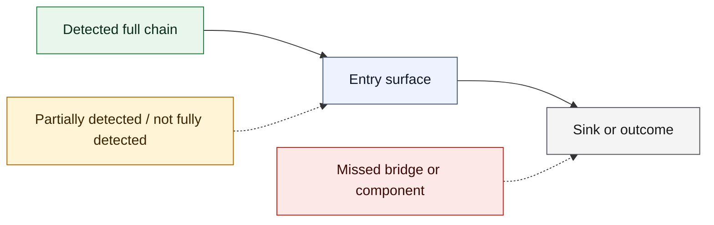
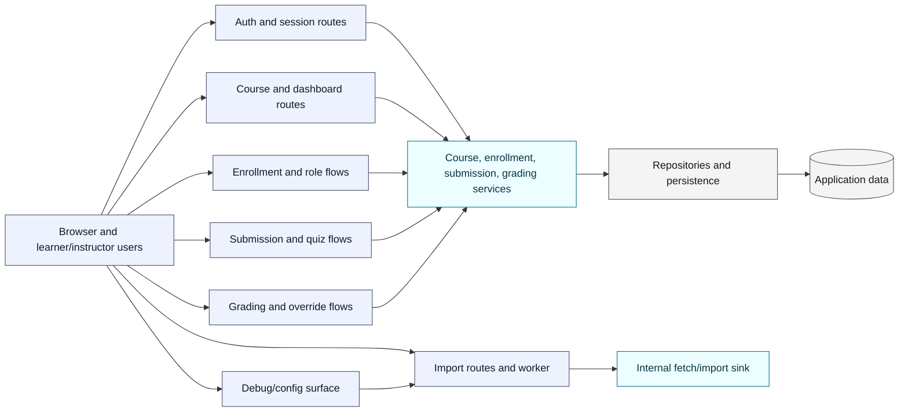
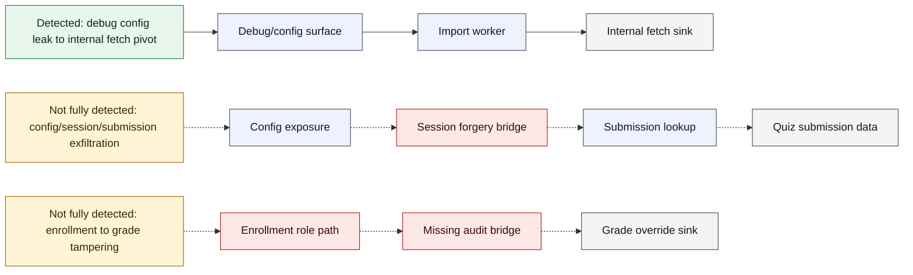
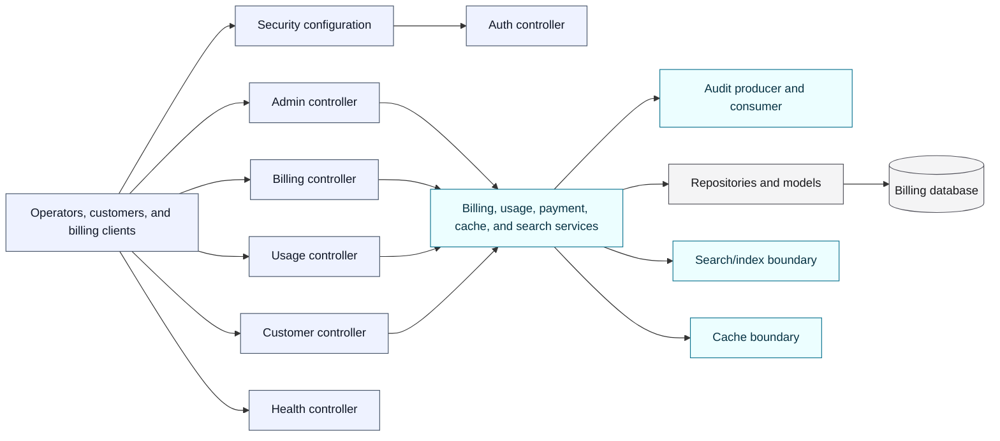
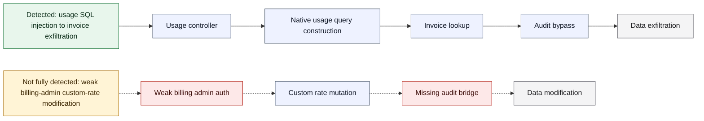
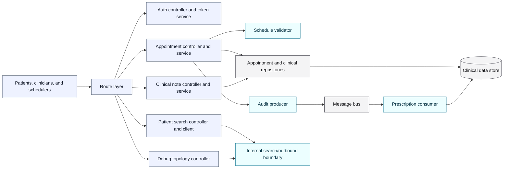
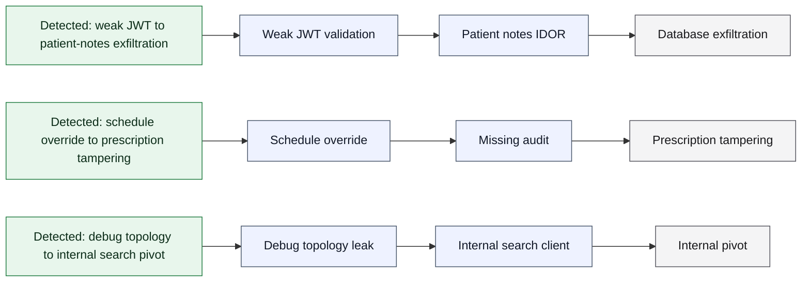
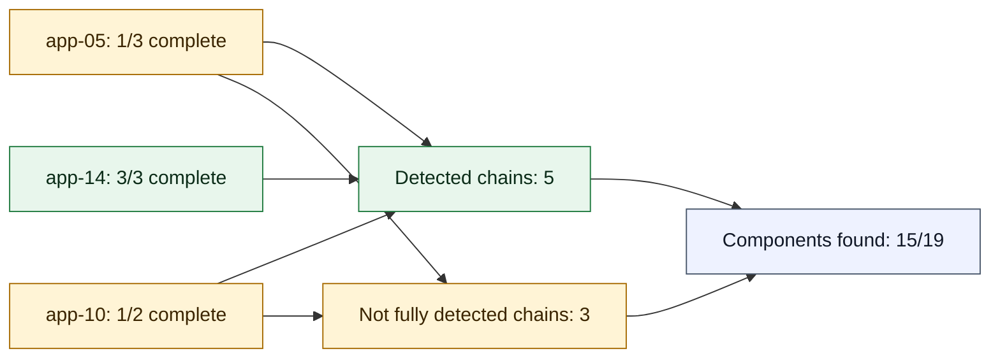

# v0.17 Focused Validation Diagrams

This companion report visualizes the sanitized app architectures and the chained-audit outcomes for `app-05`, `app-10`, and `app-14`. It uses only aggregate benchmark outcomes and source-navigation summaries from the focused run. Raw event logs, generated reports, proxy snapshots, endpoint values, usernames, API key names/values, temp roots, and original corpus paths are intentionally omitted.

## Legend

Architecture diagrams show the source-level components the agent explored. Chain overlay diagrams show whether GPT-5.4-mini fully connected the chain during the benchmark.

## app-05 Architecture

## app-05 Chain Overlay

Outcome: `1/3` complete chains and `5/7` required components were found. The debug-to-import chain was fully detected; the two user/session and role/state-change chains were not fully connected.

## app-10 Architecture

## app-10 Chain Overlay

Outcome: `1/2` complete chains and `4/6` required components were found. The usage-query chain was fully detected; the billing-admin chain remained partial.

## app-14 Architecture

## app-14 Chain Overlay

Outcome: `3/3` complete chains and `6/6` required components were found after one corrective pass. No required chain remained missed in the final selected attempt.

## Cross-App Readout

The diagrams should be read as evaluator-aligned summaries, not as complete design documentation for each application. They show the surfaces, bridges, and sinks that mattered for the focused chained-audit validation and mark whether GPT-5.4-mini fully connected each expected chain in the final selected attempt.
