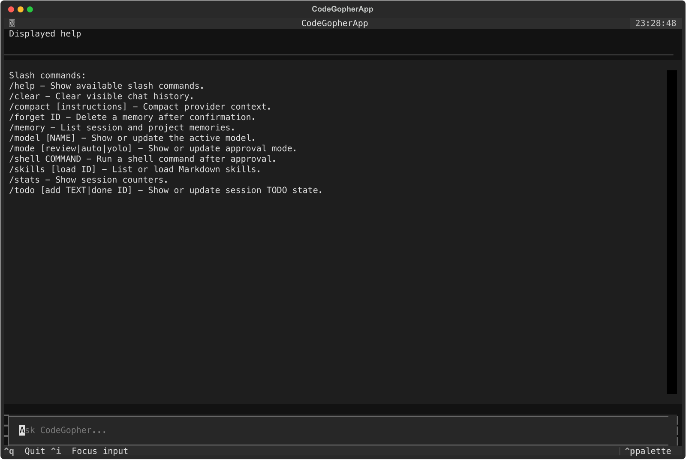
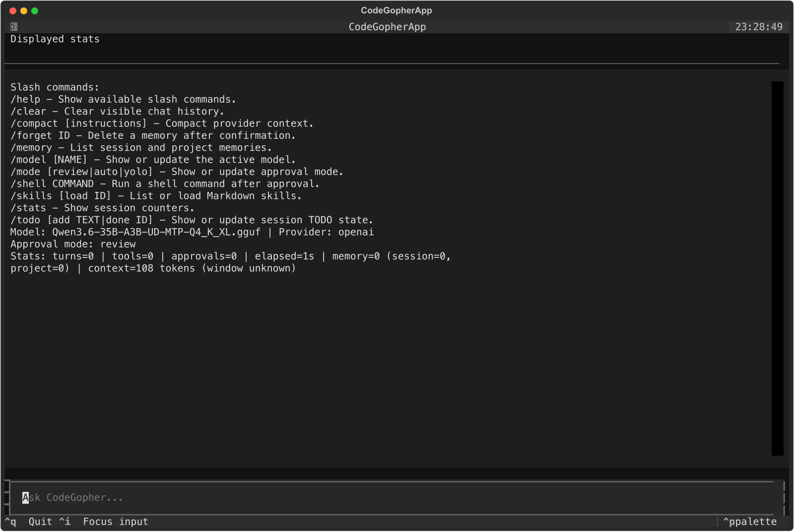
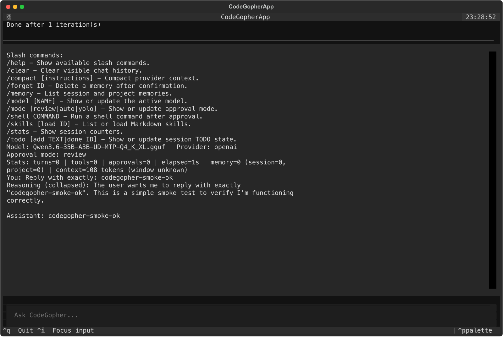
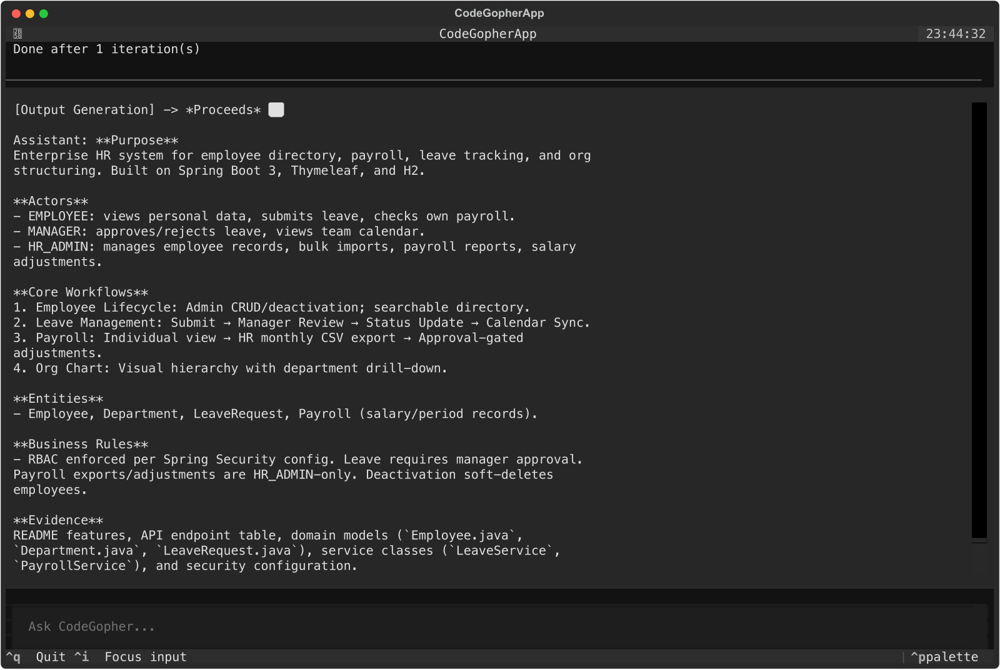
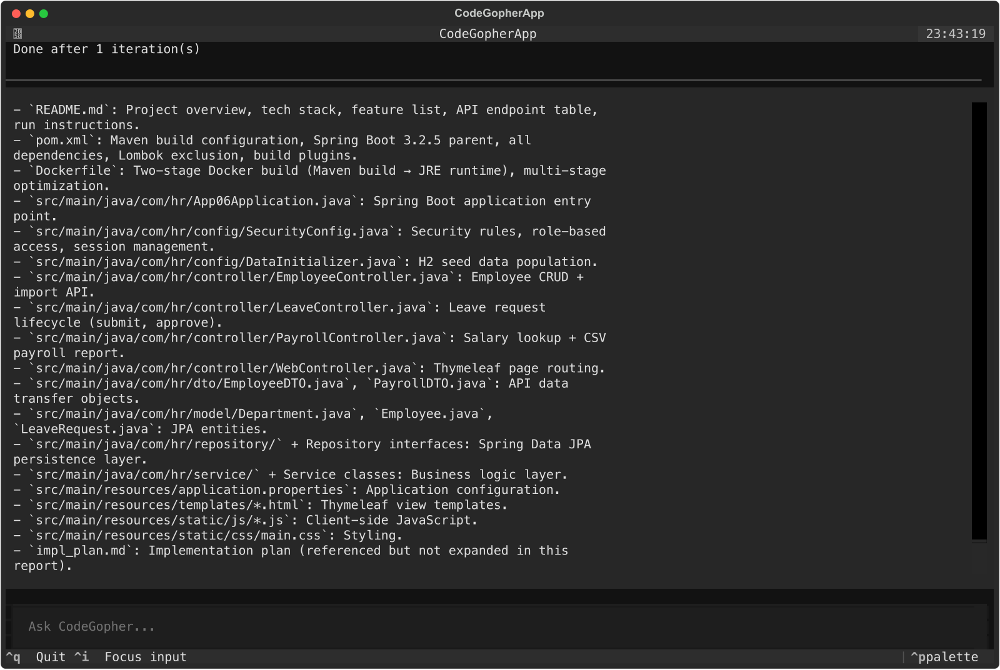

# CodeGopher TUI Local LLM Smoke And Skill Demo

Date: 2026-05-19

Target workspace:

```text
<sample-app-root>/apps/java/app-06-hr-management
```

## Summary

This walkthrough documents the CodeGopher Textual TUI path against the local OpenAI-compatible LLM endpoint:

```text
http://LOCAL_LLM_HOST:8080/v1
```

The endpoint was reachable, and the advertised model was:

```text
Qwen3.6-35B-A3B-UD-MTP-Q4_K_XL.gguf
```

The direct headless exact-smoke request returned exactly:

```text
codegopher-smoke-ok
```

The TUI also rendered slash-command output, model/mode/stats state, the exact smoke response, and the built-in `repo-domain-docs` and `repo-tech-docs` skill outputs.

## Validation Matrix

| Check | Result |
|---|---|
| Local LLM endpoint | `GET /v1/models` returned `200 OK`. |
| Direct CodeGopher exact smoke | Passed with `final_text: codegopher-smoke-ok` in one iteration. |
| TUI startup and slash commands | Passed through live Textual run with `/help`, `/model`, `/mode`, and `/stats`. |
| TUI exact smoke | Passed with `Assistant: codegopher-smoke-ok`. |
| `repo-domain-docs` built-in skill | Produced a concise domain report from bounded repository context. |
| `repo-tech-docs` built-in skill | Produced a concise architecture/setup report from bounded repository context. |
| Screenshot capture | macOS `screencapture` remained blocked by Screen Recording/TCC; screenshots below are live Textual app screenshots, exported from the running app render tree and converted to PNG. |

## Screenshots

The screenshots below are live Textual TUI screenshots, not transcript-rendered panels. They were exported from CodeGopher's running Textual app state and converted from SVG to PNG with `rsvg-convert` because shell-level macOS screen capture returned `could not create image from display`.

### TUI Startup And `/help`



### TUI `/model`, `/mode`, And `/stats`



### TUI Exact Smoke



### Built-In `repo-domain-docs` Skill



### Built-In `repo-tech-docs` Skill



## Configuration Used

TUI launch configuration:

```bash
cd <sample-app-root>/apps/java/app-06-hr-management

CODEGOPHER_DATA_HOME=<repo>/extensions/vscode/.vscode-test/smoke-artifacts/tui-data \
CODEGOPHER_API_KEY_ENV=LOCAL_LLM_API_KEY \
LOCAL_LLM_API_KEY=dummy-key \
<repo>/.venv/bin/cgopher \
  --no-project-init \
  --base-url http://LOCAL_LLM_HOST:8080/v1 \
  --api-family chat_completions \
  --model Qwen3.6-35B-A3B-UD-MTP-Q4_K_XL.gguf \
  --approval-mode review
```

The local LLM accepts any API key value; the run used `dummy-key` exposed through `LOCAL_LLM_API_KEY`.

## Direct Smoke Command

```bash
CODEGOPHER_API_KEY_ENV=LOCAL_LLM_API_KEY \
LOCAL_LLM_API_KEY=dummy-key \
<repo>/.venv/bin/cgopher \
  --no-project-init \
  --base-url http://LOCAL_LLM_HOST:8080/v1 \
  --api-family chat_completions \
  --model Qwen3.6-35B-A3B-UD-MTP-Q4_K_XL.gguf \
  -p 'Reply with exactly: codegopher-smoke-ok' \
  --json
```

Observed result:

```json
{"final_text": "codegopher-smoke-ok", "tool_results": [], "iterations": 1}
```

## TUI Walkthrough

Core command flow:

```text
/help
/model
/mode
/stats
Reply with exactly: codegopher-smoke-ok
```

Domain documentation prompt:

```text
Use @skill:repo-domain-docs to document this repository's domain.
Do not call tools. Do not read, use, or mention excluded ground-truth files.
Use only the bounded context below.
Produce a concise report in chat, max 28 lines, with sections: Purpose, Actors, Core Workflows, Entities, Business Rules, Evidence.
```

Technical documentation prompt:

```text
Use @skill:repo-tech-docs to document this repository's architecture and setup.
Do not call tools. Do not read, use, or mention excluded ground-truth files.
Use only the bounded context below.
Produce a concise report in chat with sections: Runtime, Architecture, Data and Views, Configuration, Build and Run, Verification Notes, Evidence.
```

The bounded-context prompts were used for the final skill screenshots so the demo remained read-only, avoided excluded ground-truth files, and produced output short enough to inspect in a terminal screenshot.

## Notes

- `screencapture -x` still failed with `could not create image from display`, so raw macOS display capture remains blocked by Screen Recording/TCC.
- Computer Use can inspect VS Code, but Terminal and iTerm are blocked for direct Computer Use control. The TUI evidence therefore uses Textual's own live screenshot export.
- The initial free-form `repo-tech-docs` TUI pass completed tool reads but was too long and risked mentioning excluded ground-truth context. The final screenshot uses bounded context and a no-tools instruction for a cleaner documentation demo.
