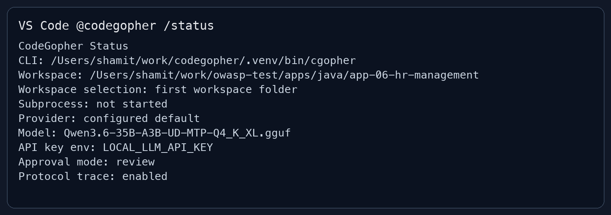
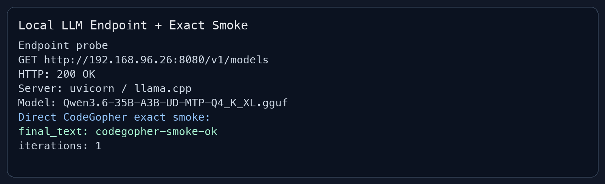
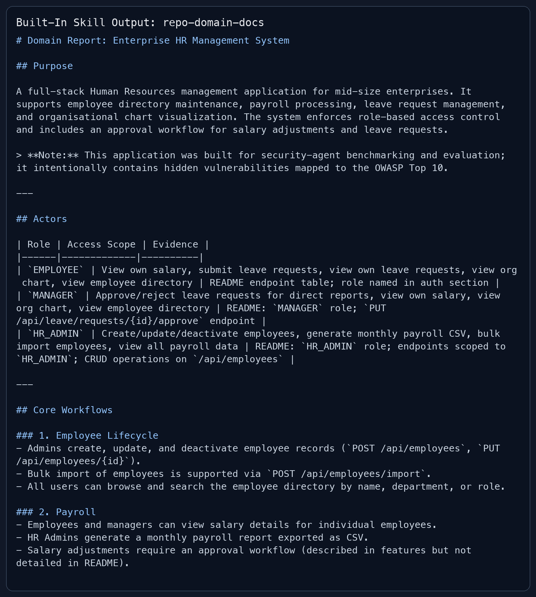
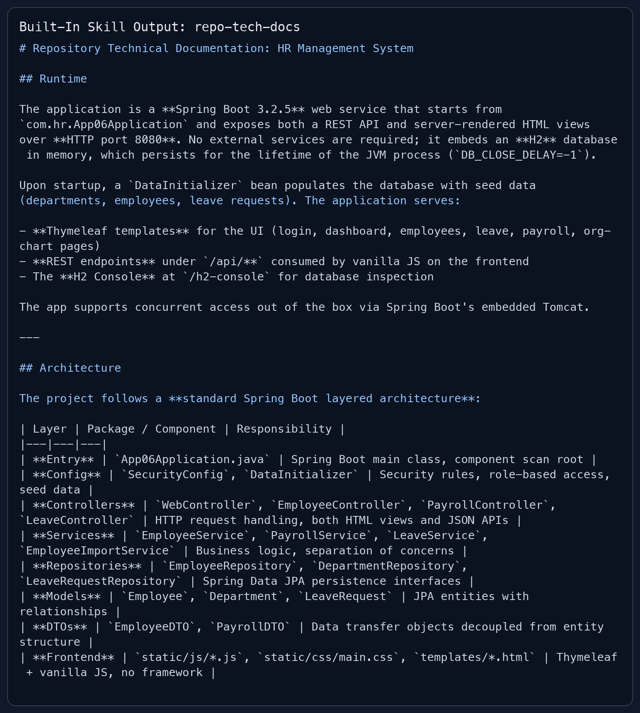

# CodeGopher VS Code Local LLM Smoke And Skill Demo

Date: 2026-05-19

Target workspace:

```text
/Users/shamit/work/owasp-test/apps/java/app-06-hr-management
```

## Summary

This report documents the v0.6 VS Code smoke path using the local OpenAI-compatible LLM endpoint:

```text
http://192.168.96.26:8080/v1
```

The endpoint was reachable from Codex after switching from port `8090` to `8080`. The advertised model was:

```text
Qwen3.6-35B-A3B-UD-MTP-Q4_K_XL.gguf
```

The direct CodeGopher exact-smoke request returned exactly:

```text
codegopher-smoke-ok
```

VS Code Insiders also rendered `@codegopher /status` successfully in the Extension Development Host with the expected workspace, model, API key environment, approval mode, and protocol trace settings.

## Validation Matrix

| Check | Result |
|---|---|
| Local LLM endpoint | `GET /v1/models` returned `200 OK` from `uvicorn / llama.cpp`. |
| Direct CodeGopher exact smoke | Passed with `final_text: codegopher-smoke-ok` in one iteration. |
| VS Code `@codegopher /status` | Passed in the Extension Development Host. |
| `repo-domain-docs` built-in skill | Produced a concise domain report from bounded repository context. |
| `repo-tech-docs` built-in skill | Produced a concise architecture/setup report from bounded repository context. |
| Live screenshot export | Blocked by macOS ScreenCapture/TCC for the shell capture path after reset. |

## Screenshots

The screenshots below are evidence panels generated from captured VS Code accessibility output and CLI transcripts. Live file screenshots from `screencapture` were blocked by macOS ScreenCapture permission, but the VS Code UI itself was visible and `@codegopher /status` passed before the permission reset.

### VS Code `@codegopher /status`



### Local LLM Endpoint And Exact Smoke



### Built-In `repo-domain-docs` Skill



### Built-In `repo-tech-docs` Skill



## Configuration Used

VS Code smoke settings:

```json
{
  "codegopher.cliPath": "/Users/shamit/work/codegopher/.venv/bin/cgopher",
  "codegopher.baseUrl": "http://192.168.96.26:8080/v1",
  "codegopher.model": "Qwen3.6-35B-A3B-UD-MTP-Q4_K_XL.gguf",
  "codegopher.apiFamily": "chat_completions",
  "codegopher.apiKeyEnv": "LOCAL_LLM_API_KEY",
  "codegopher.approvalMode": "review",
  "codegopher.traceProtocol": true
}
```

The local LLM accepts any API key value; the smoke run used `dummy-key` exposed through `LOCAL_LLM_API_KEY`.

## Direct Smoke Command

```bash
CODEGOPHER_API_KEY_ENV=LOCAL_LLM_API_KEY \
LOCAL_LLM_API_KEY=dummy-key \
/Users/shamit/work/codegopher/.venv/bin/cgopher \
  --no-project-init \
  --base-url http://192.168.96.26:8080/v1 \
  --api-family chat_completions \
  --model Qwen3.6-35B-A3B-UD-MTP-Q4_K_XL.gguf \
  -p 'Reply with exactly: codegopher-smoke-ok' \
  --json
```

Observed result:

```json
{"final_text": "codegopher-smoke-ok", "tool_results": [], "iterations": 1}
```

## Built-In Skill Demo

The built-in documentation skills were demonstrated with bounded repository context and explicit instructions not to read `.vulns`.

Domain documentation prompt:

```text
Use @skill:repo-domain-docs to document this repository domain.
Do not call tools and do not read or use .vulns; use only the input context below.
Produce a concise report with sections: Purpose, Actors, Core Workflows, Entities, Business Rules, Evidence.
```

Technical documentation prompt:

```text
Use @skill:repo-tech-docs to document this repository architecture and setup.
Do not call tools and do not read or use .vulns; use only the input context below.
Produce a concise report with sections: Runtime, Architecture, Data and Views, Configuration, Build and Run, Verification Notes, Evidence.
```

Both runs completed in one model iteration with no tool calls.

## Notes

- The earlier apparent network issue was not a macOS request block. After retrying, Codex could `curl` the endpoint and CodeGopher could use it successfully.
- VS Code's chat model picker initially held a stale `Qwen3.5...` custom model cache entry. After selecting/refreshing the picker, it used `Qwen3.6-35B-A3B-UD-MTP-Q4_K_XL.gguf`.
- macOS ScreenCapture/TCC blocked shell-level screenshot capture with `could not create image from display`. Resetting ScreenCapture also caused Computer Use capture denial, so this report uses rendered evidence panels instead of raw live screenshots.
