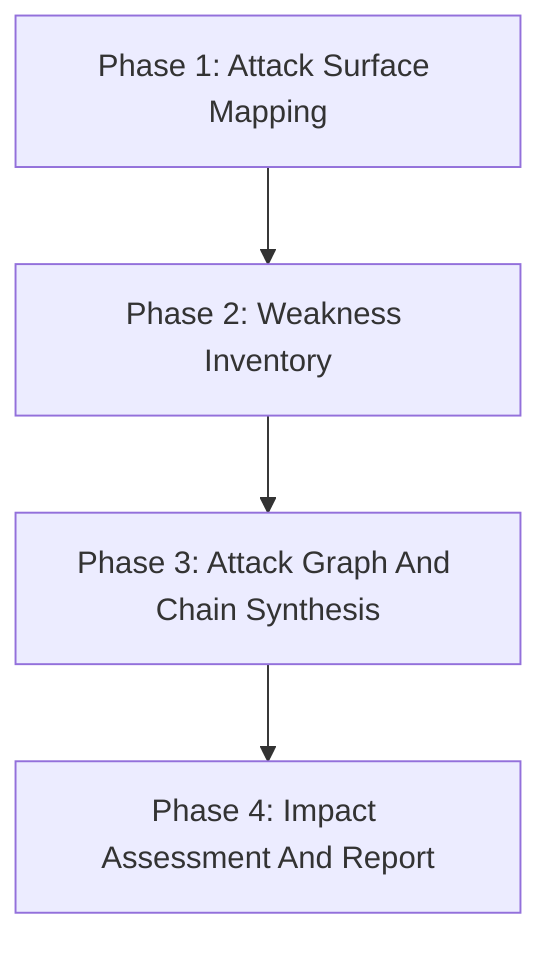

# CodeGopher v0.7 Chained Vulnerability Detection Implementation Plan

This plan covers the v0.7 implementation slice: static-only chained vulnerability detection using attack-graph reasoning, a dedicated built-in skill, constrained audit tooling, and deterministic report scaffolding.

Chained issues are combinations of individually modest bugs or misconfigurations that become high-impact when connected by an attacker, such as account takeover, lateral movement, database exfiltration, unauthorized state modification, or remote code execution.

---

## Summary

CodeGopher v0.7 introduces a static chained-vulnerability audit workflow:

- A built-in `chained-vulnerability-static-audit` skill.
- Skill-pack materialization through `cgopher init --skill-pack chained-vulns`, plus inclusion in `security` and `all`.
- TUI `/audit --chain`, which submits a normal agent turn using the chained audit skill.
- VS Code support through natural chat prompts such as `@codegopher scan for chained vulnerabilities`.
- A restricted static audit tool policy that removes shell, MCP, memory-write, edit, and arbitrary write tools from chained-audit turns.
- Internal attack graph, Mermaid, report, coordinator, and linker scaffolding.
- Required local OpenAI-compatible verification against `http://LOCAL_LLM_HOST:8080/v1` using model `Qwen/Qwen3.6-35B-A3B`.

---

## User-Facing Interfaces

Users can materialize and invoke the new audit guidance:

```bash
cgopher init --skill-pack chained-vulns
cgopher init --skill-pack security
cgopher init --skill-pack all
cgopher -p "use @skill:chained-vulnerability-static-audit to review this repository"
```

The TUI adds:

```text
/audit --chain
```

The VS Code extension keeps its thin-chat boundary. The prompt `@codegopher scan for chained vulnerabilities` is forwarded as a normal agent prompt and relies on the Python skill system and static audit policy.

The default report path is:

```text
docs/security/CHAINED_VULNERABILITIES_REVIEW.md
```

---

## Analysis Methodology

The audit models the repository as an attack graph:



1. Attack surface mapping identifies public web routes, API endpoints, webhook handlers, file uploads, message consumers, background jobs, headers, cookies, and request parameters.
2. Weakness inventory captures low-to-medium weaknesses such as open redirects, SSRF-prone fetches, permissive CORS, missing CSRF, verbose errors, hardcoded debug credentials, weak validation, and loose authorization or tenant scoping.
3. Chain synthesis connects sources to hops, hops to sinks, and sinks to impact using static evidence.
4. Impact assessment rates severity and confidence and recommends the easiest link to break.

Confirmed chains must cite source evidence. Plausible but unproven links must be marked lower confidence rather than reported as certain.

---

## Implementation Shape

### Built-In Skill And Skill Packs

The built-in skill lives at `src/codegopher/skills/builtins/chained-vulnerability-static-audit/SKILL.md`.

Skill-pack behavior:

- `repo-docs`: unchanged.
- `chained-vulns`: materializes only `chained-vulnerability-static-audit`.
- `security`: materializes `crud-owasp-static-audit` and `chained-vulnerability-static-audit`.
- `all`: materializes repository documentation skills, CRUD OWASP audit, and chained vulnerability audit.

### Static Audit Tool Policy

When the chained audit skill is explicitly mentioned or auto-loaded by keywords such as "chained vulnerabilities" or "attack graph", the agent turn uses a filtered registry.

Allowed tools:

- `read_file`
- `read_many_files`
- `list_dir`
- `glob_search`
- `grep_search`
- `update_todo`
- `write_chained_vulnerability_report`

Denied by absence from the active registry:

- `write_file`
- `edit_file`
- `run_shell_command`
- `save_memory`
- MCP-derived tools
- Any dynamic scanner or network probing path exposed through future tools

The report writer is scoped to `docs/security/CHAINED_VULNERABILITIES_REVIEW.md`.

### Attack Graph And Reporting

Internal security modules define:

- Source, hop, sink, edge, chain, confidence, severity, reference, remediation, and report models.
- Deterministic Mermaid flowchart rendering.
- Markdown report rendering and writing.
- Coordinator scaffolding that partitions repository paths into routing, auth, data, config, and jobs targets.
- Linker scaffolding that validates scanner JSON and assembles source-hop-sink chains.

The coordinator/linker are deliberately static and deterministic in v0.7. Production-grade sub-agent scheduling can evolve later without changing the audit model or report format.

---

## Safety Boundaries

The chained audit is source-only:

- Do not run live HTTP probes, fuzzers, SQL injection payloads, credential attacks, dynamic scanners, exploit scripts, port scans, or external network tests.
- Do not generate executable exploit payloads or operational abuse instructions.
- Do not add runtime scanner dependencies such as Bandit or Semgrep to the core package.
- Do not expose shell, MCP, arbitrary write, edit, or memory-write tools during chained-audit turns.

Static-only still permits writing the final Markdown report through the dedicated report tool.

---

## Testing Plan

Unit tests cover:

- CLI skill-pack materialization for `security`, `chained-vulns`, and `all`.
- Built-in skill discovery, front matter, autoload, and static-only language.
- TUI `/audit --chain` routing and invalid argument handling.
- Static audit registry contents and denial of unsafe tool calls.
- Attack graph validation, Mermaid rendering, report rendering, coordinator partitioning, and linker assembly.

Integration tests cover:

- A fixture repository with an open redirect plus weak internal admin export chain.
- Mock scanner/linker/report flow that writes a Mermaid report.
- Malicious model attempts to call `write_file` and `run_shell_command` during chained audit and receives tool errors while the dedicated report writer still works.
- VS Code chat controller forwarding of `scan for chained vulnerabilities` as a normal prompt.

Required real-LLM verification:

```bash
python -m pytest tests/integration/test_real_llm_endpoint.py
```

The test uses:

- Base URL: `http://LOCAL_LLM_HOST:8080/v1`
- API family: `chat_completions`
- Model: `Qwen/Qwen3.6-35B-A3B`
- API key: `OPENAI_API_KEY=dummy-key`

The test asserts the stripped final text equals `codegopher-smoke-ok`, no tools were used, and the turn completed in one iteration. It does not depend on `/v1/models`, which timed out during planning.
