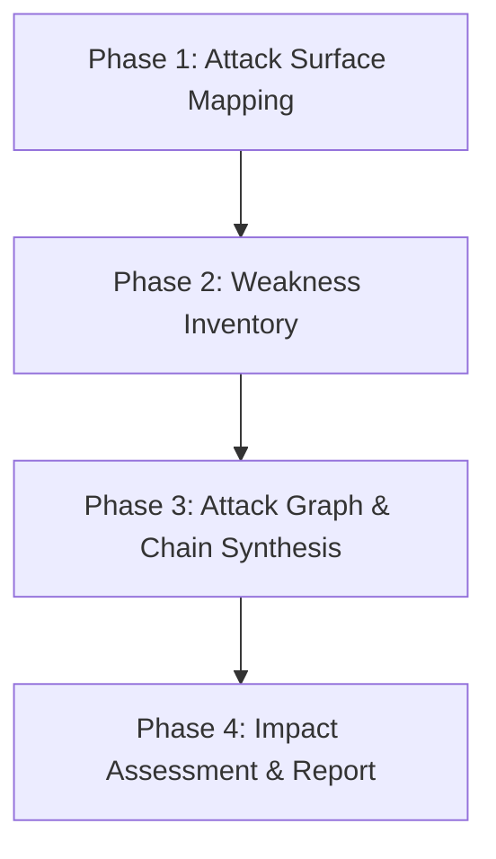

# CodeGopher v0.7 Chained Vulnerability Detection Implementation Plan

This plan covers the implementation details for detecting "chained" security issues in CodeGopher v0.7. Chained issues are combinations of minor, low-severity bugs or misconfigurations that individually seem harmless, but when linked together by a bad actor, enable high-impact exploits (such as account takeover, lateral movement, database exfiltration, or remote code execution).

The detection of chained vulnerabilities will leverage v0.7's core architectural additions: multi-step planning and sub-agent dispatch for parallel analysis.

---

## Summary

Static analysis tools (SAST) excel at identifying individual isolated vulnerabilities (e.g., a missing security header or a potential SQL injection). However, they generally fail to detect when an attacker can chain multiple individually low-risk issues together.

CodeGopher v0.7 will introduce a structured, static-only analysis framework that models a codebase as an **Attack Graph** to discover exploit chains.

### Target User Experience

Users can initialize the chained vulnerability detection skill and run the audit:

```bash
# Materialize the new security/chaining skill into the project
cgopher init --skill-pack security

# Run a dedicated chained vulnerability audit on the current workspace
cgopher -p "use @skill:chained-vulnerability-static-audit to review this repository"
```

The output is written to a structured report: `docs/security/CHAINED_VULNERABILITIES_REVIEW.md` (with ASCII/Mermaid-based attack graphs).

---

## User-Facing Interfaces

### Skill Materialization
We will update `cgopher init` to include the new skill in the `security` pack, and support an optional explicit pack name:
- `cgopher init [PATH] --skill-pack security`: materializes both `crud-owasp-static-audit` and the new `chained-vulnerability-static-audit`.
- `cgopher init [PATH] --skill-pack chained-vulns`: materializes only `chained-vulnerability-static-audit`.

### TUI and VS Code Chat Integration
Users can invoke the analysis using `@skill:chained-vulnerability-static-audit` or directly ask:
- TUI command: `/audit --chain`
- VS Code Chat: `@codegopher scan for chained vulnerabilities`

---

## Analysis Methodology (The Attack Graph Approach)

Chained vulnerability detection relies on constructing an Attack Graph from static source code. The analysis is structured into four distinct phases:



### Phase 1: Attack Surface Mapping (Sources)
Identify all potential entry points where user-controlled input enters the application. Examples:
- Public web routes, API endpoints, and webhook controllers.
- Parameter validation layers, HTTP headers, cookies, and file upload forms.
- Message queue consumers and background job inputs.

### Phase 2: Weakness Inventory (Hops)
Discover low-severity bugs, configuration oversights, or informational leaks across the codebase:
- **Informational leaks**: File path disclosures in error messages, verbose debug logging, or exposed metadata.
- **Access control issues**: Permissive CORS configurations, loose endpoint authorization checks, or lack of CSRF tokens on state-modifying actions.
- **Input handling issues**: Loose regex validations, open redirects, or SSRF-susceptible functions (e.g., uncontrolled `requests.get` or URL parsing).
- **Secrets & Credentials**: Weak cryptography, hardcoded API keys/passwords in test files, or debug accounts.

### Phase 3: Attack Graph & Chain Synthesis (Hops to Sinks)
Correlate the mapped entry points and inventory of weaknesses with critical sinks:
- **Sinks**: Database queries (SQL/ORM), OS shell command execution, file system read/write operations, process creation, or administrative functions.
- **Linker Logic**: Trace whether user input from a Source can flow to a Weakness, and whether that Weakness enables access to or exploitation of a Sink.
  - *Example 1*: Input (Source) -> Open Redirect (Weakness) -> Stealing Auth Code (Sink) -> Account Takeover (Impact).
  - *Example 2*: Input (Source) -> SSRF (Weakness) -> Unauthenticated Internal Admin Endpoint (Sink) -> Remote Code Execution (Impact).

### Phase 4: Exploitability and Impact Assessment
Evaluate the resulting chains and categorize them by impact:
- **Takeover**: Account takeover, administrative privilege escalation.
- **Lateral Movement**: Moving from a public-facing component to internal services or cloud metadata APIs.
- **Database Exfiltration**: Bypassing ORM scoping to dump database tables.
- **Data Modification**: Unauthorized state modification or state poisoning.

---

## Implementation Shape

### 1. Markdown Skill
We will add `chained-vulnerability-static-audit` to `src/codegopher/skills/builtins/`:
- `src/codegopher/skills/builtins/chained-vulnerability-static-audit/SKILL.md`: Instructs the agent on the 4-phase analysis methodology, attack graph design, and reporting format.

### 2. Multi-Agent Scan Orchestration (v0.7 Capability)
Finding chains is computationally intensive and context-heavy. A single prompt cannot scan a large repository. We will utilize v0.7 sub-agents:
- **Coordinator Agent**: Receives the user request, maps the workspace structure, and allocates sub-tasks.
- **Scanner Sub-Agents**: Run concurrent, focused scans on specific modules (e.g., `routing`, `auth`, `database/ORM`, `config/dependencies`).
- **Chain-Linker Sub-Agent**: Aggregates the findings from the Scanner agents, draws connection graphs, and validates path reachability.

### 3. Report Output Template
The analysis outputs a Markdown report to `docs/security/CHAINED_VULNERABILITIES_REVIEW.md` featuring:
- **Summary Dashboard**: Number of chains found, maximum impact level.
- **Attack Graph Diagrams**: Visualizing the chains using Mermaid.js flowcharts.
- **Detailed Chain Breakdowns**:
  - Step 1: Entry Point (Source) + Code Reference.
  - Step 2: Intermediate Weakness (Hop) + Code Reference.
  - Step 3: Target/Impact (Sink) + Code Reference.
- **Remediation Plan**: Code suggestions to break the chain at the easiest/most effective link.

---

## Safety and Scope Boundaries

Like all CodeGopher security tools, the chained vulnerability skill adheres to strict safety boundaries:
- **Static-only**: Do not run live network probes, fuzzer tools, SQL injection payloads, or port scans.
- **No weaponized exploit scripts**: The output must only describe the attack sequence conceptually and theoretically to help the developer remediate it. No executable Python/Shell exploit payloads should be generated.
- **No external tools/dependencies**: Do not add runtime dependencies for vulnerability scanning (e.g., bandit, semgrep) to CodeGopher's core package.

---

## Testing Plan

1. **Skill Discovery and CLI tests**:
   - Verify `cgopher init --skill-pack security` and `cgopher init --skill-pack chained-vulns` correctly copy the new skill folder.
   - Verify that the skill is discovered and loaded by `SkillCatalog`.
2. **Deterministic Graph Builder Tests**:
   - Unit tests to verify the sub-agent interface outputs clean, structured JSON data that can be parsed into attack chains.
3. **Integration Mock Scan**:
   - Run a simulated audit on a test fixture repository containing a pre-arranged chain (e.g., an open redirect that exposes a session token, which is then used in a loose API endpoint to read a configuration file).
   - Assert that the agent discovers the chain, constructs the correct Mermaid graph, and recommends a valid mitigation.
4. **Safety Regression Tests**:
   - Assert that the skill does not attempt to execute dynamic network calls or generate weaponized exploits.
