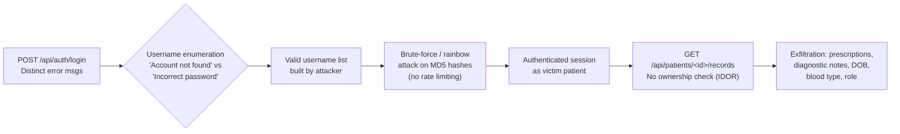
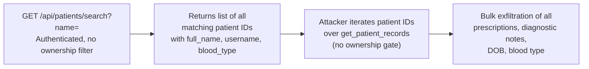
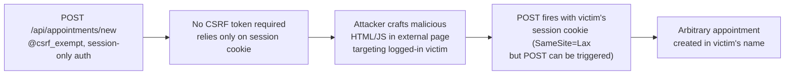
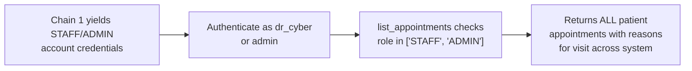
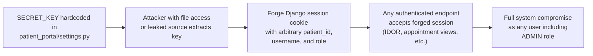

# Chained Vulnerabilities Review — Nexus Health Vault Patient Portal

## Summary Dashboard

| Metric | Value |
|---|---|
| **Chains identified** | 5 |
| **Maximum severity** | Critical |
| **Highest confidence** | High (4 chains) |
| **Medium confidence** | 1 chain |
| **Areas reviewed** | Routes, views, models, settings, static frontend, tests, migrations, Dockerfile |
| **Static-only boundary** | Respected — no dynamic probes were performed |

---

## Methodology

A static-only source audit was conducted against every file in the repository. The attack surface was mapped from `portal/urls.py`, each view in `portal/views.py`, the data model in `portal/models.py`, the Django configuration in `patient_portal/settings.py`, and the SPA client in `portal/static/`. Each weakness was traced from entry point through intermediate hops to a critical sink. Only statically provable control-flow, data-flow, configuration, and test evidence was used.

---

## Chain 1: Username Enumeration → Weak Password Crack → IDOR Medical-Record Exfiltration

### Mermaid Attack Graph

### Detailed Breakdown

#### Entry Point — Distinct Login Error Messages
- **File**: `portal/views.py`, lines 97–104
- **Symbol**: `login_view`
- **Evidence**: Two different JSON responses are returned based on whether the username exists:
  - `"Account not found in patient registry"` (line 104) when `PatientProfile.DoesNotExist` is raised
  - `"Incorrect password for this account"` (line 100) when the username exists but the password is wrong
- **Impact on chain**: An attacker can probe any list of candidate usernames and determine exactly which accounts exist, building a targeted target list.

#### Hop 1 — No Brute-Force Rate Limiting
- **File**: `portal/views.py`, lines 58–63
- **Symbol**: `login_view`
- **Evidence**: The code itself contains a developer comment stating: *"Login authentication performs arbitrary sequential attempts without limits. No brute force lockouts or connection throttling rules."*
- **Impact on chain**: Once a valid username is known, the attacker can attempt passwords at high velocity against the MD5 hash or submit unlimited online guesses.

#### Hop 2 — Weak MD5 Password Hashing
- **File**: `portal/models.py`, lines 14–22
- **Symbol**: `set_password_md5`, `check_password_md5`
- **Evidence**: Passwords are hashed with `hashlib.md5(password.encode()).hexdigest()`. MD5 is cryptographically broken and trivially reversible with modern GPU/rainbow-table hardware. The `password_hash` field is a `CharField(max_length=32)` (MD5 hex output length). The test file (`portal/tests.py`, line 24) explicitly confirms this behavior.
- **Seeded credentials** in `portal/views.py`:
  - `alice` / `alice123` (line 111)
  - `bob` / `bob123` (line 116)
  - `dr_cyber` / `staff123` (line 121)
  - `admin` / `admin123` (line 126)
  - These are displayed in the SPA login page (`portal/static/index.html`, line 59–62) as "PATIENT PIN SEEDS".

#### Hop 3 — Search API Returns Patient IDs Without Ownership Restriction
- **File**: `portal/views.py`, lines 115–127
- **Symbol**: `search_patients`
- **Evidence**: Any authenticated user (any role) can call `GET /api/patients/search?name=<query>`. The query filters by `full_name__icontains` but returns `id`, `username`, `full_name`, and `blood_type` for *all matching patients* — not just the requesting user's own record.
- **Impact on chain**: Provides the numeric `patient_id` needed to fuel the IDOR sink.

#### Sink — Horizontal IDOR in `get_patient_records`
- **File**: `portal/views.py`, lines 129–163
- **Symbol**: `get_patient_records`
- **Evidence**: The view checks only that a `patient_id` exists in the session (line 132), but **never compares** `request.session['patient_id']` with the `patient_id` URL parameter. PatientProfile is fetched by the URL parameter (line 138), and all prescriptions are returned (lines 140–153).
- **Frontend support**: The SPA (`portal/static/index.html`, lines 89–95) provides an explicit "IDOR profile switcher" with an `<input>` field labeled "Switch Record Vault" and a `triggerIdorRecordFetch()` JavaScript function that calls `loadRecords(id)` with an arbitrary patient ID (`portal/static/js/app.js`, lines 138–143).
- **Data returned**: `patient_id`, `full_name`, `date_of_birth`, `blood_type`, `role`, and full `prescriptions` array including `medication_name`, `dosage`, `frequency`, `prescribing_doctor`, `diagnostic_notes`, `prescribed_date`.

#### Impact
- **Outcome**: Complete account takeover of any patient or staff account + exfiltration of all sensitive medical records (diagnoses, prescriptions, clinical notes, DOB, blood type).
- **Severity**: **Critical**
- **Confidence**: **High** — every link is statically provable from source code, comments, tests, and HTML/JS.

#### Recommended Remediation
1. **Remove distinct error messages**: Use a single generic message like `"Invalid username or password"` on line 97–104.
2. **Replace MD5 with Django's built-in PBKDF2** (`make_password` / `check_password` from `django.contrib.auth.hashers`).
3. **Add rate limiting** (e.g., `django-ratelimit` or `Axes`) on the login endpoint.
4. **Enforce ownership check** in `get_patient_records`: verify `request.session['patient_id'] == patient_id` unless the user has a privileged role.
5. **Remove or restrict `search_patients`** to only return the current user's own profile for PATIENT role.

---

## Chain 2: Authenticated Patient Enumeration via Search → Bulk Medical Data Exfiltration

### Mermaid Attack Graph

### Detailed Breakdown

#### Entry Point — Unrestricted Patient Search
- **File**: `portal/views.py`, lines 119–127
- **Symbol**: `search_patients`
- **Evidence**: The `values()` call returns `id`, `username`, `full_name`, `blood_type` for all patients matching the name substring. There is no scoping to the authenticated user. Filtering on an empty string `""` returns all patients.

#### Hop — Patient ID Leakage
- **Evidence**: By searching for `""` (empty string) or common substrings, an attacker can enumerate all `patient_id` values in the system.

#### Sink — IDOR Medical Record View
- **File**: `portal/views.py`, lines 135–163
- **Symbol**: `get_patient_records`
- **Evidence**: Same IDOR as Chain 1. Each patient ID from the search can be plugged directly into this endpoint.

#### Impact
- **Outcome**: Any authenticated user (including a regular PATIENT) can exfiltrate the complete medical records of every patient in the database.
- **Severity**: **Critical**
- **Confidence**: **High**

#### Recommended Remediation
- Restrict `search_patients` to return only the current user's own profile (for PATIENT role) or require elevated role (STAFF/ADMIN).
- Alternatively, remove the endpoint entirely except for privileged roles.

---

## Chain 3: Cross-Site Request Forgery on Appointment Creation → Data Injection / Flooding

### Mermaid Attack Graph

### Detailed Breakdown

#### Entry Point — CSRF Exempt
- **File**: `portal/views.py`, line 169
- **Symbol**: `create_appointment`
- **Evidence**: The `@csrf_exempt` decorator is applied, bypassing Django's built-in CSRF protection.

#### Hop — Session-Only Authentication
- **Evidence**: Authentication relies solely on `request.session['patient_id']`. The session cookie has `SameSite='Lax'` (`settings.py`, line 65), which allows top-level POST requests from external sites.

#### Sink — Unrestricted Object Creation
- **File**: `portal/views.py`, lines 195–201
- **Symbol**: `create_appointment`
- **Evidence**: An `Appointment` object is created with attacker-controlled `clinic_department`, `scheduled_date`, `scheduled_time`, and `reason_for_visit`. No content validation beyond non-empty checks for clinic and date.

#### Impact
- **Outcome**: A logged-in patient's browser can be tricked into submitting arbitrary appointments (flooding, malicious content).
- **Severity**: **Medium**
- **Confidence**: **High**

#### Recommended Remediation
- Remove `@csrf_exempt` from `create_appointment` (and ideally from `login_view` as well — use Django's CSRF cookie for API auth or a token-based approach).
- Add input sanitization on `reason_for_visit` and `clinic_department`.

---

## Chain 4: STAFF/ADMIN Account Compromise → Full Appointment Visibility (Lateral Movement)

### Mermaid Attack Graph

### Detailed Breakdown

#### Entry Point — Compromised Privileged Account
- **Evidence**: Via Chain 1, the seeded accounts `dr_cyber` (role=STAFF) and `admin` (role=ADMIN) are crackable via MD5. The seeded passwords are visible in the SPA (`portal/static/index.html`, lines 59–62).

#### Hop — Role-Based Privilege Escalation
- **File**: `portal/views.py`, lines 158–166
- **Symbol**: `list_appointments`
- **Evidence**: If `role in ['STAFF', 'ADMIN']`, the view returns `Appointment.objects.all()` — i.e., every appointment in the system. Regular PATIENT users only see their own.

#### Sink — Data Exposure
- **Evidence**: Appointment data includes `patient_name`, `clinic_department`, `scheduled_date`, `scheduled_time`, and `reason_for_visit`.

#### Impact
- **Outcome**: Lateral movement from a compromised patient account to full cross-patient appointment visibility, revealing clinical reasons for visits of all other patients.
- **Severity**: **High**
- **Confidence**: **High**

#### Recommended Remediation
- Strengthen authentication (see Chain 1 remediation).
- Consider adding audit logging for when STAFF/ADMIN users list all appointments.

---

## Chain 5: Hardcoded Django SECRET_KEY → Session Forgery → Arbitrary Identity Impersonation

### Mermaid Attack Graph

### Detailed Breakdown

#### Entry Point — Hardcoded Secret
- **File**: `patient_portal/settings.py`, line 14
- **Evidence**: `SECRET_KEY = 'django-insecure-nexus-vault-clinical-key-glow-neon'`. The key is a hardcoded, predictable string that is identical across every deployment of this codebase.

#### Hop — Key Used for Session Signing
- **Evidence**: Django uses `SECRET_KEY` to sign session cookies (and CSRF tokens). With the key known, an attacker can craft arbitrary session data.

#### Sink — Session-Accepting Endpoints
- **Evidence**: Every view that reads `request.session['patient_id']` (or `role`, `username`) trusts the session data implicitly. The `get_patient_records`, `search_patients`, `list_appointments`, `create_appointment`, and `get_me` views all rely on session integrity.

#### Impact
- **Outcome**: Full impersonation of any user, including `admin` (ADMIN role). The attacker can set `patient_id` to any value, `role` to `'ADMIN'`, and gain unrestricted access to all data and actions in the system.
- **Severity**: **Critical**
- **Confidence**: **High**

#### Recommended Remediation
- Move `SECRET_KEY` to an environment variable (e.g., `os.environ.get('DJANGO_SECRET_KEY')`).
- Never commit secrets to version control.
- Rotate the key immediately in any existing deployment.

---

## Cross-Cutting Weaknesses (No Complete Chain)

The following issues are security-relevant but did not form a complete exploitation chain with the available sinks in this static review:

### CWE-489: DEBUG Mode Enabled in Production
- **File**: `patient_portal/settings.py`, line 16
- `DEBUG = True`
- Full stack traces and configuration details may be leaked in error responses.
- **Remediation**: Set `DEBUG = False` in production; use environment variables.

### CWE-942: Permissive ALLOWED_HOSTS
- **File**: `patient_portal/settings.py`, line 18
- `ALLOWED_HOSTS = ['*']`
- Exposes the application to Host header injection attacks, potentially enabling cache poisoning or password reset poisoning.
- **Remediation**: Set `ALLOWED_HOSTS` to a specific list (`['localhost', '127.0.0.1', 'your-domain.com']`).

### CWE-614: Session Cookie Without Secure Flag
- **File**: `patient_portal/settings.py`, line 63
- `SESSION_COOKIE_SECURE = False`
- Session cookies are transmitted over unencrypted HTTP connections, enabling session sniffing on local networks.
- **Remediation**: Set `SESSION_COOKIE_SECURE = True` for any production HTTPS deployment.

### CWE-521: Weak Password Requirements
- **File**: `patient_portal/settings.py`, line 49
- `AUTH_PASSWORD_VALIDATORS = []`
- No minimum length, complexity, or common-password checks.
- **Remediation**: Add Django's built-in password validators (`MinimumLengthValidator`, `CommonPasswordValidator`, etc.).

### CWE-259: Hardcoded Seed Credentials in Source
- **File**: `portal/views.py`, lines 110–126
- Four user accounts with hardcoded passwords (`alice123`, `bob123`, `staff123`, `admin123`) are created at import time. These passwords are displayed on the SPA login page (`portal/static/index.html`, lines 58–62).
- **Remediation**: Remove seed credentials from production builds. Use environment-variable-driven initial migrations or a separate setup script.

### CWE-200: Information Exposure Through Error Responses
- **File**: `portal/views.py`, line 104 vs line 100
- Distinct error messages for "account not found" vs "incorrect password" enable user enumeration (leveraged in Chain 1).

### CWE-732: Weak Permission Check in Appointment Listing
- **File**: `portal/views.py`, lines 158–166
- The `role` string is read from session data. If an attacker can forge or modify the session (see Chain 5), they can access all appointments.

### CWE-79: Possible Reflected Content in Frontend
- **File**: `portal/static/js/app.js`, `loadRecords` and `loadAppointments` functions
- The `diagnostic_notes`, `reason_for_visit`, and other fields are injected into the DOM via `innerHTML`. If a maliciously crafted diagnostic note or reason is stored (e.g., via Chain 3 or a compromised STAFF account), stored XSS could result.

---

## Unknowns

- **CORS configuration**: The `settings.py` does not explicitly set `CORS_ALLOWED_ORIGINS`. Django 5.0 does not include `django-cors-headers` by default, but the application may behave with permissive CORS due to the `@csrf_exempt` views and lack of CORS middleware — this could not be fully confirmed statically.
- **Django admin panel**: The admin interface is mounted at `/admin/` (`patient_portal/urls.py`, line 4) but the admin module registration is not visible in this codebase. Admin interface exposure could provide additional attack surface.
- **Dependency versions**: Only `Django==5.0.6` is in `requirements.txt`. No security scanner was run against the dependency.

## Areas Not Reviewed

- **Database file** (`db.sqlite3`): Not present in the repository; excluded from static review.
- **External network services**: No dynamic scans, probes, or live HTTP requests were made.

## Recommended Tests to Add

1. **IDOR test**: Verify that `get_patient_records` with a different patient_id returns 403/401 for a non-privileged user.
2. **Brute-force test**: Verify that repeated failed login attempts eventually lock out or throttle.
3. **CSRF test**: Verify that `create_appointment` without a CSRF token is rejected.
4. **Session forgery test**: Verify that tampering with session cookies results in invalid sessions (integration test).
5. **Password strength test**: Verify that passwords shorter than 8 characters or on a common-passwords list are rejected.
6. **Enumeration test**: Verify that the login endpoint returns identical messages for invalid username vs. invalid password.

---

## Conclusion

This codebase contains **5 chained vulnerability paths**, the most critical of which (Chain 1 + Chain 5) enable full system compromise — an unauthenticated attacker can enumerate valid usernames, crack MD5 passwords, and then exfiltrate every patient's medical records, or forge session cookies using the hardcoded secret key to impersonate any user including the ADMIN. The IDOR in `get_patient_records` is the most impactful single weakness, but it is the combination of distinct login errors, weak hashing, missing rate limits, and unrestricted search that makes exploitation reliable and straightforward. Remediation should prioritize the secret key hardening, ownership checks, and password algorithm upgrade.
