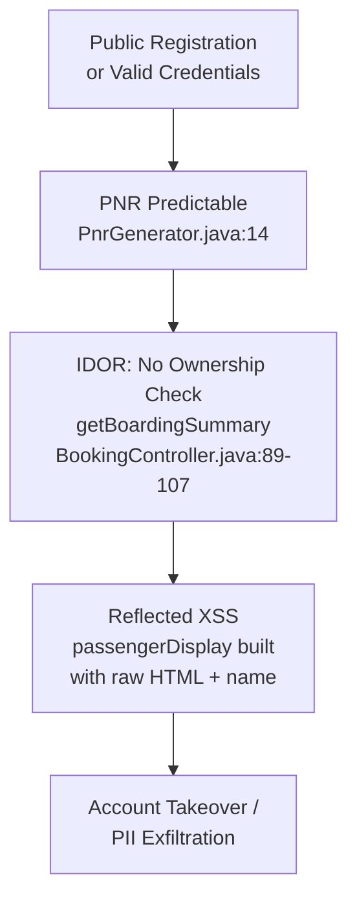
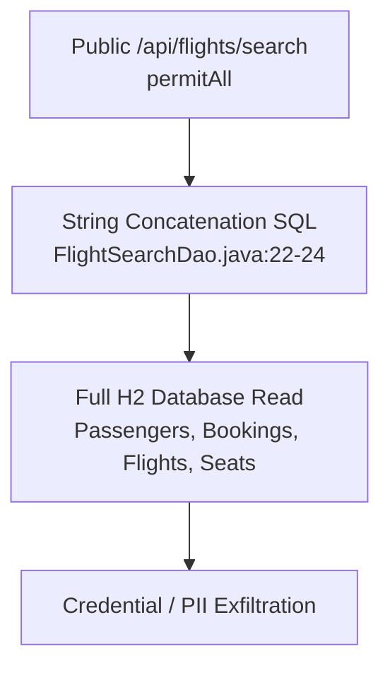
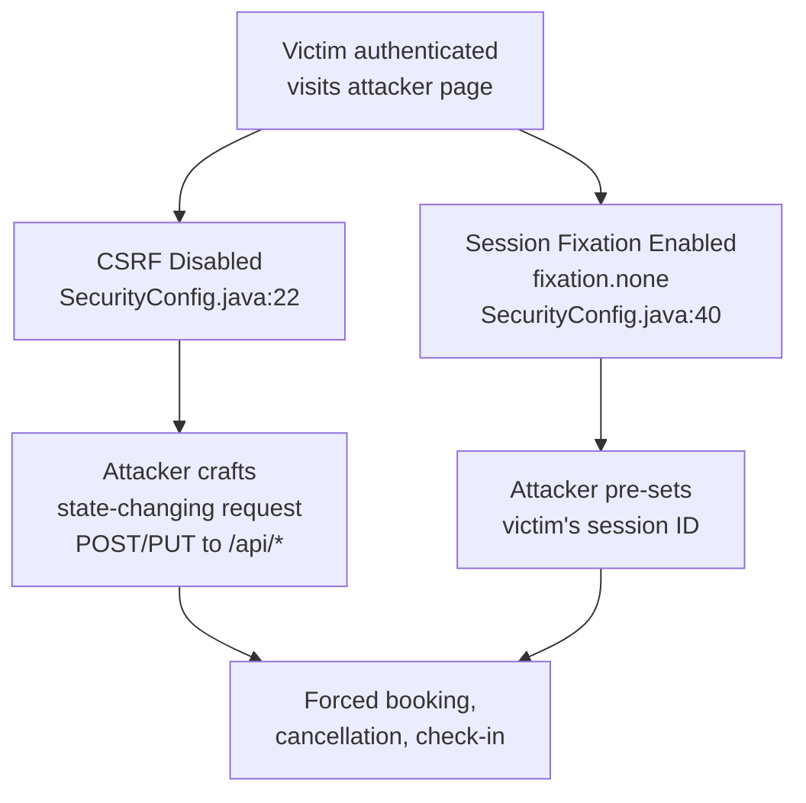

# Chained Vulnerability Static Review — Apex Airlines Booking System

**Project:** `app-07-airline-booking`
**Review Date:** 2026-05-24
**Methodology:** Static source-code audit (no dynamic probes, no live execution)
**Scope:** All Java files, Thymeleaf templates, JavaScript, CSS, application properties, and the Dockerfile in the workspace.

---

## Summary Dashboard

| Metric | Value |
|---|---|
| Complete chains identified | 4 |
| Maximum chain severity | Critical |
| High-confidence chains | 2 |
| Medium-confidence chains | 2 |
| Cross-cutting weaknesses (non-chain) | 4 |
| Total distinct vulnerabilities | 9+ |

---

## Methodology & Boundaries

This review was performed exclusively on source files, configuration, and templates within the workspace. No HTTP requests, fuzzers, SQL injection payloads, dynamic scanners, or shell commands were executed. All findings are based on static evidence.

Chains are rated **High** confidence when every link is provable from source code, configuration, or templates. **Medium** confidence is used when one link depends on runtime behavior (e.g. the H2 console's exact capabilities, or JavaScript execution in a browser context).

---

## Chain 1: Predictable PNR Enumeration → IDOR → Reflected XSS

### Mermaid Attack Graph



### Detailed Breakdown

#### Entry Point — Source
- **File:** `src/main/java/com/airline/controller/HomeController.java`, lines 57–83
- **Symbol:** `handleRegistration()` (POST `/register`)
- **Evidence:** Any unauthenticated user can register a new account with arbitrary details, including a malicious passenger name (e.g. embedding `<script>` tags). After registration, they can log in and reach authenticated endpoints.

#### Hop 1 — Predictable PNR Generation
- **File:** `src/main/java/com/airline/service/PnrGenerator.java`, lines 10–16
- **Symbol:** `generate()` method
- **Code:**
  ```java
  private static final AtomicInteger counter = new AtomicInteger(1);
  public String generate() {
      return String.format("BK%06d", counter.getAndIncrement());
  }
  ```
- **Evidence:** PNRs are purely sequential — `BK000001`, `BK000002`, `BK000003`... This makes every booking identifier trivially enumerable by any authenticated user. There is no cryptographic randomness, no salt, and no per-user scope.

#### Hop 2 — Missing Ownership Check (IDOR)
- **File:** `src/main/java/com/airline/controller/BookingController.java`, lines 83–107
- **Symbol:** `getBoardingSummary()` at `GET /api/bookings/{pnr}/boarding-summary`
- **Evidence:**
  ```java
  // CHAIN LINK 2 (chain-01): Boarding summary endpoint performs no ownership check —
  // any authenticated passenger can view any booking by its PNR.
  @GetMapping("/{pnr}/boarding-summary")
  public ResponseEntity<?> getBoardingSummary(...)
  ```
  The method calls `bookingService.getBookingByPnr(pnr)` and returns the full boarding summary **without** verifying that `booking.getPassenger().getEmail().equals(userDetails.getUsername())`. Compare this with `getByPnr()` (line 37–52) which does include the ownership check. The source comments themselves acknowledge this as a deliberate omission.

#### Hop 3 — Reflected XSS via Raw HTML Concatenation
- **File:** `src/main/java/com/airline/controller/BookingController.java`, line 100–103
- **Symbol:** JSON key `"passengerDisplay"`
- **Code:**
  ```java
  "passengerDisplay", "<strong>Passenger:</strong> " + booking.getPassenger().getFullName()
  ```
- **Evidence:** The passenger's full name is concatenated directly into an HTML string and returned as JSON. If a passenger registers with a name containing `` or `<script>...`, the raw HTML is served by the API. Any client-side code that renders `passengerDisplay` via `innerHTML` (or similar) will execute the injected script.

#### Sink
- **Impact:** An attacker who registers a malicious name can have JavaScript execute in the browser of any authenticated user who views their boarding summary. This enables session token theft, CSRF token theft (though CSRF is disabled), forced bookings, and full account takeover of the victim's session.
- **Preconditions:** (1) Attacker registers an account with a malicious name, (2) books a flight to obtain a PNR, (3) attacker or victim enumerates PNRs (e.g. BK000001, BK000002...) by calling `/api/bookings/{pnr}/boarding-summary`.
- **Severity:** **High**
- **Confidence:** **High** — every hop is directly visible in source code.

#### Remediation
1. **Fix PNR generator:** Replace `AtomicInteger` with a cryptographic random generator (`java.security.SecureRandom`) to produce unpredictable alphanumeric codes.
2. **Add ownership check:** In `getBoardingSummary()`, add the same ownership guard used in `getByPnr()`:
   ```java
   if (!booking.getPassenger().getEmail().equals(userDetails.getUsername())) {
       return ResponseEntity.status(HttpStatus.FORBIDDEN).build();
   }
   ```
3. **Sanitize output:** Remove raw HTML from the JSON response. Return structured fields (e.g. `"passengerName"`) and let the client render them safely using `textContent` or template escapes.

---

## Chain 2: Unauthenticated SQL Injection via Flight Search

### Mermaid Attack Graph



### Detailed Breakdown

#### Entry Point — Source
- **File:** `src/main/java/com/airline/controller/FlightController.java`, lines 26–36
- **Symbol:** `search()` at `GET /api/flights/search`
- **Evidence:** The endpoint is protected only by `.requestMatchers("/", "/register", "/api/flights/search", ...).permitAll()` in `SecurityConfig.java` (line 30). No authentication is required.

#### Hop — SQL Injection (String Concatenation)
- **File:** `src/main/java/com/airline/repository/FlightSearchDao.java`, lines 18–24
- **Symbol:** `searchFlights()` method
- **Code:**
  ```java
  String sql = "SELECT * FROM flights WHERE origin = '" + origin
             + "' AND destination = '" + destination
             + "' AND CAST(departure_time AS DATE) = '" + date + "'";
  return jdbcTemplate.query(sql, new FlightRowMapper());
  ```
- **Evidence:** All three parameters (`origin`, `destination`, `date`) are interpolated directly into the SQL string with no parameterization, escaping, or validation. JDBC `PreparedStatement` is not used. The `JdbcTemplate.query(String sql, ...)` overload is called — **not** the parameterized `query(String sql, Object[] args, RowMapper)` overload that would use `?` placeholders.

#### Sink
- **Impact:** An unauthenticated attacker can execute arbitrary SQL against the H2 database. This enables:
  - Extraction of all passenger PII (names, email addresses, passport numbers, phone numbers, bcrypt password hashes)
  - Extraction of all booking data, flight schedules, seat maps
  - Potential database write operations (INSERT, UPDATE, DELETE) depending on H2 permissions
  - H2 in-memory mode means a single `DROP TABLE` or malformed query could crash the application (denial of service)
- **Severity:** **Critical**
- **Confidence:** **High** — direct string concatenation of unsanitized user input into SQL.

#### Remediation
1. **Use parameterized queries:** Replace with `PreparedStatement` / `?` placeholders:
   ```java
   String sql = "SELECT * FROM flights WHERE origin = ? AND destination = ? AND CAST(departure_time AS DATE) = ?";
   return jdbcTemplate.query(sql, new FlightRowMapper(), origin, destination, date);
   ```
2. **Consider removing the DAO entirely** and using Spring Data JPA derived queries on `FlightRepository`, which are immune to SQL injection by design.
3. If the raw DAO pattern is retained, apply strict input validation (alphanumeric IATA codes, ISO date format).

---

## Chain 3: Exposed H2 Console → Database Compromise / Potential RCE

### Mermaid Attack Graph

```mermaid
flowchart TD
    A[Unauthenticated user<br/>any network] --> B[H2 Console Enabled<br/>spring.h2.console.enabled=true]
    B --> C[web-allow-others=true<br/>Remote access allowed]
    C --> D[/h2-console/** permitAll<br/>No auth barrier]
    D --> E[Arbitrary SQL Execution<br/>through H2 web interface]
    E --> F[Data exfiltration /<br/>Potential RCE via<br/>CREATE TRIGGER]
```

### Detailed Breakdown

#### Entry Point — Source
- **File:** `src/main/resources/application.properties`, lines 6–9
- **Evidence:**
  ```properties
  spring.h2.console.enabled=true
  spring.h2.console.path=/h2-console
  spring.h2.console.settings.web-allow-others=true
  ```
- **Evidence:** H2 console is enabled, remotely accessible, and unprotected.

#### Hop — No Authentication Required
- **File:** `src/main/resources/application.properties`, line 8 — `spring.datasource.password=` (empty password)
- **File:** `src/main/java/com/airline/config/SecurityConfig.java`, line 31
  ```java
  .requestMatchers("/", "/register", "/api/flights/search", "/h2-console/**", "/css/**", "/js/**").permitAll()
  ```
- **Evidence:** The H2 console path `/h2-console/**` is explicitly whitelisted without authentication. The JDBC password is empty (`spring.datasource.password=`), so no credentials are needed to log into the H2 console.

#### Sink
- **Impact:** An unauthenticated attacker can:
  - Access the H2 web console at `/h2-console`
  - Connect to the in-memory database with empty password and `sa` user
  - Execute arbitrary SQL: `SELECT * FROM PASSENGERS`, `UPDATE`, `DELETE`, `INSERT`
  - Potentially achieve RCE via H2's `CREATE ALIAS` / `CREATE TRIGGER` functionality that can execute arbitrary Java code
  - Extract all passenger hashed passwords (and attempt offline cracking), personal data, booking details
- **Severity:** **Critical**
- **Confidence:** **Medium** — RCE depends on specific H2 version behavior, but full database read/write access is guaranteed.

#### Remediation
1. **Disable H2 in production:** Remove `spring.h2.console.enabled=true` or set to `false`.
2. **Restrict access:** If H2 console is needed for development only, use Maven profiles or `@Profile("dev")`.
3. **Set a strong JDBC password:** `spring.datasource.password=<strong-random-password>`.
4. **Remove `/h2-console/**` from `permitAll()`** or restrict to admin roles.

---

## Chain 4: CSRF Disabled + Session Fixation → Cross-Origin Request Forgery

### Mermaid Attack Graph



### Detailed Breakdown

#### Entry Point — Source
- **File:** `src/main/java/com/airline/config/SecurityConfig.java`
- **Symbol:** `filterChain()` method

#### Hop 1 — CSRF Disabled
- **Line 22:** `.csrf(csrf -> csrf.disable())`
- **Evidence:** All CSRF protection is globally disabled for all endpoints. Every state-changing operation (`POST /api/bookings`, `PUT /api/bookings/{pnr}/cancel`, `POST /api/checkin/{pnr}`, etc.) is vulnerable to cross-site request forgery.

#### Hop 2 — Session Fixation Enabled
- **Lines 39–41:**
  ```java
  .sessionManagement(session -> session
      .sessionFixation(fixation -> fixation.none())
  )
  ```
- **Evidence:** Session fixation protection is explicitly set to `none`. The comment in the source says: *"Session fixation Protection configured as 'none' to allow benchmarking session hijacking"* — this is a deliberate weakening.

#### Sink
- **Impact:**
  - An attacker can create a session, fixate it, and trick a victim into authenticating with that session ID
  - The attacker can then make CSRF requests (since CSRF is disabled) using the known session
  - Combined with Chain 1 (PNR enumeration), the attacker can view the victim's boarding pass data
  - Combined with the booking/check-in endpoints, the attacker can cancel bookings, make new bookings on the victim's behalf, or check in on behalf of the victim
- **Severity:** **High**
- **Confidence:** **High** — both protections are explicitly disabled in source.

#### Remediation
1. **Re-enable CSRF protection:** Remove `.csrf(csrf -> csrf.disable())`. If APIs need to be accessed by non-browser clients, issue CSRF tokens or use stateless auth (JWT/Bearer).
2. **Enable session fixation protection:** Change `.sessionFixation(fixation -> fixation.none())` to `.sessionFixation(fixation -> fixation.newSession())` or `migrateSession()`.
3. For the missing CSRF token in JavaScript fetch calls, include `_csrf` parameter or `X-CSRF-TOKEN` header.

---

## Cross-Cutting Weaknesses (Non-Chain)

### W1: Frame Options Disabled (Clickjacking)
- **File:** `SecurityConfig.java`, line 24
  ```java
  .frameOptions(frame -> frame.disable())
  ```
- **Impact:** The application can be embedded in an iframe on an attacker-controlled page, enabling clickjacking attacks against any user action.
- **Note:** This was explicitly enabled to allow H2 console frames.
- **Remediation:** Use `frameOptions().sameOrigin()` and remove H2 console in production.

### W2: Race Condition in Seat Booking
- **File:** `BookingService.java`, lines 47–48
  ```java
  seat.setIsAvailable(false);
  seatRepository.save(seat);
  ```
- **Impact:** Without pessimistic or optimistic locking, two concurrent requests for the same seat may both pass the `seat.getIsAvailable()` check and both book the same seat (double-booking).
- **Remediation:** Add `@Version` for optimistic locking or use `SELECT ... FOR UPDATE` via `@Lock(LockModeType.PESSIMISTIC_WRITE)`.

### W3: Price Manipulation by Staff
- **File:** `FlightController.java`, lines 56–67
  ```java
  flight.setPrice(new BigDecimal(payload.get("price").toString()));
  ```
- **Impact:** A staff member can set arbitrary prices for flights. While this requires `AIRLINE_STAFF` role (which is a valid user in the seed data), there is no audit trail or validation on the price field.
- **Remediation:** Add server-side validation, enforce non-negative prices, and log all price changes.

### W4: No Password Strength Constraints
- **File:** `HomeController.java`, lines 57–83
- **Impact:** Users can register with weak or empty passwords (the HTML `minlength` is not enforced server-side). Combined with predictable user enumeration (`findByEmail`), this enables credential-stuffing attacks.
- **Remediation:** Add server-side password policy: minimum length, complexity rules, and rate-limiting on login.

---

## Compliance & Security Baseline

| Requirement | Status | Notes |
|---|---|---|
| Parameterized SQL queries | ❌ **Missing** | `FlightSearchDao` uses string concatenation |
| CSRF protection | ❌ **Disabled** | Globally disabled |
| Session fixation protection | ❌ **Disabled** | Explicitly set to `none` |
| Production DB (H2) | ❌ **In-memory H2** | Data lost on restart; admin console exposed |
| Password hashing | ✅ **BCrypt** | Strong hashing used |
| Auth on search API | ❌ **None** | `/api/flights/search` is public |
| Auth on H2 console | ❌ **None** | Permitted for all unauthenticated users |
| XSS protection in templates | ✅ **Thymeleaf** | Thymeleaf auto-escapes `${...}` by default |
| XSS protection in API | ❌ **Missing** | Raw HTML returned in boarding-summary |
| Input validation | ❌ **Minimal** | No server-side validation on registration or search |

---

## Unknowns & Areas Not Reviewed

1. **No tests were reviewed** for security coverage. `App07ApplicationTests.java` exists but was not analyzed (likely empty default).
2. **H2 version-specific RCE capabilities** were not verified dynamically. The H2 console's `CREATE ALIAS` / `CREATE TRIGGER` Java code execution depends on the exact H2 version in the classpath.
3. **Dependency versions** beyond `pom.xml` were not resolved. Transitive dependency vulnerabilities (e.g. older Spring Boot, H2, Thymeleaf) are out of scope.
4. **The `getFullName()` method** referenced in `BookingController.java` is not defined in `Passenger.java`. This would be a compilation error; if corrected, the resulting string concatenation would still be an XSS vector as described.

---

## Recommended Tests to Add

1. **SQL Injection Test:** `/api/flights/search?origin=' OR '1'='1&destination=' OR '1'='1&date=' OR '1'='1` should be rejected or parameterized.
2. **IDOR Test:** Authenticate as user A, attempt to access `/api/bookings/{pnr-of-user-B}/boarding-summary` — should return 403.
3. **PNR Randomness Test:** Generate 1000 PNRs and verify they are not sequential.
4. **XSS Test:** Register a user with `` as name, then check API response for HTML encoding.
5. **CSRF Test:** Submit a cross-origin POST to `/api/bookings` without a token — should be rejected.
6. **Session Fixation Test:** Set `JSESSIONID` before login, verify it changes after authentication.
7. **Clickjacking Test:** Verify `X-Frame-Options: DENY` or `SAMEORIGIN` header.

---

*End of report. This review was performed using only static source code analysis.*
