# Chained Vulnerability Static Audit Report

**Project:** Aether Wallet (app-12-crypto-wallet)  
**Audit Date:** 2026-05-25  
**Methodology:** Source-only static review (OWASP Top 10 mapping)  
**Review Boundary:** All source files under `src/`, `public/`, and project configuration.

---

## Summary Dashboard

| Metric | Value |
|---|---|
| Complete chains identified | **1** |
| Maximum chain severity | **Critical** |
| Individual weaknesses catalogued | **7** |
| Areas reviewed | `src/` (all *.ts), `public/` (HTML, JS, CSS), config files |
| Not reviewed | `node_modules/`, runtime behaviour, network probes, external APIs |

---

## Methodology & Static-Only Safety Note

This audit was performed exclusively via source-code inspection. No live HTTP requests, dynamic scanners, fuzzers, credential attacks, or network tests were executed. No exploit payloads or step-by-step abuse instructions are included. All findings are derived from static evidence present in the repository files listed above.

---

## Chain 01: IDOR → Private Key Exposure → Unauthorized Fund Transfer

### Mermaid Attack Graph

```mermaid
flowchart LR
    subgraph Entry
        A1["POST /api/auth/login<br/>(any valid credential)"]
    end

    subgraph Hop1["Hop 1 – IDOR (Broken Access Control)"]
        B1["GET /api/wallet?userId=N<br/>WalletController.getWallet()<br/>wallet.controller.ts:17-23"]
        B2["No userId ownership check<br/>targetUserId = userId ?? user.id"]
    end

    subgraph Hop2["Hop 2 – Plaintext Private Key Exposure (A02)"]
        C1["WalletService.getWallet(userId)<br/>wallet.service.ts:7-13<br/>returns entire wallet object"]
        C2["privateKey returned in plaintext<br/>db.ts lines 17-26"]
    end

    subgraph Sink["Sink – Unauthorized Transfer (A04/A07)"]
        D1["POST /api/wallet/external-transfer<br/>WalletController.externalTransfer()<br/>wallet.controller.ts:31-42"]
        D2["No fromAddress ownership check<br/>WalletService.executeTransferByAddress()<br/>wallet.service.ts:57-93"]
        D3["Funds drained from victim's wallet"]
    end

    A1 --> B1
    B1 --> B2
    B2 --> C1
    C1 --> C2
    C2 --> D1
    D1 --> D2
    D2 --> D3
```

### Detailed Breakdown

#### Entry Point / Source

| Property | Detail |
|---|---|
| **Endpoint** | `POST /api/auth/login` |
| **File** | `src/auth/auth.module.ts` (inline controller), lines 14–23 |
| **Symbol** | `AuthController.login()` |
| **Evidence** | Accepts `{username, password}` body. Authenticates against hardcoded plaintext credentials (`alice`/`alice123`, `bob`/`bob123`). Sets an `httpOnly` cookie `session_id` equal to the user's numeric ID (stringified). |
| **Visibility** | Any user can authenticate — credentials are documented in `public/index.html` "Demo Accounts" block. |

#### Hop 1 – IDOR / Broken Access Control (OWASP A01)

| Property | Detail |
|---|---|
| **Endpoint** | `GET /api/wallet` |
| **File** | `src/wallet/wallet.controller.ts`, lines 17–23 |
| **Symbol** | `WalletController.getWallet()` |
| **Evidence (line 19)** | `const targetUserId = userId ? parseInt(userId, 10) : user.id;` |
| **Weakness** | The optional `?userId=N` query parameter is accepted and used directly. There is **no authorization check** verifying that `targetUserId` matches the authenticated user's ID. Any authenticated user can query any other user's wallet. |
| **Static proof** | The entire method body is 5 lines. No guard, comparison, or ownership check exists between the query parameter and the service call. |

#### Hop 2 – Plaintext Private Key Exposure (OWASP A02)

| Property | Detail |
|---|---|
| **Endpoint** | (same request as Hop 1) |
| **File** | `src/wallet/wallet.service.ts`, lines 7–13 |
| **Symbol** | `WalletService.getWallet()` |
| **Evidence (line 12)** | `return wallet;` – returns the complete wallet object without any field filtering. |
| **File** | `src/db.ts`, lines 17 and 22 |
| **Evidence** | Private keys stored as plaintext strings: `privateKey: '0x1234abcd...'` |
| **Weakness** | Cryptographic failure: the wallet object includes the `privateKey` field, and the service method returns it to the caller. The front-end also renders it (`public/index.html` line ~82 / `public/js/app.js` line ~105). |
| **Static proof** | No `@Exclude()`, `pick()`, or DTO transformation strips the private key. The raw `db` object is returned. |

#### Sink – Unauthorized Fund Transfer (OWASP A04, A07)

| Property | Detail |
|---|---|
| **Endpoint** | `POST /api/wallet/external-transfer` |
| **File** | `src/wallet/wallet.controller.ts`, lines 31–42 |
| **Symbol** | `WalletController.externalTransfer()` |
| **Evidence (comment line 36)** | `// Vulnerable: no ownership check — fromAddress not verified against req['user']` |
| **File** | `src/wallet/wallet.service.ts`, lines 57–93 |
| **Symbol** | `WalletService.executeTransferByAddress()` |
| **Weakness** | The `fromAddress` parameter is accepted from the request body without verifying it belongs to the authenticated user. An attacker who discovered a victim's wallet address (via the IDOR hop) can transfer funds *from* that victim's wallet without possessing the victim's session. |
| **Static proof** | The controller passes `fromAddress` directly from the body (line 40). The service method never receives or checks `userId`. No ownership mapping exists in the code. |

#### Preconditions & Assumptions

| Condition | Source |
|---|---|
| Attacker can authenticate as any user | `public/index.html` lists credentials; `auth.module.ts` accepts them with no rate limit or lockout |
| Attacker knows or guesses victim's `userId` | `userId` values are sequential integers (1, 2) visible in `db.ts` |
| Victim has a non-zero wallet balance | `db.ts` shows both wallets have positive balances (15.5 ETH, 2.1 ETH) |
| Attacker can reach all three endpoints | Routes are public after authentication; no IP or rate limiting is present |

#### Impact, Severity, Confidence, Remediation

| Dimension | Rating |
|---|---|
| **Impact** | **Critical** — Total loss of victim funds; private key exposure leads to permanent key compromise. The victim's private key is leaked in plaintext, making the theft irreversible even off-chain. |
| **Severity** | **Critical** (CVSS 9.1+): Network-accessible, low complexity, no privileges beyond basic auth, no user interaction required. |
| **Confidence** | **High** — Every link in the chain is statically provable from the cited source lines. No runtime speculation is required. |
| **Easiest Link to Break** | **Hop 1 (IDOR)**: Remove the `userId` query parameter from `WalletController.getWallet()` or add a guard that asserts `targetUserId === user.id`. |
| **Secondary Fix** | **Sink**: Add ownership verification in `externalTransfer()` — look up the wallet address belonging to `req['user'].id` and compare with `fromAddress`. |
| **Tertiary Fix** | **Hop 2**: Never return the `privateKey` field from the API. Use a DTO/view model that excludes it. |

---

## Cross-Cutting Weaknesses

The following issues were identified but do not form a complete chained attack path on their own. They are security-relevant and should be remediated to reduce the overall risk profile.

### W-01: Plaintext Password Storage (OWASP A02)

| Detail | Value |
|---|---|
| **File** | `src/db.ts`, lines 6–10 |
| **Evidence** | `password: 'alice123'`, `password: 'bob123'` |
| **Impact** | Credentials are visible to anyone with filesystem access. No hashing is used. |
| **Remediation** | Store password hashes (bcrypt/argon2) instead of plaintext. |

### W-02: No CSRF Protection (OWASP A01)

| Detail | Value |
|---|---|
| **Files** | `src/main.ts` (cookie-parser enabled), `src/wallet/wallet.controller.ts` (transfer endpoints) |
| **Evidence** | `cookie-parser` is used but no CSRF token middleware or double-submit cookie pattern is implemented. |
| **Impact** | While `sameSite: 'lax'` on the session cookie mitigates cross-site POST (lax blocks cross-site POST), GET-based state changes are partially protected. No defense-in-depth exists. |
| **Remediation** | Add CSRF token validation for all state-changing endpoints. |

### W-03: Weak Session Token (OWASP A07)

| Detail | Value |
|---|---|
| **File** | `src/auth/auth.module.ts`, line 20 |
| **Evidence** | `res.cookie('session_id', user.id.toString(), { httpOnly: true, sameSite: 'lax' })` |
| **Weakness** | Session ID is the user's numeric ID as a string — trivially guessable or enumerable. No `Secure` flag (cookies sent over HTTP). No `Expires`/`Max-Age` (persists until browser close). No session rotation on login. No session invalidation beyond clearing the cookie. |
| **Remediation** | Use a cryptographically random session token. Set `Secure`, `Max-Age`, and rotate on privilege changes. |

### W-04: No Rate Limiting (OWASP A04)

| Detail | Value |
|---|---|
| **All endpoints** | No throttle guard is configured anywhere in the project. |
| **Impact** | Brute-force of login credentials, unlimited transfer attempts, and denial-of-wallet attacks are possible. |
| **Remediation** | Apply `@nestjs/throttler` or a reverse-proxy rate limit to all public and authenticated endpoints. |

### W-05: No Transaction Confirmation (OWASP A04)

| Detail | Value |
|---|---|
| **Endpoint** | `POST /api/wallet/transfer` |
| **File** | `src/wallet/wallet.controller.ts`, lines 25–30; `public/js/app.js`, line 121 |
| **Evidence** | No confirmation dialog or intent verification before execution. The front-end comment reads: `// OWASP A04/A07: Immediate execution without confirmation or MFA!` |
| **Impact** | A single accidental click or CSRF-like trigger (if same-site) executes the transfer irreversibly. |
| **Remediation** | Add a confirmation step (modal dialog, transaction PIN, or "review and confirm" workflow). |

### W-06: No MFA / Step-Up Authentication (OWASP A07)

| Detail | Value |
|---|---|
| **Endpoint** | `POST /api/wallet/transfer`, `POST /api/wallet/external-transfer` |
| **File** | `src/wallet/wallet.service.ts` |
| **Evidence** | Both `executeTransfer()` and `executeTransferByAddress()` execute immediately with only the session cookie check. No second factor or re-authentication is required for high-value transfers. |
| **Remediation** | Require a one-time code or password re-entry for transfers above a configurable threshold. |

### W-07: Verbose Error Messages (OWASP A05)

| Detail | Value |
|---|---|
| **File** | `src/wallet/wallet.service.ts` |
| **Evidence** | Error messages disclose whether a wallet exists, whether the address is valid, and whether the balance is sufficient: `'Wallet not found'`, `'Recipient address not found'`, `'Insufficient balance'`. |
| **Impact** | An attacker can enumerate valid wallet addresses and balances. |
| **Remediation** | Return generic error messages like `'Transfer failed'` regardless of the underlying reason. |

---

## Unknowns & Not-Reviewed Areas

| Area | Reason |
|---|---|
| `node_modules/` | Out of scope — dependency-transitive vulnerabilities are not assessed. However, no known-critical CVE-impacted packages were identified from the manifest (`@nestjs/*` v10, `cookie-parser` v1.4.x, `rxjs` v7). |
| Runtime behaviour | No dynamic analysis was performed. Race conditions (TOCTOU on balance checks) are theoretically possible but not provable from source. |
| HTTP header injection | `cookieParser()` may be vulnerable to cookie injection if not configured, but no user-controlled cookie values flow into sensitive decisions beyond the session ID (which is already integer-based). |
| Logging / monitoring | No observability or audit trail is implemented. Absence of logs is noted but not a chained vulnerability. |
| HTTPS enforcement | No TLS configuration is present. The application listens on HTTP (port 8012). This is a deployment concern, not a code-chain issue. |

---

## Recommended Tests

The following tests should be added to a test suite to prevent regression:

1. **IDOR test**: Authenticate as user A, call `GET /api/wallet?userId=<id_of_B>`, verify 403 Forbidden or that the returned wallet belongs to user A.
2. **Private key exfiltration test**: Call any wallet endpoint and verify the response schema does not contain a `privateKey` field.
3. **Ownership enforcement test for external-transfer**: Call `POST /api/wallet/external-transfer` with a `fromAddress` not owned by the authenticated user, verify 403 Forbidden.
4. **CSRF test**: Verify that state-changing POST endpoints reject requests without a valid CSRF token.
5. **Session strength test**: Verify the session cookie is a random token, not a sequential user ID.
6. **Rate-limit test**: Verify that N rapid login/transfer attempts trigger a 429 Too Many Requests.

---

*Report generated via static-only audit. No dynamic exploitation was performed.*
