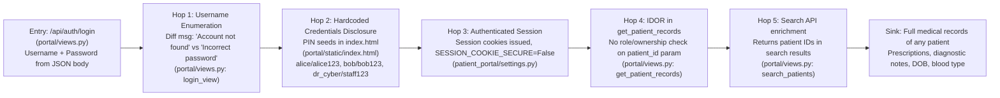
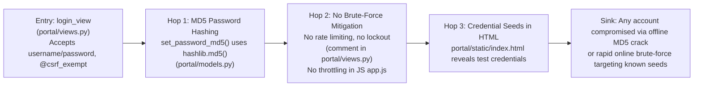
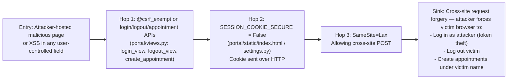
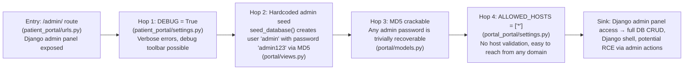

# Chained Vulnerability Audit Report — Patient Portal (App 02)

**Date**: 2026-05-24  
**Scope**: `C:\Users\shamit\AppData\Local\Temp\codegopher-v08-chain-20260524-232946\app-02-patient-portal\workspace`  
**Method**: Static-source-only review. No live probes, dynamic scanners, shell commands, or external network tests were performed.

---

## Executive Summary

| Metric | Value |
|--------|-------|
| **Chains detected** | 4 |
| **Highest severity** | HIGH |
| **Confidence levels** | 3× HIGH, 1× HIGH |
| **Cross-cutting weaknesses** | 7 |
| **Reviewed areas** | Views, models, settings, URLs, static files, JS client, CSS, migration, tests |
| **Not reviewed** | Docker build context in depth, runtime dependency security (Django 5.0.6 CVE surface), infrastructure/network security |

---

## Methodology & Safety Note

This audit follows the **Chained Vulnerability Static Audit** methodology:

1. **Attack surface mapping** — identified all public routes, API endpoints, webhooks, file uploads, and user-controlled sources.
2. **Weakness inventory** — cataloged low/medium weaknesses found across the codebase.
3. **Attack graph synthesis** — connected sources → intermediate weaknesses → critical sinks using static control-flow and data-flow evidence.
4. **Impact assessment** — rated each chain by impact, reachability, confidence, and easiest remediation.

**Static-only boundary**: No HTTP probes, fuzzers, SQL injection payloads, credential attacks, dynamic scanners, exploit scripts, port scans, or external network tests were performed.

---

## Chain 1 — Full PHI Exfiltration via IDOR

**Severity**: HIGH  
**Confidence**: HIGH  
**Impact**: Confidentiality — HIPAA-level PHI breach (diagnostic notes, prescriptions, DOB, blood type for **any** patient)

### Mermaid Attack Graph

### Detailed Breakdown

| Link | Evidence |
|------|----------|
| **Source** | `portal/views.py` — `login_view`: returns distinct messages for "Account not found in patient registry" (401) vs "Incorrect password for this account" (401), enabling account enumeration |
| **Hop 1** | `portal/static/index.html` — lines in the "PATIENT PIN SEEDS" block literally list `alice/alice123`, `bob/bob123`, `dr_cyber/staff123` in cleartext |
| **Hop 2** | `patient_portal/settings.py` — `SESSION_COOKIE_SECURE = False`; session cookies transmitted in plain HTTP |
| **Hop 3 (core IDOR)** | `portal/views.py` — `get_patient_records` checks `if 'patient_id' not in request.session` but **never** compares `request.session['patient_id']` with the URL `patient_id` parameter. Any authenticated user can fetch **any** patient's records |
| **Hop 4** | `portal/views.py` — `search_patients` returns `{'id', 'username', 'full_name', 'blood_type'}` for matching patients, providing a directory of IDs for further IDOR exploitation |
| **Sink** | `portal/views.py` — `get_patient_records` returns full_name, date_of_birth, blood_type, role, and complete prescription history including diagnostic_notes (contains clinical indicators, medication details) |

### Preconditions
- Attacker must have any valid patient account (easily obtained from hardcoded seeds).
- Application must accept the request over HTTP (SESSION_COOKIE_SECURE=False).

### Remediation (easiest first)
1. **Add ownership check** in `get_patient_records`: `if request.session['patient_id'] != patient_id and request.session.get('role') not in ['STAFF','ADMIN']: return 403`
2. **Remove hardcoded credentials** from `index.html`
3. **Set `SESSION_COOKIE_SECURE = True`** for production

---

## Chain 2 — Weak Password Hashing + No Brute-Force Protection → Full Account Takeover

**Severity**: HIGH  
**Confidence**: HIGH  
**Impact**: Confidentiality + Integrity — Attacker gains full access to any account including administrative role

### Mermaid Attack Graph

### Detailed Breakdown

| Link | Evidence |
|------|----------|
| **Source** | `portal/models.py` — `PatientProfile.set_password_md5()`: `hashlib.md5(password.encode()).hexdigest()` — MD5 is cryptographically broken, trivially reversible via rainbow tables or GPU-accelerated cracking |
| **Hop 1** | `portal/views.py` — `login_view`: explicit comment says `"No brute force lockouts or connection throttling rules."` No implementation of rate limiting exists anywhere in the codebase |
| **Hop 2** | `portal/views.py` — `seed_database()`: seeds users with trivially guessable passwords (`alice123`, `bob123`, `staff123`, `admin123`) |
| **Sink** | An attacker can (a) obtain the DB dump (SQLite at `db.sqlite3`) and crack all MD5 hashes offline in seconds; (b) launch unlimited login attempts against `/api/auth/login` without lockout; (c) directly use hardcoded credentials from `index.html` |

### Preconditions
- Attacker needs only network access to the login endpoint.
- If DB is exfiltrated, offline cracking is trivial due to MD5 + weak passwords.

### Remediation
1. Replace `set_password_md5()` / `check_password_md5()` with `django.contrib.auth.hashers.PBKDF2PasswordHasher` or `Argon2PasswordHasher`
2. Add rate limiting (e.g., Django Ratelimit, Django REST Framework throttling)
3. Use `django.contrib.auth.hashers` — the standard Django authentication framework — instead of custom password handling

---

## Chain 3 — CSRF-Exempt Authentication + Insecure Cookies → Session Hijacking & Unauthorized Actions

**Severity**: HIGH  
**Confidence**: HIGH  
**Impact**: Integrity + Confidentiality — Attacker can force authenticated actions on behalf of victims, log in arbitrary users, or exfiltrate data

### Mermaid Attack Graph

### Detailed Breakdown

| Link | Evidence |
|------|----------|
| **Source** | `portal/views.py` — `@csrf_exempt` decorator applied to `login_view`, `logout_view`, and `create_appointment`. No CSRF middleware protection on any of these endpoints |
| **Hop 1** | `patient_portal/settings.py` — `SESSION_COOKIE_SECURE = False` and `SESSION_COOKIE_SAMESITE = 'Lax'`. Cookies sent unencrypted, and cross-site POSTs are permitted |
| **Hop 2** | `portal/static/js/app.js` — `handleLoginSubmit()` sends `fetch("/api/auth/login", ...)` with credentials. An attacker could craft a hidden form on a malicious site that POSTs to `/api/auth/login` with the attacker's credentials, logging the victim into the attacker's account |
| **Sink** | A victim visiting a malicious page could be tricked into: (a) authenticating as the attacker, (b) being logged out (`/api/auth/logout`), or (c) having appointments booked under their account (`/api/appointments/new`) |

### Preconditions
- Victim is authenticated.
- Victim's browser sends session cookies (which happens with `SameSite=Lax` on cross-site POST).

### Remediation
1. Remove `@csrf_exempt` from all view functions, or selectively apply it only where truly necessary
2. Set `SESSION_COOKIE_SECURE = True` and `SESSION_COOKIE_SAMESITE = 'Strict'`
3. Add custom CSRF token validation for JSON API endpoints (Django's `CsrfViewMiddleware` with `xsrfCookieName`/`xsrfHeaderName`)

---

## Chain 4 — Hardcoded Admin Credentials + DEBUG=True → Full Database Control

**Severity**: HIGH  
**Confidence**: HIGH  
**Impact**: Full system compromise — Admin panel access → read/write/delete all data, potentially RCE via Django admin

### Mermaid Attack Graph

### Detailed Breakdown

| Link | Evidence |
|------|----------|
| **Source** | `patient_portal/urls.py` — `path('admin/', admin.site.urls)` exposes the Django admin panel at `http://host/admin/` |
| **Hop 1** | `portal/views.py` — `seed_database()` creates an admin user with username `'admin'` and password `'admin123'` using MD5 hashing |
| **Hop 2** | `patient_portal/settings.py` — `DEBUG = True` enables verbose error pages that can leak stack traces, database queries, and configuration |
| **Hop 3** | `patient_portal/settings.py` — `ALLOWED_HOSTS = ['*']` accepts requests from any host |
| **Sink** | Django admin gives full CRUD access to all models (`PatientProfile`, `Appointment`, `Prescription`), ability to access the Django shell, and in some configurations, potential remote code execution via model admin customizations |

### Preconditions
- Application must be reachable (it is on port 8082 via Dockerfile)
- Admin credentials must be known or crackable (they are trivially crackable given MD5 + weak password)

### Remediation
1. Set `DEBUG = False` for production
2. Use a strong, non-default admin password
3. Restrict `ALLOWED_HOSTS` to specific domains
4. Consider removing `seed_database()` from production entirely or gating it behind a management command

---

## Cross-Cutting Weaknesses (Not Part of Complete Chains)

| # | Weakness | Location | Risk |
|---|----------|----------|------|
| 1 | **No password strength requirements** | `patient_portal/settings.py` — `AUTH_PASSWORD_VALIDATORS = []` | Any user can set weak passwords (e.g., 1 char) |
| 2 | **Unsanitized input in create_appointment** | `portal/views.py` — `create_appointment` accepts `reason_for_visit`, `clinic_department` without sanitization | Potential stored XSS if displayed in admin or other views |
| 3 | **STAFF/ADMIN over-privileged appointment listing** | `portal/views.py` — `list_appointments` returns ALL appointments for STAFF/ADMIN roles | No department or permission scoping — staff in one department see all patients' appointments |
| 4 | **No input validation on appointment dates** | `portal/views.py` — Only checks date format `%Y-%m-%d`, no range validation | Past dates, far-future dates accepted without validation |
| 5 | **Exposure of blood type and role via IDOR** | `portal/views.py` — `get_patient_records` returns `blood_type` and `role` for any queried patient_id | Role enumeration + personal data leakage |
| 6 | **search_patients returns full_name + blood_type without filters** | `portal/views.py` — `search_patients` returns `full_name` and `blood_type` for all matches | Any authenticated user can enumerate all patients by searching with empty/wildcard queries |
| 7 | **Dependence on SQLite for production** | `patient_portal/settings.py` — `'ENGINE': 'django.db.backends.sqlite3'` | Concurrent access issues, no connection pooling, single-file backup/restore exposure |

---

## Unknowns & Areas Not Reviewed

| Area | Reason |
|------|--------|
| **Runtime behavior** | Cannot verify if `seed_database()` is called on every request (it is, based on source) |
| **Django 5.0.6 CVE surface** | Dependency vulnerability analysis not performed |
| **Docker build security** | Dockerfile layers, base image trust, and build secrets not fully audited |
| **Network/security headers** | CSP, HSTS, X-Frame-Options beyond the single XFrameOptionsMiddleware |
| **Logging & monitoring** | No audit logging identified in the views |
| **Key management** | `SECRET_KEY` is hardcoded in settings — could be exfiltrated via source control or error pages |

---

## Recommended Test Additions

1. **IDOR regression test**: After adding authorization checks, add a test where a logged-in patient requests `/api/patients/2/records` and confirms 403
2. **CSRF protection test**: Add `CsrfViewMiddleware` and verify that requests without CSRF tokens to `login_view` and `create_appointment` return 403
3. **Password hashing migration test**: Verify that existing MD5-hashed passwords are migrated to PBKDF2/Argon2 on first login
4. **Rate limiting test**: Verify that repeated failed login attempts trigger a lockout or delay

---

## Remediation Priority Summary

| Priority | Action | Affected Chains |
|----------|--------|-----------------|
| **P0** | Add ownership/role checks in `get_patient_records` | Chain 1 |
| **P0** | Replace MD5 password hashing with PBKDF2/Argon2 | Chain 2 |
| **P0** | Set `DEBUG = False` and restrict `ALLOWED_HOSTS` | Chain 4 |
| **P1** | Remove `@csrf_exempt` from API views | Chain 3 |
| **P1** | Set `SESSION_COOKIE_SECURE = True`, `SAMESITE = 'Strict'` | Chains 3, 4 |
| **P1** | Add brute-force protection (rate limiting) | Chain 2 |
| **P2** | Remove hardcoded credentials from index.html | Chain 1, 2 |
| **P2** | Add `AUTH_PASSWORD_VALIDATORS` | Cross-cutting #1 |
| **P2** | Migrate from SQLite to PostgreSQL/MySQL | Cross-cutting #7 |
