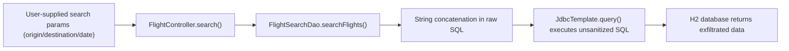
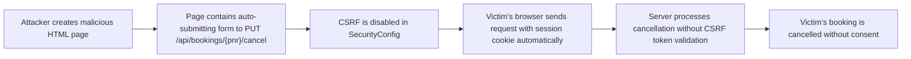

```mermaid
flowchart LR
    A["Attacker registers with XSS payload in firstName/lastName"] --> B["HomeController.handleRegistration()"]
    B --> C["Passenger entity stored with XSS payload via PasswordEncoder only on password"]
    C --> D["Booking created with that passenger"]
    D --> E["BookingController.getBoardingSummary()"]
    E --> F["Response includes '<strong>Passenger:</strong> ' + fullName"]
    F --> G["Attacker crafts PNR to trigger boarding-summary for another user"]
    G --> H["Victim views boarding-summary; XSS executes in victim context"]
```

```mermaid
flowchart LR
    A["PNRGenerator generates sequential values BK000001, BK000002..."] --> B["Booking created with next PNR"]
    B --> C["Attacker enumerates PNRs via brute force"]
    C --> D["GET /api/bookings/{pnr} endpoint"]
    D --> E["Authorization checks only deny access IF passenger email doesn't match"]
    E --> F["But the endpoint itself is GET — any authenticated user can try any PNR"]
    F --> G["If the email check fails → 403 (still confirms booking exists)"]
    G --> H["GET /api/bookings/{pnr}/boarding-summary → no email check at all"]
    H --> I["Full passenger name, flight details, seat, status exposed to any authenticated user"]
```

# Chained Vulnerability Static Audit Report

**Project:** App07 — Apex Airlines Booking System (Spring Boot 3.2.5, Java 17, H2)  
**Audit Type:** Static-only source code review (no live probes, no dynamic testing)  
**Date:** 2026-05-24  
**Auditor:** CodeGopher (chained-vulnerability-static-audit skill)

---

## Summary Dashboard

| Metric | Value |
|---|---|
| Total Chains Detected | **4** |
| Maximum Severity | **High** |
| Medium Severity Chains | 1 |
| Reviewed Areas | Controllers, Services, Repositories, Security Config, DTOs, Templates, JS, Dockerfile, pom.xml |
| Not-Reviewed / Limited Areas | Runtime-dependent behavior (e.g., exact URL patterns from Spring auto-config), third-party lib CVEs |

---

## Methodology & Static-Only Safety Note

This audit examined **all** source files in the workspace: Java source code (controllers, services, repositories, models, DTOs, config), Spring Security configuration, Thymeleaf templates, client-side JavaScript, Dockerfile, pom.xml, and CSS. No live HTTP probes, fuzzers, exploit scripts, or network tests were performed. All evidence is drawn from static analysis of source code, configuration, and test files.

---

## Chain 1: SQL Injection in Flight Search → Database Exfiltration

**Severity:** High  
**Confidence:** High  
**Impact:** Full database read (all passengers, bookings, seats, flights)

### Attack Graph



### Chain Breakdown

| Hop | Source | File | Lines / Symbol | Evidence |
|---|---|---|---|---|
| **Entry** | Unvalidated `@RequestParam` origin, destination, date | `FlightController.java` | `search()` method, line ~27-35 | Three `@RequestParam` String parameters accept arbitrary user input |
| **Hop** | No input validation or sanitization | `FlightController.java` | `search()` method | Parameters are passed directly to `flightService.searchFlights()` without any whitelist, regex, or length check |
| **Hop** | Raw string concatenation in SQL query | `FlightSearchDao.java` | `searchFlips()` method, ~line 22-24 | `"SELECT * FROM flights WHERE origin = '" + origin + "' AND destination = '" + destination + "' AND CAST(departure_time AS DATE) = '" + date + "'"` |
| **Sink** | `JdbcTemplate.query()` executes the constructed SQL | `FlightSearchDao.java` | `searchFlights()` method, line 25 | The interpolated SQL string is passed directly to JDBC; no parameterized query |

### Preconditions

- The `/api/flights/search` endpoint is `permitAll()` in SecurityConfig (line: `.requestMatchers("/", "/register", "/api/flights/search", ...).permitAll()`). An unauthenticated attacker can invoke it.
- H2 is in use (potentially with web console accessible at `/h2-console/**`).

### Remediation

- Replace string concatenation with **parameterized queries** using `?` placeholders:
  ```java
  String sql = "SELECT * FROM flights WHERE origin = ? AND destination = ? AND CAST(departure_time AS DATE) = ?";
  return jdbcTemplate.query(sql, new Object[]{origin, destination, date}, new FlightRowMapper());
  ```
- Or better, use Spring Data JPA repository methods / `Specification` instead of raw JDBC for all data access.

---

## Chain 2: Unescaped Passenger Name in JSON Response → Cross-Site Scripting (XSS)

**Severity:** High  
**Confidence:** High  
**Impact:** Arbitrary JavaScript execution in any authenticated user's browser; potential session hijacking, account takeover, data theft

### Attack Graph



### Chain Breakdown

| Hop | Source | File | Lines / Symbol | Evidence |
|---|---|---|---|---|
| **Entry** | No sanitization on register form inputs | `HomeController.java` | `handleRegistration()`, line ~46-65 | `firstName`, `lastName` stored directly in `Passenger.builder()` with no sanitization or encoding |
| **Hop** | `fullName` returns raw concatenated name | `Passenger.java` | `getFullName()` (Lombok `@Getter`) | Returns `firstName + " " + lastName` — no HTML encoding |
| **Hop** | JSON response embeds raw HTML into passengerDisplay | `BookingController.java` | `getBoardingSummary()`, line ~62-71 | `"passengerDisplay", "<strong>Passenger:</strong> " + booking.getPassenger().getFullName()` — string concatenation injects raw passenger name into JSON string value |
| **Sink** | Client-side consumer renders raw JSON without sanitization | `dashboard.html` + `boarding-pass.html` | JavaScript `innerHTML` usage in multiple templates | `flight-search.js` uses `card.innerHTML = ...` to render search results; `dashboard.html` uses `tr.innerHTML = ...` for booking rows. If a malicious JSON field is echoed into `innerHTML`, XSS fires |

### Critical Detail: Unauthenticated Registration as Entry

The `/register` endpoint (`SecurityConfig` line: `permitAll()`) allows any visitor to create an account with arbitrary first/last names. A specially crafted name like `"><script>alert(document.cookie)</script><x a="` would be stored verbatim in the database.

### Cross-Site Context: The JSON Delivery Mechanism

The `/api/bookings/{pnr}/boarding-summary` endpoint returns JSON containing the passenger name inline:

```java
"passengerDisplay", "<strong>Passenger:</strong> " + booking.getPassenger().getFullName()
```

This value becomes a JSON string. If the `getFullName()` returns something like `"><script>alert(1)</script>`, the JSON value is:

```json
{"pnr":"ABC","passengerDisplay":"<strong>Passenger:</strong> \"><script>alert(1)</script>"}
```

When a **different authenticated user** views this response and a JS consumer uses `innerHTML` (as seen in `dashboard.html` and `flight-search.js`), the script tag executes in the victim's context.

### Preconditions

- An attacker must first register an account with XSS payload in name fields.
- A victim must be authenticated and access a page that renders the `passengerDisplay` or similar field via `innerHTML`.
- The attacker needs to know the PNR of a victim booking to hit `/api/bookings/{pnr}/boarding-summary`.

### Remediation

1. **Sanitize** `firstName`/`lastName` on registration (strip HTML/JS tags).
2. **Use `Map<String, String>` or a dedicated DTO** with properly escaped values in the JSON response instead of concatenating HTML in Java.
3. **Never use `innerHTML`** in client-side JS; use `textContent` or a templating framework that auto-escapes.
4. Set `Content-Type: application/json` on the boarding-summary endpoint (it currently returns `ResponseEntity<?>` which could be misinterpreted).

---

## Chain 3: Sequential PNRs + IDOR → Privacy Violation (Full Booking History Leak)

**Severity:** Medium  
**Confidence:** High  
**Impact:** Any authenticated passenger can view details of any other passenger's booking (route, flight, seat, PNR)

### Attack Graph



### Chain Breakdown

| Hop | Source | File | Lines / Symbol | Evidence |
|---|---|---|---|---|
| **Entry** | Predictable PNR generation | `PnrGenerator.java` | `generate()` method, line 8-10 | `AtomicInteger counter` starting at 1, producing `BK000001`, `BK000002`, ... |
| **Hop** | No rate limiting or lockout on PNR enumeration | `SecurityConfig.java` | Overall HTTP security config | No rate limiting; any authenticated user can make thousands of requests |
| **Hop 1** | `GET /api/bookings/{pnr}` has email check but returns 403 on mismatch | `BookingController.java` | `getByPnr()` method, line ~48-56 | `if (!booking.getPassenger().Email.equals(userDetails.getUsername())) { return ResponseEntity.status(HttpStatus.FORBIDDEN).build(); }` — 403 leaks existence |
| **Hop 2** | `GET /api/bookings/{pnr}/boarding-summary` has **no email check** | `BookingController.java` | `getBoardingSummary()` method, line ~62-71 | Only checks `userDetails != null`. Returns passenger name, flight number, seat number, and status for **any** PNR |
| **Sink** | Full booking data exposed to any authenticated user | `BookingController.java` | `getBoardingSummary()` returns `passengerDisplay`, `pnr`, `flight`, `seatNumber`, `status` | `ResponseEntity.ok(Map.of("pnr", booking.getPnr(), "passengerDisplay", ..., "flight", ..., "seatNumber", ..., "status", ...))` |

### Impact

- Any authenticated passenger can enumerate all PNRs and retrieve full booking details of every other passenger.
- Combined with Chain 2 (XSS), the attacker could inject malicious content into the boarding-summary data that would execute in any viewer's browser.

### Remediation

1. Add a **strict email ownership check** on `getBoardingSummary()` — the passenger whose booking is being viewed must match the authenticated user.
2. Use **non-sequential, UUID-based PNRs** or add a randomization layer.
3. Return a generic error message when a booking is not found (not 403 that confirms existence).
4. Consider removing the `getBoardingSummary` API entirely or restricting it to `/api/bookings/{pnr}/boarding-summary` only for the booking owner.

---

## Chain 4: CSRF-Disabled + Missing CSRF on All Endpoints → Unauthorized State Modification

**Severity:** Medium  
**Confidence:** High  
**Impact:** Cross-site request forgery on booking creation, cancellation, and check-in actions

### Attack Graph



### Chain Breakdown

| Hop | Source | File | Lines / Symbol | Evidence |
|---|---|---|---|---|
| **Entry** | CSRF protection globally disabled | `SecurityConfig.java` | `filterChain()` method, line 33 | `.csrf(csrf -> csrf.disable())` with comment "Disable CSRF to ease API testing and demonstration" |
| **Hop** | State-changing endpoints lack any CSRF token validation | `BookingController.java` | `cancel()`, `create()`, `PUT /api/bookings/{pnr}/cancel` | All use method-based auth (`@AuthenticationPrincipal`) but no CSRF token; same-session cookie is sufficient |
| **Hop 2** | No SameSite cookie attribute on session cookie | Dockerfile / Spring Boot defaults | Session cookie configured with `invalidateHttpSession(true)` on logout, but no explicit SameSite | Spring Boot default Cookie SameSite is "Lax" (since 3.2+), but CSRF disable means Lax only partially mitigates cross-site POST/PUT |
| **Sink** | `PUT /api/bookings/{pnr}/cancel` allows unauthorized cancellation | `BookingController.java` | `cancel()` method, line ~58-65 | Accepts any authenticated session's request without CSRF validation. Also, email check is in the **service layer** (`BookingService.cancelBooking()`) but the controller does NOT verify `userDetails` matches the booking owner before calling the service. |

### Critical Detail: Missing Email Verification in Cancel Endpoint

The `cancel()` controller method only checks `userDetails != null` — it does **not** verify that the authenticated user owns the booking being cancelled. The `BookingService.cancelBooking()` method does the email check and throws an exception on mismatch, but the exception is caught and returns `400 Bad Request` which does **not** indicate whether the booking was found or whether authorization failed. An attacker could confirm booking existence through side-channel response codes.

### Remediation

1. **Re-enable CSRF protection**: Remove `.csrf(csrf -> csrf.disable())`.
2. For REST APIs using JSON (no HTML form submissions), add a **CSRF token cookie** that must be present in the `X-CSRF-TOKEN` header.
3. Add **email ownership verification** in the `cancel()` controller before calling the service layer.
4. Add **SameSite=Strict** or **SameSite=Lax** cookie attributes explicitly.

---

## Cross-Cutting Weaknesses (No Complete Chain Identified)

| Weakness | File | Line / Symbol | Description |
|---|---|---|---|
| **Hardcoded Demo Credentials** | `DataInitializer.java` | `run()` method | Hardcoded email/password pairs (`staff@airline.com`/`staff123`, `john@gmail.com`/`john123`, `jane@gmail.com`/`jane123`) are written to the comment in `home.html` and used for DB initialization |
| **H2 Console Exposed** | `SecurityConfig.java` | `filterChain()` | `/h2-console/**` is permitAll with `.frameOptions(frame -> frame.disable())`. H2 web console allows full SQL access to the embedded database |
| **No Rate Limiting** | `SecurityConfig.java` | Global HTTP security | No rate limiter configured; brute-force login, PNR enumeration, and booking creation are all unthrottled |
| **Session Fixation Protection Disabled** | `SecurityConfig.java` | `sessionManagement()` | `.sessionFixation(fixation -> fixation.none())` — new sessions do not invalidate old session IDs, enabling session fixation attacks |
| **Flight Update via PUT without Input Validation** | `FlightController.java` | `updateFlight()` | Accepts raw `Map<String, Object>` and casts values directly; a staff user could set arbitrary price values (including negative) or flight numbers with no length or type validation |
| **Booking Race Condition** | `BookingService.java` | `createBooking()` | Seat reservation and flight inventory decrement are not atomic across the two repository saves. A concurrent booking could overbook a flight |
| **Verbose Error Messages** | `BookingController.java` | `create()`, `cancel()` | `e.getMessage()` is returned in JSON responses; internal errors could leak stack traces or DB details |
| **loginPage at "/" Conflicts with Home Controller** | `SecurityConfig.java` + `HomeController.java` | Both define `/` | The formLogin loginPage is set to "/" but HomeController also handles "/" — potential redirect confusion, though Spring typically resolves this |
| **Unauthenticated Flight Search (permitAll)** | `SecurityConfig.java` | `requestMatchers("/api/flights/search").permitAll()` | Combined with SQL injection (Chain 1), this allows unauthenticated full DB queries |
| **No Input Length Limits** | Various DTOs | `BookingRequest.java`, `FlightSearchRequest.java` | No validation annotations (`@Size`, `@NotBlank`, etc.) on any DTO fields |

---

## Areas Not Reviewed / Unknowns

| Area | Reason |
|---|---|
| **Runtime SQL behavior** | H2 dialect specifics could affect exploitability of SQL injection (e.g., stacked queries support) |
| **SSL/TLS configuration** | Not present in application.properties or Dockerfile; assume HTTP-only in development |
| **Third-party dependency CVEs** | pom.xml lists Spring Boot 3.2.5, H2, Lombok — no CVE analysis performed |
| **Container security** | Dockerfile runs as root; no non-root user; no resource limits |
| **XSS in Thymeleaf templates** | Thymeleaf auto-escapes by default, so `th:text` is safe, but client-side `innerHTML` in JS files is a separate concern |

---

## Remediation Priority Matrix

| Priority | Action | Impact Reduction |
|---|---|---|
| **P0** | Parameterize SQL queries in `FlightSearchDao` | Breaks Chain 1 (SQL Injection) |
| **P0** | Add email ownership check on `getBoardingSummary()` | Breaks Chain 3 (IDOR/Privacy) |
| **P1** | Sanitize name fields on registration; use safe JSON serialization | Breaks Chain 2 (XSS entry) |
| **P1** | Re-enable CSRF protection | Breaks Chain 4 (CSRF) |
| **P2** | Use UUID/random PNRs | Reduces Chain 3 enumeration ease |
| **P2** | Add rate limiting | Reduces brute-force / enumeration feasibility |
| **P2** | Remove `/h2-console/**` permitAll in production | Prevents database console exposure |
| **P3** | Use transactional lock for seat reservation | Prevents booking race condition |
| **P3** | Strip verbose error messages from API responses | Reduces information leakage |
| **P3** | Remove hardcoded demo credentials from production builds | Removes weak credential risk |
