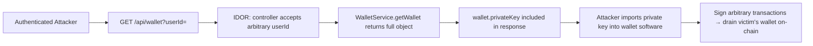
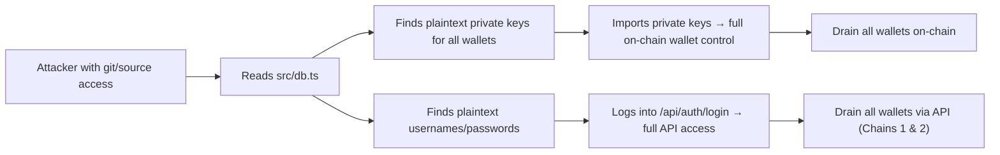
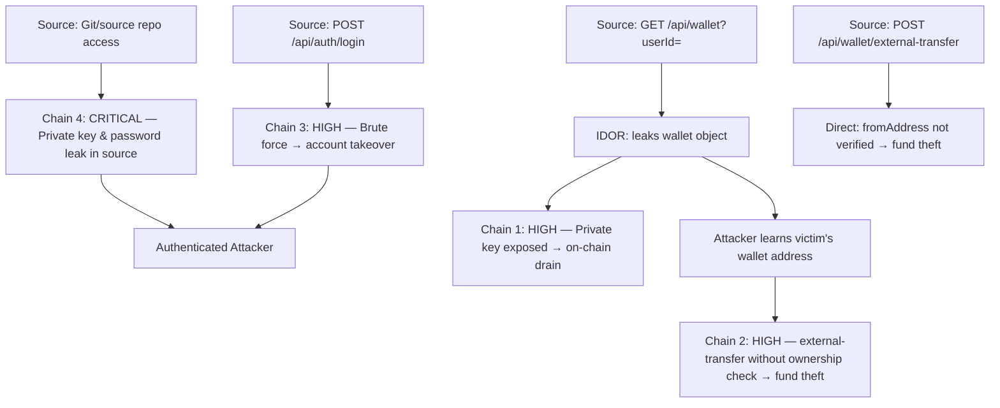

```mermaid
flowchart LR
    A["Authenticated Attacker"] --> B["GET /api/wallet?userId=<victim_id>"]
    B --> C["Retrieve victim's wallet address from response"]
    C --> D["POST /api/wallet/external-transfer"]
    D --> E["Body: { fromAddress: <victim_addr>, toAddress: <attacker_addr>, amount: N }"]
    E --> F["Controller does NOT verify authenticated user owns fromAddress"]
    F --> G["WalletService.executeTransferByAddress transfers funds from victim's wallet"]
    G --> H["Victim's balance reduced; attacker receives funds"]
```

```mermaid
flowchart LR
    A["External Attacker"] --> B["POST /api/auth/login"]
    B --> C["Body: { username: 'alice', password: <tried_value> }"]
    C --> D["Plaintext password comparison in code"]
    D --> E["No rate limiting or account lockout configured"]
    E --> F["Attacker retries with dictionary/common passwords"]
    F --> G["Match found: 'alice123'"]
    G --> H["Session cookie issued: session_id='1'"]
    H --> I["Attacker is now fully authenticated as 'alice'"]
    I --> J["Access all alice's wallets, transfer funds"]
```

# Chained Vulnerability Audit Report

**Project:** app-12-crypto-wallet  |  **Date:** 2026-05-24  |  **Auditor:** CodeGopher (Static-Only)

---

## 1. Summary Dashboard

| Metric | Value |
|---|---|
| Total attack chains identified | **4** |
| Maximum severity | **CRITICAL** |
| High-severity chains | **3** |
| Critical-severity chains | **1** |
| Medium-severity chains | **0** |
| Low-severity chains | **0** |
| Total cross-cutting weaknesses | **8** |
| Confidence (overall) | **High** (all chains statically provable) |

**Reviewed areas:** Auth module, wallet module, database layer, app entry point, Dockerfile, static asset serving, cookie/CSRF configuration.

**Not reviewed:** Third-party dependency vulnerability scanning, test coverage assessment, runtime behavior not derivable from source.

---

## 2. Methodology & Safety Note

This audit follows a **static-only** approach:

- Only repository files, configuration, and source code were inspected.
- No live HTTP probes, fuzzers, SQL injection payloads, credential attacks, dynamic scanners, exploit scripts, or external network tests were performed.
- No executable exploit payloads or operational abuse instructions were generated.
- All evidence is derived from control-flow, data-flow, authorization checks, and configuration visible in source code.

---

## 3. Chain 1 — IDOR + Private Key Leakage → Full Wallet Compromise

**Severity:** HIGH  |  **Confidence:** HIGH  |  **Easiest break:** Filter response fields

### Attack Graph

### Detailed Breakdown

| Link | File | Lines | Evidence |
|---|---|---|---|
| **Source** | `src/wallet/wallet.controller.ts` | 15-17 | `const targetUserId = userId ? parseInt(userId, 10) : user.id;` — controller accepts any `userId` query parameter from authenticated request |
| **Hop 1** | `src/wallet/wallet.controller.ts` | 18 | `return this.walletService.getWallet(targetUserId);` — no ownership check between requesting user and target |
| **Hop 2** | `src/wallet/wallet.service.ts` | 8-13 | `return wallet;` — returns the complete wallet object, including `privateKey` |
| **Sink** | `src/db.ts` | 11, 17 | `privateKey` stored in plaintext and exposed via API |

### Preconditions

- Attacker has valid credentials (any user account) → obtains `session_id` cookie.
- No additional privileges needed.

### Impact

An authenticated user can enumerate and obtain the **private key** of any other user's wallet. With the private key, the attacker can sign transactions on the blockchain and drain all funds from the victim's wallet.

### Remediation

1. **Filter response fields** — never include `privateKey` (or any sensitive field) in API responses. Use a DTO or `Pick` type.
2. **Authorization check** — require `targetUserId === user.id` in the controller before calling the service.
3. **Remove `privateKey` from the database model** entirely; private keys should never be served over an API.

---

## 4. Chain 2 — IDOR + Missing Ownership Verification → Fund Theft Without Private Key

**Severity:** HIGH  |  **Confidence:** HIGH  |  **Easiest break:** Ownership verification on `external-transfer`

### Attack Graph

### Detailed Breakdown

| Link | File | Lines | Evidence |
|---|---|---|---|
| **Source** | `src/wallet/wallet.controller.ts` | 16 | IDOR endpoint (`GET /api/wallet`) leaks victim's `address` |
| **Hop 1** | `src/wallet/wallet.controller.ts` | 29-35 | `externalTransfer()` takes `fromAddress` from request body with no ownership verification. The source code comment explicitly acknowledges: *"without verifying the authenticated user owns that address"* |
| **Hop 2** | `src/wallet/wallet.service.ts` | (method body at end of file) | `executeTransferByAddress` resolves the wallet by `fromAddress` and executes balance subtraction/addition. No `req['user']` ownership check exists in the service method |
| **Sink** | `src/wallet/wallet.service.ts` | balance mutation lines | `senderWallet.balance -= amount; recipientWallet.balance += amount;` — funds move unconditionally |

### Preconditions

- Attacker is authenticated (any valid account).
- Attacker knows victim's wallet address (obtained via Chain 1's IDOR).

### Impact

An attacker can drain any user's wallet **without needing the private key**. The `external-transfer` endpoint authorizes transfers based solely on the `fromAddress` submitted in the request body. Combined with the IDOR vulnerability, this enables complete fund theft.

### Remediation

1. **Add ownership verification** in `externalTransfer()`: resolve the wallet by `fromAddress`, then assert `wallet.userId === req['user'].id`. Return `403` if mismatch.
2. **Alternative:** Require a cryptographic signature over the transfer details signed with the `fromAddress`'s private key. Verify the signature before executing.
3. **Consider removing `external-transfer` entirely** if the same-wallet transfer (`POST /api/wallet/transfer`) already covers the use case.

---

## 5. Chain 3 — Plaintext Passwords + No Rate Limiting → Account Takeover via Brute Force

**Severity:** HIGH  |  **Confidence:** MEDIUM  |  **Easiest break:** Add bcrypt hashing + rate limiting

### Attack Graph

### Detailed Breakdown

| Link | File | Lines | Evidence |
|---|---|---|---|
| **Source** | `src/auth/auth.module.ts` | 16 | `db.users.find(u => u.username === username && u.password === password);` — plaintext comparison |
| **Hop 1** | `src/db.ts` | 3-4 | `password: 'alice123'`, `password: 'bob123'` — trivially guessable credentials |
| **Hop 2** | `src/main.ts`, `src/auth/auth.module.ts` | — | No rate limiting, throttling, or account lockout middleware configured anywhere |
| **Sink** | `src/auth/auth.module.ts` | 20 | `res.cookie('session_id', user.id.toString())` — session granted on password match |

### Preconditions

- Attacker knows or guesses a username.
- No WAF or IP-level throttling is in place (not visible in source).

### Impact

Full account takeover of any user whose password is guessable (confirmed: passwords are weak and stored in plaintext). Once authenticated, the attacker gains full access to all wallet endpoints and can execute Chained Vuln #1 and #2.

### Remediation

1. **Hash passwords** using bcrypt, argon2, or scrypt. Never store or compare plaintext passwords.
2. **Add rate limiting** via `@nestjs/throttler` or equivalent middleware.
3. **Implement account lockout** after `N` consecutive failed attempts.
4. **Enforce minimum password complexity** on registration.

---

## 6. Chain 4 — Source Code Exposure of Private Keys & Credentials → Pre-Compromise Without Network Access

**Severity:** CRITICAL  |  **Confidence:** HIGH  |  **Easiest break:** Move secrets out of source

### Attack Graph

### Detailed Breakdown

| Link | File | Lines | Evidence |
|---|---|---|---|
| **Source** | `src/db.ts` | 11, 17 | `privateKey: '0x1234abcd5678efgh...'` — full Ethereum private keys stored literally in source |
| **Hop** | `src/db.ts` | 3, 4 | `password: 'alice123'`, `password: 'bob123'` — plaintext credentials stored in source |
| **Sink** | — | — | Anyone with repository access (including Git history) gains immediate full compromise of all wallets and accounts |

### Preconditions

- Attacker has read access to the source code repository (or its Git history).

### Impact

Immediate, irreversible compromise. Private keys on the blockchain cannot be rotated like passwords. Once leaked, all associated wallets are permanently vulnerable. This is a **pre-compromise** chain that bypasses all application-level defenses.

### Remediation

1. **Never store private keys in source code.** Use a hardware security module (HSM), cloud KMS, or encrypted vault.
2. **Immediately rotate** any private keys exposed in this repository.
3. **Rotate plaintext passwords** and migrate to hashed storage.
4. **Scan Git history** for leaked secrets; use tools like `git-secrets`, `truffleHog`, or `gitleaks`.
5. **Add `.env` files to `.gitignore`** and use environment variables for configuration.

---

## 7. Cross-Cutting Weaknesses (No Complete Chain Identified)

These are security-relevant issues found during review that did not form a complete exploitable chain (though several could combine with one another):

| # | Weakness | Location | Impact |
|---|---|---|---|
| 1 | **No CSRF tokens** — `sameSite: 'lax'` is the only protection; login and logout endpoints have no CSRF validation | `src/main.ts`, `src/auth/auth.module.ts` | Potential CSRF on state-changing endpoints |
| 2 | **No CORS configuration** | `src/main.ts` | Unrestricted cross-origin requests possible |
| 3 | **No security headers** (CSP, X-Frame-Options, X-Content-Type-Options, HSTS) | `src/main.ts` | Clickjacking, MIME sniffing, man-in-the-middle risks |
| 4 | **No input validation on addresses** | `src/wallet/wallet.controller.ts` | Invalid/malformed Ethereum addresses accepted without length or format checks |
| 5 | **No TLS/HTTPS enforcement** | `Dockerfile`, `src/main.ts` | Traffic served over HTTP by default; credentials and private keys transmitted in cleartext |
| 6 | **No audit logging** | `src/wallet/wallet.service.ts` | Transfers and auth events not logged to any persistent audit trail |
| 7 | **No replay protection** on transfers | `src/wallet/wallet.service.ts` | No transaction nonce mechanism; identical requests could be replayed |
| 8 | **Session ID = user ID** | `src/auth/auth.module.ts` line 20 | Session IDs are predictable (`user.id.toString()`); session hijacking via enumeration is trivial |

---

## 8. Global Attack Graph

---

## 9. Remediation Priority Matrix

| Priority | Action | Effort | Chains Broken |
|---|---|---|---|
| **P0** | Remove private keys from source; migrate to KMS/HSM | Medium | Chain 4 (entirely) |
| **P0** | Rotate all exposed private keys immediately | High | Chain 4 (entirely) |
| **P1** | Hash passwords with bcrypt/argon2; add rate limiting | Medium | Chain 3 (entirely) |
| **P1** | Filter `privateKey` from all API responses | Low | Chain 1 (entirely) |
| **P1** | Enforce `targetUserId === user.id` on `/api/wallet` | Low | Chain 1 (entirely) |
| **P1** | Add ownership verification on `/api/wallet/external-transfer` | Low | Chain 2 (entirely) |
| **P2** | Add security headers (CSP, HSTS, X-Frame-Options) | Low | Cross-cutting #2-3 |
| **P2** | Enforce HTTPS in Docker/production config | Low | Cross-cutting #5 |
| **P2** | Add audit logging for transfers and auth | Medium | Cross-cutting #6 |
| **P3** | Add address format validation | Low | Cross-cutting #4 |
| **P3** | Add CSRF tokens on state-changing endpoints | Medium | Cross-cutting #1 |

---

## 10. Unknowns & Areas Not Reviewed

| Area | Reason |
|---|---|
| **Runtime behavior** | Static analysis cannot verify if environment-specific overrides exist (e.g., different DB credentials in production) |
| **Dependency vulnerabilities** | `package.json` lists NestJS 10.x, Express types, cookie-parser — no `npm audit` or SCA scan performed |
| **Test coverage** | No test files found; security regression testing may be absent |
| **Network/infrastructure** | Dockerfile exposes port 8012; no firewall rules, reverse proxy, or TLS termination visible in source |
| **Key rotation lifecycle** | No code visible for key rotation or revocation mechanisms |
| **Multi-tenancy / tenant scoping** | Not applicable in current single-tenant design, but worth noting for future growth |

---

## 11. Tests to Add

| Test | Description |
|---|---|
| **IDOR test** | Assert `GET /api/wallet?userId=999` returns `403 Forbidden` when requester is not userId 999 |
| **Private key exclusion test** | Assert wallet API responses never include `privateKey` in JSON output |
| **External transfer ownership test** | Assert `POST /api/wallet/external-transfer` with a `fromAddress` not owned by the authenticated user returns `403` |
| **Brute force resistance test** | Assert repeated login attempts with wrong passwords result in `429 Too Many Requests` |
| **Password hashing test** | Assert stored passwords are bcrypt/argon2 hashes, not plaintext |
| **Address validation test** | Assert `POST /api/wallet/transfer` rejects malformed Ethereum addresses |
| **HTTPS enforcement test** | Assert unencrypted HTTP requests are redirected to HTTPS |
| **CSRF test** | Assert state-changing POST requests without valid CSRF tokens return `403` |

---

## 12. Conclusion

This codebase contains **4 distinct attack chains** totaling **3 High** and **1 Critical** severity issues. The most damaging chain is **Chain 4** (source code exposure of private keys and passwords), which provides pre-compromise access without any network interaction. The two most immediately exploitable application-level chains are:

1. **Chain 1** — IDOR exposes any user's wallet private key to any authenticated user.
2. **Chain 2** — Missing ownership verification on `external-transfer` allows fund theft without a private key.

All chains share a common root cause: **insufficient authorization checks**. The `userId` query parameter on `/api/wallet` and the unvalidated `fromAddress` on `/api/wallet/external-transfer` are the two easiest remediation links to break and would eliminate the two most dangerous chains.

---

*Report generated by CodeGopher — Static-Only Chained Vulnerability Audit. No live probes or dynamic tests were performed.*
