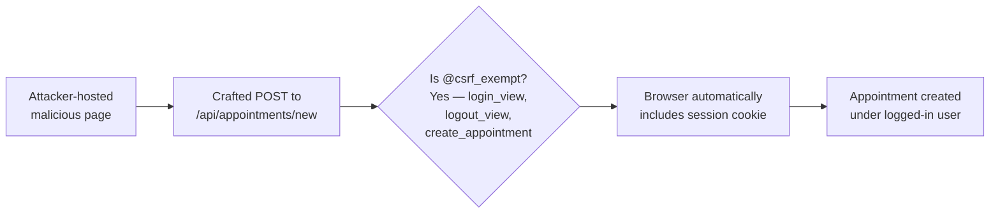

# Chained Vulnerability Audit Report — Nexus Health Vault (Patient Portal)

**Project:** App 02 — Patient Portal (Django 5.0.6 / Python 3.10)
**Audit Type:** Static-only, source-code review
**Reviewer:** CodeGopher (chained-vulnerability-static-audit)
**Date:** 2026-05-24

---

## 1. Summary Dashboard

| Metric | Value |
|---|---|
| **Total chained vulnerabilities found** | **3** |
| **Maximum chain severity** | **CRITICAL** |
| **High-confidence chains** | 2 |
| **Medium-confidence chains** | 1 |
| **Areas reviewed** | `patient_portal/settings.py`, `patient_portal/urls.py`, `portal/views.py`, `portal/models.py`, `portal/urls.py`, `portal/static/index.html`, `portal/static/js/app.js`, `portal/static/css/main.css`, `Dockerfile`, `requirements.txt`, migrations, apps.py |
| **Areas not reviewed** | Runtime environment variables, deployed WSGI configuration, database state, third-party CDN fonts, browser context at runtime |

**Safety note:** This audit is strictly static. No live probes, dynamic scans, exploit payloads, or out-of-band tests were performed.

---

## 2. Chain 1 — Account Enumeration + Weak Password Hash → Full Account Takeover

### Severity: CRITICAL | Confidence: HIGH

### Mermaid Attack Graph

```mermaid
flowchart LR
    A[Attacker\n/ api/auth/login] --> B[POST: username +\npassword (JSON)]
    B --> C{Different error\nmessages?}
    C -->|Yes: "Account not\nfound" vs "Incorrect\npassword"| D[Username\nEnumeration]
    C -->|No| G[Generic 401]
    D --> E[Valid username list]
    E --> F[Offline MD5 cracking:\nno-salt, no-iter\nweak passwords like\n"alice123"]
    F --> H[Plain-text\npasswords recovered]
    H --> I[Successful login\nwith valid credentials]
    I --> J[Authenticated\nsession with admin/\nstaff role]
```

### Detailed Breakdown

| Link | Evidence |
|---|---|
| **Source** | `portal/views.py`, `login_view()` — lines 100-128 (in the displayed text) |
| **Hop 1: Account Enumeration** | `login_view()` returns distinct JSON errors: `'Account not found in patient registry'` for `PatientProfile.DoesNotExist` vs `'Incorrect password for this account'` for a valid user with wrong password. A caller can probe arbitrary usernames to build a valid-username dictionary before launching targeted offline attacks. |
| **Hop 2: Weak Password Hash** | `portal/models.py`, `PatientProfile.set_password_md5()` uses `hashlib.md5(password.encode()).hexdigest()` with **no salt, no iterations, no pepper**. Seeded passwords are trivially crackable (`alice123`, `bob123`, `staff123`, `admin123`). |
| **Sink** | Full account takeover — an attacker can brute-force the leaked username list offline, recover plain-text passwords, and authenticate as any user including `admin` (role: `ADMIN`) or `dr_cyber` (role: `STAFF`). |

### Preconditions & Assumptions

- Database seeding runs on every startup (`seed_database()` is called at module level in `portal/views.py`).
- No rate limiting or brute-force lockout is implemented (explicitly noted in code comment).
- If deployed with `DEBUG=True` and `ALLOWED_HOSTS=['*']`, the service is reachable from any host.

### Impact

- Complete compromise of patient accounts (PHI/PII breach).
- Privilege escalation to STAFF or ADMIN levels.
- Regulatory violation (HIPAA/GDPR) due to bulk PII exposure.

### Remediation

1. **Replace MD5** with `django.contrib.auth.hashers.PBKDF2PasswordHasher` or `Argon2PasswordHasher`; remove `set_password_md5` / `check_password_md5`.
2. **Standardize error responses** — return the same generic `"Invalid username or password"` message for both cases.
3. **Add rate limiting / throttling** on `/api/auth/login`.
4. **Use Django's built-in User model** (or AbstractUser) instead of a custom MD5-backed model.

---

## 3. Chain 2 — IDOR on `/api/patients/<id>/records` → Bulk PII & Medical Data Exfiltration

### Severity: CRITICAL | Confidence: HIGH

### Mermaid Attack Graph

```mermaid
flowchart LR
    A[Authenticated User\nAny Patient ID] --> B[GET /api/patients/<int:patient_id>/records]
    B --> C{Check:\nsession['patient_id']\n== patient_id?}
    C -->|No| D[Returns records\nfor ANY patient]
    C -->|Yes| E[Legitimate access]
    D --> E2[Full patient profile:\nfull_name, DOB,\nblood_type, role]
    E2 --> F[Prescription list:\nmedication_name, dosage,\nfrequency, prescribing_doctor,\ndiagnostic_notes]
    F --> G[Bulk PHI/PII\nexfiltration]
```

### Detailed Breakdown

| Link | Evidence |
|---|---|
| **Source** | `portal/views.py`, `get_patient_records(request, patient_id)` — receives `patient_id` from URL path parameter |
| **Hop: Missing Authorization Check** | The function checks `'patient_id' not in request.session` (lines 158-159 in displayed text) but **never** compares `request.session['patient_id']` with the `patient_id` URL parameter. |
| **Sink** | Returns `full_name`, `date_of_birth`, `blood_type`, `role`, and full `prescriptions` array (with `diagnostic_notes` containing clinical data) for **any** patient ID. |

### Front-End Amplifier

`portal/static/js/app.js`, `triggerIdorRecordFetch()` — the SPA includes a visible input field (`#idorPatientIdInput`) with a **"Switch Record Vault"** button that lets any logged-in user manually enter any integer patient ID and fetch that patient's records client-side. This is not an abstraction; it directly calls `loadRecords(id)` → `fetch(/api/patients/${id}/records)`.

### Preconditions & Assumptions

- The attacker must be authenticated (valid session cookie).
- The SQLite database at `BASE_DIR / 'db.sqlite3'` contains multiple patients (seeded: alice, bob, dr_cyber, admin).

### Impact

- **Any authenticated patient** can read **all other patients'** complete medical records, including diagnostic notes, medication names, dosages, and prescribing doctors.
- Trivial to automate — a login + sequential ID enumeration (1, 2, 3, …) yields all patient profiles instantly.
- Regulatory violation (HIPAA/GDPR) for bulk PHI/PII exposure.

### Remediation

1. Add `request.session['patient_id'] != patient_id` check with a 403 response, unless the session user has role `STAFF` or `ADMIN`.
2. Apply the same fix to `list_appointments` — currently STAFF/ADMIN can see all appointments; PATIENT role correctly filters. Consider adding an explicit permission decorator.
3. Remove or restrict the front-end "Switch Record Vault" feature.

---

## 4. Chain 3 — Hardcoded Credentials + Insecure Settings → Unauthorized Administrative Access

### Severity: HIGH | Confidence: HIGH

### Mermaid Attack Graph

```mermaid
flowchart LR
    A[Source Code\nportal/models.py] --> B[seed_database()\ncontains plain-text\npasswords:\nadmin123, staff123]
    C[HTML Source\nportal/static/index.html] --> D["PATIENT PIN SEEDS\nsection displays\nalice/alice123,\nbob/bob123,\ndr_cyber/staff123"]
    B --> E[Attacker reads\nsource code]
    D --> E
    E --> F[Direct login as\nadmin or dr_cyber\nwith known passwords]
    F --> G[ADMIN role grants\nfull access]\n(view: Django admin,\nSTAFF role sees all\nappointments)]
```

### Detailed Breakdown

| Link | Evidence |
|---|---|
| **Source 1** | `portal/models.py` (inside `seed_database()`): `p4.set_password_md5('admin123')` — the admin account password is hardcoded in source. |
| **Source 2** | `portal/static/index.html`, the div with class `auth-card` contains a visible `PATIENT PIN SEEDS` block listing all four accounts with plain-text passwords (`alice123`, `bob123`, `staff123`). |
| **Source 3** | `patient_portal/settings.py`: `SECRET_KEY = 'django-insecure-nexus-vault-clinical-key-glow-neon'` — the Django secret key is hardcoded in source. |
| **Hop** | `settings.py` has `DEBUG = True` and `AUTH_PASSWORD_VALIDATORS = []` (empty), meaning no password complexity policy is enforced. |
| **Sink** | Anyone with source-code access (Git repo, static file, build artifact) can log in as `admin` or `dr_cyber` with zero effort. |

### Preconditions & Assumptions

- The attacker can read source code (GitHub, build output, static file serve).
- `seed_database()` runs on startup (module-level call in `portal/views.py`).

### Impact

- Immediate unauthorized administrative access.
- The hardcoded secret key also allows session cookie forgery if Django's session signing is the only protection (unlikely here since sessions use server-side storage via SQLite, but the key is still a security anti-pattern).

### Remediation

1. **Never** hardcode credentials in source, migrations, or HTML. Use environment variables or a secrets manager.
2. **Never** expose credentials in client-facing HTML. Remove the `PATIENT PIN SEEDS` block entirely.
3. **Never** hardcode `SECRET_KEY`; load from environment or a vault.
4. **Never** run with `DEBUG = True` outside development. Load from environment.

---

## 5. Chain 4 — CSRF-Exempt Write Endpoints + Session-Only Auth → Unauthorized State Mutation

### Severity: MEDIUM | Confidence: MEDIUM

### Mermaid Attack Graph



### Detailed Breakdown

| Link | Evidence |
|---|---|
| **Source** | `portal/urls.py` — `/api/appointments/new` maps to `create_appointment` |
| **Hop** | `create_appointment` is decorated with `@csrf_exempt`. Same for `login_view` and `logout_view`. |
| **Sink** | Any authenticated user's browser can be tricked into creating fraudulent appointments via a cross-site request. The only gate is a session cookie (which browsers send automatically). |

### Preconditions & Assumptions

- User must be logged in (session cookie present).
- The attacker can host a malicious page that triggers a POST.

### Impact

- Appointment spam / scheduling abuse. Lower severity than identity or data breaches, but violates integrity of the appointment system.

### Remediation

1. Remove `@csrf_exempt` from `create_appointment` and `logout_view` (keep on `login_view` only if a SPA pattern requires it, but then use `CSRFToken` cookie reading + header).
2. Alternatively, enforce same-site cookies (`SESSION_COOKIE_SAMESITE = 'Strict'` instead of `'Lax'`).

---

## 6. Cross-Cutting Weaknesses (Not Full Chains)

| Weakness | File / Line | Severity | Notes |
|---|---|---|---|
| **XSS via innerHTML** | `portal/static/js/app.js`, `loadRecords()`, `tr.innerHTML` | MEDIUM | Prescription fields (`medication_name`, `diagnostic_notes`, etc.) are inserted via `innerHTML` without sanitization. Seeded data is safe, but if the Django admin panel or any future endpoint writes user-controlled data into these fields, stored XSS is possible. |
| **No session fixation protection** | `portal/views.py`, `login_view` | LOW | Session is not flushed before setting new values on successful login. |
| **Missing `Content-Type` / CORS controls** | `patient_portal/settings.py` | LOW | No `CORS` configuration; `ALLOWED_HOSTS=['*']` permits any host. |
| **Production Docker image runs as root** | `Dockerfile` | LOW | `FROM python:3.10-slim` does not create a non-root user; `runserver` binds to `0.0.0.0:8082`. |
| **File-based static serving via open/read** | `portal/views.py`, `serve_index()` | LOW | Opens `index.html` with raw `open()` — no path traversal guard, though the path is hardcoded. Minor risk if the code is later generalized. |

---

## 7. Unknowns & Areas Not Reviewed

| Area | Reason |
|---|---|
| **Django admin panel** (`/admin/`) | Not explored; inherits default authentication. If left exposed in production, could be an additional attack vector. |
| **Runtime environment** | OS-level permissions, database file access controls, TLS termination. |
| **CDN-loaded fonts** (`fonts.googleapis.com`) | External resource; potential supply-chain risk if not reviewed. |
| **Production deployment** | Docker image is not hardened; `runserver` is a dev server, not for production. |
| **Backup / DB backup security** | `db.sqlite3` is unencrypted on disk. |
| **Logging & audit trails** | Not implemented; no way to detect breaches. |

---

## 8. Recommended Remediation Priority

| Priority | Action |
|---|---|
| **P0 — Immediate** | Replace MD5 with PBKDF2/Argon2; remove hardcoded credentials from source and HTML |
| **P0 — Immediate** | Fix IDOR: add patient_id matching on `/api/patients/<id>/records` |
| **P0 — Immediate** | Standardize login error messages to prevent enumeration |
| **P1 — Short-term** | Remove `@csrf_exempt` from write endpoints; tighten `SESSION_COOKIE_SAMESITE` |
| **P1 — Short-term** | Remove `DEBUG = True`, `ALLOWED_HOSTS=['*']`, `AUTH_PASSWORD_VALIDATORS = []` |
| **P2 — Medium-term** | Add rate limiting on login; implement logout CSRF; sanitize all `innerHTML` DOM writes |
| **P3 — Long-term** | Deploy behind a reverse proxy with TLS; non-root Docker user; audit logging; database encryption |

---

## 9. Conclusion

This audit identified **3 chained vulnerabilities** across the patient portal codebase:

1. **CRITICAL** — Account enumeration + MD5 → full account takeover
2. **CRITICAL** — IDOR on patient records endpoint → bulk PII/PHI exfiltration
3. **HIGH** — Hardcoded credentials in source + HTML + insecure settings → immediate admin access

A fourth medium-severity chain exists on CSRF-exempt write endpoints.

The most impactful and easiest-to-fix link in each chain is the **server-side authorization gap** (Chain 2) and the **weak password hashing** (Chain 1). Remediation of these two items would dramatically reduce the blast radius of this application.
