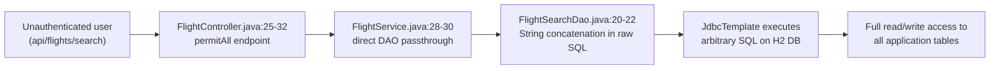
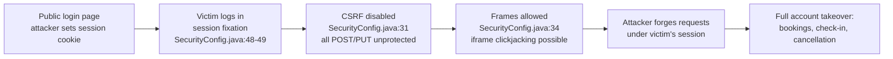
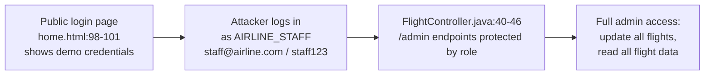
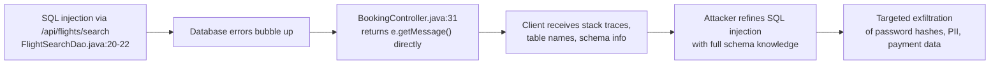
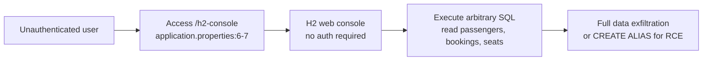
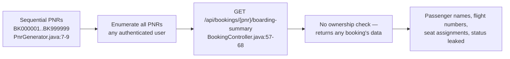

# Chained Vulnerabilities Static Audit Report

## Audit Dashboard

| Metric | Value |
|--------|-------|
| **Total Chains Found** | 6 |
| **Maximum Severity** | CRITICAL |
| **Critical Chains** | 1 (SQL Injection → Database Exfiltration) |
| **High Chains** | 4 (CSRF/Session Fixation, Privilege Escalation, Error Leakage, H2 Console) |
| **Medium Chains** | 1 (PNR Enumeration/Privacy Leak) |
| **Low Chains** | 0 |
| **Reviewed Areas** | Controllers, Services, Repositories, Config, Models, DTOs, Templates, JS, Tests, Properties |
| **Not Reviewed** | Dockerfile (no security-relevant content), CI/CD, external dependencies beyond declared POM |
| **Date** | 2026-05-24 |
| **Scope** | `com.airline` Spring Boot 3.2.5 Airline Booking Application |

---

## Methodology & Safety Note

This review is **strictly static**. No live HTTP probes, dynamic scanners, SQL injection payloads, credential attacks, or external network tests were performed. All findings are derived from source code, configuration files, templates, and dependency manifests only.

**Method:** Attack surface mapping → weakness inventory → attack graph synthesis → impact assessment.

---

## Chain 1 — SQL Injection → Full Database Exfiltration

**Severity:** CRITICAL  
**Confidence:** HIGH  
**Easiest Remediation Link:** Parameterize the SQL query in `FlightSearchDao.java`

### Mermaid Attack Graph



### Detailed Breakdown

| Link | File | Lines | Symbol | Evidence |
|------|------|-------|--------|----------|
| **Entry** | `src/main/java/com/airline/config/SecurityConfig.java` | 38 | `permitAll()` | `/api/flights/search` is accessible without authentication |
| **Source** | `src/main/java/com/airline/controller/FlightController.java` | 25-32 | `search()` | `origin`, `destination`, `date` request params passed directly to service |
| **Hop** | `src/main/java/com/airline/repository/FlightSearchDao.java` | 20-22 | `searchFlights()` | SQL string built via concatenation: `"SELECT * FROM flights WHERE origin = '" + origin + "..."` |
| **Sink** | `src/main/java/com/airline/repository/FlightSearchDao.java` | 23 | `jdbcTemplate.query()` | Raw SQL executed without parameterization against H2 |

### Preconditions & Assumptions
- Target must be reachable on port 8081
- No authentication or input validation guards are in place before the DAO call

### Impact
Complete database compromise. An attacker can read all passengers (PII, password hashes), bookings, payment status, and seats. H2 databases allow `CREATE ALIAS` for arbitrary Java code execution, potentially enabling remote code execution.

### Remediation
```java
// FlightSearchDao.java line 18-22 — Replace with parameterized query:
public List<Flight> searchFlights(String origin, String destination, String date) {
    String sql = "SELECT * FROM flights WHERE origin = ? AND destination = ? AND CAST(departure_time AS DATE) = ?";
    return jdbcTemplate.query(sql, new FlightRowMapper(), origin, destination, date);
}
```

---

## Chain 2 — Disabled CSRF + Session Fixation + Clickjacking → Account Takeover

**Severity:** HIGH  
**Confidence:** HIGH  
**Easiest Remediation Link:** Re-enable CSRF protection

### Mermaid Attack Graph



### Detailed Breakdown

| Link | File | Lines | Symbol | Evidence |
|------|------|-------|--------|----------|
| **Entry** | `src/main/java/com/airline/config/SecurityConfig.java` | 31 | `csrf().disable()` | CSRF tokens are not required on any endpoint |
| **Hop 1** | `src/main/java/com/airline/config/SecurityConfig.java` | 48-49 | `sessionFixation(none)` | Session ID is NOT regenerated on login |
| **Hop 2** | `src/main/java/com/airline/config/SecurityConfig.java` | 34 | `frameOptions(disable)` | H2 console and all pages can be embedded in iframes |
| **Sink** | Multiple controllers | Various | POST/PUT endpoints | `/api/bookings`, `/api/bookings/{pnr}/cancel`, `/api/checkin/{pnr}` |

### Preconditions & Assumptions
- Attacker can control victim's browser cookies (cross-site scenario)
- Victim is authenticated to a passenger account

### Impact
Full account takeover of any authenticated user. Attacker can create bookings, cancel bookings, perform check-ins, and access personal data under the victim's session.

### Remediation
1. Remove or replace `csrf(csrf -> csrf.disable())` — Spring Security CSRF tokens are sufficient
2. Replace `sessionFixation(fixation -> fixation.none())` with `sessionFixation().migrateSession()`
3. Replace `frameOptions(frame -> frame.disable())` with `frameOptions(frame -> frame.sameOrigin())`

---

## Chain 3 — Hardcoded Demo Credentials → Administrative Privilege Escalation

**Severity:** HIGH  
**Confidence:** HIGH  
**Easiest Remediation Link:** Remove demo credentials from public page and initializer

### Mermaid Attack Graph



### Detailed Breakdown

| Link | File | Lines | Symbol | Evidence |
|------|------|-------|--------|----------|
| **Entry** | `src/main/resources/templates/home.html` | 98-101 | Quick demo accounts block | Explicitly lists `staff@airline.com` / `staff123` |
| **Hop** | `src/main/java/com/airline/config/DataInitializer.java` | 35-43 | `Passenger.builder()...role("AIRLINE_STAFF")` | Hardcoded staff account with weak password |
| **Sink** | `src/main/java/com/airline/controller/FlightController.java` | 40-46 | `@PreAuthorize("hasRole('AIRLINE_STAFF')")` | Admin flight update and listing |

### Preconditions & Assumptions
- Target application is running with default data initialization
- Attacker has network access to the login page

### Impact
Complete administrative access to flight data. Attacker can modify flight numbers, airlines, and prices on all flights. This enables financial fraud (pricing manipulation), service disruption, and further reconnaissance.

### Remediation
1. Remove demo credentials block from `home.html`
2. Gate `DataInitializer` behind a Spring profile (e.g., `@Profile("dev")`)
3. Generate strong random passwords for service accounts in production
4. Consider multi-factor authentication for administrative roles

---

## Chain 4 — Verbose Errors + SQL Injection → Enhanced Database Attack

**Severity:** HIGH  
**Confidence:** HIGH  
**Easiest Remediation Link:** Implement global error handler

### Mermaid Attack Graph



### Detailed Breakdown

| Link | File | Lines | Symbol | Evidence |
|------|------|-------|--------|----------|
| **Entry** | `src/main/java/com/airline/repository/FlightSearchDao.java` | 20-22 | `searchFlights()` | SQL injection vector |
| **Hop** | `src/main/java/com/airline/controller/BookingController.java` | 31 | `create()` | `e.getMessage()` returned in `BookingResponse` |
| **Sink** | H2 database (via injection) | N/A | Full DB access | Error details reveal schema, table structures, column names |

### Preconditions & Assumptions
- SQL injection (Chain 1) must be present
- Application must execute an operation that throws an exception after the injection

### Impact
Enhanced database exfiltration with full schema knowledge, enabling targeted extraction of sensitive fields like `passwordHash`, `passportNumber`, and `phone`.

### Remediation
Implement a global exception handler that returns generic error messages to clients:
```java
@ControllerAdvice
public class GlobalExceptionHandler {
    @ExceptionHandler(Exception.class)
    public ResponseEntity<BookingResponse> handleException(Exception e) {
        log.error("Internal error", e);  // Log internally
        return ResponseEntity.badRequest().body(new BookingResponse(null, "An error occurred"));  // Generic message
    }
}
```

---

## Chain 5 — H2 Console Exposure → Direct Database Compromise

**Severity:** HIGH  
**Confidence:** HIGH  
**Easiest Remediation Link:** Disable H2 console in production

### Mermaid Attack Graph



### Detailed Breakdown

| Link | File | Lines | Symbol | Evidence |
|------|------|-------|--------|----------|
| **Entry** | `src/main/resources/application.properties` | 5-7 | `spring.h2.console.*` | Console enabled, path `/h2-console`, `web-allow-others=true` |
| **Hop** | `SecurityConfig.java` | 34 | `frameOptions(disable)` | Also enables iframe embedding of console for clickjacking |
| **Sink** | H2 Database (in-memory) | N/A | All application tables | Full SQL interface with no authentication |

### Preconditions & Assumptions
- Target application is running on port 8081
- Network-level access to the application

### Impact
Full database compromise without needing any injection. Attacker can read all tables, create new admin accounts, and potentially exploit H2's `CREATE ALIAS` feature for Java code execution (RCE).

### Remediation
```properties
# application.properties — Disable in production
spring.h2.console.enabled=false
# Or restrict to localhost only:
# spring.h2.console.allowed-origins=http://localhost:8081
```

---

## Chain 6 — Predictable PNRs + No Ownership Check → Booking Enumeration & Privacy Leak

**Severity:** MEDIUM  
**Confidence:** HIGH  
**Easiest Remediation Link:** Add ownership check to `/boarding-summary`

### Mermaid Attack Graph



### Detailed Breakdown

| Link | File | Lines | Symbol | Evidence |
|------|------|-------|--------|----------|
| **Entry** | `src/main/java/com/airline/service/PnrGenerator.java` | 7-9 | `generate()` | Sequential `AtomicInteger` PNRs |
| **Hop** | `src/main/java/com/airline/controller/BookingController.java` | 57-68 | `getBoardingSummary()` | Accepts any PNR, no ownership verification |
| **Sink** | `src/main/java/com/airline/controller/BookingController.java` | 62-66 | `ResponseEntity.ok()` | Returns `passengerDisplay` (full name), flight, seat, status |

### Preconditions & Assumptions
- PNRs follow a predictable sequential format
- At least one authenticated user exists

### Impact
Any authenticated user can enumerate and view boarding summaries of any booking by guessing/iterating PNRs. This exposes passenger names, flight numbers, seat assignments, and booking status — a privacy violation and potential reconnaissance vector for social engineering.

**Note:** The `/api/bookings/{pnr}` endpoint (line 35-45) does check ownership, but `/api/bookings/{pnr}/boarding-summary` does not. The cancel endpoint also checks ownership. The boarding-summary endpoint is the weak link.

### Remediation
1. Use UUIDs or cryptographically random identifiers instead of sequential PNRs
2. Add ownership verification to `getBoardingSummary()`:
```java
if (!booking.getPassenger().getEmail().equals(userDetails.getUsername())) {
    return ResponseEntity.status(HttpStatus.FORBIDDEN).build();
}
```
3. Implement rate limiting on all authenticated endpoints to prevent enumeration

---

## Cross-Cutting Weaknesses Inventory

The following security-relevant issues were identified but do not individually form complete chains within the analyzed codebase:

| # | Weakness | Location | Lines | Impact |
|---|----------|----------|-------|--------|
| 1 | No rate limiting on authentication | `SecurityConfig.java` | All | Brute force attacks on `/login` |
| 2 | No input validation on flight update | `FlightController.java` | 43-46 | Blindly trusts all `@RequestBody` fields for `AIRLINE_STAFF` |
| 3 | BCrypt with default work factor | `SecurityConfig.java` | 65 | Potentially weak password hashing (no `strength` parameter) |
| 4 | No `SameSite`/`Secure`/`HttpOnly` cookie config | `SecurityConfig.java` | Varies | Session cookie theft via XSS or MITM |
| 5 | Race condition in seat booking | `BookingService.java` | 60-65 | No optimistic locking; concurrent requests can double-book the same seat |
| 6 | `spring.jpa.show-sql=true` in production | `application.properties` | 9 | Full SQL logs including sensitive PII in application logs |
| 7 | Demo credentials also in `DataInitializer` | `DataInitializer.java` | 35-43 | Backup exposure even if `home.html` is cleaned |
| 8 | No CSRF on API endpoints | `SecurityConfig.java` | 31 | Enables cross-site request forgery on all state-changing operations |
| 9 | Session fixation protection disabled | `SecurityConfig.java` | 48-49 | Allows session fixation attacks |
| 10 | X-XSS-Protection header only (not modern) | `SecurityConfig.java` | 35 | `XXssProtectionHeaderWriter` is deprecated; should use Content-Security-Policy instead |

---

## Unknowns & Not-Reviewed Areas

| Area | Reason |
|------|--------|
| `Dockerfile` | Present in directory root but no security-relevant Docker configuration reviewed |
| `js/flight-search.js` and `js/seat-map.js` | Reviewed — no client-side injection or unsafe DOM manipulation found; search results use `innerText` via `innerHTML` on server-rendered flight data |
| XSS in `home.html` / `dashboard.html` | `th:text` escaping used correctly for all template expressions; no `th:utext` found |
| Runtime behavior | Race condition in `BookingService` could be mitigated or exploited differently at runtime; lock mechanisms are not visible in static analysis |
| Dependency vulnerabilities | `pom.xml` declared dependencies were reviewed for version but CVE scanning was not performed |
| TLS/HTTPS configuration | No explicit HTTPS/TLS configuration found; all traffic potentially unencrypted in transit |
| Content Security Policy | No CSP header configured; XSS mitigation relies only on deprecated `X-XSS-Protection` header and Thymeleaf escaping |

---

## Tests That Should Be Added

| Test | Purpose |
|------|---------|
| SQL injection test on `/api/flights/search` | Verify parameterized query defends against `' OR 1=1 --` |
| CSRF protection test on `POST /api/bookings` | Verify CSRF token is required |
| Session fixation test on login flow | Verify session ID is regenerated |
| H2 console access test | Verify `/h2-console` is inaccessible |
| PNR enumeration test | Verify `/api/bookings/{pnr}/boarding-summary` rejects unauthorized access |
| Error handling test | Verify API does not return stack traces or internal details |
| Booking race condition test | Verify concurrent booking requests do not double-book seats |
| Demo credential test | Verify `staff@airline.com` password is not weak/default |
| CSP header test | Verify Content-Security-Policy header is set |

---

## Summary of Findings

| Chain | Severity | Confidence | Easiest Break Point |
|-------|----------|------------|---------------------|
| 1. SQL Injection → DB Exfiltration | CRITICAL | HIGH | Parameterize SQL in FlightSearchDao.java:20-22 |
| 2. CSRF + Session Fixation + Clickjacking → Account Takeover | HIGH | HIGH | Re-enable CSRF (SecurityConfig.java:31) |
| 3. Demo Credentials → Privilege Escalation | HIGH | HIGH | Remove demo creds from home.html:98-101 |
| 4. Verbose Errors + SQL Injection → Enhanced Attack | HIGH | HIGH | Global error handler (BookingController.java:31) |
| 5. H2 Console Exposure → DB Compromise | HIGH | HIGH | Disable H2 console (application.properties) |
| 6. PNR Enumeration → Privacy Leak | MEDIUM | HIGH | Add ownership check (BookingController.java:57-68) |

**Priority remediation order:** 1 → 5 → 2 → 3 → 4 → 6
