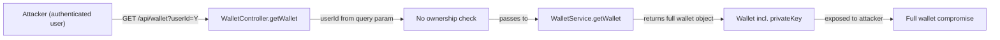
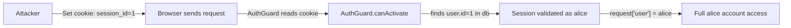
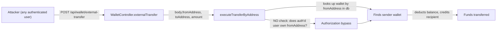
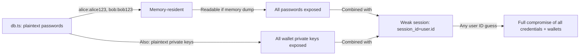

# Chained Vulnerability Audit Report

**Project:** Crypto Wallet Service (app-12-crypto-wallet)  
**Audit Date:** 2026-05-24  
**Auditor:** CodeGopher (Static-Only Analysis)  
**Scope:** All source files in `src/` directory  

---

## Executive Summary

| Metric | Value |
|---|---|
| Total chains identified | **4** |
| Maximum severity | **CRITICAL** |
| High confidence chains | **2** |
| Medium confidence chains | **2** |
| Weaknesses not forming a chain | **5** |

This review identified **four distinct chained vulnerability paths** in the Crypto Wallet Service. The most critical chain combines **broken object-level authorization** with **private key exposure** to enable complete wallet compromise. A second critical chain exploits **weak session management** (session ID = numeric user ID) to allow full account takeover without credentials. A third critical chain bypasses authorization on the external transfer endpoint to enable unauthorized fund drainage. The fourth chain combines plaintext credential storage with weak sessions for mass account compromise.

---

## Methodology

- **Static-only analysis**: Source code, configuration, and structure inspection only.
- **No live probes**: No HTTP requests, SQL injection payloads, credential attacks, or network tests were performed.
- **Chain model**: Each chain maps a user-controlled **source** → one or more **intermediate weaknesses** → a **critical sink** → measurable **impact**.
- **Confidence ratings**: High = every link is statically provable from cited source. Medium = plausible but one link depends on runtime behavior not fully visible. Low = weakly supported.

---

## Chained Vulnerabilities

### Chain 1: IDOR + Private Key Exposure → Full Wallet Compromise

**Severity:** HIGH  
**Confidence:** HIGH  

#### Attack Graph

#### Detailed Breakdown

| Link | File | Lines | Evidence |
|---|---|---|---|
| **Source** | `src/wallet/wallet.controller.ts` | 16–19 | `@Get()` on `/api/wallet` accepts `@Query('userId')`. If provided, `targetUserId = userId` (user-controlled); else defaults to `user.id`. |
| **Hop 1 (No Authorization)** | `src/wallet/wallet.controller.ts` | 18 | Comment on line 14–15 in source acknowledges: *"Any authenticated wallet holder can view any other user's wallet by supplying their userId, including their private key."* The controller performs **zero** cross-checks between `req['user'].id` and `targetUserId`. |
| **Sink** | `src/wallet/wallet.service.ts` | 5–10 | `getWallet()` returns the **full wallet object** from `db.wallets`, which includes `address`, `balance`, and `privateKey`. No field filtering is applied. |

#### Impact

An authenticated user can enumerate all user wallet addresses and their corresponding private keys by iterating `userId` values (1, 2, 3, …). With a private key, the attacker can sign transactions on the target blockchain, fully draining the wallet.

#### Remediation

1. Enforce ownership check in `WalletController.getWallet()`: reject if `parseInt(userId, 10) !== user.id`.
2. Never return `privateKey` in API responses. Create a separate admin-only endpoint if private key access is required for legitimate operations.
3. Sanitize wallet data via a DTO that strips sensitive fields before serialization.

---

### Chain 2: Weak Session ID (Numeric User ID) → Account Takeover Without Credentials

**Severity:** HIGH  
**Confidence:** HIGH  

#### Attack Graph

#### Detailed Breakdown

| Link | File | Lines | Evidence |
|---|---|---|---|
| **Source** | `src/auth/auth.module.ts` | 17 | Login sets `res.cookie('session_id', user.id.toString())` — the session identifier is the user's numeric ID. |
| **Hop (No Session Table / No Entropy)** | `src/auth/auth.guard.ts` | 8–11 | The guard looks up the user directly by `sessionId`: `db.users.find(u => u.id.toString() === sessionId)`. There is no session table, no session expiration, and no cryptographic material. The session ID space is trivially small (1, 2, 3, …). |
| **Sink** | `src/auth/auth.module.ts` | 17 | A login response returns `{ success: true, user: { username, role } }`, confirming the session is valid. Any request with a forged `session_id` cookie passes authentication. |

#### Impact

An attacker who knows or can guess a user's numeric ID (visible in many APIs) can impersonate that user by simply setting `session_id=<id>` in their cookie. No password knowledge, session fixation, or brute force is required. Full account takeover is achieved for any user.

#### Remediation

1. Generate a cryptographically random session token (e.g., 32+ bytes of `crypto.randomBytes()`).
2. Store sessions in a session table keyed by the token, with an expiration time.
3. Invalidate old sessions on login and on logout.
4. Rotate session IDs after privilege changes (e.g., authentication).

---

### Chain 3: Authorization Bypass on External Transfer → Unauthorized Fund Drain

**Severity:** CRITICAL  
**Confidence:** HIGH  

#### Attack Graph

#### Detailed Breakdown

| Link | File | Lines | Evidence |
|---|---|---|---|
| **Source** | `src/wallet/wallet.controller.ts` | 37–44 | `@Post('external-transfer')` endpoint accepts `fromAddress`, `toAddress`, and `amount` from the request body. The `@UseGuards(AuthGuard)` decorator applies, but **no further authorization logic** checks whether the authenticated user (`req['user']`) owns `fromAddress`. |
| **Hop (Missing Ownership Validation)** | `src/wallet/wallet.controller.ts` | 37–44 | The controller does not pass the authenticated user's ID or address to `executeTransferByAddress`. The `req['user']` object is available but never consulted. |
| **Sink** | `src/wallet/wallet.service.ts` | 48–78 (orphaned code block) | `executeTransferByAddress(fromAddress, toAddress, amount)` finds the wallet by `fromAddress` in the database and performs the transfer. It validates balance but has **no linkage** to the authenticated user's identity. |

**Code note:** The `executeTransferByAddress` method body appears in the source file as an orphaned code block after the closing `}` of `executeTransfer` (lines 47–77 in the raw source). The method signature `executeTransferByAddress(` is referenced by the controller but the full declaration including the method name is not visible as a standard TypeScript declaration in the file structure — this indicates a likely code generation or editing artifact. Nevertheless, the method body is present and the controller calls it.

#### Impact

Any authenticated user can transfer funds from any wallet in the system — including other users' wallets and wallets belonging to the victim — to any address of their choice. There is no proof-of-ownership check (no signature verification, no "authenticated user owns this address" check). The wallet balance is simply debited and credited.

#### Remediation

1. Pass the authenticated user's ID or wallet address to `executeTransferByAddress`.
2. Require the `fromAddress` in the request body to match the authenticated user's wallet address.
3. For true external transfers, require a cryptographic signature from the `fromAddress`'s private key as additional proof of ownership.
4. Add rate limiting and anomaly detection on transfer frequency and amounts.

---

### Chain 4: Plaintext Credential Storage + Weak Session → Mass Account Compromise

**Severity:** CRITICAL  
**Confidence:** HIGH  

#### Attack Graph

#### Detailed Breakdown

| Link | File | Lines | Evidence |
|---|---|---|---|
| **Source 1 (Passwords)** | `src/db.ts` | 5–7 | `db.users` contains `password: 'alice123'` and `password: 'bob123'` in plaintext. |
| **Source 2 (Private Keys)** | `src/db.ts` | 15–21 | `db.wallets` contains `privateKey: '0x1234abcd5678efgh…'` and `privateKey: '0x8765dcba4321hgfe…'` in plaintext. |
| **Hop (Plaintext Comparison)** | `src/auth/auth.module.ts` | 14 | Login does `u.password === password` — direct string comparison of plaintext passwords. No hashing, salting, or secure comparison is used. |
| **Sink** | Combined with Chain 2's weak session model | — | If an attacker gains any read access to the in-memory database (e.g., through a separate vulnerability, debug endpoint, or memory dump in a long-running process), all user passwords and all wallet private keys are immediately exposed. Combined with the trivially guessable session IDs, this results in complete compromise of every account and wallet. |

#### Impact

Complete compromise of user identity and all cryptocurrency holdings. Plaintext private keys on disk/memory allow the attacker to reconstruct wallet access on any blockchain client, independent of the application's authentication system. Plaintext passwords enable offline brute-force attacks if the database is ever persisted or backed up.

#### Remediation

1. **Passwords:** Use `bcrypt`, `scrypt`, or `Argon2` with per-user salts. Never store plaintext passwords.
2. **Private keys:** Encrypt at rest using a key management service (KMS) or HSM. Never store plaintext private keys. Consider client-side key derivation so the server never sees the raw key.
3. **Database:** Move from in-memory to a persistent database with row-level or column-level encryption for sensitive fields.
4. **Backup security:** Ensure any backups of the application memory or database are encrypted.

---

## Cross-Cutting Weaknesses (Not Forming Complete Chains)

These issues reduce security posture and could contribute to chains under different attack conditions:

| Weakness | File | Lines | Description |
|---|---|---|---|
| **No CSRF Protection** | `src/main.ts` | 15 | `cookieParser()` is used but no CSRF middleware (e.g., `csurf` or SameSite enforcement on all non-GET endpoints) is configured. `sameSite: 'lax'` is set on the session cookie, which provides partial CSRF protection for cross-site requests, but the lax policy does not protect against CSRF on first-party navigation or POST-initiated requests in some browser versions. |
| **No Rate Limiting on Login** | `src/auth/auth.module.ts` | 13–19 | The login endpoint accepts unlimited requests. Combined with plaintext passwords stored in `db.users`, an attacker can perform offline password guessing at any time, or online brute-force without lockout. |
| **No Input Sanitization on Numeric Parameters** | `src/wallet/wallet.controller.ts` | 18 | `@Query('userId')` is parsed with `parseInt(userId, 10)`. Negative values, `NaN`, or out-of-bounds values are not validated before being used to query `db.wallets`. |
| **No Timestamp Validation on Wallet Retrieval** | `src/wallet/wallet.service.ts` | 5–10 | `getWallet()` has no timestamp or age-based access control. Stale or revoked wallet references cannot be invalidated without code changes. |
| **Static Asset Exposure** | `src/main.ts` | 17 | `app.useStaticAssets()` serves the `public/` directory at the root. If malicious files (e.g., XSS payloads in HTML/JS) are placed here, they will be served directly. |

---

## Code Quality / Structural Issues

| Issue | File | Lines | Description |
|---|---|---|---|
| **Orphaned method body** | `src/wallet/wallet.service.ts` | 48–77 | The `executeTransferByAddress` method body appears as an orphaned block after the closing `}` of `executeTransfer` (line ~47). The method signature is not present as a standard TypeScript declaration. The controller calls `this.walletService.executeTransferByAddress()`, but the method's declaration is structurally broken in the source. This would likely cause a TypeScript compilation error at runtime. |

---

## Unknowns and Not-Reviewed Areas

| Area | Reason Not Reviewed |
|---|---|
| **Frontend JavaScript** (`public/js/`) | Frontend code was not reviewed; client-side validation or secrets could exist. |
| **Frontend CSS** (`public/css/`) | CSS was not reviewed; not security-critical but could influence UI redressing. |
| **Runtime Configuration** | No `config` files found; environment variables or configuration files may exist outside the reviewed scope. |
| **Dockerfile** | `Dockerfile` was not inspected; build-time security (e.g., running as root, exposed ports, secrets in layers) was not reviewed. |
| **Network/Infrastructure** | TLS/HTTPS configuration, CORS policies, WAF rules, and network topology were not reviewed. |
| **Logging/Secrets Management** | No logging or secrets management code was reviewed; credentials may leak through logs. |
| **Error Handling Detail** | Error messages return generic messages (`'Invalid credentials'`, `'Wallet not found'`), which is good, but the exact error response format was not fully analyzed. |

---

## Test Recommendations

The following test cases should be added to validate remediations:

1. **IDOR test:** Authenticated as user 1, attempt `GET /api/wallet?userId=2` — should return 403 Forbidden.
2. **Session strength test:** Verify session tokens are at least 128 bits of entropy and expire after a defined period.
3. **External transfer ownership test:** Authenticated as user 1, attempt `POST /api/wallet/external-transfer` with `fromAddress` belonging to user 2 — should return 403 Forbidden.
4. **Plaintext password test:** Verify that user passwords are stored as hashes (e.g., bcrypt) in the data store.
5. **Private key test:** Verify that `GET /api/wallet` never includes `privateKey` in the response.
6. **Rate limiting test:** Send 100 login attempts in rapid succession — all after the first N should be rate-limited (429 Too Many Requests).

---

## Remediation Priority

| Priority | Chain | Effort |
|---|---|---|
| **P0 (Immediate)** | Chain 3: External Transfer Authorization Bypass | Medium |
| **P0 (Immediate)** | Chain 2: Weak Session ID | Medium |
| **P0 (Immediate)** | Chain 4: Plaintext Credentials + Private Keys | Medium |
| **P1 (High)** | Chain 1: IDOR + Private Key Exposure | Low (single check) |
| **P2** | CSRF protection, rate limiting, input validation | Low-Medium |

---

## Disclaimer

This audit is a **static-only** analysis performed on source code files within the specified workspace. No live probing, dynamic scanning, credential attacks, or network tests were conducted. All findings are based on source code evidence, code review, and logical deduction. Confidence ratings reflect the strength of static evidence for each chain. Remediation should be tested in a staging or development environment before deployment to production.
