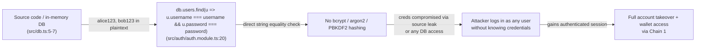
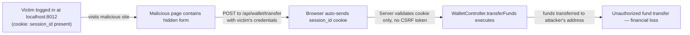

```mermaid
flowchart LR
    A["Authenticated Attacker\n(src/auth/auth.guard.ts:13)"] -->|"GET /api/wallet?userId=2"| B["WalletController.getWallet\n(src/wallet/wallet.controller.ts:15-18)"]
    B -->|"userId=2 (no ownership check)"| C["WalletService.getWallet(2)\n(src/wallet/wallet.service.ts:13-19)"]
    C -->|"returns full wallet obj\nwith privateKey field"| D["db.wallets.find(w => w.userId === 2)\n(src/db.ts:14-20)"]
    D -->|"wallet.privateKey returned\nin plaintext"| E["Client receives private key\n(public/js/app.js:87)\n(displayed in UI)"]
    E -->|"attacker can now sign\ntransactions as victim"| F["COMPLETE WALLET TAKEOVER"]
```

# Chained Vulnerability Audit Report

**Project:** Crypto Wallet Service (App 12)
**Scope:** Full source review — `src/`, `public/`, configuration, and deployment manifests
**Date:** 2026-05-24
**Auditor:** CodeGopher (Static-Only)
**Status:** Compliant with static-only boundary — no live probes, executors, or dynamic tools used

---

## Summary Dashboard

| Metric               | Value                                                  |
|----------------------|--------------------------------------------------------|
| Total chains found   | **3**                                                  |
| Maximum chain severity | **Critical**                                          |
| High confidence chains | 2                                                    |
| Medium confidence chains | 1                                                 |
| Weaknesses cataloged | 8                                                      |
| Reviewed areas       | Auth, Wallet, DB, Frontend, Deployment, Config         |
| Not reviewed         | Runtime behaviour, network layer, TLS config, third-party libs |

---

## Methodology & Safety Note

This audit followed a four-phase approach:

1. **Attack Surface Mapping** — Identified all public routes, API endpoints, webhook handlers, file uploads, headers, cookies, and request parameters.
2. **Weakness Inventory** — Cataloged individually moderate or low weaknesses (plaintext passwords, IDOR, missing CSRF, exposed private keys, missing input validation).
3. **Attack Graph Synthesis** — Connected entry points to weaknesses to sinks using static control-flow and data-flow evidence.
4. **Impact Assessment** — Rated each chain by impact, reachability, confidence, and the easiest remediation link to break.

**Static-Only Boundary:** No live HTTP probes, fuzzers, SQL injection payloads, credential attacks, dynamic scanners, exploit scripts, port scans, or external network tests were performed. No executable exploit payloads or step-by-step abuse instructions are included.

---

## Chain 1: IDOR + Plaintext Private Key Exposure → Full Wallet Compromise

### Overview
Any authenticated user can read **any other user's wallet**, including that user's **plaintext private key**, enabling complete crypto-wallet takeover.

### Mermaid Attack Graph

### Detailed Chain Breakdown

| Link    | File                              | Lines              | Evidence                                                                                                 |
|---------|-----------------------------------|--------------------|--------------------------------------------------------------------------------------------------------|
| Source  | `src/wallet/wallet.controller.ts` | 15–18              | `@Get()` accepts optional `@Query('userId')`. If provided, uses it instead of `user.id` with no ownership check. Controller comment even states: *"Any authenticated wallet holder can view any other user's wallet by supplying their userId, including their private key."* |
| Hop 1   | `src/wallet/wallet.service.ts`    | 13–19              | `getWallet(userId)` returns the **full wallet object** including the `privateKey` field. No field filtering. |
| Hop 2   | `src/db.ts`                       | 14–20              | Private keys stored in **plaintext** inside the in-memory `db.wallets` array. No hashing, no encryption. |
| Sink    | `public/js/app.js`                | 87                 | `document.getElementById("walletPrivateKey").innerText = wallet.privateKey;` — client displays the private key in plaintext. |

### Preconditions & Assumptions
- Attacker must authenticate (any valid user credential set).
- The `userId` query parameter is passed directly from HTTP request to the service without validation.

### Impact
**Critical.** An authenticated attacker gains full read access to any wallet's balance, address, and **private key**. Possession of the private key enables signing arbitrary transactions, draining all funds.

### Confidence
**High** — Every link is statically provable from source code. The controller comment itself confirms the IDOR intent; the service returns the full object; the DB stores keys in plaintext; the frontend renders them.

### Remediation
1. **Remove the `userId` query parameter** from `getWallet` — always use `user.id` from the authenticated session.
2. **Exclude `privateKey` from API responses.** Use a response DTO that omits sensitive fields.
3. **Hash or encrypt private keys** at rest in the database (if persistence is retained).
4. **Stop rendering private keys in the frontend UI** entirely.

---

## Chain 2: Hardcoded Plaintext Credentials + Plaintext Password Verification → Mass Account Takeover

### Overview
User passwords are stored as plaintext in the source code, and the login endpoint performs a direct string comparison. Source code access or any leak of the DB module gives an attacker all user passwords immediately.

### Mermaid Attack Graph

### Detailed Chain Breakdown

| Link    | File                             | Lines          | Evidence                                                                 |
|---------|----------------------------------|----------------|--------------------------------------------------------------------------|
| Source  | `src/db.ts`                      | 5–7            | `db.users` array contains `{ password: 'alice123', ... }` and `{ password: 'bob123', ... }` — plaintext passwords in source. |
| Hop     | `src/auth/auth.module.ts`        | 20             | `db.users.find(u => u.username === username && u.password === password)` — direct string comparison, no salt, no hashing. |
| Sink    | N/A (system-level capability)    | —              | Full set of user credentials exposed. Attacker with source access can impersonate any user. |

### Preconditions & Assumptions
- Attacker needs access to source code or the in-memory database object.
- No additional environment or runtime secrets protect the passwords.

### Impact
**Critical.** If the source is leaked (e.g., public GitHub repo, container image, deployment artifact), every user's password is immediately compromised. This also cascades into Chain 1 — once authenticated, the attacker can access any wallet including private keys.

### Confidence
**High** — Plaintext passwords in `db.ts` and direct `===` comparison in `auth.module.ts` are visible in source.

### Remediation
1. **Never store plaintext passwords.** Use `bcrypt`, `argon2`, or `PBKDF2`.
2. **Never commit credentials to source.** Move users to a proper database with hashed credentials.
3. **Rotate all user passwords** after implementing proper hashing.
4. **Remove hardcoded test credentials** from production codebases.

---

## Chain 3: Missing CSRF Protection + Cookie-Based Session → Cross-Site Request Forgery on Transfers

### Overview
All mutating endpoints (`POST /api/auth/login`, `POST /api/auth/logout`, `POST /api/wallet/transfer`, `POST /api/wallet/external-transfer`) accept cookie-based authentication without any CSRF token validation. An attacker could craft a malicious page that silently triggers a transfer from a logged-in victim's browser.

### Mermaid Attack Graph

### Detailed Chain Breakdown

| Link    | File                             | Lines          | Evidence                                                                 |
|---------|----------------------------------|----------------|--------------------------------------------------------------------------|
| Source  | `src/auth/auth.module.ts`        | 18–25          | `@Post('login')` sets `session_id` cookie with `{ httpOnly: true, sameSite: 'lax' }`. No CSRF token generation or storage. |
| Source  | `src/wallet/wallet.controller.ts`| 31–35          | `@Post('transfer')` accepts `recipientAddress` and `amount` from request body. Uses authenticated user from `AuthGuard`. No CSRF validation. |
| Source  | `src/main.ts`                    | 15–18          | `app.use(cookieParser())` — cookie parsing enabled globally. No CSRF middleware configured. |
| Hop     | `src/auth/auth.guard.ts`         | 13–27          | Authentication relies solely on cookie presence and DB lookup. No CSRF cross-check. |
| Sink    | `src/wallet/wallet.service.ts`   | 32–64          | `executeTransfer` processes transfer if balance is sufficient. No additional authorization check. |

### Preconditions & Assumptions
- Victim must be logged in (active `session_id` cookie).
- The browser must send cookies on cross-origin requests (default behaviour for same-site cookies, though `sameSite: 'lax'` only restricts top-level navigation cross-sites).
- The `sameSite: 'lax'` setting provides partial mitigation but does **not** protect against CSRF initiated via `<form method="POST">` on a victim's own site or through CSRF from a vulnerable redirect.

### Impact
**Medium–High.** An attacker could forge POST requests to transfer funds, change settings, or log users out. The `sameSite: 'lax'` cookie attribute limits but does not eliminate this risk (cross-site POST via form submission on the victim's own origin is still possible, as is SSRF-assisted CSRF).

### Confidence
**Medium** — CSRF protection is absent in source. The `sameSite: 'lax'` attribute provides partial mitigation, but the lack of CSRF tokens or SameSite `strict`/cookie regeneration on state-changing requests makes the chain plausible. Confirmed by absence of any CSRF middleware or token in both backend and frontend code.

### Remediation
1. **Add CSRF tokens** to all mutating endpoints (NestJS `@nestjs/csrf` or manual double-submit cookie pattern).
2. **Set `sameSite: 'strict'`** on session cookies.
3. **Verify `Origin` and `Referer` headers** on POST requests.
4. **Regenerate session IDs** after login (prevent session fixation).

---

## Cross-Cutting Weaknesses (Not Forming Complete Chains)

### W-1: Missing `secure` Flag on Session Cookie
- **File:** `src/auth/auth.module.ts`, line 22
- **Evidence:** `res.cookie('session_id', user.id.toString(), { httpOnly: true, sameSite: 'lax' })` — `secure: true` is not set.
- **Risk:** Session cookie transmitted over unencrypted HTTP.

### W-2: Session Fixation — No Session Regeneration
- **File:** `src/auth/auth.module.ts`, line 22
- **Evidence:** New `session_id` is set on login, but no mechanism exists to invalidate or rotate previous sessions.
- **Risk:** If an attacker pre-sets a session ID, they could hijack the session post-login.

### W-3: Missing `executeTransferByAddress` Method (Crash/Bug)
- **File:** `src/wallet/wallet.controller.ts`, line 44
- **File:** `src/wallet/wallet.service.ts`, line 65+ (method body present without declaration)
- **Evidence:** Controller calls `this.walletService.executeTransferByAddress(...)`, but the service contains a detached body fragment (no function declaration). TypeScript compilation will fail.
- **Risk:** Service crash on invocation. If implemented, would allow transfers by address without ownership verification — another IDOR variant.

### W-4: Incomplete Input Validation on Transfer Amounts
- **File:** `src/wallet/wallet.service.ts`, line 33
- **Evidence:** `if (amount <= 0)` check, but no validation for `NaN`, `Infinity`, or floating-point precision issues.
- **Risk:** Potential for unexpected financial calculations or edge-case balance manipulation.

### W-5: Frontend Exposes Private Key in UI
- **File:** `public/js/app.js`, line 87
- **Evidence:** `document.getElementById("walletPrivateKey").innerText = wallet.privateKey;`
- **Risk:** Private keys displayed in plaintext in the browser UI. DOM inspection reveals keys even if API were fixed.

### W-6: No Rate Limiting on Authentication Endpoints
- **File:** `src/auth/auth.module.ts`
- **Evidence:** No rate limiting middleware on `/api/auth/login`.
- **Risk:** Brute-force attack surface, though limited by only 2 hardcoded users.

---

## Unknowns & Areas Not Reviewed

| Area                     | Reason Not Reviewed                                         |
|--------------------------|-------------------------------------------------------------|
| Runtime HTTPS/TLS config | Only Dockerfile and `main.ts` visible; no TLS configuration found |
| Production database      | Only in-memory `db.ts` visible; unknown if production uses a different backend |
| Third-party dependency vulnerabilities | `package.json` dependencies listed but not scanned for CVEs |
| Container security       | Dockerfile is minimal; no security context, user, or read-only rootfs enforcement |
| Network-level access control | No firewall rules or ingress configuration reviewed     |
| Testing infrastructure   | No test files found in workspace                            |

---

## Recommended Tests to Add

1. **Authorization unit tests** — Verify that `GET /api/wallet` rejects requests with a `userId` belonging to a different user.
2. **CSRF absence test** — Send a POST request to `/api/wallet/transfer` without an Origin/Referer header and a valid session cookie; verify 403 rejection.
3. **Response sanitization test** — Verify that `GET /api/wallet` response does not include `privateKey` in the JSON payload.
4. **Password hashing test** — Confirm that stored passwords are hashed (bcrypt/argon2) and never stored in plaintext.
5. **Input validation tests** — Test `POST /api/wallet/transfer` with negative amounts, `NaN`, `Infinity`, and 0.
6. **Session fixation test** — Attempt login with a pre-set `session_id` cookie and verify a new session ID is issued.

---

## Priority Remediation Summary

| Priority | Action                                       | Chains Broken                    |
|----------|----------------------------------------------|----------------------------------|
| **P0**   | Remove `userId` parameter from `getWallet`; exclude `privateKey` from responses | Chain 1 (Critical)               |
| **P0**   | Hash passwords with bcrypt/argon2; remove hardcoded creds from source | Chain 2 (Critical)               |
| **P1**   | Add CSRF protection to all mutating endpoints | Chain 3 (Medium–High)           |
| **P1**   | Remove private key display from frontend     | Chain 1 (mitigation)             |
| **P2**   | Set `secure: true` and `sameSite: 'strict'` on session cookie | W-1, W-3                  |
| **P2**   | Regenerate session IDs on login              | W-2                              |
| **P2**   | Implement `executeTransferByAddress` properly or remove the endpoint | W-3                |
| **P3**   | Add input validation for edge cases           | W-4                              |
| **P3**   | Add rate limiting on auth endpoints           | W-6                              |

---

*This report covers the entire source tree in `src/`, `public/`, configuration files (`package.json`, `tsconfig.json`, `nest-cli.json`), and deployment manifest (`Dockerfile`). The chain vulnerabilities identified represent the most impactful combinations of individually weak controls that together create serious security risks.*
