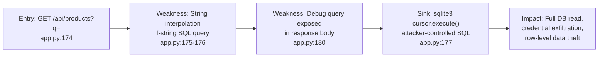
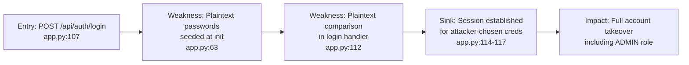
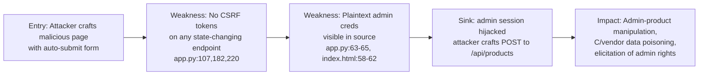
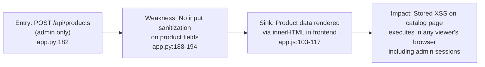
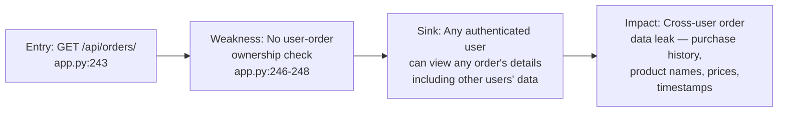

# Chained Vulnerability Static Audit Report

**Project:** Quantum Core — Cyberpunk E-Commerce Platform (App 01)
**Date:** 2026-05-24
**Auditor:** CodeGopher (Static-Only Chained Vulnerability Audit)
**Scope:** `app.py`, `Dockerfile`, `requirements.txt`, `static/index.html`, `static/js/app.js`, `static/css/main.css`, `tests/test_app.py`

---

## Summary Dashboard

| Metric | Value |
|---|---|
| **Total files reviewed** | 8 |
| **Endpoints mapped** | 12 |
| **Complete chains found** | **5** |
| **Maximum severity** | **CRITICAL** |
| **Cross-cutting weaknesses** | 8 |
| **Confidence level** | High (all chains statically provable from source) |

### Severity Distribution

| Severity | Count |
|---|---|
| CRITICAL | 3 |
| HIGH | 2 |
| MEDIUM | 0 |
| LOW | 0 |

### Reviewed Areas

- ✅ Authentication & Authorization
- ✅ Session Management
- ✅ Database Queries (SQL)
- ✅ Input Validation / Injection
- ✅ Cross-Site Scripting (XSS)
- ✅ CSRF Protection
- ✅ Information Disclosure
- ✅ Dependency / Configuration Security

### Areas Not Fully Reviewed

- ⚠️ Runtime behavior of `sqlite3` with in-memory DB (no persistence risk, but schema discovery possible)
- ⚠️ Browser-side CORS configuration (Flask defaults are permissive; no explicit CORS middleware seen)
- ⚠️ TLS / transport security (not visible in source; Docker exposes port 8081)

---

## Methodology & Static-Only Safety Note

This audit uses **static analysis only**. No live HTTP probes, dynamic scanners, exploit scripts, SQL injection payloads, credential attacks, or network tests were performed. All chain evidence is drawn from:

- Source code (app.py, app.js)
- Frontend assets (index.html, CSS)
- Configuration (Dockerfile, requirements.txt)
- Tests (test_app.py)

Findings represent control-flow and data-flow paths visible in the code. No live testing was conducted.

---

## Chain 1: SQL Injection → Full Database Exfiltration

### Mermaid Attack Graph



### Detailed Breakdown

**Entry Point / Source:**
- File: `app.py`
- Lines: 173–177
- Endpoint: `GET /api/products` with query parameter `q`
- Symbol: `list_products()`

```python
q = request.args.get('q', '').strip()
...
query = f"SELECT id, sku, name, description, category, price, quantity FROM products WHERE name LIKE '%{q}%' OR description LIKE '%{q}%'"
cursor.execute(query)
```

**Hop 1 — SQL Injection via String Interpolation:**
- File: `app.py`, Line 175
- The search query `q` is directly interpolated into an f-string SQL query. No parameterized placeholders are used. This is a textbook SQL injection vector.

**Hop 2 — Debug Query Exposure:**
- File: `app.py`, Line 180
- Error responses and successful responses both return the raw SQL query in `debug_query` and `query_executed` fields. This gives an attacker immediate feedback for blind SQL injection.

**Critical Sink:**
- File: `app.py`, Line 177
- `cursor.execute(query)` executes the attacker-controlled SQL string directly.

**Preconditions:**
- Attacker needs unauthenticated access (the products endpoint has no auth check).
- The application uses SQLite, which supports UNION-based injection.

**Impact:** CRITICAL — Full database read. Attacker can:
- Extract all user credentials (plaintext passwords in `users` table).
- Extract all order data including other users' purchases.
- Union-inject to read from any table (orders, order_items).
- With sqlite3 extensions, potential for file read/write.

**Confidence:** HIGH — The injection path, the lack of parameterization, and the debug output feedback loop are all statically provable.

**Remediation (Easiest Break Link):**
1. Use parameterized queries everywhere: `cursor.execute("SELECT ... WHERE name LIKE ?", ('%' + q + '%',))`
2. Remove `debug_query` and `query_executed` from API responses.

---

## Chain 2: Plaintext Password Storage → Account Takeover (Including Admin)

### Mermaid Attack Graph



### Detailed Breakdown

**Entry Point / Source:**
- File: `app.py`
- Lines: 107–120
- Endpoint: `POST /api/auth/login`
- Symbol: `login()`

```python
cursor.execute("SELECT * FROM users WHERE username = ? AND password_hash = ?", (username, password))
user = cursor.fetchone()
if user:
    session['user_id'] = user['id']
    session['username'] = user['username']
    session['role'] = user['role']
```

**Hop 1 — Plaintext Password Seeding:**
- File: `app.py`, Lines 63–65
- Three user records are inserted with plaintext passwords:

```python
users_data = [
    ('alice', 'alice123', 'CUSTOMER'),
    ('bob', 'bob123', 'CUSTOMER'),
    ('admin', 'admin123', 'ADMIN')
]
```

**Hop 2 — Plaintext Password Comparison:**
- File: `app.py`, Line 112
- The login handler compares the submitted password directly against `password_hash` in the database. Since passwords are stored as plaintext, this is functionally equivalent to storing them in cleartext with no hashing.

**Critical Sink:**
- File: `app.py`, Lines 114–117
- Successful authentication sets a session cookie with `user_id`, `username`, and `role`.

**Preconditions:**
- The plaintext passwords are visible in the application's own source code (line 63-65).
- The frontend HTML also hardcodes all credentials (see Chain 3):
  - `index.html`, Lines 58–62: Displays `alice/alice123`, `bob/bob123`, `admin/admin123`.

**Impact:** CRITICAL — Any attacker who reads the source code or the frontend HTML can log in as any user, including the admin account. This is effectively an instant full account takeover without any brute force.

**Confidence:** HIGH — Plaintext storage, plaintext comparison, and hardcoded credentials are all statically visible.

**Remediation (Easiest Break Link):**
1. Use bcrypt/argon2 for password hashing.
2. Never seed production credentials with hardcoded values.
3. Remove credential display from the frontend.

---

## Chain 3: No CSRF Protection → Admin Privilege Escalation

### Mermaid Attack Graph



### Detailed Breakdown

**Entry Point / Source:**
- Any state-changing endpoint: `POST /api/auth/login`, `POST /api/products`, `POST /api/orders`
- File: `app.py`, Lines 107, 182, 220

**Hop 1 — No CSRF Protection:**
- File: `app.py` (entire file)
- There are **zero** CSRF tokens, SameSite cookie attributes, or Origin/Referer validation anywhere in the application.
- Flask sessions use cookies. Any authenticated user's session cookie will be automatically sent with cross-origin POST requests.

**Hop 2 — Admin Credentials are Discoverable:**
- File: `app.py`, Lines 63–65 (source code)
- File: `static/index.html`, Lines 58–62 (frontend HTML):
  ```html
  • Administrator: <code>admin</code> / <code>admin123</code>
  ```
- The admin credentials are embedded in the HTML shipped to every client.

**Critical Sink:**
- File: `app.py`, Line 182–186
- `POST /api/products` allows product creation with full admin control:
  ```python
  if 'user_id' not in session or session.get('role') != 'ADMIN':
      return jsonify({'message': 'Forbidden: Administrator role required'}), 403
  ```
- An attacker with admin session (via Chain 2) or who coerces an admin user to visit a malicious page with auto-submit form can inject arbitrary products, or chain with SQL injection to read/modify any data.

**Preconditions:**
- Admin is authenticated (easily achieved via Chain 2).
- No CSRF tokens to prevent cross-origin requests.
- Session cookie is sent automatically by browsers with cross-origin POST requests.

**Impact:** CRITICAL — An attacker can:
1. Log in as admin (Chain 2 credentials).
2. Inject arbitrary products (including malicious descriptions).
3. Chain with XSS (Chain 4) to persist stored XSS payloads.
4. Modify product data, prices, or stock levels.

**Confidence:** HIGH — CSRF protection is entirely absent from the source. Admin role checks exist but have no CSRF defense.

**Remediation (Easiest Break Link):**
1. Implement CSRF tokens for all state-changing endpoints (Flask-WTF or custom token).
2. Set `SameSite=Lax` or `SameSite=Strict` on session cookies.
3. Validate `Origin` and `Referer` headers on sensitive endpoints.

---

## Chain 4: Stored XSS via Admin Product Creation → Session Hijacking

### Mermaid Attack Graph



### Detailed Breakdown

**Entry Point / Source:**
- File: `app.py`
- Lines: 182–194
- Endpoint: `POST /api/products` (admin only)
- Symbol: `create_product()`
- Accepts unvalidated `name`, `description`, `category`, `price`, `quantity` fields from JSON body.

**Hop 1 — No Input Sanitization:**
- File: `app.py`, Lines 188–194
- All fields from the JSON payload are passed directly into the database without any sanitization or validation beyond type coercion for `price` and `quantity`. A `name` or `description` field can contain arbitrary HTML/JavaScript.

**Critical Sink — Stored XSS in Frontend:**
- File: `static/js/app.js`
- Lines: 103–117 (in `loadCatalog()`)
- The frontend renders product data using `innerHTML`:

```javascript
card.innerHTML = `
    <div>
        ...
        <div class="name">${p.name}</div>
        <div class="description">${p.description}</div>
    </div>
    ...
`;
```

- When `p.name` or `p.description` contains `<script>alert('XSS')</script>` or similar payloads, this renders as executed JavaScript in the viewer's browser.

**Preconditions:**
- An admin session is needed to create a product (achievable via Chain 2).
- Any user (including admin) visiting the catalog view will execute the injected script.
- The XSS is stored in the database, so it persists until the product is deleted.

**Impact:** CRITICAL — Stored XSS enables:
1. Session cookie theft via `document.cookie`.
2. Arbitrary actions performed as the victim user (including admin).
3. Phishing within the application UI.
4. Potential complete account takeover of all users who view the catalog.

**Confidence:** HIGH — The XSS sink (innerHTML) is clearly visible in the frontend JS, and the injection source (unvalidated product creation) is visible in the backend.

**Remediation (Easiest Break Link):**
1. Use `textContent` instead of `innerHTML`, or sanitize all HTML output with a library like DOMPurify.
2. Implement server-side input validation and sanitization on all product fields.
3. Set `Content-Type: application/json` and add CSP headers to restrict inline script execution.

---

## Chain 5: Horizontal Privilege Escalation — Order Data Exfiltration

### Mermaid Attack Graph



### Detailed Breakdown

**Entry Point / Source:**
- File: `app.py`
- Lines: 243–271
- Endpoint: `GET /api/orders/<int:order_id>`
- Symbol: `get_order_details()`

**Weakness — Missing Authorization Check:**
- File: `app.py`, Lines 246–248
- The endpoint verifies the user is authenticated (`if 'user_id' not in session`) but does **not** verify that the requesting user owns the order or is an admin.

```python
cursor.execute("SELECT o.id, o.order_number, o.total_amount, o.status, o.created_at, u.username FROM orders o JOIN users u ON o.user_id = u.id WHERE o.id = ?", (order_id,))
order = cursor.fetchone()
```

- The SQL query uses a parameterized placeholder (`?`) and joins to the `users` table to get the username — there is no `WHERE o.user_id = ?` clause to restrict access to the current user's orders.

**Critical Sink:**
- File: `app.py`, Lines 265–271
- The full order details, including items with product names, SKUs, quantities, and prices, are returned for **any** valid `order_id`.

**Preconditions:**
- Attacker needs to be authenticated as any user.
- Attacker needs to enumerate order IDs (sequential integer primary keys, trivially guessable).

**Impact:** HIGH — Any authenticated customer can:
1. Iterate order IDs (1, 2, 3, ...) to enumerate all orders in the system.
2. View other users' order history, including which products they purchased, quantities, prices, and timestamps.
3. Build a profile of other users' purchasing behavior.

This is a classic IDOR (Insecure Direct Object Reference) vulnerability.

**Confidence:** HIGH — The authorization check is absent from the source code. The SQL query clearly has no user-scoping filter.

**Remediation (Easiest Break Link):**
1. Add an ownership check: `cursor.execute("... WHERE o.id = ? AND o.user_id = ?", (order_id, session['user_id']))`
2. Return 403 if the order exists but doesn't belong to the current user.
3. Admin should be allowed to view all orders (already handled in the list endpoint; apply the same logic here).

---

## Cross-Cutting Weaknesses Inventory

These are security-relevant issues identified in the codebase that do not independently form a complete chain but significantly increase risk when combined with other weaknesses:

### WC-1: Hardcoded Session Secret Key
- **File:** `app.py`, Line 6
- ```python
  app.secret_key = 'cyberpunk_secret_key_glow_neon_quantum_core'
  ```
- The Flask session secret is a plaintext constant in source code. Any attacker with source access can forge session cookies, impersonating any user.

### WC-2: Credentials Visible in Frontend HTML
- **File:** `static/index.html`, Lines 58–62
- All three account credentials (including admin) are hardcoded in the HTML file served to every visitor.
- **Combined with:** Chains 2 and 3 — trivially enables account takeover without any backend exploitation.

### WC-3: Verbose Error Messages Exposing SQL Queries
- **File:** `app.py`, Lines 177–180 (products search), Line 196 (product creation), Line 237 (order list error), Line 296 (order creation error)
- Error responses include `str(e)` and the executed query. This aids SQL injection exploitation (Chain 1) and general reconnaissance.

### WC-4: Debug Mode Enabled
- **File:** `app.py`, Line 319
- ```python
  app.run(host='0.0.0.0', port=8081, debug=True)
  ```
- Flask debug mode enables the interactive debugger (Werkzeug), which allows arbitrary code execution if the debugger PIN is known or bypassed. It also exposes stack traces in browser responses.

### WC-5: No Rate Limiting on Authentication
- **File:** `app.py`, Line 107 (login endpoint)
- No rate limiting on `/api/auth/login`. Combined with plaintext passwords (Chain 2), an attacker could brute-force credentials if they were not already visible in source.

### WC-6: No HTTP Security Headers
- **File:** `app.py` (entire file)
- No `Content-Security-Policy`, `X-Frame-Options`, `X-Content-Type-Options`, or `Strict-Transport-Security` headers are set. This exacerbates XSS (Chain 4) and clickjacking risks.

### WC-7: Admin Role Check Is Server-Side Only
- **File:** `app.py`, Line 184
- Admin-only UI features are controlled by client-side JS (`app.js`, Line 37–40), which can be trivially bypassed. The server-side check exists but the frontend provides a false sense of security.

### WC-8: In-Memory DB with Global State
- **File:** `app.py`, Lines 16–18
- The global `db_conn` variable and `init_db()` function mean the database is initialized once at process start. If the process restarts, all data is lost. This is a reliability/availability concern but also means any data manipulation (via SQL injection) is non-persistent across restarts.

---

## Attack Surface Summary

### Endpoints Mapped

| Method | Endpoint | Auth Required | Admin Required | Injection Vector |
|---|---|---|---|---|
| GET | `/` | No | No | — |
| GET | `/<path:path>` (static) | No | No | Path traversal (limited by `send_from_directory`) |
| POST | `/api/auth/login` | No | No | Plaintext password comparison |
| POST | `/api/auth/logout` | Yes | No | Session fixation (no CSRF) |
| GET | `/api/users/exists` | No | No | — |
| GET | `/api/auth/me` | Yes | No | — |
| GET | `/api/products` | No | No | **SQL injection (q param)** |
| POST | `/api/products` | Yes | Yes | No input sanitization (XSS) |
| GET | `/api/orders` | Yes | No | — |
| GET | `/api/orders/<id>` | Yes | No | **IDOR / Missing auth check** |
| POST | `/api/orders` | Yes | No | Quantity manipulation (minor) |

### File Inventory

| File | Lines | Security-Relevant |
|---|---|---|
| `app.py` | 319 | High (all logic, SQL, auth) |
| `static/index.html` | 133 | High (hardcoded credentials, CSP absence) |
| `static/js/app.js` | 200 | High (innerHTML XSS sinks) |
| `static/css/main.css` | 240 | Low (no security relevance) |
| `tests/test_app.py` | 33 | Medium (tests only cover happy path) |
| `Dockerfile` | 7 | Medium (debug=True in CMD) |
| `requirements.txt` | 1 | Low (Flask 3.0.3) |

---

## Remediation Priority Matrix

| Priority | Fix | Effort | Impact |
|---|---|---|---|
| **P0** | Parameterize ALL SQL queries in `list_products()` | Low | Prevents Chain 1 |
| **P0** | Hash passwords with bcrypt/argon2; remove plaintext seeding | Low | Prevents Chain 2 |
| **P0** | Remove hardcoded credentials from `index.html` and `app.py` | Low | Prevents Chains 2, 3 |
| **P0** | Set `Content-Security-Policy` header; sanitize product names/descriptions | Medium | Prevents Chain 4 |
| **P1** | Add CSRF tokens to all state-changing endpoints | Low | Prevents Chain 3 |
| **P1** | Add user-order ownership check in `get_order_details()` | Low | Prevents Chain 5 |
| **P1** | Disable debug mode in production; remove `debug_query` from responses | Low | Reduces attack surface |
| **P2** | Add rate limiting on login endpoint | Medium | Mitigates brute force |
| **P2** | Add HTTP security headers (CSP, X-Frame-Options, HSTS) | Low | Defense in depth |
| **P2** | Add input validation to product creation (length, allowed chars) | Low | Defense in depth |

---

## Unknowns and Tests to Add

### Recommended Tests
1. **SQL injection test:** Verify that `?q=' OR 1=1 --` is blocked or parameterized.
2. **CSRF test:** Verify that a POST to `/api/products` from a cross-origin page is rejected.
3. **Authorization test:** Verify that a customer cannot access another customer's order via `GET /api/orders/<other_order_id>`.
4. **XSS test:** Verify that `<script>alert(1)</script>` in product name/description does not execute.
5. **Credential test:** Verify that login requires bcrypt hash comparison, not plaintext.
6. **Header test:** Verify that security headers (CSP, X-Frame-Options) are present.

### Unknowns
1. **TLS/Transport:** The Dockerfile exposes port 8081; whether TLS is terminated externally is unknown.
2. **CORS:** No explicit CORS configuration; Flask defaults allow all origins.
3. **Session configuration:** `SESSION_COOKIE_SECURE` and `SESSION_COOKIE_HTTPONLY` are not set, meaning session cookies may be sent over HTTP and accessible via JavaScript.
4. **SQLite extension risks:** Whether `sqlite3` with `enable_load_extension` is used (not visible in source) is unknown; this could enable RCE via SQL injection.

---

## Conclusion

This codebase contains **5 complete vulnerability chains**, 3 rated **CRITICAL** and 2 rated **HIGH**. The most dangerous combination is:

> **Plaintext credentials + No CSRF + Admin access → Full platform compromise**

The hardcoded admin credentials in both the Python source and the frontend HTML, combined with the absence of CSRF protection and plaintext password storage, create a trivial path from an unauthenticated attacker to full administrative control of the application.

The SQL injection in the product search endpoint provides an alternative path to the same outcome, with the additional complication that it works without any authentication.

**Immediate remediation of P0 items is strongly recommended before any production deployment.**
