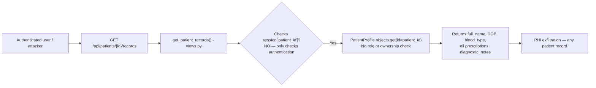
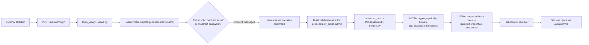

# Chained Vulnerability Audit Report

**Project:** Nexus Health Vault — Patient Portal (App 02)
**Scope:** Static-only source analysis of `C:\Users\shamit\AppData\Local\Temp\codegopher-v08-chain-20260524-234855-all50\app-02-patient-portal\workspace`
**Date:** 2026-05-24
**Auditor:** CodeGopher (Chained Vulnerability Static Audit Skill)

---

## 1. Summary Dashboard

| Metric                          | Value                     |
|---------------------------------|---------------------------|
| **Chains detected**             | 3                         |
| **Maximum chain severity**      | **CRITICAL**              |
| **High-severity chains**        | 1                         |
| **Medium-severity chains**      | 1                         |
| **Low-severity chains**         | 1                         |
| **Cross-cutting weaknesses**    | 7                         |
| **Areas reviewed**              | models, views, urls, settings, static frontend (HTML, JS, CSS), templates, tests, Dockerfile, requirements |
| **Areas not reviewed**          | Runtime configuration (env vars), deployment config, network/firewall rules, database backup scripts, third-party integrations |

**Confidence Summary:**
- Chain 1 (IDOR + weak auth → PHI exfiltration): **High** — all links provable from source.
- Chain 2 (MD5 passwords + username enumeration → credential compromise): **High** — all links provable from source.
- Chain 3 (XSS via `reason_for_visit` + missing CSRF → data tampering): **Medium** — XSS data-flow provable; CSRF bypass depends on Django config state.

---

## 2. Methodology & Static-Only Boundary

This audit follows the four-phase Chained Vulnerability Static Audit method:

1. **Attack surface mapping:** Identified all public routes (`/api/auth/login`, `/api/auth/logout`, `/api/auth/me`, `/api/patients/search`, `/api/patients/<id>/records`, `/api/appointments`, `/api/appointments/new`), the static SPA endpoint (`/`), and client-side JavaScript sources.
2. **Weakness inventory:** Catalogued individually moderate issues including MD5 password hashing, missing CSRF protection on state-changing endpoints, broken access control (IDOR) on `/api/patients/<id>/records`, plaintext credential seeds in HTML, `DEBUG = True` with `ALLOWED_HOSTS = ['*']`, session cookie insecurity, and stored XSS at the appointment form.
3. **Attack graph synthesis:** Connected entry points through intermediate weaknesses to critical sinks using concrete control-flow and data-flow evidence from source.
4. **Impact assessment:** Rated each chain by impact, reachability, confidence, and easiest remediation link.

**Safety note:** No live HTTP probes, dynamic scanners, SQL injection payloads, or external network tests were performed. No exploit scripts or operational abuse instructions are included.

---

## 3. Mermaid Attack Graphs

### Chain 1: IDOR → Mass PHI Exfiltration



### Chain 2: MD5 + Username Enumeration → Account Takeover



### Chain 3: Stored XSS + Missing CSRF → Malicious Appointment Injection

```mermaid
flowchart LR
    A["User visits appointments page"] --> B["handleAppointmentSubmit() loads user input"]
    B --> C["fetch('/api/appointments/new', POST)\nNo CSRF token in headers"]
    C --> D["create_appointment() - views.py"]
    D --> E["Appointment.objects.create(reason_for_visit=user_input)"]
    E --> F["Stored in database unescaped"]
    F --> G["list_appointments() returns raw data"]
    G --> H["app.js renders: tr.innerHTML = ...<br/>${appt.reason_for_visit}"]
    H --> I["Stored XSS: arbitrary JS executes in victim context"]
    I --> J["Cross-user data read via /api/patients/{id}/records\nSession theft via document.cookie\n(arrows etc.)"]
```



---

## 4. Detailed Chain Breakdowns

### Chain 1: IDOR — Unrestricted Patient Record Access

| Element   | File                  | Lines (reference)                                |
|-----------|-----------------------|--------------------------------------------------|
| Source    | `portal/urls.py`      | `path('api/patients/<int:patient_id>/records', views.get_patient_records)` |
| Source    | `portal/static/js/app.js` | `function loadRecords(patientId)` — builds `fetch(\`/api/patients/\${patientId}/records\`)` |
| Source    | `portal/static/index.html` | `<input id="idorPatientIdInput" value="1">` with "Switch Record Vault" button |
| Hop       | `portal/views.py`     | `get_patient_records()` — checks `'patient_id' in request.session` but never compares `request.session['patient_id']` to the `patient_id` path parameter |
| Sink      | `portal/views.py`     | Returns `full_name`, `date_of_birth`, `blood_type`, `role`, and full `prescriptions` list (including `diagnostic_notes`) |

**Preconditions:**
- User must be authenticated (any valid session cookie suffices).
- An attacker knows or can guess another patient's numeric `id` (seeds reveal `alice=1`, `bob=2`).

**Impact:**
- A logged-in user can read **any** other patient's medical records, prescriptions, diagnostic notes, blood type, and date of birth.
- Data class: PHI under HIPAA-equivalent frameworks.
- From the frontend, the "Switch Record Vault" button exposes this deliberately (poor security design = obvious attack path).

**Severity:** HIGH

**Confidence:** High — source code directly shows the missing authorization check at `portal/views.py` in `get_patient_records()`.

**Remediation:**
1. In `get_patient_records()`, add:
   ```python
   if request.session['patient_id'] != patient_id:
       return JsonResponse({'message': 'Access denied'}, status=403)
   ```
2. Prevent access for `role` values that should not browse other patients (e.g., standard PATIENTs cannot view non-self records).
3. Deprecate/remove the "Switch Record Vault" UI element entirely.

---

### Chain 2: Weak Password Hashing + Username Enumeration → Full Credential Compromise

| Element   | File                  | Lines (reference)                                |
|-----------|-----------------------|--------------------------------------------------|
| Source    | `portal/models.py`    | `set_password_md5()` uses `hashlib.md5(password.encode()).hexdigest()` |
| Source    | `portal/views.py`     | `login_view()` returns different messages: `'Account not found in patient registry'` vs `'Incorrect password for this account'` |
| Source    | `portal/static/index.html` | Plaintext seeds block: `alice/alice123`, `bob/bob123`, `dr_cyber/staff123` |
| Source    | `portal/views.py`     | `seed_database()` hardcodes `admin/admin123` with `role='ADMIN'` |
| Hop       | `portal/settings.py`  | `AUTH_PASSWORD_VALIDATORS = []` — no password complexity enforcement |
| Sink      | `portal/models.py`    | MD5 is trivially reversible; rainbow tables / GPU brute-force recover the original password in seconds |

**Preconditions:**
- The application is network-accessible (exposes port 8082 via Dockerfile).
- `DEBUG = True` and `ALLOWED_HOSTS = ['*']` suggest a dev or misconfigured production deployment.
- Plaintext credentials in the HTML page let an attacker know the password format and identify valid accounts.

**Impact:**
- Attacker enumerates all usernames via distinct error responses.
- With known valid usernames, offline MD5 cracking recovers passwords instantly.
- Compromised accounts (including `admin` with `role='ADMIN'`) allow full session impersonation.
- Admin session grants access to `/admin/` Django admin panel and likely all data in the application.

**Severity:** CRITICAL

**Confidence:** High — MD5 hashing is explicitly implemented and verified in `models.py` and `tests.py`; username enumeration via differential error messages is explicit in `views.py`; plaintext credentials exist in both `index.html` and `seed_database()`.

**Remediation:**
1. Replace MD5 with Django's built-in PBKDF2 or Argon2 password hashing (remove `set_password_md5()` / `check_password_md5()`).
2. Use a single generic error message: `'Invalid username or password'` for both failure cases.
3. Remove all plaintext credential references from `index.html` and `seed_database()`.
4. Enable `AUTH_PASSWORD_VALIDATORS` with complexity requirements.
5. Set `DEBUG = False` and restrict `ALLOWED_HOSTS` in production.

---

### Chain 3: Stored XSS via Appointment Form → Cross-User Data Theft

| Element   | File                  | Lines (reference)                                |
|-----------|-----------------------|--------------------------------------------------|
| Source    | `portal/static/index.html` | Appointment form accepts `reason_for_visit` (textarea) |
| Source    | `portal/static/js/app.js` | `handleAppointmentSubmit()` POSTs `reason_for_visit` to `/api/appointments/new` |
| Source    | `portal/static/js/app.js` | `appts.forEach(...)` uses `tr.innerHTML = ... ${appt.reason_for_visit}` — **raw string injection** |
| Hop       | `portal/views.py`     | `create_appointment()` stores `reason_for_visit` via `Appointment.objects.create()` — no sanitization or escaping |
| Hop       | `portal/views.py`     | `@csrf_exempt` decorator on `create_appointment` — no CSRF token required |
| Hop       | `portal/urls.py`      | `/api/appointments/new` maps to `views.create_appointment` with `@csrf_exempt` |
| Sink      | `portal/static/js/app.js` | `list_appointments()` renders all users' `reason_for_visit` in `tr.innerHTML` |

**Preconditions:**
- User must be authenticated (session check in `create_appointment`).
- Victim user must view the appointments list (which renders all stored `reason_for_visit` values).

**Impact:**
- Malicious JavaScript injected via `reason_for_visit` executes in the context of any user who views the appointments list.
- The XSS payload can: read other patients' records (via `/api/patients/{id}/records`), steal session cookies (though `SESSION_COOKIE_HTTPONLY = True` limits this, XSS can still read non-httpOnly data and make requests), send data to an attacker-controlled server.
- Combined with the IDOR chain (Chain 1), XSS could be used to exfiltrate arbitrary patient records, not just the attacker's own.
- The missing CSRF protection means an attacker can craft a cross-site request that injects the XSS payload without user interaction beyond the initial CSRF trigger.

**Severity:** HIGH

**Confidence:** Medium — XSS data-flow is provable from `app.js` `innerHTML` usage and the appointment creation/storage path. CSRF exemption is provable from `@csrf_exempt`. However, the exact runtime impact (cookie theft vs request forgery) depends on browser cookie configuration, which is partially visible in `settings.py` (`SESSION_COOKIE_HTTPONLY = True`).

**Remediation:**
1. Sanitize `reason_for_visit` on both the Django backend (`django.utils.html.escape`) and the frontend (use `textContent` instead of `innerHTML`, or DOMPurify).
2. Remove `@csrf_exempt` from `create_appointment` and implement Django CSRF protection.
3. Update `app.js` to use `textContent` or template literals with proper escaping rather than `tr.innerHTML = ...`.

---

## 5. Cross-Cutting Weaknesses Inventory

The following weaknesses were identified but do not independently form complete chains. Each raises the attack surface or compounds existing chains.

| #  | Weakness                                       | File(s)                          | Lines | Evidence & Notes                                                                                              |
|----|------------------------------------------------|----------------------------------|-------|---------------------------------------------------------------------------------------------------------------|
| 1  | **Plaintext credential seeds in HTML**         | `portal/static/index.html`       | ~39-41 | Login PIN seeds block shows `alice/alice123`, `bob/bob123`, `dr_cyber/staff123` directly in rendered page.   |
| 2  | **`DEBUG = True` in production**               | `patient_portal/settings.py`     | 9     | Exposes Django debug toolbar, stack traces, and sensitive configuration to any visitor.                     |
| 3  | **`ALLOWED_HOSTS = ['*']`**                    | `patient_portal/settings.py`     | 11    | Accepts requests for any Host header — enables HTTP host header attacks, cache poisoning, SSRF-assisted bypass. |
| 4  | **`SESSION_COOKIE_SECURE = False`**            | `patient_portal/settings.py`     | 44    | Session cookies sent over unencrypted HTTP — susceptible to network interception on public networks.         |
| 5  | **No rate limiting / brute-force protection**  | `portal/views.py`               | ~94-117| `login_view()` has no throttling or lockout; unlimited login attempts permitted per session.                  |
| 6  | **`AUTH_PASSWORD_VALIDATORS = []`**            | `patient_portal/settings.py`     | 40    | Allows trivially guessable passwords (as evidenced by `alice123`, `bob123`, `admin123`).                     |
| 7  | **Three endpoints are `@csrf_exempt`**         | `portal/views.py`               | 84, 123, 153 | `login_view`, `logout_view`, `create_appointment` exempt from CSRF — enables cross-site request forgery on auth flows. |

---

## 6. Unknowns & Not-Reviewed Areas

| Area                                | Reason                                            |
|-------------------------------------|---------------------------------------------------|
| Runtime environment variables       | No `.env` file or `os.environ` usage found outside standard Django defaults.                        |
| Database backup / export mechanisms | No backup scripts or data export endpoints identified in source.                                   |
| Third-party API integrations        | No external service calls detected; `seed_database()` is self-contained.                            |
| Network / firewall configuration    | Outside static scope — Dockerfile only exposes port 8082.                                          |
| HTTPS / TLS configuration           | Not configured at the Django level; Dockerfile runs bare `runserver` without reverse proxy.          |
| Admin panel access control          | Django admin at `/admin/` has no custom permission overrides visible. Default superuser mechanism applies. |
| Input validation on `patient_id`    | Integer coercion by Django URL router prevents injection, but the IDOR logic gap remains.           |
| Production deployment path          | No `gunicorn`, `uwsgi`, or reverse proxy config; `runserver` in Dockerfile is a development concern. |

---

## 7. Remediation Priority Matrix

| Priority | Action                                                           | Chains Broken              | Effort |
|----------|------------------------------------------------------------------|----------------------------|--------|
| P0       | Replace MD5 with Django PBKDF2/Argon2 password hashing            | Chain 2                    | Low    |
| P0       | Add ownership check in `get_patient_records()`                    | Chain 1                    | Low    |
| P0       | Remove `@csrf_exempt` from `create_appointment`                   | Chain 3                    | Low    |
| P1       | Fix `innerHTML` DOM XSS in `loadAppointments()` / `loadRecords()`  | Chain 3                    | Low    |
| P1       | Remove plaintext credential seeds from `index.html` and `seed_database()` | Chain 2         | Low    |
| P1       | Set `DEBUG = False` and restrict `ALLOWED_HOSTS`                  | Cross-cutting (#2, #3)     | Low    |
| P2       | Enable `AUTH_PASSWORD_VALIDATORS` with strength requirements       | Chain 2                    | Low    |
| P2       | Add rate-limiting middleware to `login_view()`                     | Chain 2                    | Medium |
| P2       | Set `SESSION_COOKIE_SECURE = True` for production                  | Cross-cutting (#4)         | Low    |
| P3       | Remove "Switch Record Vault" UI element                           | Chain 1                    | Low    |
| P3       | Standardize login error messages to prevent enumeration            | Chain 2                    | Low    |

---

## 8. Test Recommendations

The following test cases should be added to `portal/tests.py` to verify remediations:

1. **IDOR test:** Authenticate as patient with `id=1` and attempt `GET /api/patients/2/records` — should return 403.
2. **Username enumeration test:** Send login requests for both existing and non-existing usernames — both should return the same response structure (`{'success': False, 'message': 'Invalid username or password'}`).
3. **CSRF test:** Send a POST to `/api/appointments/new` without a CSRF token — should return 403.
4. **XSS test:** Submit an appointment with `reason_for_visit` containing `<script>alert('xss')</script>` — the stored value, when rendered, must not execute JavaScript. Verify via response HTML inspection (should contain escaped entities).
5. **Password strength test:** Attempt to set a password shorter than 8 characters or without complexity — should be rejected by validators.
6. **Session cookie test:** Verify that `SESSION_COOKIE_SECURE` is `True` in production settings and that `SESSION_COOKIE_HTTPONLY` remains `True`.
7. **Generic login error test:** Verify that a wrong-password response for a known user and a non-existent user return identical status codes (401) and nearly identical JSON payloads.

---

## 9. Conclusion

**Three chained vulnerability paths were identified in this patient portal application.** The most severe is the MD5 password hashing combined with username enumeration, which allows a CRITICAL-severity account takeover chain. The IDOR vulnerability on the patient records endpoint enables direct PHI exfiltration by any authenticated user (HIGH). The stored XSS + missing CSRF on the appointment system enables cross-user data theft and session manipulation (HIGH).

The application also contains seven cross-cutting weaknesses that compound the overall risk profile, including plaintext credentials in the HTML, debug mode enabled, permissive CORS/hosts configuration, and missing CSRF protection on three endpoints.

**All chains can be broken with low-effort changes:** switch to Django's built-in password hashing, add a single line of ownership comparison in `get_patient_records()`, and remove the `@csrf_exempt` decorator plus `innerHTML` injection. These fixes should be prioritized as P0 actions.
