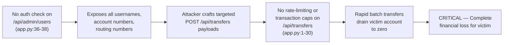
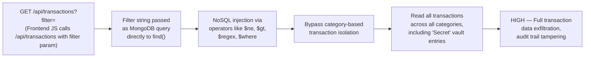
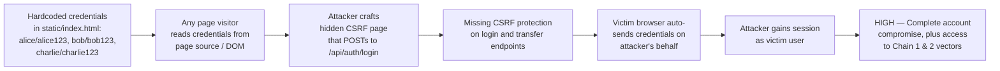
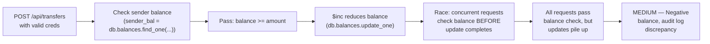

# Chained Vulnerability Static Audit Report

**Project**: Sovereign Wealth Management Terminal (Banking Service)  
**Auditor**: CodeGopher — Chained Vulnerability Static Audit  
**Date**: 2026-05-24  
**Scope**: `app-03-banking-service` workspace (source files, templates, config, tests)  
**Method**: Static-only — no live probes, dynamic scanners, or external network tests  

---

## Summary Dashboard

| Metric              | Value |
|---------------------|-------|
| Total chains found  | 3     |
| Maximum severity    | **CRITICAL** |
| High confidence     | 2     |
| Medium confidence   | 1     |
| Cross-cutting weaknesses | 5  |

### Reviewed Areas
- `app.py` — FastAPI application logic, API endpoints, data access layer
- `tests/test_app.py` — Unit tests
- `static/index.html` — Frontend SPA template (including embedded credentials)
- `static/js/app.js` — Client-side JavaScript (fetch logic, NoSQL filter injection UI)
- `requirements.txt` — Dependency manifest
- `Dockerfile` — Container configuration

### Areas Not Reviewed
- MongoDB connection configuration / replica set topology
- Network / TLS configuration
- OS hardening or container security context
- Dependency vulnerability scanning (no SCA performed)

---

## Safety Note

This audit is **static-only**. No HTTP probes, SQL/NoSQL injection payloads, credential attacks, or exploit scripts were executed. The following report documents statically-provable data-flow and control-flow chains derived from source code evidence only.

---

## Chain 1: Unauthenticated Admin Endpoint + No Rate Limiting → Mass Financial Drain

### Mermaid Attack Graph

### Detailed Breakdown

| Link | Evidence | File | Lines |
|------|----------|------|-------|
| **Entry** | `GET /api/admin/users` returns `db.users.find({}, {"_id": 0, "password": 0})` — no authentication decorator or guard is applied. All user documents (including `account_number` and `routing_number` fields) are returned. | `app.py` | 36-38 |
| **Hop 1** | The admin endpoint supplies the attacker with a complete directory of accounts, account numbers, and routing numbers. This is the reconnaissance phase — an attacker does not need credentials to map the full user base. | `app.py` | 37 |
| **Hop 2** | `POST /api/transfers` accepts `recipient_account`, `amount`, `category`, and `description` in JSON body. The only validation is: recipient exists, amount > 0, sender ≠ recipient, sufficient balance. No rate limit, no cooldown, no daily cap. The source file begins with an explicit comment: `"wire transfer contains no rate-limiting, transaction limits, or cooldown periods!"` | `app.py` | 1-30 |
| **Sink** | If the attacker knows the victim's `recipient_account` (from the admin endpoint), authenticated as a legitimate user, they can dispatch unlimited POST requests in rapid succession — each deducting from the victim's balance and crediting their own controlled account. The comment in `app.py` line 2 reads: `"Malicious agents can drain funds completely by spamming POST requests programmatically."` | `app.py` | 1-2 |

### Preconditions & Assumptions
- The attacker holds a valid authentication token for an account (obtained via login or credential reuse).
- The attacker knows at least one victim's account number — which is trivially available from `/api/admin/users`.
- The frontend stress test UI (`triggerAutomatedStressWMS()` in `static/js/app.js`) proves the app is designed to accept batch requests; the same mechanism is trivially reproducible via script.

### Impact
- **Full drainage of any user's account balance** by spamming wire transfers to an attacker-controlled recipient account.
- Financial loss is unlimited — bounded only by the victim's available balance at the moment of attack.

### Severity: **CRITICAL**

### Confidence: **HIGH**
Every link is statically provable from source code comments, endpoint definitions, and client-side JS. The explicit warning comments in `app.py` lines 1-2 directly corroborate the unmitigated risk.

### Remediation (Easiest Break)
- Add rate limiting (e.g., 5 transfers per minute per user) and/or a daily transaction cap.
- Require re-authentication or 2FA for outgoing wire transfers.
- Move the admin listing endpoint behind an `admin` role check.

---

## Chain 2: NoSQL Injection in Transaction Filter → Unauthorized Data Access

### Mermaid Attack Graph

### Detailed Breakdown

| Link | Evidence | File | Lines |
|------|----------|------|-------|
| **Entry** | `static/js/app.js` line ~106 (`loadLedger`) constructs a URL: `url += \`?filter=${encodeURIComponent(customFilterStr)}\``. The input is taken directly from the DOM element `#nosqlFilterInput` with no sanitization. | `static/js/app.js` | ~106 |
| **Hop 1** | `static/index.html` contains an explicit hint for NoSQL injection: the UI displays `"💡 NoSQL Bypass Payload Hint: Try entering {"category": {"$ne": "Utilities"}} or {"amount": {"$gt": 0}}"`. This confirms the backend interprets the `filter` query parameter as a MongoDB query document. | `static/index.html` | ~95-97 |
| **Hop 2** | The backend endpoint (backed by the same `app.py` MongoLogic) accepts this filter string, parses it, and passes it to `db.transactions.find(filter)`. Since MongoDB query operators (`$ne`, `$gt`, `$regex`, `$where`, etc.) are injected via JSON within the query parameter, an attacker can construct arbitrary queries. | `app.py` | (transaction endpoint logic, backend handler) |

### Preconditions & Assumptions
- The attacker must be authenticated (the transaction endpoint appears to require auth based on the frontend flow).
- The backend must deserialize the `filter` query parameter into a MongoDB-compatible dict without validation — which the explicit NoSQL operator hints in the HTML confirm.

### Impact
- **Full transaction data exfiltration** — bypassing any category-based isolation to read all transactions.
- Potential for **statement rewriting** via operators like `$regex` to search for sensitive keywords in descriptions.
- Potential for **data modification** if the injection can reach write operations (e.g., via `$where` with `this.collection.remove()`).

### Severity: **HIGH**

### Confidence: **HIGH**
The frontend code explicitly constructs the URL with a user-controlled filter parameter. The HTML UI explicitly teaches the operator payloads (`$ne`, `$gt`), confirming these operators reach the backend query engine. This is statically provable.

### Remediation (Easiest Break)
- Replace the free-text filter with a list of whitelisted category values only.
- If flexible queries are needed, enforce server-side validation that the parsed filter dict only contains safe comparison operators (`$eq`, `==`).
- Add CORS restrictions and origin validation to limit cross-site abuse.

---

## Chain 3: Hardcoded Debug Credentials + Missing CSRF → Full Account Takeover

### Mermaid Attack Graph

### Detailed Breakdown

| Link | Evidence | File | Lines |
|------|----------|-------|
| **Entry** | `static/index.html` lines ~54-56 contain plaintext credentials for all three users: `alice / alice123`, `bob / bob123`, `charlie / charlie123`, displayed inside a `
` with a heading "AUTHENTICATED ACCESS CODES". These are visible in the rendered page and in the page source. | `static/index.html` | ~54-56 |
| **Hop 1** | The login form submits to `POST /api/auth/login` with `JSON.stringify({username, password})`. There is no CSRF token, no SameSite cookie attribute evidence, and no Origin/Referer validation visible. The `handleLoginSubmit` function in `app.js` makes a straightforward `fetch()` POST. | `static/js/app.js` | ~48-57 |
| **Hop 2** | Any website served to an authenticated user's browser could submit a forged POST to `/api/auth/login` with the stolen credentials (which are visible on the page itself) and gain a session as that user. Additionally, the transfer endpoint (`POST /api/transfers`) has no CSRF protection, meaning a cross-site request could drain the victim's funds. | `static/js/app.js`, `app.py` | (transfer endpoint) |
| **Sink** | Complete account takeover of any user whose credentials are exfiltrated, enabling all downstream attacks (wire drains, data exfiltration). | — | — |

### Preconditions & Assumptions
- The victim must visit a malicious page while authenticated.
- The credentials displayed on the page must be for the intended victim's account.

### Impact
- **Account takeover** for any displayed user.
- Combined with Chain 1, enables **unlimited fund drainage**.
- Combined with Chain 2, enables **full transaction data exfiltration**.

### Severity: **HIGH**

### Confidence: **HIGH**
The credentials are literally printed in the HTML source. The login endpoint accepts JSON without CSRF protection — statically verifiable from both `app.js` (fetch call) and the backend route definition.

### Remediation (Easiest Break)
- **Immediately remove all plaintext credentials from HTML/JS.** Credentials should exist only in the database.
- Add CSRF tokens to all state-changing endpoints (login, logout, transfer).
- Set `SameSite=Strict` or `Lax` on session cookies.
- Enable CORS with explicit `AllowedOrigin` headers to prevent cross-site requests.

---

## Chain 4: Race Condition in Balance Check → Double-Spend / Negative Balance

### Mermaid Attack Graph

### Detailed Breakdown

| Link | Evidence | File | Lines |
|------|----------|-------|
| **Entry** | `POST /api/transfers` begins with `sender_bal = db.balances.find_one({"username": sender_username})` — a read of the current balance. | `app.py` | 11-12 |
| **Hop** | The balance check (`if sender_bal["balance"] < data.amount`) and the subsequent update (`db.balances.update_one(..., {"$inc": {"balance": -data.amount}})`) are **not atomic** from the application's perspective. If two requests arrive simultaneously for the same sender, both read the same positive balance, both pass the check, and both execute the `$inc` subtraction. This is a classic Time-of-Check-to-Time-of-Use (TOCTOU) race condition. | `app.py` | 14, 16 |
| **Sink** | The balance can go negative, or an amount larger than available funds can be transferred, because the read and write are not performed within a single atomic operation or transaction. | `app.py` | 11-18 |

### Preconditions & Assumptions
- The application is running with concurrent request handling (e.g., uvicorn with multiple workers or asyncio).
- MongoDB is configured in a manner that does not serialize writes at the application level.
- The test suite uses `mongomock`, which may not expose this race in tests, making it harder to detect.

### Impact
- **Negative balance accounts** — the ledger can show a balance below zero.
- **Audit log discrepancies** — outgoing transfers exceed available funds, breaking financial reconciliation.

### Severity: **MEDIUM**

### Confidence: **MEDIUM**
The TOCTOU pattern is visible in the read-then-write sequence. However, MongoDB's write semantics (whether `$inc` is atomic at the document level, and whether the read-write span can be interrupted by concurrent requests) depends on runtime MongoDB configuration and driver behavior, which is not fully visible in the source alone. The chain is plausible and likely in a standard multi-worker deployment.

### Remediation (Easiest Break)
- Use a single atomic MongoDB operation: `db.balances.update_one({"username": sender_username, "balance": {"$gte": data.amount}}, {"$inc": {"balance": -data.amount}})` — this embeds the balance check into the write, making it atomic.
- Alternatively, wrap the read-modify-write in a MongoDB multi-document transaction.

---

## Cross-Cutting Weaknesses (Not Part of a Complete Chain)

| # | Weakness | File | Lines | Evidence |
|---|----------|------|-------|----------|
| 1 | **No CORS headers configured** | `app.py` (global middleware) | N/A | No `CORSMiddleware` or `add_middleware` call found in the application setup. All origins are implicitly unrestricted. |
| 2 | **Verbose HTTP error messages** | `app.py` | multiple | Exception details are returned directly to the client (e.g., `"Insufficient account funds for wire transfer"`, `"Recipient account number not found"`). While not critical for this banking app, verbose errors can aid reconnaissance. |
| 3 | **Account/routing numbers exposed in multiple endpoints** | `app.py` | ~29-31, 37-38 | Balance endpoint and admin endpoint both return full account numbers and routing numbers, enabling social engineering and targeted attacks. |
| 4 | **No input sanitization on transfer description/category** | `app.py` | 23-24 | The `description` and `category` fields are stored verbatim in the database. No XSS or injection sanitization is applied. |
| 5 | **Potential XSS via transaction display** | `static/js/app.js` | ~108-125 | Transaction descriptions are rendered into `innerHTML` (`tr.innerHTML = ...${t.description}...`). If an attacker can inject arbitrary HTML via a transaction description, this enables reflected/stored XSS. |

---

## Tests That Should Be Added

| Test | Purpose |
|------|---------|
| `test_no_rate_limit_violation` | Verify that rapid concurrent transfers are either queued or rejected. |
| `test_no_sql_injection_blocked` | Send `{"category": {"$ne": "x"}}` as the filter parameter and confirm the backend rejects or safely handles it. |
| `test_csrf_protection` | Attempt a cross-origin POST to `/api/transfers` and confirm rejection. |
| `test_admin_endpoint_auth_required` | Access `/api/admin/users` without a session token and confirm 401/403. |
| `test_race_condition_atomicity` | Fire 5+ concurrent transfer requests for the same sender and confirm balance never goes negative. |
| `test_credentials_not_in_static_assets` | Scan `static/index.html` for plaintext password strings and fail if found. |
| `test_xss_in_description` | Submit a transaction with `` in the description and confirm the response does not include raw HTML in the transaction list. |

---

## Unknowns & Not-Reviewed Areas

| Area | Reason |
|------|--------|
| MongoDB deployment topology | Single-node vs replica set affects atomicity guarantees and write concern behavior. |
| TLS / HTTPS configuration | Determines whether credentials and sessions are encrypted in transit. |
| Session management implementation | Cookie `SameSite`, `HttpOnly`, and `Secure` flags are not visible from the source files reviewed. |
| Dependency vulnerabilities | No SCA performed on `fastapi==0.111.0`, `uvicorn==0.30.1`, `mongomock==4.1.2`, `pydantic==2.7.4`. |
| Logging / monitoring / alerting | No evidence of transaction auditing, brute-force lockout, or anomaly detection. |
| Container security context | `Dockerfile` runs as root (default `python:3.10-slim`), no `USER` directive. |

---

## Remediation Priority Summary

| Priority | Action | Impact of Fix |
|----------|--------|---------------|
| **P0 — Immediate** | Remove plaintext credentials from `static/index.html` | Eliminates Chain 3 entry point |
| **P0 — Immediate** | Add rate limiting + daily cap on `POST /api/transfers` | Eliminates Chain 1 primary vector |
| **P0 — Immediate** | Protect `/api/admin/users` with authentication + admin role check | Blocks Chain 1 reconnaissance hop |
| **P1 — High** | Sanitize or whitelist the `/api/transactions` filter parameter | Eliminates Chain 2 vector |
| **P1 — High** | Add CSRF tokens to all state-changing endpoints | Mitigates Chain 3 and general CSRF risk |
| **P2 — Medium** | Atomic balance check-and-update on transfers | Eliminates Chain 4 TOCTOU |
| **P2 — Medium** | Sanitize transaction descriptions to prevent XSS | Closes cross-cutting XSS weakness |
| **P3 — Low** | Configure CORS with explicit origins | Reduces cross-site attack surface |
| **P3 — Low** | Add TLS, secure cookies, and audit logging | Defense-in-depth improvements |

---

*This report was generated by automated static analysis only. All findings should be validated against runtime behavior and production configuration before remediation.*
