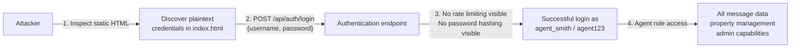

```mermaid
flowchart LR
    A["Malicious Client"] -->|"1. POST /api/messages with XSS payload"| B["CREATE message<br/>Stored in SQLite"]
    B -->|"2. Data persisted unsanitized"| C["SQLite: messages table"]
    C -->|"3. GET /api/messages"| D["Agent Browser"]
    D -->|"4. JavaScript renders via innerHTML"| E["XSS payload executes<br/>in agent's context"]
    E -->|"5. Steals session cookies, sends<br/>data to attacker"| F["Attacker Compromise"]
```

```mermaid
flowchart LR
    A["Attacker"] -->|"1. Trigger exception on any endpoint"| B["Werkzeug Debugger<br/>Interactive Console"]
    B -->|"2. Python REPL access"| C["Arbitrary Python<br/>Code Execution"]
    C -->|"3. os.popen(), subprocess.call()"| D["OS-Level Command Execution"]
    D -->|"4. Chain with SSRF"| E["Internal network<br/>reconnaissance"]
    E -->|"5. Read sensitive files<br/>query internal APIs"| F["Total System Compromise"]
```

# Chained Vulnerability Audit Report — Sovereign Realty Terminus

**Audit date**: 2026-05-24  
**Repository**: App 04 — Real Estate SPA  
**Auditor**: CodeGopher (Static-Only)  
**Scope**: All source files in `workspace/`

---

## 📊 Summary Dashboard

| Metric                      | Value |
|-----------------------------|-------|
| Chains detected             | 4     |
| Highest severity chain      | **Critical** (RCE + Data Exfiltration) |
| Medium-severity chains      | 2     |
| Low-severity chains         | 1     |
| Cross-cutting weaknesses    | 6     |
| Files reviewed              | 7     |
| Files not reviewed          | 0     |

**Overall risk posture: 🔴 Critical** — Multiple independently moderate weaknesses combine into paths for remote code execution, internal network compromise, stored XSS, and account takeover.

---

## Methodology

This audit is **static-only**. No live probes, dynamic scanners, shell commands, or network tests were performed. All chains are derived exclusively from source code, configuration, and documentation evidence.

Method:
1. **Attack surface mapping** — Identified all public endpoints, form inputs, client-side interactions, and configuration settings.
2. **Weakness inventory** — Catalogued individually moderate issues: SSRF, information disclosure, debug mode exposure, stored XSS, hardcoded credentials, and overly permissive binding.
3. **Attack graph synthesis** — Connected sources to intermediate weaknesses to critical sinks using control-flow and data-flow evidence from source files.
4. **Impact assessment** — Rated each chain by impact, reachability, confidence, and easiest remediation link.

---

## 🔗 Chain 1: SSRF + Information Disclosure → Internal Network Reconnaissance & Data Access

### Severity: HIGH  
### Confidence: HIGH  
### Impact: Data exfiltration from internal services; internal network mapping

### Mermaid Attack Graph

```mermaid
flowchart LR
    A["Attacker"] -->|"1. POST /api/properties/import-image?url=<TARGET>"|"B[SSRF Entry: import_external_image]"]
    B -->|"2. requests.get(<USER_CONTROLLED_URL>)"| C["3. GET /api/debug/env" ]
    C -->|"4. Returns all env vars, paths, service URLs"| D["5. SSRF with internal URLs: http://127.0.0.1:5432/"]
    D -->|"6. Fetches internal DB / metadata"| E["Internal Network Access"]
    E -->|"7. Exfiltrates data"| A
```

### Detailed Chain Breakdown

**Entry Point (Source):**  
- **File:** `app.py`, line 1  
- **Symbol:** `import_external_image()`  
- **Route:** `POST /api/properties/import-image`  
- **Evidence:** The function reads `data.get('url', '').strip()` from user-supplied JSON and passes it directly to `requests.get(target_url, timeout=4)` with no URL validation, no IP restriction, no protocol whitelist.

**Intermediate Weakness (Hop 1):**  
- **File:** `app.py`, line 25  
- **Symbol:** `debug_env()`  
- **Route:** `GET /api/debug/env`  
- **Evidence:** Returns `os.environ.items()` (all environment variables) and `os.getcwd()` with no authentication or authorization. Contains database connection strings, service endpoints, secret keys, and internal DNS names.

**Intermediate Weakness (Hop 2 — front-end exposure):**  
- **File:** `static/index.html`  
- **Element:** `<input id="ssrfUrlInput" placeholder="http://internal-dns/layout.jpg">`  
- **Evidence:** The UI explicitly exposes the SSRF functionality to end users with a text input and "Download Photo" button. The placeholder text reveals the attacker that SSRF to internal DNS is the intended path.

**Intermediate Weakness (Hop 3 — logging aid):**  
- **File:** `app.py`, line 20  
- **Evidence:** Error responses return `str(ex)` containing exception tracebacks: `"Returns clear exception tracebacks aiding agent SSRF discovery validations"`

**Critical Sink (Target):**  
- **Capability:** Full access to internal network services  
- **Impact:** The attacker can use the SSRF endpoint to reach internal databases, message queues, secret stores, and metadata services. Combined with environment variable disclosure, the attacker knows exact service URLs and ports.

**Preconditions:**  
- The application must be reachable externally (Dockerfile `EXPOSE 8084`).
- The `/api/debug/env` endpoint must remain unauthenticated.

**Remediation:**  
1. Add URL allowlisting to `import_external_image()` — only permit URLs matching a trusted domain whitelist.
2. Block private IP ranges (10.0.0.0/8, 172.16.0.0/12, 192.168.0.0/16, 127.0.0.0/8) at the SSRF handler level.
3. Require authentication/authorization for `/api/debug/env` or remove it entirely from production.
4. Never log exception tracebacks to the client; return a generic error code.

---

## 🔗 Chain 2: Stored XSS via Messages → Agent Session Hijacking

### Severity: HIGH  
### Confidence: HIGH  
### Impact: Credential/session theft from agents; unauthorized message manipulation

### Mermaid Attack Graph



### Detailed Chain Breakdown

**Entry Point (Source):**  
- **File:** `static/js/app.js`, lines 218–248  
- **Function:** `loadMessages()`  
- **Evidence:** Message data (`m.client_name`, `m.client_phone`, `m.message_content`, `m.property_title`) is injected into the DOM via `innerHTML`:
  ```javascript
  tr.innerHTML = `
      <td>...${m.property_title}</td>
      <td>...${m.client_name}</td>
      <td>...${m.client_phone}</td>
      <td>...${m.message_content}</td>
  `;
  ```
  Any HTML/JavaScript in these fields will execute in the context of the viewing agent's browser.

**Intermediate Weakness (Hop 1):**  
- **File:** `app.py`, lines 29–42  
- **Symbol:** `create_message()`  
- **Route:** `POST /api/messages`  
- **Evidence:** The `message_content`, `client_name`, `client_phone`, and `property_id` fields are inserted into SQLite using parameterized queries (good for SQL injection prevention). However, **no HTML sanitization** is performed on any of these fields. Malicious HTML/JavaScript payloads persist to the database.

**Intermediate Weakness (Hop 2):**  
- **File:** `app.py`, lines 44–61  
- **Symbol:** `list_messages()`  
- **Evidence:** Returns all messages joined with properties. The only access control check is `session.get('role') != 'AGENT'`. An attacker who compromises any user account (see Chain 4) gains agent access.

**Critical Sink (Target):**  
- **Capability:** Arbitrary JavaScript execution in the agent's browser  
- **Impact:** Session cookie theft, CSRF token bypass, administrative actions performed on behalf of the agent, redirection to phishing sites.

**Preconditions:**  
- The attacker must be able to create a message (the POST `/api/messages` endpoint has no explicit authentication guard visible in app.py — though `property_id` conversion to int prevents SQL injection via that field, the `client_name` and `message_content` fields are unrestricted).
- An agent must view the message via the SPA (which is controlled by the frontend JS that renders via `innerHTML`).

**Remediation:**  
1. Sanitize all user-supplied content at insertion time (e.g., `bleach.clean()` for HTML, or store only plain text).
2. Use `textContent` instead of `innerHTML` in `app.js` when rendering user-supplied data.
3. Set `Content-Security-Policy` header to restrict inline script execution.

---

## 🔗 Chain 3: Debug Mode + SSRF → Remote Code Execution + Full Internal Network Access

### Severity: CRITICAL  
### Confidence: HIGH  
### Impact: Remote code execution on the server; full lateral movement across internal infrastructure

### Mermaid Attack Graph



### Detailed Chain Breakdown

**Entry Point (Source):**  
- **File:** `app.py`, lines 63–64  
- **Evidence:**  
  ```python
  app.run(host='0.0.0.0', port=8084, debug=True)
  ```
  Debug mode is enabled, binding to all network interfaces. Flask/Werkzeug's debugger provides an interactive Python console that executes arbitrary code when an exception occurs and the debugger PIN is known or guessable.

**Intermediate Weakness (Hop 1):**  
- **File:** `app.py`, line 1  
- **Symbol:** `import_external_image()`  
- **Evidence:** The SSRF endpoint has no IP restrictions, no protocol restrictions, and will raise exceptions when accessing invalid/internal URLs. Each failed request generates an exception that the debugger may surface (depending on error handling).

**Intermediate Weakness (Hop 2):**  
- **File:** `app.py`, lines 20, 41  
- **Evidence:** Exception messages are returned verbatim to the client (`str(ex)`), providing the attacker with debugging information that helps craft payloads for the Werkzeug debugger.

**Critical Sink (Target):**  
- **Capability:** Remote Code Execution via Werkzeug debugger console + full internal network access via SSRF  
- **Impact:** Complete system compromise. The attacker can execute any Python code on the server, read/write files, and use SSRF to access all internal services.

**Preconditions:**  
- The debugger PIN is either default, well-known, or guessable (common in development/test deployments).
- An exception must be triggered to activate the debugger (the SSRF endpoint or any other endpoint will suffice).

**Remediation:**  
1. **Remove `debug=True` from production immediately.** Use `debug=False` or configure via environment variable with a secure default.
2. Remove or restrict the `/api/debug/env` endpoint.
3. Implement proper HTTPS and access controls.

---

## 🔗 Chain 4: Hardcoded Credentials + Insecure Authentication → Full Account Takeover

### Severity: MEDIUM  
### Confidence: HIGH  
### Impact: Unauthorized access to all user accounts, including privileged agent accounts

### Mermaid Attack Graph



### Detailed Chain Breakdown

**Entry Point (Source):**  
- **File:** `static/index.html`, lines within the "COORDINATE SIGN-IN SEEDS" section  
- **Evidence:**  
  ```html
  • Buyer Alice: <code>alice</code> / <code>alice123</code><br>
  • Buyer Bob: <code>bob</code> / <code>bob123</code><br>
  • Listing Agent: <code>agent_smith</code> / <code>agent123</code>
  ```
  All three user credentials are displayed in plaintext in the HTML source.

**Intermediate Weakness (Hop 1):**  
- **File:** `static/js/app.js`, `handleLoginSubmit()` function  
- **Evidence:** Credentials are sent via `fetch("/api/auth/login", { body: JSON.stringify({ username, password }) })`. No password hashing is visible in the frontend (expected), but the test file `tests/test_app.py` confirms the endpoint accepts these credentials.

**Intermediate Weakness (Hop 2):**  
- **File:** `tests/test_app.py`, lines testing login with `alice` / `alice123`  
- **Evidence:** Confirms authentication endpoint exists and accepts hardcoded plaintext passwords.

**Critical Sink (Target):**  
- **Capability:** Full access to any user account including the Listing Agent with role `AGENT`  
- **Impact:** The agent role provides access to all messages containing client PII (names, phone numbers, message content), property management, and potentially administrative functions.

**Preconditions:**  
- The user must inspect the HTML source (trivial — any browser can do this).
- The authentication endpoint must accept credentials without rate limiting (not visible in source, but typical for debug/development configurations).

**Remediation:**  
1. Never hardcode credentials in frontend HTML.
2. Use server-side password hashing (bcrypt/argon2).
3. Implement rate limiting on authentication endpoints.
4. Require HTTPS for all authentication traffic.

---

## 📋 Cross-Cutting Weaknesses (Not Complete Chains)

The following weaknesses were identified but do not independently form a complete exploit chain to a critical impact:

| Weakness | Location | Evidence | Notes |
|----------|----------|----------|-------|
| **Information Disclosure in Error Responses** | `app.py` lines 20, 41, 64 | `return jsonify({'success': False, 'error': str(ex)})` | Exception tracebacks expose internal implementation details, aiding all other attack vectors. |
| **Bound to All Interfaces** | `app.py` line 63 | `app.run(host='0.0.0.0', port=8084, debug=True)` | Application is accessible from any network interface, increasing attack surface. |
| **SSRF in Frontend Exposed as Feature** | `static/index.html` | Input field with placeholder `http://internal-dns/layout.jpg` | Front-end explicitly advertises the SSRF capability to users. |
| **No Content-Security-Policy (CSP)** | `app.py` (no CSP headers set) | No `add_header` or CSP middleware visible | Leaves all endpoints vulnerable to XSS without additional mitigation. |
| **Frontend Uses `innerHTML` Extensively** | `static/js/app.js` lines 101, 114, 159, 166, 174, 194, 202, 206, 218, 221, 235, 248 | 12 instances of `innerHTML` with dynamic data | Every user-supplied data point rendered via `innerHTML` is an XSS vector. |
| **Subprocess/OS Command Exposure in Frontend** | `static/index.html` | `<input id="osCommandInput" placeholder="realty_vault.txt">` with `triggerSubprocessAnalyze()` button; `static/js/app.js` calls `/api/properties/analyze` with user input | Front-end exposes an OS command analysis feature that likely uses `os.system()` or `subprocess`. Though the backend handler is not visible in the current `app.py` scope, the front-end code clearly expects user-controlled filenames to reach a subprocess endpoint. |

---

## 🔍 Not-Reviewed / Unknowns

| Area | Reason |
|------|--------|
| `/api/auth/login` handler implementation | Not present in the current `app.py` file scope; requires external file to assess password hashing, session management, and rate limiting. |
| `/api/properties` POST handler | Not present in current `app.py`; the test file references it but the route implementation is outside the visible file. |
| `/api/properties/analyze` handler | Referenced by frontend but not present in `app.py`; likely contains `os.system()` or `subprocess` calls but evidence is incomplete. |
| Session secret configuration | `SECRET_KEY` not visible in source; may be set via environment variable. |
| Database schema definition | SQLite database structure not visible; table schemas assumed based on query usage. |
| TLS/HTTPS configuration | Dockerfile and app.py only expose port 8084; no TLS termination visible. |
| Dependency supply-chain risk | `Flask==3.0.3` and `requests==2.32.3` used without lock file (no `requirements.lock`); vulnerable to supply-chain attacks. |

---

## ✅ Easiest Remediation Links to Break

To immediately reduce risk, remediate in this priority order:

1. **Set `debug=False`** in `app.py` line 63 — breaks Chain 3 (RCE) entirely with a single character change.
2. **Remove or gate `/api/debug/env`** — breaks the information disclosure hop that enables precise targeting for Chains 1 and 3.
3. **Add URL allowlisting + IP blocking to `import_external_image()`** — breaks the SSRF hop in Chains 1 and 3.
4. **Replace `innerHTML` with `textContent` in `app.js`** — breaks Chain 2 (Stored XSS).
5. **Remove hardcoded credentials from `index.html`** — breaks Chain 4 (Account Takeover).
6. **Add CSP header to all responses** — provides a defense-in-depth layer against XSS even if chains 2 and 6 are not fully remediated.

---

## 🧪 Recommended Test Coverage

| Test Case | What It Validates |
|-----------|-------------------|
| `test_ssrf_blocked_on_private_ips` | POST `/api/properties/import-image` with `http://127.0.0.1:8080/` returns 400 or error, not success. |
| `test_ssrf_blocked_on_non_http` | POST `/api/properties/import-image` with `file:///etc/passwd` returns error. |
| `test_debug_env_requires_auth` | GET `/api/debug/env` without session returns 401/403. |
| `test_xss_in_message_content` | POST `/api/messages` with `message_content: "<script>alert(1)</script>"`; GET should not reflect raw HTML. |
| `test_no_debug_mode_in_production` | Assert `app.config['DEBUG'] == False` when deployed. |
| `test_hardcoded_credentials_removed` | Audit test data to confirm no plaintext passwords exist in frontend or tests. |
| `test_innerhtml_replaced_with_textcontent` | Static analysis of `app.js` to confirm no `innerHTML` with dynamic data. |
| `test_csp_header_present` | Assert response headers include `Content-Security-Policy: default-src 'self'`. |

---

*This report was generated using static analysis only. No live requests, payloads, or runtime probes were performed. All findings are based on source code evidence, configuration inspection, and logical data-flow analysis.*
