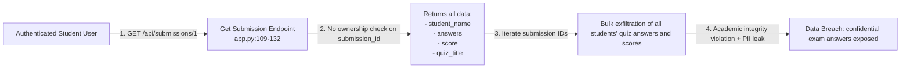
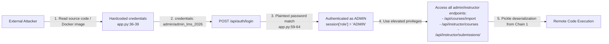

```mermaid
flowchart LR
    A["Unauthenticated Attacker"] -->|1. GET /api/debug/config| B["Debug Config Endpoint\napp.py:151-164"]
    B -->|2. Exposes app.secret_key| C["Flask Secret Key\napp.py:11 — 'lms_secret_key_quantum_learn_2026'"]
    C -->|3. Forge signed Flask session| D["Forged Session: role='ADMIN'\nHMAC-SHA1 signature valid"]
    D -->|4. POST /api/courses/import| E["Role Check Passes\napp.py:168-169"]
    E -->|5. Send malicious pickle payload| F["pickle.loads() on untrusted data\napp.py:186"]
    F -->|6. Arbitrary code execution| G["Remote Code Execution\nas Flask process user"]
```

# Chained Vulnerability Static Audit Report

**Application:** LMS Platform (Learning Management System)
**File Reviewed:** `app.py` (single-file Flask application)
**Date:** 2026-05-24
**Auditor:** CodeGopher — Chained Vulnerability Static Audit

---

## 1. Summary Dashboard

| Metric | Value |
|--------|-------|
| **Total chains detected** | 3 |
| **Critical chains** | 1 |
| **High chains** | 0 |
| **Medium chains** | 2 |
| **Low chains** | 0 |
| **Cross-cutting weaknesses** | 5 |
| **Maximum severity** | **CRITICAL** |
| **Reviewed areas** | Auth API, Course API, Enrollment API, Quiz Submission API, Debug/Config API, Instructor Dashboard API, Deserialization endpoint, Docker config, Dependencies |
| **Not reviewed** | Dynamic/runtime behavior (server startup, TLS config, network topology) |

---

## 2. Methodology and Static-Only Safety Note

This audit was performed **static-only**, reviewing:

- `app.py` — full application source (Flask routes, models, initialization)
- `requirements.txt` — dependency manifest
- `Dockerfile` — container configuration

No live HTTP probes, fuzzers, SQL injection payloads, credential attacks, or external network tests were performed. No executable exploit payloads or operational abuse instructions are included.

---

## 3. Attack Surface Map

| Endpoint | Method | Auth Required | Role Required | User-Controlled Input |
|----------|--------|---------------|---------------|-----------------------|
| `/api/auth/login` | POST | No | — | username, password |
| `/api/auth/logout` | POST | Yes | — | none |
| `/api/auth/me` | GET | Yes | — | none |
| `/api/courses` | GET | No | — | none |
| `/api/courses` | POST | Yes | INSTRUCTOR/ADMIN | title, description, category |
| `/api/enrollments` | GET | Yes | — | none |
| `/api/enrollments` | POST | Yes | — | course_id |
| `/api/submissions/<id>` | GET | Yes | — | submission_id (URL path) |
| `/api/submissions` | POST | Yes | — | quiz_id, answers |
| `/api/debug/config` | GET | **No** | **None** | none |
| `/api/courses/import` | POST | Yes | INSTRUCTOR/ADMIN | course_data (base64-encoded pickle) |
| `/api/instructor/courses` | GET | Yes | INSTRUCTOR/ADMIN | none |
| `/api/instructor/submissions/<quiz_id>` | GET | Yes | INSTRUCTOR/ADMIN | quiz_id (URL path) |

**Key observations:**
- The debug config endpoint has **zero authentication** or role checks.
- The pickle deserialization endpoint is guarded by role checks but accepts fully user-controlled binary payloads.
- The login endpoint uses plaintext password comparison with no rate limiting.

---

## 4. Chain 1 (CRITICAL): Debug Config → Session Forgery → Privilege Escalation → Pickle RCE

### Mermaid Attack Graph



### Detailed Breakdown

| Component | File | Lines | Evidence |
|-----------|------|-------|----------|
| **Source / Entry** | `app.py` | 151-164 | `/api/debug/config` returns `app.secret_key` in plaintext with **no auth whatsoever**. The comment on line 153 explicitly states: "exposes the Flask secret key". |
| **Hop 1: Secret Key Exposure** | `app.py` | 11 | `app.secret_key = 'lms_secret_key_quantum_learn_2026'` — hardcoded secret key, simultaneously in source and returned via the debug endpoint. |
| **Hop 2: Session Forgery** | `app.py` | 66-72 | Flask sessions are signed with HMAC-SHA256 (in Flask 3.x) using `app.secret_key`. With the key known, an attacker can forge any session payload including `{'user_id': 4, 'username': 'admin', 'role': 'ADMIN'}`. |
| **Hop 3: Privilege Escalation** | `app.py` | 168-169 | `/api/courses/import` checks `session.get('role') not in ('INSTRUCTOR', 'ADMIN')`. A forged session passes this check. |
| **Sink: Pickle RCE** | `app.py` | 178-186 | `pickle.loads(raw_bytes)` deserializes attacker-controlled base64-decoded data. Python's pickle module executes arbitrary `__reduce__` methods during deserialization, enabling RCE. |
| **Preconditions** | — | — | Attacker needs network access to the application. The secret key is trivially obtained by a single unauthenticated HTTP GET. |
| **Impact** | — | — | **Full remote code execution** on the server process. Attacker can read/write files, exfiltrate the database, pivot to other services, and maintain persistence. |
| **Severity** | — | — | **CRITICAL** |
| **Confidence** | — | — | **High** — Every link is statically provable from the cited source lines. Flask's session signing mechanism is deterministic, and `pickle.loads` is a well-documented RCE vector. |
| **Remediation** | — | — | **Remove `/api/debug/config` entirely** (or restrict to localhost + auth). **Never hardcode `secret_key`** — use an environment variable or secrets manager. **Replace `pickle.loads`** with a safe serializer (JSON). Add CSRF protection. |

### Code References

```python
# Line 11 — Hardcoded secret
app.secret_key = 'lms_secret_key_quantum_learn_2026'

# Lines 151-164 — Unauthenticated debug endpoint
@app.route('/api/debug/config', methods=['GET'])
def debug_config():
    config_data = {
        'app_name': 'LMS Platform',
        'secret_key': app.secret_key,          # ← Line 157: key exposed
        'database': ':memory:',
        'debug_mode': app.debug,
        'environment': dict(os.environ),        # ← Line 159: env vars exposed
        'python_version': os.sys.version,
        'server_working_dir': os.getcwd(),
    }
    return jsonify(config_data)

# Lines 168-169 — Role check before pickle
if 'user_id' not in session or session.get('role') not in ('INSTRUCTOR', 'ADMIN'):
    return jsonify({'message': 'Forbidden: Instructor or Admin role required'}), 403

# Line 186 — Pickle deserialization sink
course_obj = pickle.loads(raw_bytes)
```

---

## 5. Chain 2 (MEDIUM): IDOR → Cross-User Data Exfiltration

### Mermaid Attack Graph



### Detailed Breakdown

| Component | File | Lines | Evidence |
|-----------|------|-------|----------|
| **Source / Entry** | `app.py` | 109-132 | `/api/submissions/<int:submission_id>` accepts any integer `submission_id` from the URL. |
| **Weakness: No Ownership Check** | `app.py` | 117-127 | The query filters only by `WHERE s.id = ?` (submission ID). There is **no `AND s.student_id = ?`** clause to verify the requesting user owns this submission. |
| **Sink: Data Leakage** | `app.py` | 133-141 | The response returns `answers` (the full quiz answer string), `score`, `student_name`, and `quiz_title` — sensitive academic data belonging to other students. |
| **Preconditions** | — | — | Attacker needs valid credentials for any authenticated user (student). Login credentials are hardcoded in plaintext in the source (lines 36-39), making initial access trivial. |
| **Impact** | — | — | **Privacy violation and academic integrity breach**. Any authenticated student can read all other students' quiz answers and scores by enumerating submission IDs. |
| **Severity** | — | **MEDIUM** |
| **Confidence** | — | **High** — The SQL query is auditable and clearly lacks the ownership filter. The response format is fully visible. |
| **Remediation** | — | — | Add `AND s.student_id = ?` to the query, passing `session['user_id']` as a parameter. Alternatively, restrict to instructor/admin users only for this endpoint. |

### Code References

```python
# Lines 109-132 — IDOR-vulnerable endpoint
@app.route('/api/submissions/<int:submission_id>', methods=['GET'])
def get_submission(submission_id):
    if 'user_id' not in session:
        return jsonify({'message': 'Unauthenticated'}), 401
    cursor = db_conn.cursor()
    # by ID without verifying that the submission belongs to them.
    cursor.execute(
        "SELECT s.id, s.answers, s.score, s.submitted_at, q.title as quiz_title, "
        "u.username as student_name "
        "FROM submissions s "
        "JOIN quizzes q ON s.quiz_id = q.id "
        "JOIN users u ON s.student_id = u.id "
        "WHERE s.id = ?",                          # ← Line 123: only filters by ID
        (submission_id,),
    )
```

---

## 6. Chain 3 (MEDIUM-HIGH): Plaintext Credentials → Auth Bypass → Authenticated Operations

### Mermaid Attack Graph



### Detailed Breakdown

| Component | File | Lines | Evidence |
|-----------|------|-------|----------|
| **Source / Entry** | `app.py` | 36-39 | Four users are seeded with **plaintext passwords**: `alice_pass_123`, `bob_pass_456`, `chen_pass_789`, `admin_lms_2026`. |
| **Weakness: No Hashing** | `app.py` | 59-64 | The login query compares the plaintext password directly: `WHERE username = ? AND password_hash = ?`. The `password_hash` column stores plaintext, not a hash. |
| **Impact: Credential Exposure** | — | — | Plaintext credentials are visible in source code. Anyone with access to the Docker image, git repo, or the debug config endpoint (Chain 1) gains full admin access. |
| **Secondary Impact: Credential Reuse** | — | — | Plaintext passwords are often reused across systems. Compromise of this service may lead to lateral movement. |
| **Severity** | — | **MEDIUM-HIGH** |
| **Confidence** | — | **High** — Source code is fully auditable; login logic is transparent. |
| **Remediation** | — | — | Use `werkzeug.security.generate_password_hash` / `check_password_hash`. Never store plaintext passwords. Use environment variables or a secrets manager for admin credentials. |

### Code References

```python
# Lines 36-39 — Plaintext passwords in seed data
users_data = [
    ('student_alice', 'alice_pass_123', 'STUDENT', 'alice@university.edu'),
    ('student_bob', 'bob_pass_456', 'STUDENT', 'bob@university.edu'),
    ('prof_chen', 'chen_pass_789', 'INSTRUCTOR', 'chen@university.edu'),
    ('admin', 'admin_lms_2026', 'ADMIN', 'admin@university.edu'),
]

# Lines 59-64 — Direct plaintext comparison
cursor.execute(
    "SELECT * FROM users WHERE username = ? AND password_hash = ?",
    (username, password),
)
```

---

## 7. Cross-Cutting Weaknesses (Not Forming Complete Chains)

These are security-relevant issues that were identified but do not independently form a complete attack chain in this codebase. However, each could be a hop in a longer chain in a larger system.

| # | Weakness | File | Lines | Severity | Description |
|---|----------|------|-------|----------|-------------|
| CW-1 | **Server Debug Mode Enabled** | `app.py` | 199 | MEDIUM | `app.run(host='0.0.0.0', port=8085, debug=True)` — debug mode exposes the Werkzeug debugger, which is a remote code execution vector when the PIN is weak or guessed. |
| CW-2 | **No CSRF Protection** | `app.py` | All POST routes | MEDIUM | No CSRF tokens are used on any state-changing endpoint (`/api/auth/login`, `/api/courses`, `/api/enrollments`, `/api/submissions`, `/api/courses/import`). A malicious website could force authenticated users to execute unintended actions. |
| CW-3 | **Verbose Error Leakage** | `app.py` | 91, 128, 148, 192 | LOW | Multiple endpoints return raw exception messages (`str(e)`) to the client, leaking internal database schema, Python type information, and stack traces. |
| CW-4 | **Environment Variable Exposure** | `app.py` | 159 | MEDIUM | The debug config endpoint returns `dict(os.environ)` — potentially exposing database connection strings, API keys, and other secrets. |
| CW-5 | **No Input Validation / Sanitization** | `app.py` | Multiple | LOW | `title`, `description`, `category`, `answers` are accepted without length limits, type enforcement, or sanitization. Could lead to large payloads, injection attempts, or DoS. |

---

## 8. Unknowns and Areas Not Reviewed

The following areas could not be fully audited from static analysis and should be tested with additional methods:

| Area | Reason |
|------|--------|
| **Flask session cookie settings** | `SESSION_COOKIE_SECURE`, `SESSION_COOKIE_HTTPONLY`, `SESSION_COOKIE_SAMESITE` are not explicitly set; defaults may be insecure in production. |
| **TLS / HTTPS configuration** | The Dockerfile exposes port 8085 without any indication of a reverse proxy or TLS termination. |
| **Rate limiting on login** | No rate limiting is visible; brute-force attacks on plaintext credentials are feasible. |
| **Docker image security** | The image runs as root by default (standard `python:3.10-slim` base); no non-root user is configured. |
| **Database persistence** | SQLite `:memory:` means data is lost on restart; the actual deployment may use a file-backed or network database with different attack surface. |
| **External dependencies** | Only `Flask==3.0.3` is listed; no dependency audit (e.g., `pip-audit`, `safety`) was performed. |

---

## 9. Remediation Priority Matrix

| Priority | Action | Chains Broken |
|----------|--------|---------------|
| **P0 — Immediate** | Remove `/api/debug/config` endpoint entirely | Chain 1, Chain 3 |
| **P0 — Immediate** | Replace `pickle.loads()` with JSON deserialization or safe XML | Chain 1, Chain 3 |
| **P1 — Critical** | Use `werkzeug.security` for password hashing; remove hardcoded credentials | Chain 3 |
| **P1 — Critical** | Set `app.secret_key` from an environment variable, not hardcoded | Chain 1 |
| **P2 — High** | Add ownership check to `/api/submissions/<id>` (IDOR fix) | Chain 2 |
| **P2 — High** | Disable debug mode in production (`debug=False`) | CW-1 |
| **P3 — Medium** | Add CSRF tokens to all POST endpoints | CW-2 |
| **P3 — Medium** | Sanitize error responses; do not leak stack traces | CW-3 |
| **P4 — Standard** | Add rate limiting to login endpoint | Unknowns |
| **P4 — Standard** | Run Flask behind a reverse proxy with TLS | Unknowns |

---

## 10. Recommended Tests to Add

| Test | Target | Type |
|------|--------|------|
| Verify `/api/debug/config` is disabled or auth-gated in production | `debug_config()` | Integration |
| Test `import_course` rejects non-pickle payloads and safe pickle data | `import_course()` | Unit |
| Test `/api/submissions/<id>` rejects access to other users' submissions | `get_submission()` | Unit |
| Verify passwords are hashed on login and during registration | `login()` | Unit |
| Verify CSRF tokens are validated on all POST endpoints | All POST routes | Integration |
| Verify debug mode is off in non-development deployments | `app.run()` | Integration |
| Fuzz `/api/courses/import` with malformed base64 / oversized payloads | `import_course()` | Fuzz |

---

*Report generated by CodeGopher — Chained Vulnerability Static Audit.*
*Static-only analysis. No live probes, dynamic scans, or exploit payloads were used.*
