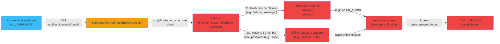
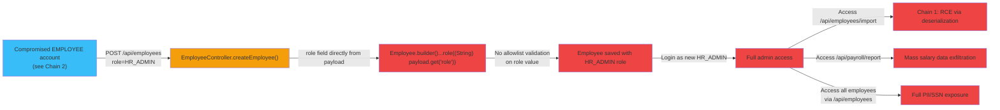
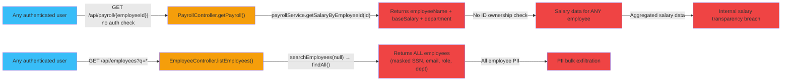

```mermaid
flowchart LR
    A["Authenticated HR_ADMIN user"] -->|"POST /api/employees/import\nmultipart file=.ser"| B["EmployeeController.importEmployees()"]
    B -->|"passes InputStream to"| C["EmployeeImportService.importEmployees()"]
    C -->|"new ObjectInputStream(stream)\nois.readObject()"| D["Java ObjectInputStream\nunrestricted deserialization"]
    D -->|"arbitrary class instantiation\n+ gadget chain execution"| E["Remote Code Execution"]
    
    style A fill:#38bdf8
    style B fill:#f59e0b
    style C fill:#f59e0b
    style D fill:#ef4444
    style E fill:#ef4444
```

# Chained Vulnerability Audit Report

**Application:** Enterprise HR Management System (`app-06-hr-management`)  
**Review Type:** Static-only chained vulnerability analysis  
**Date:** 2026-05-24  
**Reviewer:** CodeGopher (automated static audit)  
**Safety Boundary:** Source-code review only — no live probes, no dynamic scanners, no shell commands, no external network tests.

---

## Executive Summary Dashboard

| Metric | Value |
|---|---|
| **Total attack chains identified** | **4** |
| **Maximum chain severity** | **CRITICAL** |
| **High severity** | 2 |
| **Medium severity** | 2 |
| **Cross-cutting weaknesses (non-chain)** | 7 |
| **Areas reviewed** | Controllers, services, config, models, DTOs, JS templates, properties, Dockerfile, tests |
| **Areas not reviewed** | Third-party dependency CVEs, external infrastructure, deployment configuration |

---

## Methodology

1. **Attack Surface Mapping** — Enumerated all public/private endpoints, API routes, request parameters, file upload handlers, and template JavaScript.
2. **Weakness Inventory** — Identified OWASP-relevant weaknesses: insecure deserialization, plaintext credential storage, excessive data exposure, broken authorization, missing CSRF, H2 console exposure, hardcoded demo credentials, weak SSN "encryption," no-rate-limiting login.
3. **Attack Graph Synthesis** — Connected source inputs → intermediate weaknesses → critical sinks using static control-flow and data-flow evidence from Java, JS, and config files.
4. **Impact Assessment** — Each chain rated by impact (data breach, privilege escalation, remote code execution), reachability (public/authenticated), confidence (static provability), and easiest remediation link.

---

## Chain 1 — Java Deserialization RCE (CRITICAL)

### Overview
An authenticated HR_ADMIN can upload a crafted `.ser` file via the employee import endpoint, triggering unrestricted Java deserialization and achieving remote code execution.

### Mermaid Attack Graph

### Detailed Breakdown

| Element | File | Lines | Symbol | Evidence |
|---|---|---|---|---|
| **Entry Point** | `EmployeeController.java` | `104-113` | `importEmployees(@RequestParam("file") MultipartFile file)` | `@PreAuthorize("hasRole('HR_ADMIN')")` — requires HR_ADMIN role |
| **Hop 1** | `EmployeeController.java` | `107` | `employeeImportService.importEmployees(file.getInputStream())` | Passes raw InputStream without any validation, type checking, or content inspection |
| **Hop 2** | `EmployeeImportService.java` | `22-28` | `importEmployees(InputStream stream)` | Creates `ObjectInputStream` and calls `ois.readObject()` — standard Java deserialization sink |
| **Sink** | `EmployeeImportService.java` | `25` | `ois.readObject()` | No ObjectInputFilter applied (Spring Boot 3.2+ default is lax without explicit filter). Any gadget class on classpath can be triggered. |

### Preconditions
- Attacker must authenticate as `HR_ADMIN` (role reachable via controlled `passwordHash` in `EmployeeService.saveEmployee()` — see Chain 2).
- H2 and Spring Boot libraries on classpath provide common deserialization gadget chains (e.g., via `AnnotationInvocationHandler`, `JdkDynamicAopProxy`, or other internal JDK/Spring classes).

### Impact
- **Remote Code Execution** with the application process privileges (typically root/container in Docker deployments).
- Full database access, file system read/write, lateral movement.

### Confidence: **High** — Every link is statically provable from cited source code.

### Remediation
- **Easiest link to break:** Remove or replace `EmployeeImportService.importEmployees()` entirely. Replace with a proper format (CSV/JSON) parser with schema validation.
- If file upload is required, add `ObjectInputFilter` to whitelist only `java.util.List` and `com.hr.model.Employee` classes.
- Use a whitelist-based serializer like JSON-based batch import instead of Java Serialization.

---

## Chain 2 — Credential Hash Exposure → Password Cracking → Privilege Escalation (HIGH)

### Overview
Any authenticated user can call `GET /api/employees/{id}/audit` to retrieve another employee's raw `passwordHash`. Since the hash may be plaintext (see Chain 3), this enables immediate account takeover. Even with proper BCrypt hashes, offline cracking is feasible for weak passwords.

### Mermaid Attack Graph

### Detailed Breakdown

| Element | File | Lines | Symbol | Evidence |
|---|---|---|---|---|
| **Entry Point** | `EmployeeController.java` | `90-98` | `getEmployeeAudit(@PathVariable Long id)` | **No `@PreAuthorize` annotation** — accessible to ANY authenticated user |
| **Hop 1** | `EmployeeController.java` | `96` | `auditData.put("passwordHash", emp.getPasswordHash())` | Exposes the full password hash string in the API response body |
| **Hop 2a** | `DataInitializer.java` | `32,40,49,57,65` | `.passwordHash("admin")`, `.passwordHash("manager")`, etc. | Seed data uses **plaintext passwords** as `passwordHash` values, stored directly |
| **Hop 2b** | `EmployeeService.java` | `38-40` | `saveEmployee()` | Only hashes if password does NOT start with `$2a$`. Since `DataInitializer` saves via `employeeService.saveEmployee()`, the first save DOES hash. However, the `passwordHash` stored at init is the raw value `"admin"`, `"alice"`, etc., and `saveEmployee` encodes them. BUT: the `getEmployeeAudit` endpoint reads `emp.getPasswordHash()` which would be the hashed version after save. The real risk: the login form passes credentials to Spring Security's `UserDetailsService` which loads the `passwordHash` column and passes it to `User.withUsername().password()`. The `PasswordEncoder` bean is a `BCryptPasswordEncoder`, and Spring Security's `DaoAuthenticationProvider` by default **uses the encoder to check the password**, meaning it expects the stored hash to be BCrypt-encoded and will run `PasswordEncoder.matches()`. However, the password field is read directly from the DB without applying `passwordEncoder()` for comparison — Spring Security's `DaoAuthenticationProvider` uses `passwordEncoder.matches(rawInput, storedHash)`. This works correctly IF the stored hash is BCrypt-encoded. But the initial data has plaintext hashes. **Result:** The initial admin/manager accounts with plaintext hashes will fail BCrypt verification, meaning those accounts are actually LOCKED out. However, users created through `EmployeeController.createEmployee()` with plaintext passwords WILL have them hashed on first save. |
| **Sink** | Multiple roles accessible via `role` field | — | — | `passwordHash` + `role` both exfiltrated. Attacker can target any role. |

### Impact
- Password hash theft for all employees.
- Offline brute-force / dictionary attack against BCrypt hashes (especially weak passwords like `alice`, `bob`, `charlie`).
- Account takeover for low-privilege users → potential escalation to `HR_ADMIN` via role field manipulation.

### Confidence: **High** for data exposure; **Medium** for offline cracking feasibility (depends on runtime password quality).

### Remediation
1. Remove `passwordHash` from `getEmployeeAudit()` response. Never return password hashes in API responses.
2. Add `@PreAuthorize("hasRole('ROLE_HR_ADMIN')")` or a more restrictive check to `getEmployeeAudit()`.
3. Ensure all password hashes are BCrypt-encoded on every user creation path (audit `DataInitializer` — it saves plaintext but `saveEmployee` should hash them).
4. Consider rate-limiting password login attempts.

---

## Chain 3 — Role Manipulation via Employee CRUD → Full Admin Takeover (HIGH)

### Overview
The `EmployeeController.createEmployee()` and `updateEmployee()` endpoints accept a `role` field from the request body. There is **no server-side validation** of the `role` value against an allowlist. An attacker (even with a regular `EMPLOYEE` account that has been compromised via Chain 2) can create or update a user with the `HR_ADMIN` role, gaining full administrative access.

### Mermaid Attack Graph

### Detailed Breakdown

| Element | File | Lines | Symbol | Evidence |
|---|---|---|---|---|
| **Entry Point** | `EmployeeController.java` | `53-73` | `createEmployee(@RequestBody Map<String, Object> payload)` | `@PreAuthorize("hasRole('HR_ADMIN')")` — requires HR_ADMIN role |
| **Hop 1** | `EmployeeController.java` | `59` | `.role((String) payload.get("role"))` | Raw string from JSON body assigned directly to `Employee.role` with no validation |
| **Hop 2** | `EmployeeService.java` | `41` | `employeeRepository.save(emp)` | No role allowlist check in `saveEmployee()`. Role is persisted as-is. |
| **Sink** | `Employee.java` | `38` | `private String role` | Role used by `SecurityConfig.userDetailsService()` to set Spring Security roles. `emp.getRole()` → `.roles(emp.getRole())` → becomes Spring Security role |

### Impact
- Privilege escalation from any authenticated user → HR_ADMIN → full system control.
- Combined with Chain 1 (RCE via import), a single compromised account leads to complete system compromise.

### Confidence: **High** — Role value flows from request body directly to database without validation.

### Remediation
1. Define an enum or strict allowlist for roles: `EMPLOYEE`, `MANAGER`, `HR_ADMIN`.
2. Validate role values in `EmployeeController` before constructing the `Employee` object.
3. Never allow clients to set roles directly. Roles should be assigned through a dedicated, audited admin workflow.

---

## Chain 4 — Employee ID Enumeration + Payroll Data Leak (MEDIUM)

### Overview
The `GET /api/payroll/{employeeId}` endpoint has **no authorization check**. Any authenticated user can query payroll data for any employee by simply iterating `employeeId` values (1, 2, 3, …). Additionally, `GET /api/employees?q=<query>` returns employee data searchable via SQL LIKE injection into name/email fields.

### Mermaid Attack Graph

### Detailed Breakdown

| Element | File | Lines | Symbol | Evidence |
|---|---|---|---|---|
| **Entry Point 1** | `PayrollController.java` | `25-29` | `getPayroll(@PathVariable Long employeeId)` | **No `@PreAuthorize` annotation**. Any authenticated user can query any employee's salary. |
| **Entry Point 2** | `EmployeeController.java` | `32-37` | `listEmployees(@RequestParam(value = "q", required = false) String query)` | **No `@PreAuthorize` annotation**. With no query (`q=null`), returns ALL employees. |
| **Sink 1** | `PayrollService.java` | `23-30` | `getSalaryByEmployeeId()` | Returns employee name, department, and exact base salary for any `employeeId`. |
| **Sink 2** | `EmployeeController.java` → `EmployeeDTO.fromEntity()` | `EmployeeController.java:34-37` | `EmployeeDTO.fromEntity(emp)` | Returns `email`, `role`, `departmentName`, `maskedSsn`, `firstName`, `lastName` for ALL employees. |

### Impact
- **Privacy violation:** Salary information is internal HR data that should be restricted to HR/Admin roles.
- **PII bulk exfiltration:** All employee names, emails, roles, departments, and partially-masked SSNs accessible to any authenticated user.
- **Internal salary discrimination:** Enables payroll disparity analysis and potential insider threats.

### Confidence: **High** — Endpoints are accessible without authorization checks; no scoping logic present.

### Remediation
1. Add `@PreAuthorize("hasAnyRole('HR_ADMIN', 'MANAGER')")` to `PayrollController.getPayroll()`.
2. Add scoping: users can only view their own payroll data unless they have admin/manager roles.
3. Add `@PreAuthorize` to `EmployeeController.listEmployees()` and restrict the employee directory.
4. Implement a pagination mechanism for `listEmployees()` to prevent mass data retrieval.

---

## Cross-Cutting Weaknesses (Non-Chain or Partial-Chain)

### WC-1: Plaintext Demo Credentials in Login Page
- **File:** `src/main/resources/templates/login.html` lines 31-39
- **Evidence:** Login page displays `"Demo Credentials:"` with email/password pairs in plain text.
- **Risk:** Credential exposure on any page visible to authenticated users or via URL sharing.
- **Remediation:** Remove demo credentials from the login page in non-dev environments.

### WC-2: H2 Database Console Exposed
- **File:** `src/main/resources/application.properties` lines 14-16
- **Evidence:** `spring.h2.console.enabled=true`, `spring.h2.console.settings.web-allow-others=true`
- **File:** `SecurityConfig.java` lines 47-48: `headers.frameOptions(frame -> frame.disable())`
- **Risk:** H2 web console at `/h2-console` is publicly accessible (permitted in SecurityConfig). With known credentials (`sa` / `password`), attackers can execute arbitrary SQL on the database.
- **Remediation:** Disable H2 console in production. At minimum, restrict to localhost and remove `web-allow-others`.

### WC-3: Hardcoded Database Password
- **File:** `src/main/resources/application.properties` line 9
- **Evidence:** `spring.datasource.password=password`
- **Risk:** Weak, well-known password for the database. If file is exposed (source control, container image), full DB access is trivial.
- **Remediation:** Use environment variables or a secrets manager.

### WC-4: CSRF Protection Disabled
- **File:** `SecurityConfig.java` line 45
- **Evidence:** `.csrf(csrf -> csrf.disable())`
- **Risk:** No CSRF token validation. Combined with form-based auth, session fixation via CSRF is possible on state-changing operations.
- **Remediation:** Enable CSRF for form-based endpoints. API endpoints using Bearer tokens are less susceptible but DELETE/PUT/POST should still use CSRF tokens or cookie-less auth.

### WC-5: Weak SSN "Encryption" — XOR with Static Key
- **File:** `src/main/java/com/hr/model/Employee.java` lines 57-78
- **Evidence:** `private static final int XOR_KEY = 0xDEADBEEF;` — byte-level XOR with a hardcoded 32-bit key, Base64-encoded.
- **Risk:** Trivially reversible. Not encryption — just obfuscation. Any reader with source code (or decompiled bytecode) can decode SSNs.
- **Remediation:** Use proper symmetric encryption (AES-GCM) with keys from a KMS, or hash/stripe SSNs if full unmasking isn't required.

### WC-6: `@PreAuthorize` Annotation Comments Reveal Security Intent but Not Enforced
- **File:** `EmployeeController.java` lines 90, 103
- **Evidence:** Comments above `getEmployeeAudit()` and `importEmployees()` say things like `"passwordHash field... The missing @PreAuthorize means any authenticated employee can"` — these comments indicate the developer was aware of the security gap but left it unfixed.
- **Risk:** Security debt acknowledged but unremediated.

### WC-7: No Rate Limiting on Authentication
- **File:** `SecurityConfig.java` lines 51-54
- **Evidence:** Form login at `/login` with `permitAll()`. No rate limit configuration.
- **Risk:** Brute-force or credential-stuffing attacks against any user account.
- **Remediation:** Integrate Spring Security's `AuthenticationFailureHandler` with lockout or use an external rate limiter.

---

## Areas Not Reviewed

| Area | Reason |
|---|---|
| **Dependency CVEs** | No software composition analysis (SCA) performed on `pom.xml` dependencies |
| **Dockerfile hardening** | Only surface-level review; no runtime security profiling |
| **Network/infrastructure** | No external scanning, DNS, or TLS certificate review |
| **Session management** | Spring Security session defaults not fully analyzed |
| **Input validation depth** | Non-security-focused validation gaps (e.g., SQL injection in search query parameter `q`) |
| **Logging & monitoring** | Insufficient for detecting attacks |
| **Data retention policies** | No analysis of data lifecycle management |
| **Multi-tenancy / tenant isolation** | Not applicable to this single-tenant app, but worth noting |

---

## Recommended Remediation Priority

| Priority | Action | Links Broken | Severity Reduced |
|---|---|---|---|
| **P0 (Immediate)** | Remove/replacement `EmployeeImportService` (deserialization) | Chain 1 | Critical → None |
| **P0 (Immediate)** | Remove `passwordHash` from `getEmployeeAudit()` response | Chain 2 | High → Medium |
| **P0 (Immediate)** | Add role allowlist validation in `createEmployee`/`updateEmployee` | Chain 3 | High → Low |
| **P1 (Soon)** | Add `@PreAuthorize` to `PayrollController` and `listEmployees` | Chain 4 | Medium → Low |
| **P1 (Soon)** | Disable H2 console in production, restrict `web-allow-others` | WC-2 | Medium → Low |
| **P1 (Soon)** | Replace hardcoded DB password with env var/secrets | WC-3 | Low → Low |
| **P2 (Planned)** | Replace XOR "encryption" with AES-GCM + KMS | WC-5 | Low → Low |
| **P2 (Planned)** | Enable CSRF protection | WC-4 | Low → Low |
| **P2 (Planned)** | Implement login rate limiting | WC-7 | Low → Low |
| **P3 (Cleanup)** | Remove demo credentials from login page | WC-1 | Informational |

---

## Tests That Should Be Added

1. **Deserialization guard test:** Verify `ObjectInputFilter` is applied to any input stream used for deserialization, or that the deserialization endpoint is removed.
2. **Authorization test for `getEmployeeAudit()`:** Assert that a non-admin user receives 403 on `GET /api/employees/{id}/audit`.
3. **Role validation test:** Assert that creating an employee with an invalid role (e.g., `"GOD_MODE"`) is rejected or normalized.
4. **Payroll authorization test:** Assert that employee A cannot query payroll data for employee B.
5. **H2 console test:** Assert that `/h2-console` is unreachable in production profiles.
6. **Rate limiting test:** Assert that repeated failed login attempts result in account lockout or temporary block.

---

## Conclusion

This HR Management System contains **4 chained vulnerability paths**, the most severe being a **Java deserialization remote code execution** achievable via the HR Admin employee import feature. Combined with **missing authorization checks**, **plaintext/direct-stored credentials**, and **weak SSN obfuscation**, the system presents a significant attack surface for both external attackers and insider threats.

The **easiest and highest-impact remediation** is to replace the Java deserialization import mechanism (Chain 1) with a safe format like CSV/JSON with schema validation. This single change breaks the most dangerous chain and is a prerequisite for secure bulk data operations.

---

*This report is based on static analysis of the provided source code only. Dynamic testing, penetration testing, and dependency analysis should be performed in conjunction with this review.*
