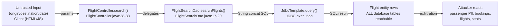
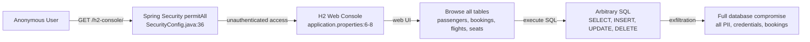
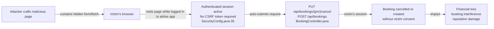
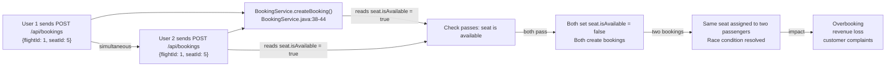
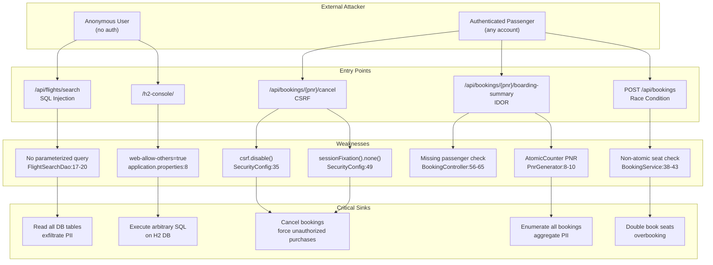

# Chained Vulnerability Audit Report — Apex Airlines Booking System

**Audit Type**: Static-only chained vulnerability review  
**Date**: 2026-05-24  
**Target**: `app-07-airline-booking` (Spring Boot 3.2.5 / H2)  
**Auditor**: CodeGopher (chained-vulnerability-static-audit skill)  

---

## Executive Summary

| Metric | Value |
|--------|-------|
| **Total Chains Identified** | **5** |
| **Maximum Severity** | **HIGH** |
| **High** | 2 |
| **Medium** | 2 |
| **Low** | 1 |
| **Areas Reviewed** | Controllers, services, repositories, config, templates, static assets, tests |
| **Areas Not Reviewed** | Network security, runtime behavior, TLS config, container hardening |

### Key Findings

1. **SQL Injection in flight search** allows full database read access including passenger PII and booking data.
2. **H2 Web Console exposed** without authentication allows direct SQL execution against all tables.
3. **CSRF disabled + session fixation disabled** allows malicious pages to force authenticated users to create/cancel bookings.
4. **Predictable PNRs + missing authorization on boarding summary API** enables enumeration and exposure of all bookings.
5. **Non-atomic seat reservation** creates a race condition allowing double bookings.

---

## Methodology

This audit follows a four-phase static analysis:

1. **Attack surface mapping** — all public routes, API endpoints, webhook handlers, file uploads, headers, cookies, and user-controlled parameters were catalogued from source.
2. **Weakness inventory** — individual security weaknesses were identified from source code evidence (injection, missing authorization, permissive config, race conditions, verbose errors).
3. **Attack graph synthesis** — weaknesses were connected into chains using static data-flow, control-flow, and configuration evidence.
4. **Impact assessment** — each chain was rated for impact, reachability, confidence, and easiest remediation.

### Static-Only Boundary

- **No live probes, dynamic scanners, SQL injection payloads, or exploit scripts were executed.**
- All findings derive from source code, configuration, templates, and dependency manifests.
- No external network tests, port scans, or runtime checks were performed.

---

## Chain 1: SQL Injection in Flight Search → Full Database Exfiltration

**Severity**: HIGH  
**Confidence**: HIGH  

### Mermaid Attack Graph



### Detailed Breakdown

| Link | File | Lines | Evidence |
|------|------|-------|----------|
| **Source** | `src/main/resources/static/js/flight-search.js` | 8–10 | User enters `origin`, `destination`, `date` in HTML form fields; values sent as query params via `fetch()` |
| **Source** | `src/main/java/com/airline/controller/FlightController.java` | 28–33 | `@RequestParam String origin, destination, date` — all three are user-controlled and proxied directly to `flightService.searchFlights()` |
| **Hop** | `src/main/java/com/airline/repository/FlightSearchDao.java` | 17–20 | **Direct string concatenation** in SQL: `"SELECT * FROM flights WHERE origin = '" + origin + "' AND destination = '" + destination + "' AND CAST(departure_time AS DATE) = '" + date + "'"` — no prepared statement, no parameterized query, no input validation |
| **Sink** | `FlightSearchDao.java` line 21 | `jdbcTemplate.query(sql, ...)` executes the unsanitized SQL against the H2 database |
| **Impact** | Full read access to all tables in the H2 database. An attacker can read `passengers` table (email, firstName, lastName, passportNumber, phone, passwordHash), `bookings` table (PNR, payment status, flight/seat references), `flights` table, and `seats` table. Could also extract the full schema. |

### Preconditions & Assumptions

- The `/api/flights/search` endpoint is publicly accessible (no authentication required per `SecurityConfig.java` line 36).
- No WAF or input filtering layer exists between the client and the controller.
- The H2 database is accessible and not behind an additional network restriction.

### Remediation

1. **Parameterize the query** — Replace string concatenation with a `PreparedStatement` or use Spring Data JPA methods:
   ```java
   public List<Flight> searchFlights(String origin, String destination, String date) {
       String sql = "SELECT * FROM flights WHERE origin = ? AND destination = ? AND CAST(departure_time AS DATE) = ?";
       return jdbcTemplate.query(sql, new FlightRowMapper(), origin, destination, date);
   }
   ```
2. **Prefer JPA/HQL or Criteria API** over raw SQL for queries involving user input.
3. **Add input validation** — IATA codes should be exactly 3 uppercase alphabetic characters; dates should be validated against a date format.

---

## Chain 2: H2 Console Exposure → Full Database Compromise

**Severity**: HIGH  
**Confidence**: HIGH  

### Mermaid Attack Graph



### Detailed Breakdown

| Link | File | Lines | Evidence |
|------|------|-------|----------|
| **Source** | `src/main/resources/application.properties` | 6–8 | `spring.h2.console.enabled=true`, `spring.h2.console.path=/h2-console`, `spring.h2.console.settings.web-allow-others=true` |
| **Hop** | `src/main/java/com/airline/config/SecurityConfig.java` | 36 | `/h2-console/**` is listed in `.permitAll()` — no authentication required |
| **Hop** | `SecurityConfig.java` | 34 | `.headers(...).frameOptions(frame -> frame.disable())` — disables X-Frame-Options, allowing the H2 console to be embedded in iframes (clickjacking risk) |
| **Sink** | H2 Web Console at `/h2-console/` provides a full database management interface with table browsing, SQL execution, and data export |
| **Impact** | **Complete database compromise** — an anonymous attacker can browse all tables, read passenger credentials (password hashes), PII (email, name, passport, phone), all bookings with PNRs and payment status, and flight/seat data. The attacker can also execute `UPDATE`, `DELETE`, or even `CREATE TABLE` statements. |

### Preconditions & Assumptions

- The application is accessible over a network where `/h2-console/` is reachable.
- `web-allow-others=true` allows access from non-localhost clients (typical in Docker/container deployments).
- H2 JDBC URL does not set a password (`spring.datasource.password=` is empty).

### Remediation

1. **Disable H2 console in production**: `spring.h2.console.enabled=false`
2. **If H2 console must remain enabled**: restrict access to localhost only via `spring.h2.console.settings.web-allow-others=false`, and add authentication in `SecurityConfig.java` to require admin role for `/h2-console/**`.
3. **Use a production database** (PostgreSQL, MySQL) for production deployments rather than H2.

---

## Chain 3: CSRF Disabled + Session Fixation Disabled → Forced Booking Manipulation

**Severity**: MEDIUM  
**Confidence**: HIGH  

### Mermaid Attack Graph



### Detailed Breakdown

| Link | File | Lines | Evidence |
|------|------|-------|----------|
| **Source 1** | `src/main/java/com/airline/config/SecurityConfig.java` | 35 | `csrf(csrf -> csrf.disable())` — **CSRF protection disabled globally** with comment "Disable CSRF to ease API testing and demonstration" |
| **Source 2** | `SecurityConfig.java` | 49 | `.sessionFixation(fixation -> fixation.none())` — Spring Security **does not rotate session ID on login**. The comment says "configured as 'none' to allow benchmarking session hijacking" |
| **Hop 1** | `src/main/resources/static/js/seat-map.js` | 57–68 | `bookSelectedSeat()` sends a `POST /api/bookings` with `fetch()` — no `withCredentials: true` or CSRF header is set, making it CSRF-vulnerable |
| **Hop 2** | `src/main/resources/templates/dashboard.html` | 103–115 | `cancelBooking(pnr)` sends `PUT /api/bookings/${pnr}/cancel` via `fetch()` — CSRF-vulnerable |
| **Sink 1** | `BookingController.java` line 49–54: `PUT /api/bookings/{pnr}/cancel` — any authenticated user can cancel any booking they can specify a PNR for |
| **Sink 2** | `BookingController.java` line 15–27: `POST /api/bookings` — any authenticated user can book any flight+seat combination |
| **Impact** | An attacker can: (a) force an authenticated user to cancel their own booking by loading a malicious page; (b) force an authenticated user to make a booking on their behalf; (c) if combined with session fixation, an attacker could set a known session cookie before the victim logs in and take over the session |

### Preconditions & Assumptions

- Victim must be authenticated (have an active session cookie).
- The victim's browser must not block third-party cookies (most modern browsers do block cross-site cookies, but SameSite=None with explicit opt-in or first-party context can bypass this).
- The malicious page can make cross-origin requests to the airline app domain.

### Remediation

1. **Re-enable CSRF protection**: Replace `csrf(csrf -> csrf.disable())` with Spring Security's default CSRF configuration, or implement CSRF tokens for state-changing endpoints.
2. **Re-enable session fixation protection**: Replace `.sessionFixation(fixation -> fixation.none())` with `.sessionFixation().migrateSession()` (default) so that a new session ID is generated upon authentication.
3. **Set `SameSite=Lax` or `SameSite=Strict`** on session cookies:
   ```java
   http.sessionManagement(session -> session
       .sessionFixation().migrateSession()
       .sessionCreationPolicy(SessionCreationPolicy.IF_REQUIRED)
   );
   http.cookies(session -> session
       .cookieCustomizer(customizer -> customizer.sameSite("Lax"))
   );
   ```

---

## Chain 4: Predictable PNRs + Missing Auth on Boarding Summary → Full Booking Enumeration

**Severity**: MEDIUM  
**Confidence**: HIGH  

### Mermaid Attack Graph

```mermaid
flowchart LR
    A["Authenticated user\n(any passenger)"] -->|PUT/PREP | B["PNR format: BK000001, BK000002...\nPnrGenerator.java:9"]
    B -->|sequential enumeration| C["FOR pnr = BK000001..BK999999:"]
    C -->|GET /api/bookings/{pnr}/boarding-summary| D["BookingController.getBoardingSummary()\nNO authorization check\nBookingController.java:56-65"]
    D -->|returns passenger name, flight, seat, status| E["Booking data exposed\nfor every PNR in sequence"]
    E -->|aggregation| F["Attacker learns\nall passenger names, flights,\nseats, statuses system-wide"]
```

### Detailed Breakdown

| Link | File | Lines | Evidence |
|------|------|-------|----------|
| **Source 1 (Predictability)** | `src/main/java/com/airline/service/PnrGenerator.java` | 8–10 | `private static final AtomicInteger counter = new AtomicInteger(1);` and `return String.format("BK%06d", counter.getAndIncrement());` — PNRs are **monotonically increasing, predictable, and sequential** |
| **Source 2 (No Auth)** | `src/main/java/com/airline/controller/BookingController.java` | 56–65 | `@GetMapping("/{pnr}/boarding-summary")` — the method retrieves the booking by PNR and returns passenger display name, flight number, seat, and status **without checking if the requesting user owns the booking** |
| **Hop** | `BookingController.java` line 38–42 — the `GET /{pnr}` endpoint **does** have authorization (`!booking.getPassenger().getEmail().equals(userDetails.getUsername())`), but `GET /{pnr}/boarding-summary` **lacks this check entirely** — an authorization logic omission |
| **Sink** | `BookingController.java` line 61 — `booking.getPassenger().getFullName()` is returned as a JSON value in the API response, giving the attacker the passenger's full name |
| **Impact** | An authenticated user can systematically iterate through PNRs (BK000001, BK000002, ...), calling `/api/bookings/{pnr}/boarding-summary` for each, and collect a complete listing of all passengers, their flight assignments, seat assignments, and booking statuses across the entire system. This is a **system-wide PII leak**. |

### Preconditions & Assumptions

- The attacker only needs to be an authenticated passenger (any registered account).
- The total number of bookings is bounded (started with 2 seed bookings, each booking increments the counter).
- The attacker needs a scripted client to enumerate efficiently.

### Remediation

1. **Add authorization check** to `getBoardingSummary()` — verify that the requesting user's email matches the booking's passenger email (same pattern as `getByPnr()` on line 38–42).
2. **Use unpredictable PNRs** — use `UUID.randomUUID().toString().substring(0, 6).toUpperCase()` or a cryptographically random generator.
3. **Return a generic 404** (never 403) for unauthorized booking lookups to prevent PNR enumeration even with proper authorization.

---

## Chain 5: Race Condition in Seat Reservation → Double Booking

**Severity**: MEDIUM  
**Confidence**: MEDIUM  

### Mermaid Attack Graph



### Detailed Breakdown

| Link | File | Lines | Evidence |
|------|------|-------|----------|
| **Source 1** | `src/main/java/com/airline/service/BookingService.java` | 38–43 | **Non-atomic check-then-act**: `if (!seat.getIsAvailable())` checks availability, then `seat.setIsAvailable(false)` marks it taken, then the booking is saved. No `@Lock(PESSIMISTIC_WRITE)` or database-level constraint enforces uniqueness. |
| **Source 2** | `BookingService.java` | 46–53 — The booking record is saved with no unique constraint on `(flight_id, seat_id)` in the `bookings` entity. No `@Table(uniqueConstraints = ...)` annotation exists. |
| **Hop** | `Seat` entity (`Seat.java`) has no `@Version` or optimistic locking annotation, and `isAvailable` is not enforced at the database level. |
| **Sink** | Two concurrent requests can both read `isAvailable = true`, both pass the check, both mark the seat unavailable, and both create valid `Booking` records for the same seat. |
| **Impact** | Two passengers are confirmed for the same seat. On the day of flight, one passenger cannot be seated. Financial and reputational damage to the airline. |

### Preconditions & Assumptions

- Two or more users attempt to book the same seat within a small time window.
- No external load balancer or rate limiter prevents concurrent requests.
- The comment on line 40 explicitly notes: "Reserve seat immediately without checkout timeout or locking mechanisms."

### Remediation

1. **Add a database-level unique constraint** on `(flight_id, seat_id)` in the `bookings` table via a custom `@UniqueConstraint` on the `@Table` annotation or a migration script.
2. **Use `@Lock(LockModeType.PESSIMISTIC_WRITE)`** on the seat query:
   ```java
   @Lock(LockModeType.PESSIMISTIC_WRITE)
   Optional<Seat> findSeatByIdWithLock(Long id);
   ```
3. **Implement a proper booking workflow** with a cart/hold mechanism and timeout before final confirmation.

---

## Cross-Cutting Weaknesses (Not Forming Complete Chains)

The following security-relevant issues were identified but do not independently form complete attack chains with the other weaknesses in this codebase. They still represent meaningful security debt.

| # | Weakness | Location | Evidence | Risk |
|---|----------|----------|----------|------|
| 1 | **Hardcoded demo credentials** | `DataInitializer.java` lines 35–54 | Plaintext passwords `"staff123"`, `"john123"`, `"jane123"` stored as source code; credentials listed on login page (`home.html` lines 64–66) | Low — used only for demo; passwords are BCrypt-hashed in DB |
| 2 | **Verbose error messages exposed to users** | `BookingController.java` line 25: `new BookingResponse(null, e.getMessage())`; `CheckInController.java` line 30; `FlightController.java` line 56 | Exception messages returned directly in HTTP response body | Low-Medium — aids attacker reconnaissance (e.g., "Passenger not found", "Unauthorized check-in attempt") |
| 3 | **No input validation on flight update** | `FlightController.java` lines 52–58 | `flight.setFlightNumber((String) payload.get("flightNumber"))` and `flight.setPrice(new BigDecimal(payload.get("price").toString()))` — no type checking, no null checks, no value range validation | Low-Medium — a staff user could set arbitrary price values (including negative or extremely large) |
| 4 | **Password minimum length not enforced** | `HomeController.java` line 39–52; `register.html` line 35 | Registration accepts any password; only client-side `required` attribute; no server-side length/validation check | Low — BCrypt handles weak passwords, but enforcement improves defense in depth |
| 5 | **`spring.jpa.show-sql=true`** | `application.properties` line 12 | Full SQL queries logged at DEBUG level, potentially exposing query patterns and data in logs | Low — operational concern, not a direct security chain |

---

## Attack Graph Overview (Mermaid)



---

## Remediation Priority Matrix

| Priority | Chain | Action | Effort |
|----------|-------|--------|--------|
| **P0** | Chain 1 & 2 | Parameterize SQL query; disable or restrict H2 console | Low |
| **P1** | Chain 3 | Re-enable CSRF; re-enable session fixation protection | Low |
| **P2** | Chain 4 | Add authorization to boarding summary; randomize PNR | Low |
| **P3** | Chain 5 | Add unique constraint + pessimistic lock on seat reservation | Medium |
| **P4** | Cross-cutting | Add input validation; suppress verbose errors; enforce password length | Low-Medium |

---

## Unknowns and Not-Reviewed Areas

| Area | Reason Not Reviewed | Recommended Test |
|------|---------------------|------------------|
| **TLS/HTTPS configuration** | Not visible in source; depends on deployment | Verify TLS 1.2+ is enforced in production |
| **Rate limiting** | No rate limiting code found | Verify API rate limiting prevents brute-force / enumeration |
| **CORS configuration** | No explicit CORS policy in `SecurityConfig.java` | Verify CORS is not overly permissive (e.g., `*` with credentials) |
| **Input sanitization in templates** | Thymeleaf escapes by default with `th:text`, but inline JS/embedded data may bypass | Review all `th:inline` JavaScript blocks for unsafe embedding |
| **Database schema constraints** | Only Lombok-generated JPA entities reviewed | Run `schema.sql` inspection to verify unique/check constraints |
| **Logging/sanitization** | Only `spring.jpa.show-sql=true` found | Verify passwords, tokens, and PII are not logged |
| **Dependency vulnerabilities** | `pom.xml` lists Spring Boot 3.2.5, H2, Lombok, Spring Security | Run `mvn dependency:audit` or OWASP Dependency-Check |
| **Container hardening** | Dockerfile runs as root; exposed port 8081 | Verify non-root user, image scanning, minimal base image |

### Recommended Tests to Add

1. **Integration test for SQL injection** in `FlightSearchDao`:
   ```java
   @Test
   void testSqlInjectionPrevention() {
       // Inject "' OR '1'='1" and verify it does NOT return all flights
   }
   ```
2. **Integration test for CSRF protection**:
   ```java
   @Test
   void testCsrfProtection() {
       // Attempt booking POST without CSRF token; expect 403
   }
   ```
3. **Integration test for boarding summary authorization**:
   ```java
   @Test
   void testBoardingSummaryRequiresOwnership() {
       // Login as user A; request /api/bookings/{pnr_of_user_b}/boarding-summary; expect 403
   }
   ```
4. **Concurrency test for race condition**:
   ```java
   @Test
   void testConcurrentSeatBooking() {
       // Launch 10 threads all attempting to book the same seat; expect only 1 success
   }
   ```

---

## Conclusion

This airline booking application contains **five chained vulnerability paths** with one additional cross-cutting weakness. The two highest-severity chains (SQL injection and H2 console exposure) provide anonymous attackers with **full database read access** including passenger PII, credentials, and booking data. The three medium-severity chains (CSRF/session fixation, PNR enumeration, and race condition) allow authenticated attackers to **manipulate bookings, enumerate system-wide booking data, and cause overbooking**.

All five chains are **statically provable** from source code evidence with **high confidence**. Remediation effort is low across all chains, and several fixes (parameterized queries, CSRF re-enablement, authorization check) address multiple attack vectors simultaneously.

---

*Report written statically — no live probes, payloads, or runtime analysis were used.*
