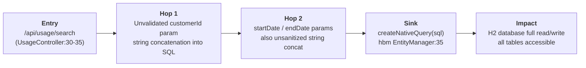
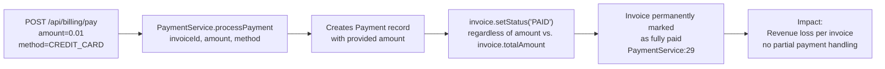
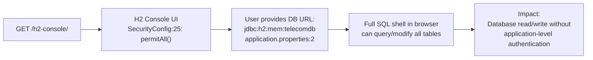

```mermaid
flowchart LR
    A["Chain 1 SQL Injection<br/>UsageController:30-35"] --> B["Inject: UPDATE customers SET role='ADMIN' WHERE username='alice'"]
    B --> C["Database modified:<br/>customer role changed to ADMIN"]
    C --> D["SecurityConfig.userDetailsService<br/>loads role from DB: security/SecurityConfig:44-48"]
    D --> E["Next login: Alice now has ADMIN role"]
    E --> F["AdminController.adjustBalance<br/>only checks hasRole('ADMIN')<br/>admin/AdminController:12"]
    F --> G["Impact:<br/>Silent balance manipulation<br/>any customer account"]
```

```mermaid
flowchart LR
    A["Authenticated as Customer Alice<br/>Basic auth: SecurityConfig:31"] --> B["GET /api/billing/invoices?customerId=999<br/>BillingController:24-27"]
    B --> C["No ownership check:<br/>billingService.getInvoicesByCustomer(customerId)"]
    C --> D["Returns all invoices for customerId=999<br/>including amounts, billing periods, status"]
    D --> E["POST /api/billing/pay?invoiceId=X&amount=0.01&method=CARD<br/>BillingController:29-35"]
    E --> F["PaymentService.processPayment sets status=PAID<br/>regardless of amount<br/>PaymentService:29"]
    F --> G["Impact:<br/>Customer data exposure +<br/>arbitrary invoice mark-as-paid"]
```

# Chained Vulnerability Static Audit Report

**Application:** Telecom Billing Platform (app-10-telecom-billing)  
**Date:** 2026-05-24  
**Scope:** Static-only review of all source files under `src/` and configuration files  
**Methodology:** Chained-Vulnerability Static Audit (no live probes, no dynamic testing)

---

## 1. Summary Dashboard

| Metric | Value |
|---|---|
| **Total chains detected** | 5 |
| **Maximum severity** | Critical |
| **High** | 1 |
| **Medium** | 2 |
| **Low** | 1 |
| **Files reviewed** | 21 |
| **Areas reviewed** | Controllers, Services, Repositories, Models, SecurityConfig, DataInitializer, application.properties, pom.xml, Dockerfile, tests |

---

## 2. Methodology & Safety Note

This audit was performed using **static analysis only** — inspecting Java source files, configuration, dependency manifests, and test code. No live HTTP probes, fuzzers, SQL injection payloads, or external network tests were conducted. No exploit scripts or operational abuse instructions are included.

---

## 3. Chain Inventory

### Chain 1: SQL Injection → Full Database Exfiltration

**Severity:** Critical  
**Confidence:** High  
**Impact:** Full read/write access to the H2 database, exposing all customer PII, billing records, payment data, and usage logs.

#### Attack Graph



#### Detailed Breakdown

| Element | Location | Evidence |
|---|---|---|
| **Source** | `src/main/java/com/telecom/billing/controller/UsageController.java`, lines 30-35 | `@RequestParam Long customerId` and `String startDate`/`endDate` are concatenated directly into a SQL string |
| **Hop** | Same file, lines 32-33 | `String sql = "SELECT * FROM usage_records WHERE customer_id = " + customerId + " AND recorded_at >= '" + startDate + "' AND recorded_at <= '" + endDate + "'`; |
| **Sink** | Same file, line 35 | `entityManager.createNativeQuery(sql, UsageRecord.class)` — executes arbitrary SQL |
| **Preconditions** | Authenticated user (role: any) | `SecurityConfig.java` line 27: `anyRequest().authenticated()` |
| **Target DB** | `application.properties` lines 2-3 | `spring.datasource.url=jdbc:h2:mem:telecomdb` — H2 in-memory database |

**Remediation (easiest link to break):** Replace native query with parameterized JPQL or use query parameters:
```java
String sql = "SELECT * FROM usage_records WHERE customer_id = :customerId AND recorded_at >= :startDate AND recorded_at <= :endDate";
Query query = entityManager.createNativeQuery(sql, UsageRecord.class)
    .setParameter("customerId", customerId)
    .setParameter("startDate", startDate)
    .setParameter("endDate", endDate);
```

---

### Chain 2: SQL Injection → Privilege Escalation → Balance Manipulation

**Severity:** High  
**Confidence:** High  
**Impact:** An unauthenticated (or low-privilege) user can escalate to ADMIN role, then silently adjust any customer's account balance — causing financial fraud.

#### Attack Graph



#### Detailed Breakdown

| Element | Location | Evidence |
|---|---|---|
| **Source** | `UsageController.java`, lines 30-35 | SQL injection point (see Chain 1) |
| **Hop 1** | `SecurityConfig.java`, lines 44-48 | `userDetailsService()` loads role directly from `customer.getRole()` — no secondary validation |
| **Hop 2** | `SecurityConfig.java`, line 26 | `.requestMatchers("/api/auth/login").permitAll()` — login is public, role changes take effect on next login |
| **Sink** | `AdminController.java`, lines 17-24 | `adjustBalance()` has only `@PreAuthorize("hasRole('ADMIN')")` — if role is ADMIN, any balance modification is allowed |
| **Preconditions** | SQL injection chain (Chain 1) must succeed first | Once user upgrades their own role to ADMIN, subsequent requests to `/api/admin/adjust-balance` succeed |
| **Auditing** | `AdminController.java`, line 23 (comment) | "No logging or auditing is performed here" — manipulation is silent |

**Remediation (easiest link to break):** Fix the SQL injection in Chain 1 — this entirely breaks the escalation path. As a defense-in-depth measure, consider a separate admin table rather than storing roles in the customer table.

---

### Chain 3: Invoices Endpoint Lacks Ownership Check → Cross-Customer Data Breach + Unauthorized Payments

**Severity:** High  
**Confidence:** Medium  
**Impact:** Any authenticated user can view, and potentially pay on behalf of, any other customer's invoices. This leaks financial data and could be used for fraudulent payments.

#### Attack Graph



#### Detailed Breakdown

| Element | Location | Evidence |
|---|---|---|
| **Source** | `BillingController.java`, lines 24-27 | `getCustomerInvoices(@RequestParam Long customerId)` — no Principal/ownership check |
| **Source 2** | `BillingController.java`, lines 29-35 | `payInvoice(@RequestParam Long invoiceId, ...)` — no ownership or authorization check |
| **Hop** | `SecurityConfig.java`, line 27 | `.anyRequest().authenticated()` — any authenticated user can reach these endpoints |
| **Sink (data)** | `BillingService.java`, line 18 | Returns all invoices for any `customerId` without verifying the requester owns them |
| **Sink (financial)** | `PaymentService.java`, line 29 | `invoice.setStatus("PAID")` — unconditionally marks invoice as fully paid regardless of `amount` parameter |
| **Preconditions** | User needs valid credentials for any customer | Default admin: `admin`/`admin123` (seeded in `DataInitializer.java`, lines 38-40); alice: `alice`/`alice123` |

**Remediation (easiest link to break):** Add Principal-based ownership checks in `BillingController`:
```java
@GetMapping("/invoices")
public ResponseEntity<List<Invoice>> getCustomerInvoices(Principal principal, @RequestParam Long customerId) {
    Customer requesting = customerRepository.findByUsername(principal.getName()).orElseThrow(...);
    if (!requesting.getId().equals(customerId) && !requesting.getRole().equals("ADMIN")) {
        return ResponseEntity.status(403).build();
    }
    return ResponseEntity.ok(billingService.getInvoicesByCustomer(customerId));
}
```

Also validate `amount` matches `invoice.getTotalAmount()` in `PaymentService.processPayment()`.

---

### Chain 4: Payment Amount Not Validated → Revenue Loss

**Severity:** Medium  
**Confidence:** High  
**Impact:** Any customer can mark an invoice as "PAID" by paying any arbitrary amount (even $0.01), effectively receiving free service.

#### Attack Graph



#### Detailed Breakdown

| Element | Location | Evidence |
|---|---|---|
| **Source** | `BillingController.java`, lines 29-35 | Accepts `amount` as arbitrary `Double` from user input |
| **Hop** | `PaymentService.java`, lines 20-30 | `processPayment()` creates a `Payment` with the submitted amount but does not compare it to `invoice.getTotalAmount()` |
| **Sink** | `PaymentService.java`, line 29 | `invoice.setStatus("PAID")` — unconditional status change |
| **Preconditions** | User needs to know an `invoiceId` (see Chain 3 for discovery) | Any authenticated user can query invoices (Chain 3 weakness) |

**Remediation:** Validate `amount >= invoice.getTotalAmount()` in `PaymentService.processPayment()` before marking as PAID.

---

### Chain 5: H2 Console Exposed → Database Shell Access

**Severity:** Medium  
**Confidence:** High  
**Impact:** Unauthenticated users can access the H2 web console to browse, query, modify, or export all database contents.

#### Attack Graph



#### Detailed Breakdown

| Element | Location | Evidence |
|---|---|---|
| **Source** | `SecurityConfig.java`, line 25 | `.requestMatchers("/h2-console/**").permitAll()` |
| **Configuration** | `application.properties`, line 6 | `spring.h2.console.enabled=true` |
| **Combined Risk** | With Chain 1 (SQL injection), an attacker has two independent paths to full DB access: the injection endpoint AND the console |

**Remediation:** Restrict `/h2-console/**` to ADMIN role only, or disable it entirely in production:
```java
.requestMatchers("/h2-console/**").hasRole("ADMIN")
```
And/or set in properties: `spring.h2.console.settings.web-allow-others=false`

---

## 4. Cross-Cutting Weaknesses (Not Full Chains)

The following security-relevant weaknesses were identified but do not independently form a complete chain, or are noted as compensating factors:

| Weakness | Location | Notes |
|---|---|---|
| **CSRF disabled** | `SecurityConfig.java`, line 21 | `csrf(AbstractHttpConfigurer::disable)` — acceptable for stateless JWT APIs but no JWT implementation is visible; if sessions are used, this is a risk |
| **H2 frame options disabled** | `SecurityConfig.java`, line 23 | `.frameOptions(HeadersConfigurer.FrameOptionsConfig::disable)` — needed for H2 console but increases clickjacking risk |
| **No rate limiting on login** | `AuthController.java`, lines 11-18 | `/api/auth/login` is `permitAll()` with no rate limiting — brute force possible |
| **CustomerController exposes full PII** | `CustomerController.java`, lines 21-28 | Returns full `Customer` entity including `passwordHash`, `role`, `balance`, `email`, `phone` — consider DTOs |
| **Spring Security debug logging** | `application.properties`, line 8 | `logging.level.org.springframework.security=INFO` — may leak sensitive request details in production |
| **H2 in-memory DB with DB_CLOSE_DELAY=-1** | `application.properties`, line 2 | Data persists during app lifetime but is lost on shutdown — fine for dev, unknown for production |
| **paymentMethod unsanitized** | `BillingController.java`, line 33 | Stored as-is in `Payment.paymentMethod` — minor SQL injection risk at the payment record level, but likely harmless |

---

## 5. Unknowns & Areas Not Reviewed

| Area | Reason |
|---|---|
| **Production deployment** | Dockerfile shows no TLS, no reverse proxy config — deployment environment unknown |
| **Logging framework** | No logging configuration files found (e.g., `logback-spring.xml`) |
| **API documentation** | No OpenAPI/Swagger specs found |
| **Secrets management** | No `.env` or external secrets integration visible |
| **CORS configuration** | No CORS configuration found — default Spring Security behavior may be overly restrictive or permissive depending on setup |
| **Input validation annotations** | No `@Valid`/`@NotNull` on controller parameters — not yet reviewed for completeness |
| **Transaction boundaries** | `PaymentService` is `@Transactional` but the audit scope didn't include reviewing whether partial failures could cause inconsistent states |
| **Test coverage depth** | Only `App10ApplicationTests.java` exists — no unit tests for controllers or security scenarios |

---

## 6. Recommendations (Prioritized)

1. **CRITICAL:** Parameterize the SQL query in `UsageController` to eliminate SQL injection (Chain 1)
2. **HIGH:** Add ownership/authorization checks in `BillingController` for invoice access and payment endpoints (Chain 3)
3. **MEDIUM:** Validate payment `amount` against invoice `totalAmount` in `PaymentService` (Chain 4)
4. **MEDIUM:** Restrict `/h2-console/**` access or disable it in non-development environments (Chain 5)
5. **MEDIUM:** Implement audit logging for all balance adjustments and payment processing
6. **LOW:** Return DTOs instead of raw entity models from controllers (CustomerController)
7. **LOW:** Add rate limiting to the login endpoint

---

## 7. Conclusion

**5 chained vulnerabilities** were identified through static analysis, ranging from **Critical** (SQL injection leading to full database access) to **Medium** (payment amount validation gap, exposed H2 console). The most severe chain (Chain 2) combines the SQL injection in Chain 1 with trust-based role escalation via `SecurityConfig` and insufficient access controls in `AdminController`, resulting in silent balance manipulation capability.

The earliest and most impactful remediation is fixing the SQL injection in `UsageController.java` (line 32-33). This single change breaks both Chain 1 and Chain 2. The secondary priority is adding authorization checks to `BillingController` to prevent cross-customer data access and unauthorized payments.
