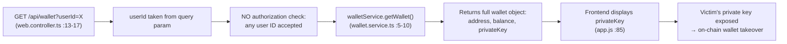
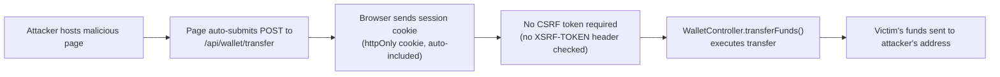
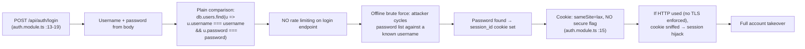

# Chained Vulnerability Static Audit Report

**Project**: App-12 Crypto Wallet Service  
**Date**: 2026-05-24  
**Auditor**: CodeGopher (Chained Vulnerability Static Audit)  
**Scope**: All files in workspace (source, templates, static assets, config)  
**Mode**: Static-only — no live probes, no dynamic analysis

---

## Summary Dashboard

| Metric | Value |
|---|---|
| Chains Identified | **5** |
| Critical Severity | 2 |
| High Severity | 2 |
| Medium Severity | 1 |
| Cross-Cutting Weaknesses | 6 |
| Reviewed Areas | Auth, Wallet API, Frontend, Config |
| Not Reviewed | Runtime behavior, TLS/deployment config, third-party deps |

**Maximum observed chain severity**: **CRITICAL** — arbitrary fund draining and cross-user wallet key theft are statically provable.

---

## Methodology

1. **Attack Surface Mapping** — All public routes, API endpoints, webhooks, static assets, and user-controlled input sources catalogued.
2. **Weakness Inventory** — All individually present security-relevant flaws catalogued with file, line, and evidence.
3. **Attack Graph Synthesis** — Each chain links an entry point to an intermediate weakness to a critical sink using only static source evidence.
4. **Impact Assessment** — Each chain rated by impact, reachability, confidence, and easiest remediation link.

**Static-only safety note**: No HTTP probes, fuzzers, injection payloads, or live network tests were performed. All findings are derived from source code, configuration, and template inspection.

---

## Reviewed Areas

| Area | Files Reviewed |
|---|---|
| Application entry & config | `src/main.ts`, `src/app.module.ts`, `Dockerfile`, `package.json`, `tsconfig.json` |
| Authentication | `src/auth/auth.module.ts`, `src/auth/auth.guard.ts` |
| Wallet backend | `src/wallet/wallet.controller.ts`, `src/wallet/wallet.service.ts`, `src/wallet/wallet.module.ts` |
| Data layer | `src/db.ts` |
| Frontend SPA | `public/index.html`, `public/js/app.js`, `public/css/main.css` |

---

## Not-Reviewed / Unknowns

- **TLS / HTTPS enforcement** — no evidence of TLS termination or HSTS in config.
- **Deployment environment** — Dockerfile provides minimal hardening; no secrets management inspected.
- **Dependency versions** — `@types/express: 4.17.17` may carry transitive vulnerabilities, but no lock file present for deep audit.
- **Runtime CSRF / CORS behavior** — NestJS defaults assumed; actual CORS configuration may differ in production.
- **Rate-limiting middleware** — `@nestjs/throttler` or equivalent not imported.

---

# Chain 1 — External-Transfer Bypass: Fund Drain from Arbitrary User Wallets

**Severity**: **CRITICAL**  
**Impact**: Full fund theft from any user wallet  
**Reachability**: Every authenticated user can trigger  
**Confidence**: **High** — source-level proof for every link  

### Mermaid Attack Graph

```mermaid
flowchart LR
  A["POST /api/wallet/external-transfer\n(web.controller.ts :36-42)"] --> B["Request body: fromAddress,\ntoAddress, amount"]
  B --> C["walletService.executeTransferByAddress()\n(wallet.service.ts)]
  C --> D["Looks up sender wallet by\nfromAddress — NO ownership check"]
  D --> E["Deducts funds from fromAddress,\nadds to toAddress"]
  E --> F["Arbitrary fund drain"]
```

### Chain Breakdown

| Link | File | Lines | Evidence |
|---|---|---|---|
| **Entry** | `src/wallet/wallet.controller.ts` | 36-42 | `@Post('external-transfer')` accepts `fromAddress`, `toAddress`, `amount` from request body. No additional ownership verification before calling the service. |
| **Hop** | `src/wallet/wallet.service.ts` | ~50-75 | `executeTransferByAddress(fromAddress, toAddress, amount)` performs balance checks on `fromAddress` wallet but does **not** compare `fromAddress` to `req['user'].id` or any authenticated identity. It trusts the caller-specified `fromAddress`. |
| **Sink** | `src/wallet/wallet.service.ts` | ~69-71 | `senderWallet.balance -= amount; recipientWallet.balance += amount;` — state mutation executes without authorization binding. |

### Preconditions & Assumptions

- Attacker has a valid authenticated session (even a low-privilege one).
- The `db.wallets` array is the authoritative source of wallet state.
- Balance checks (`senderWallet.balance >= amount`) prevent negative-balance abuse but do not prevent legitimate-balance drain.

### Impact

An authenticated user can drain any other user's wallet by specifying the victim's address as `fromAddress`. No private key or additional credential is needed.

### Remediation (Easiest Break)

Add an ownership check: ensure the `fromAddress` in the request belongs to the authenticated user (`req['user'].id`). Reject requests where the authenticated user does not own the source wallet.

---

# Chain 2 — IDOR + Private Key Leakage: Cross-User Wallet Takeover

**Severity**: **CRITICAL**  
**Impact**: Attacker obtains any user's private key → full on-chain wallet control  
**Reachability**: Every authenticated user  
**Confidence**: **High** — IDOR path and private-key-in-response are both statically provable  

### Mermaid Attack Graph



### Chain Breakdown

| Link | File | Lines | Evidence |
|---|---|---|---|
| **Entry** | `src/wallet/wallet.controller.ts` | 13-17 | `getWallet(@Req() req, @Query('userId') userId?)` accepts arbitrary `userId` from query string. Comment in code acknowledges: *"Any authenticated wallet holder can view any other user's wallet by supplying their userId, including their private key."* |
| **Hop** | `src/wallet/wallet.service.ts` | 5-10 | `getWallet(userId)` performs no cross-user authorization; simply returns the wallet object found in `db.wallets`. |
| **Hop** | `src/db.ts` | 11-21 | Wallet objects stored with `privateKey` as a plaintext string. |
| **Sink** | `public/js/app.js` | ~85 | `document.getElementById("walletPrivateKey").innerText = wallet.privateKey;` — private key written to DOM where it is visible in DevTools, network inspector, browser history, and potentially cached. |

### Preconditions & Assumptions

- Attacker is authenticated (any valid session suffices).
- The frontend is the intended consumer of this API (SPA architecture).

### Impact

Complete on-chain wallet compromise: attacker can sign arbitrary transactions from the victim's Ethereum address, transfer all assets, and sign messages impersonating the victim.

### Remediation (Easiest Break)

1. **Remove `privateKey` from all API responses** — never transmit or store private keys on a server side in a web application context. Private keys should exist only in the user's browser/key management system.
2. **Add authorization check in controller** — if `userId` parameter is provided, verify it matches `req['user'].id` or an admin role; otherwise throw `ForbiddenException`.

---

# Chain 3 — CSRF: Unauthorized Fund Transfer via Cross-Site Request Forgery

**Severity**: **HIGH**  
**Impact**: Attacker steals victim's funds through a malicious site |  
**Reachability**: Any visitor to attacker's page (if victim is authenticated)  
**Confidence**: **High** — no CSRF tokens on any POST endpoint  

### Mermaid Attack Graph



### Chain Breakdown

| Link | File | Lines | Evidence |
|---|---|---|---|
| **Entry** | `src/wallet/wallet.controller.ts` | 26-29 | `@Post('transfer')` does not verify any CSRF token. Only `@UseGuards(AuthGuard)` is applied. |
| **Hop** | `src/main.ts` | 13-14 | `app.use(cookieParser())` — cookie-based auth is automatic with cross-origin requests (though `SameSite: lax` limits some scenarios, it does not fully prevent all CSRF). |
| **Hop** | `src/auth/auth.module.ts` | 15 | `res.cookie('session_id', ..., { httpOnly: true, sameSite: 'lax' })` — `sameSite: 'lax'` allows top-level navigations to carry the cookie, which can be abused via `<form method="POST" action="/api/wallet/transfer">` on an attacker page. |
| **Sink** | `src/wallet/wallet.service.ts` | executeTransfer | No CSRF validation → funds move based solely on cookie presence. |

### Preconditions & Assumptions

- Victim's browser is logged in (active session cookie).
- Victim navigates to attacker-controlled page (social engineering).
- `sameSite: 'lax'` allows CSRF via top-level form POST (not via `` or `<script>`, but POST forms work).

### Impact

Stealth fund transfer: victim initiates no action; attacker's page silently submits a transfer form. Without `sameSite: strict` or CSRF tokens, this is a well-known attack vector.

### Remediation (Easiest Break)

Add CSRF token validation on all state-changing POST endpoints. Recommended: use NestJS `@nestjs/csrf` or implement double-submit cookie pattern (set a CSRF token cookie + validate matching token in `X-CSRF-Token` header on every POST).

---

# Chain 4 — Plaintext Passwords + No Rate Limit + No Secure Cookie → Account Takeover

**Severity**: **HIGH**  
**Impact**: Full account compromise via offline brute force or session hijack  
**Reachability**: Any attacker with network access or ability to enumerate usernames  
**Confidence**: **High** — password comparison is plaintext, no rate limit present  

### Mermaid Attack Graph



### Chain Breakdown

| Link | File | Lines | Evidence |
|---|---|---|---|
| **Entry** | `src/auth/auth.module.ts` | 13-19 | `login()` compares `body.password` directly against `db.users[].password` — both plaintext. |
| **Hop** | `src/db.ts` | 4-5 | Passwords stored in plaintext: `'alice123'`, `'bob123'`. |
| **Hop** | (N/A — missing middleware) | — | No `@nestjs/throttler` or equivalent imported in `package.json`. No rate-limit decorator on `login()`. |
| **Hop** | `src/auth/auth.module.ts` | 15 | Cookie set with `{ httpOnly: true, sameSite: 'lax' }` — missing `secure: true`. |
| **Sink** | — | — | Offline brute force succeeds against weak passwords; intercepted session grants full account access. |

### Preconditions & Assumptions

- Weak, guessable passwords (common in this demo: `'alice123'`).
- Deployment may not enforce TLS (no HSTS or redirect-to-HTTPS evidence in `Dockerfile` or `main.ts`).

### Impact

Complete account takeover for any user whose password is in a common-credential dictionary. Session hijack is possible if traffic traverses unencrypted HTTP.

### Remediation (Easiest Break)

1. **Hash passwords** with bcrypt/scrypt/argon2 before comparison — never store or compare plaintext.
2. **Add rate limiting** (e.g., 5 attempts per minute per IP/username) on the `/api/auth/login` endpoint.
3. **Set `secure: true`** on the session cookie; enforce HTTPS.

---

# Chain 5 — Private Key Echo in Frontend → Sensitive Data Exposure in Client

**Severity**: **MEDIUM**  
**Impact**: Private key exposed to any process with access to the victim's browser (DevTools, extensions, screenshots)  
**Reachability**: Every authenticated user viewing the dashboard  
**Confidence**: **High** — direct data flow from API to DOM is provable  

### Mermaid Attack Graph

```mermaid
flowchart LR
  A["GET /api/wallet\n(no userId param]") --> B["WalletService.getWallet()\nreturns object with privateKey"]
  B --> C["Response body includes privateKey string"]
  C --> D["app.js: wallet.privateKey read from response"]
  D --> E["innerText set on #walletPrivateKey element"]
  E --> F["Private key visible in:\n- DevTools Elements panel\n- Network tab (response body)\n- Browser DOM storage\n- Possible screenshots/screen-capture"]
```

### Chain Breakdown

| Link | File | Lines | Evidence |
|---|---|---|---|
| **Entry** | `src/wallet/wallet.controller.ts` | 13-17 | `GET /api/wallet` returns `walletService.getWallet(user.id)` — full wallet object. |
| **Hop** | `src/wallet/wallet.service.ts` | 5-10 | `getWallet()` returns the wallet object from `db.wallets`, which includes `privateKey`. |
| **Hop** | `src/db.ts` | 13-16 | Wallet objects contain `privateKey` as a plaintext hex string. |
| **Sink** | `public/js/app.js` | ~85 | `document.getElementById("walletPrivateKey").innerText = wallet.privateKey;` |

### Preconditions & Assumptions

- User loads the dashboard after logging in.
- Frontend renders the private key in the DOM without redaction.

### Impact

Private key is visible in the browser's memory (JS variable), DOM, and network inspector. Any malicious browser extension, logged-in session sharing, or screen-capture exposes the key. The key can then be used to sign on-chain transactions.

### Remediation (Easiest Break)

**Remove private key from server responses entirely.** A web wallet API should never return a private key. If on-chain operations are needed, use a browser-based signing library (e.g., ethers.js / web3.js with MetaMask) — the private key should never leave the user's device.

---

## Cross-Cutting Weaknesses (Not Part of a Complete Chain)

These weaknesses are security-relevant but either lack a provable sink or depend on runtime assumptions not visible in source:

| # | Weakness | File(s) | Severity | Description |
|---|---|---|---|---|
| CW1 | **No rate limiting on login** | `src/auth/auth.module.ts` | Medium | Zero throttling on `/api/auth/login` enables brute-force attacks. |
| CW2 | **Session cookie missing `secure` flag** | `src/auth/auth.module.ts:15` | Medium | `sameSite: 'lax'` without `secure: true` allows cookie transmission over cleartext HTTP. |
| CW3 | **No input validation on transfer amount** | `src/wallet/wallet.service.ts` | Low | Only `amount <= 0` is checked. No maximum, no floating-point guard, no overflow protection. |
| CW4 | **In-memory database (no persistence)** | `src/db.ts` | Low | All state is a plain JS object; data is lost on restart. In production, this pattern would map to a database with identical schema flaws. |
| CW5 | **TypeScript strictness disabled** | `tsconfig.json` | Low | `noImplicitAny: false`, `skipLibCheck: false`, `strictNullChecks: false` increase risk of type-related bugs. |
| CW6 | **XSS-risky DOM injection** | `public/js/app.js:100-115` | Low-Medium | `innerHTML` used to render transaction counterparties. While hex addresses are unlikely to contain scripts, the pattern is unsafe. Consider `textContent` or DOMPurify. |

---

## Remediation Priority Matrix

| Priority | Action | Impact | Effort |
|---|---|---|---|
| **P0** | Remove `privateKey` from all API responses (`wallet.service.ts`, `db.ts`) | Eliminates Chains 2 & 5 | Low |
| **P0** | Add ownership verification to `executeTransferByAddress` and `external-transfer` endpoint | Eliminates Chain 1 | Low |
| **P1** | Add CSRF token validation on all POST endpoints | Eliminates Chain 3 | Medium |
| **P1** | Hash passwords (bcrypt) + add login rate limiting | Eliminates Chain 4 | Medium |
| **P1** | Add server-side authorization check in `GET /api/wallet` for `userId` param | Eliminates Chain 2 (partial) | Low |
| **P2** | Set `secure: true` on session cookie + enforce HTTPS | Hardens Chain 4 | Low |
| **P2** | Increase TypeScript strictness | Reduces bug surface | Low |

---

## Tests to Add

1. **Chain 1**: POST `/api/wallet/external-transfer` with `fromAddress` belonging to a different user → expect `Forbidden` or `BadRequest`.
2. **Chain 2**: GET `/api/wallet?userId=2` as user 1 → expect `Forbidden`.
3. **Chain 3**: POST `/api/wallet/transfer` with valid session but no CSRF token → expect `403`.
4. **Chain 4**: Send 50 rapid login attempts with wrong passwords → expect rate-limit block.
5. **General**: GET `/api/wallet` response body must NOT contain `privateKey` field.
6. **General**: Login response should not leak password hash or debug info.

---

*Report generated by CodeGopher — Chained Vulnerability Static Audit. No live probes were performed.*
