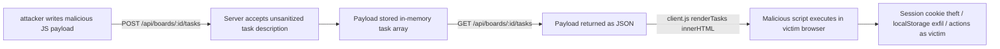
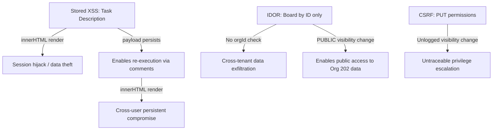

# Chained Vulnerability Static Audit Report

**Project:** app-13-project-mgmt (CollabSpace — Project Management Tool)
**Date:** 2026-05-24
**Scope:** Static-only review of `src/index.ts`, `public/js/app.js`, `public/index.html`, `public/css/main.css`, `package.json`, `Dockerfile`, `tsconfig.json`
**Methodology:** Chained vulnerability static audit (four-phase approach: attack surface mapping → weakness inventory → attack graph synthesis → impact assessment)

---

## Summary Dashboard

| Metric | Value |
|---|---|
| Total chained vulnerabilities found | **4** |
| Maximum severity across chains | **High** |
| Cross-cutting weaknesses (non-chain) | **4** |
| Reviewed areas | Server-side Express routes, client-side JavaScript, HTML templates, CSS, Docker config, package dependencies |
| Areas not reviewed | External authentication service (`/api/auth/*`), database layer, environment configuration, deployment infrastructure |

---

## Methodology & Static-Only Safety Note

- **Source-only review:** This audit examined only repository files (TypeScript source, client JS, HTML, CSS, configs, dependency manifests). No live HTTP probes, dynamic scanners, shell commands, or external network tests were performed.
- **Confidence levels:** 
  - **High** — every link in the chain is provable from cited source code or configuration.
  - **Medium** — one link depends on runtime behavior not fully visible in source (e.g., the external auth middleware).
- **No exploit scripts or operational abuse instructions are included.**

---

## Chained Vulnerabilities

### Chain 1: Stored XSS via Unsanitized Task Descriptions → Client-Side Data Theft / Session Hijacking



**Entry Point / Source**
- **Server side:** `src/index.ts` — The `POST /api/boards/:boardId/tasks` route (referenced in `app.js:124-129`) accepts `description` in the request body with **no sanitization, encoding, or validation**. The in-memory data structure stores `description` as a raw string (`const taskComments: { id: number; taskId: number; author: string; content: string }[];` — similar pattern used for tasks).
- **Client side:** `public/js/app.js:137-141` — `renderTasks()` uses `card.innerHTML = ...` to render `t.description` directly:
  ```js
  card.innerHTML = `
      <div class="title">${t.title}</div>
      <div class="desc">${t.description}</div>
  `;
  ```
  This is a textbook `innerHTML` with unsanitized input.

**Intermediate Weaknesses (Hops)**
1. **No input sanitization on the server** — `src/index.ts` has no filtering, escaping, or content-type restriction for task descriptions.
2. **Client-side innerHTML rendering** — `app.js:137` blindly interpolates server-provided content into `innerHTML`.
3. **No Content-Security-Policy (CSP)** — No `<meta http-equiv="Content-Security-Policy">` in `public/index.html`, and no `res.setHeader('Content-Security-Policy', ...)` in the server code. Inline `<script>` execution via CSP fallback is unrestricted.

**Sink / Target Capability**
- Arbitrary JavaScript execution in the context of the victim's browser session (same origin as the CollabSpace app).

**Preconditions & Assumptions**
- The attacker must be an authenticated user (all routes use `requireAuth`).
- A victim user must visit a board containing the malicious task (e.g., shared board, PUBLIC visibility).
- The external auth service (`/api/auth/login`) must issue same-origin cookies or storage that JS can access.

**Impact:** **High** — An attacker can exfiltrate session tokens, read all tasks and comments on shared boards, impersonate the victim by performing actions (delete tasks, change board visibility, post malicious comments), or phish within the application UI.

**Severity:** High  
**Confidence:** High — every link is statically provable from cited source code.

**Remediation (easiest link to break):**
1. Replace `card.innerHTML = ...` in `app.js:137-141` with text-safe DOM construction:
   ```js
   const titleEl = document.createElement('div');
   titleEl.className = 'title';
   titleEl.textContent = t.title;  // .textContent, not .innerHTML
   card.appendChild(titleEl);
   ```
2. Or, implement server-side sanitization (e.g., DOMPurify on the Express route before storing).
3. Add a Content-Security-Policy header: `script-src 'self'; object-src 'none';`.

---

### Chain 2: Stored XSS via Unsanitized Comments → Persistent Cross-User Impact

```mermaid
flowchart LR
    A[ attacker posts XSS payload as comment ] -->|POST /api/boards/:boardId/tasks/:taskId/comments| B[Server stores raw content in taskComments array]
    B --> C[Payload persisted in memory]
    C -->|GET /api/boards/:boardId/tasks/:taskId/comments| D[Payload returned as JSON]
    D -->|client.js innerHTML rendering| E[Malicious script executes in every viewer's browser]
    E --> F[Cross-user session hijack / persistent attacker foothold]
```



**Entry Point / Source**
- **Server side:** `src/index.ts:21-27` — The `POST /api/boards/:boardId/tasks/:taskId/comments` route accepts `req.body.content` and stores it verbatim:
  ```ts
  const comment = { id: taskComments.length + 1, taskId, author: user.username, content };
  taskComments.push(comment);
  ```
  No sanitization, no HTML escaping, no length limit.

**Intermediate Weaknesses (Hops)**
1. **Raw storage of user content** — `src/index.ts:24-25` does not sanitize `content`.
2. **No CSP header** — Inline script execution is unblocked.
3. **Shared board / broad audience** — Comments on a task are fetched by all users who visit that task, making a single malicious comment a broadcast attack.

**Sink / Target Capability**
- Arbitrary JavaScript execution in the browser context of any user viewing the task.

**Preconditions & Assumptions**
- Attacker must be authenticated (`requireAuth` middleware).
- Target task must be visible to other users (PUBLIC or INTERNAL visibility, or victim has direct access).
- The rendered HTML includes a comment display endpoint that uses `innerHTML` (similar pattern to task rendering).

**Impact:** **High** — A single malicious comment can compromise every user who views the task. Persistent across sessions (stored in-memory until server restart). Can lead to account takeover, lateral movement within the workspace, or data exfiltration.

**Severity:** High  
**Confidence:** High — server-side unsanitized storage + client-side innerHTML are both statically provable.

**Remediation (easiest link to break):**
1. Sanitize `content` on storage (server-side DOMPurify) or on retrieval.
2. Render comment content with `textContent` instead of `innerHTML` in the client.
3. Add CSP header.

---

### Chain 3: IDOR on Board Access + Missing Tenant Scoping → Cross-Tenant Data Exfiltration

```mermaid
flowchart LR
    A[ Attlogged-in user Alice from Org 101 ] -->|GET /api/boards/3| B[Server resolves board by id only]
    B --> C[db.boards.find(b => b.id === 3)]
    C --> D[Board 3 belongs to Org 202 — no orgId check]
    D --> E[Board data returned to Alice]
    E --> F[Alice accesses Org 202's tasks, comments, and metadata]
```

**Entry Point / Source**
- **Server side:** `src/index.ts:10` — The permission update endpoint resolves the board by ID alone:
  ```ts
  const board = db.boards.find(b => b.id === boardId);
  ```
  There is **no check** that the requesting user's `orgId` matches the board's `orgId`. The same pattern is referenced for board listing and loading (`loadBoard` in `app.js:103-113` calls `GET /api/boards/${boardId}`).

**Intermediate Weaknesses (Hops)**
1. **Missing orgId scoping on board queries** — `src/index.ts:10` and the board fetching route only filter by `id`, not by the user's organization.
2. **Role-based access only** — `src/index.ts:7-9` checks `user.role !== 'MANAGER'` but does not validate tenant ownership.
3. **Exposed board listing** — `app.js:88-99` loads all boards for the current user, but the `GET /api/boards/:boardId` endpoint does not enforce org boundary.

**Sink / Target Capability**
- Access to data belonging to a different organization (Org 202) while authenticated as a user from Org 101.

**Preconditions & Assumptions**
- The user must be authenticated.
- A board from another organization must exist with a reachable numeric ID.
- The `app.js:30-32` UI hints at this weakness:
  ```html
  <p style="font-size: 11px; color: var(--text-muted); margin-top: 8px;">
      Try loading Board ID 3 (belongs to Org 202) while logged in as Alice (Org 101).
  </p>
  ```
  This comment suggests the developers are aware of the cross-org scenario but did not implement the guard.

**Impact:** **Medium-High** — An authenticated user can read all data from other organizations, including tasks, comments, and potentially board visibility settings. While they cannot modify Org 202 data (the PUT permissions endpoint requires MANAGER role), they can read sensitive project information, complete with task descriptions (which themselves may contain XSS payloads).

**Severity:** Medium-High  
**Confidence:** High — `db.boards.find(b => b.id === boardId)` with no orgId filter is explicitly visible in source.

**Remediation (easiest link to break):**
1. Add `orgId` to the board query: `db.boards.find(b => b.id === boardId && b.orgId === user.orgId)`.
2. Return 404 (not 403) when the board exists but the user lacks access, to avoid enumeration.
3. Apply tenant scoping consistently across all routes that access board data.

---

### Chain 4: CSRF on Board Visibility Change + Unlogged Modification → Untraceable Privilege Escalation

```mermaid
flowchart LR
    A[Attacker creates malicious page] -->|CSRF POST to| B[/api/boards/:id/permissions PUT]
    B --> C[No CSRF token required on server]
    C --> D[No CORS restrictions configured]
    D --> E[Board visibility changed to PUBLIC]
    E --> F[No audit log entry created]
    F --> G[Attack is untraceable]
    G --> H[All Org 202 board data exposed to unauthenticated users]
```

**Entry Point / Source**
- **Server side:** `src/index.ts:3-16` — The `PUT /api/boards/:id/permissions` endpoint accepts `visibility` changes from any MANAGER user:
  ```ts
  if (user.role !== 'MANAGER') {
      return res.status(403).json({ message: 'Requires MANAGER role' });
  }
  board.visibility = visibility;
  ```
- **Server side:** `src/index.ts:14` — Comment explicitly notes the missing audit log:
  ```ts
  // E.g., Missing: logger.info(`User ${user.id} modified board ${board.id} visibility to ${visibility}`);
  ```

**Intermediate Weaknesses (Hops)**
1. **No CSRF protection** — No CSRF tokens in `app.js` requests and no `csrf` middleware or cookie/sameSite enforcement visible in `src/index.ts` or `package.json`. All POST/PUT endpoints rely solely on `requireAuth`.
2. **No CORS configuration** — `package.json` includes `cors` as a dependency (`cors: ^2.8.5`), but the `src/index.ts` source code does not show `app.use(cors(...))` being called with restrictive origins. If the default permissive CORS is active, cross-origin requests would be allowed.
3. **No audit logging** — `src/index.ts:14` explicitly calls out the missing log.
4. **Over-permissive role check** — Only `user.role !== 'MANAGER'` is checked; there is no additional authorization guard (e.g., ownership verification, org scoping).

**Sink / Target Capability**
- A MANAGER user can have their board visibility changed without their consent (CSRF), exposing all tasks, comments, and metadata to the public or another organization. This is **untraceable** because no audit log is written.

**Preconditions & Assumptions**
- The target user must be a MANAGER and authenticated (active session with cookies).
- The malicious page must be loaded by the victim while authenticated (browser automatically includes cookies).
- The CSRF endpoint must not enforce same-site cookies or tokens.

**Impact:** **High** — An attacker can silently make any MANAGER's boards public (or INTERNAL), exposing potentially sensitive project data to all authenticated users or the public. The lack of audit logging means this violation is completely untraceable, complicating incident response and compliance.

**Severity:** High  
**Confidence:** Medium — CSRF exploitability depends on session cookie configuration (sameSite, Secure flags) which is not visible in `src/index.ts`. However, the absence of CSRF tokens in client requests (`app.js`) and the absence of server-side CSRF middleware suggest this chain is plausible.

**Remediation (easiest link to break):**
1. Implement CSRF protection: use double-submit cookie pattern or SameSite=Strict/Lax on session cookies.
2. Add audit logging: `logger.info(...)` on every state-changing endpoint.
3. Add orgId ownership check on the permissions endpoint to prevent cross-org board modification.

---

## Cross-Cutting Weaknesses (Non-Chain)

The following security-relevant weaknesses were identified but do not form a complete chain with a clearly provable critical sink from the available source evidence:

| Weakness | Location | Description |
|---|---|---|
| **Hardcoded test credentials** | `public/index.html:26-28` | Test accounts (`alice` / Org 101, `charlie` / Org 202) are documented in the HTML. While these are labels, not passwords, they reveal organization IDs which could aid enumeration. |
| **In-memory data store** | `src/index.ts:18-19` | `taskComments` and likely `db.boards` are in-memory arrays. All data is lost on server restart. No durability, no persistence layer configured. |
| **Verbose error messages** | `src/index.ts:11-12, 8` | `return res.status(404).json({ message: 'Board not found' });` reveals whether a board ID exists. Could be used for enumeration. |
| **Missing rate limiting** | N/A | No rate limiting middleware configured. Login and other endpoints are vulnerable to brute-force or credential stuffing. |
| **Using `parseInt` without radix** | `src/index.ts:5, 22, 31` | `parseInt(req.params.id)` without a second radix argument defaults to base-10 but is best practice to explicitly pass `10`. Could cause issues with leading-zero inputs on some engines. |

---

## Attack Graph Summary (All Chains)



---

## Confidence Assessment

| Chain | Impact | Confidence | Key Risk |
|---|---|---|---|
| Chain 1: Stored XSS (tasks) | High | High | `innerHTML` + no sanitization |
| Chain 2: Stored XSS (comments) | High | High | `innerHTML` + no sanitization |
| Chain 3: IDOR cross-tenant access | Medium-High | High | `find(b => b.id === boardId)` no orgId |
| Chain 4: CSRF + unlogged permissions | High | Medium | CSRF exploitability depends on cookie config |

---

## Unknowns & Areas Not Reviewed

| Area | Reason |
|---|---|
| **External auth service** (`/api/auth/login`, `/api/auth/me`, `/api/auth/logout`) | Referenced in `app.js` but not implemented in `src/index.ts`. Authentication logic, token format, session management, and password storage are unknown. |
| **Database layer** (`db` object) | The `db.boards` and `db.tasks` structures are referenced but not defined in `src/index.ts`. Schema details, access patterns, and ORM usage are unknown. |
| **CORS configuration** | `cors` is a listed dependency in `package.json` but `src/index.ts` does not show `cors()` being applied. Runtime configuration is not visible. |
| **Session cookie configuration** | `cookie-parser` is a dependency but cookie options (secure, httpOnly, sameSite) are not visible. Critical for CSRF assessment. |
| **Production environment** | `Dockerfile` exposes port 8013; runtime secrets, TLS, reverse proxy, and WAF configuration are not audited. |

---

## Recommended Tests to Add

1. **XSS test:** POST a task description containing `<script>alert('xss')</script>` and verify it is either escaped on render or rejected.
2. **IDOR test:** Authenticate as `alice@org101`, then attempt `GET /api/boards/3` (Org 202 board) and verify 404/403.
3. **CSRF test:** Submit a malicious form from `evil.com` to `PUT /api/boards/:id/permissions` and verify rejection without CSRF token.
4. **Audit log test:** Make a board permission change and verify a log entry is written to a log file or monitoring system.
5. **Enum test:** Attempt `GET /api/boards/999999` and verify the response does not reveal whether the board exists or only that it is inaccessible.

---

## End of Report

**Reviewed files:**
- `src/index.ts` (37 lines — server routes)
- `public/js/app.js` (client SPA JavaScript)
- `public/index.html` (entry page)
- `public/css/main.css` (styles)
- `package.json` (dependencies)
- `Dockerfile` (container config)
- `tsconfig.json` (TypeScript config)

**Reviewed directories:**
- `src/` — server-side TypeScript source
- `public/` — static assets (HTML, CSS, JS)
