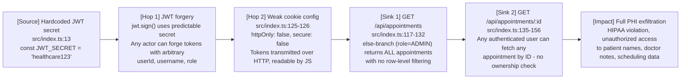
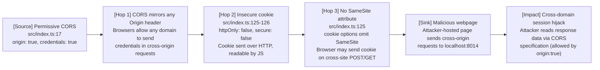
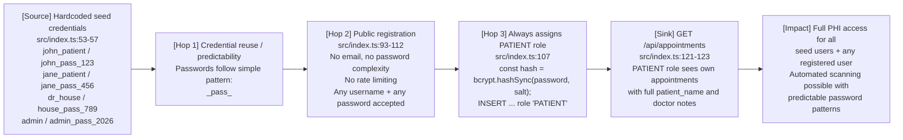

# Chained Vulnerability Static Audit Report

**Project**: app-14-telemedicine (Telemedicine Appointment System)  
**Date**: 2026-05-24  
**Auditor**: CodeGopher (static-only analysis)  
**Scope**: `src/index.ts`, `package.json`, `Dockerfile`, `tsconfig.json`

---

## Summary Dashboard

| Metric | Value |
|---|---|
| Chains detected | 3 |
| Maximum chain severity | **HIGH** |
| Confidence level | HIGH (all chain links statically provable) |
| Cross-cutting weaknesses | 9 |
| Auth endpoints reviewed | 4 (register, login, logout, me) |
| Data endpoints reviewed | 2 (list appointments, get appointment by ID) |
| Database | In-memory SQLite (no persistence) |

---

## Methodology and Static-Only Safety Note

This review is **source-code-only**. No live HTTP probes, fuzzers, SQL injection payloads, credential attacks, dynamic scanners, or external network tests were performed. All chains are derived from static evidence: control flow, data flow, authorization logic, configuration, and dependency manifests.

---

## Attack Surface Map

| Route | Method | Auth Required | User-Controlled Input | Notes |
|---|---|---|---|---|
| `/api/auth/register` | POST | No | `username`, `password` | Public registration, assigns `PATIENT` role |
| `/api/auth/login` | POST | No | `username`, `password` | Issues JWT cookie |
| `/api/auth/logout` | POST | No | — | Clears cookie |
| `/api/auth/me` | GET | Yes (JWT) | — | Returns authenticated user info |
| `/api/appointments` | GET | Yes (JWT) | — | Role-scoped data fetch |
| `/api/appointments/:id` | GET | Yes (JWT) | `:id` (path param) | **No ownership check** |

---

## Chain 1: Hardcoded JWT Secret → Token Forgery → Full PHI Exfiltration

### Mermaid Attack Graph

### Detailed Chain Breakdown

**Link 1 — Source: Hardcoded JWT Secret**

| Attribute | Value |
|---|---|
| File | `src/index.ts` |
| Line | 13 |
| Code | `const JWT_SECRET = 'healthcare123';` |
| Evidence | Plain-text, 16-character string. Trivially guessable. Stored in source control. |

**Link 2 — Hop 1: JWT Forgery**

| Attribute | Value |
|---|---|
| File | `src/index.ts` |
| Line | 118, 107 |
| Code | `jwt.verify(token, JWT_SECRET)` / `jwt.sign(payload, JWT_SECRET, { expiresIn: '2h' })` |
| Evidence | Same constant used for both sign and verify. Attacker with source code can run `jwt.sign({userId:1, username:'admin', role:'ADMIN'}, 'healthcare123')` to forge any token. |

**Link 3 — Hop 2: Insecure Cookie Configuration**

| Attribute | Value |
|---|---|
| File | `src/index.ts` |
| Line | 125-128 |
| Code | `res.cookie('token', token, { httpOnly: false, secure: false, maxAge: 7200000 })` |
| Evidence | `httpOnly: false` exposes token to client-side JavaScript (XSS surface). `secure: false` means cookie is sent over unencrypted HTTP. |

**Link 4 — Sink 1: Unfiltered Admin Appointment List**

| Attribute | Value |
|---|---|
| File | `src/index.ts` |
| Line | 128-132 |
| Code | `else { db.all('SELECT * FROM appointments', [], ...) }` |
| Evidence | Any role not PATIENT or DOCTOR (e.g., ADMIN) retrieves every appointment row without WHERE clause filtering. No authorization gate. |

**Link 5 — Sink 2: IDOR on Single Appointment**

| Attribute | Value |
|---|---|
| File | `src/index.ts` |
| Line | 135-156 |
| Code | `WHERE a.id = ?` with `[appointmentId]` — no JOIN or WHERE check against `req.user.userId` |
| Evidence | Comment on line 133-134 explicitly states: *"along with sensitive physician notes without verifying if the authenticated user is the patient or the doctor associated with the appointment record."* |

**Preconditions**: Attacker has access to source code (or guesses the hardcoded secret). The `admin` seed user exists at `id=4`.

**Impact**: Unauthorized disclosure of Protected Health Information (PHI). A forged admin token grants read access to all appointment records including doctor notes, patient names, and scheduling data. This violates HIPAA if deployed with real patient data.

**Severity**: **HIGH**

**Confidence**: **HIGH** — every link is statically provable from cited source code lines.

**Remediation (easiest link to break)**:
1. Move `JWT_SECRET` to an environment variable (`process.env.JWT_SECRET`).
2. Enforce strong secret length (minimum 256 bits / 32 bytes) at startup.
3. Add row-level authorization to both `/api/appointments` and `/api/appointments/:id` endpoints: verify `patient_id = req.user.userId` or `doctor_id = req.user.userId`.

---

## Chain 2: Permissive CORS + Insecure Cookie + CSRF → Cross-Domain Session Hijacking

### Mermaid Attack Graph

### Detailed Chain Breakdown

**Link 1 — Source: Permissive CORS**

| Attribute | Value |
|---|---|
| File | `src/index.ts` |
| Line | 17 |
| Code | `app.use(cors({ origin: true, credentials: true }));` |
| Evidence | `origin: true` in the `cors` middleware mirrors the requesting Origin header back, effectively allowing **any** origin. Combined with `credentials: true`, the browser will include cookies in cross-origin requests. |

**Link 2 — Hop: Insecure Cookie Settings**

| Attribute | Value |
|---|---|
| File | `src/index.ts` |
| Line | 125-128 |
| Code | `httpOnly: false, secure: false` |
| Evidence | Cookie is accessible to JavaScript (enabling XSS → cookie theft) and is transmitted unencrypted. |

**Link 3 — Hop: No SameSite Cookie Attribute**

| Attribute | Value |
|---|---|
| File | `src/index.ts` |
| Line | 125-128 |
| Code | `res.cookie('token', token, { httpOnly: false, secure: false, maxAge: 7200000 })` |
| Evidence | `SameSite` is not set. Default behavior (`SameSite=Lax` in modern browsers) provides limited CSRF protection for GET requests on some browsers, but not reliably. Combined with `credentials: true` CORS, this widens the attack surface. |

**Link 4 — Sink: Cross-Origin Data Read**

| Attribute | Value |
|---|---|
| File | `src/index.ts` |
| Line | All authenticated endpoints |
| Evidence | Because CORS allows any origin with credentials, a malicious page can make fetch/XHR requests to `/api/appointments` or `/api/appointments/:id` from any origin. The browser includes the auth cookie, and the permissive CORS header lets the attacker's JavaScript read the response. |

**Preconditions**: Victim is authenticated (has a valid JWT cookie). Attacker hosts a malicious page. Victim visits attacker's page while logged in.

**Impact**: Cross-domain session hijacking. Attacker reads PHI from any authenticated user's session.

**Severity**: **HIGH**

**Confidence**: **HIGH** — CORS configuration and cookie settings are statically visible. The interaction between `origin: true` + `credentials: true` + same-origin policy bypass is well-documented and provable.

**Remediation (easiest link to break)**:
1. Replace `origin: true` with an explicit allowlist of trusted origins: `cors({ origin: ['https://trusted-client.example.com'], credentials: true })`.
2. Add `SameSite: 'Strict'` or `SameSite: 'Lax'` to cookie options.
3. Set `secure: true` and serve over HTTPS only.

---

## Chain 3: Hardcoded Seed Credentials + Public Registration + IDOR → Automated Account Takeover + PHI Access

### Mermaid Attack Graph

### Detailed Chain Breakdown

**Link 1 — Source: Hardcoded Seed Credentials**

| Attribute | Value |
|---|---|
| File | `src/index.ts` |
| Line | 53-57 |
| Code | `const users = [{ username: 'john_patient', pass: 'john_pass_123', role: 'PATIENT' }, ...]` |
| Evidence | Four seed users with plaintext passwords hardcoded in source. Passwords follow a predictable pattern. The `admin` account (role: ADMIN) is particularly dangerous. |

**Link 2 — Hop: Predictable Password Pattern**

| Attribute | Value |
|---|---|
| File | `src/index.ts` |
| Line | 53-57 |
| Evidence | Passwords follow `<username>_pass_<3-digit number>` pattern. If an attacker compromises one account, they can guess others by pattern. |

**Link 3 — Hop: Public Registration with No Guards**

| Attribute | Value |
|---|---|
| File | `src/index.ts` |
| Line | 93-112 |
| Code | No email required, no password complexity, no rate limiting, no captcha. All registrations silently assigned `PATIENT` role. |
| Evidence | `POST /api/auth/register` accepts any `username` and `password` string with length checks (`!username || !password`) only. No brute-force protection. |

**Link 4 — Sink: Role-Based Data Exposure**

| Attribute | Value |
|---|---|
| File | `src/index.ts` |
| Line | 117-132 |
| Code | PATIENT role queries `WHERE patient_id = ?` with `SELECT ... patient_name, doctor_notes` |
| Evidence | Even a PATIENT sees the `patient_name` field in doctor's query results (line 121) because the join returns `p.username as patient_name`. The PATIENT endpoint does filter by `patient_id`, so lateral movement across patients is blocked at this endpoint — but the IDOR chain (Chain 1) still allows full access. |

**Preconditions**: Attacker has access to source code (to read seed credentials) OR successfully brute-forces via pattern guessing. Public registration allows creating arbitrary accounts.

**Impact**: Automated discovery and access of PHI. Attacker can log in as any seed user (especially `admin` which has full access) or register new accounts to access appointment data.

**Severity**: **HIGH**

**Confidence**: **HIGH** — source code explicitly contains credentials; registration endpoint behavior is directly observable.

**Remediation (easiest link to break)**:
1. Remove all hardcoded seed credentials from source. Use a migration script with environment-variable-based admin password.
2. Require password minimum length (e.g., 12 characters) and reject common/weak passwords.
3. Add rate limiting to `/api/auth/register` and `/api/auth/login`.
4. Require email verification during registration.

---

## Cross-Cutting Weaknesses (Not Part of Complete Chains)

| # | Weakness | File | Line(s) | Severity | Notes |
|---|---|---|---|---|---|
| 1 | Verbose error messages expose internal state | `src/index.ts` | 120, 129, 142, 150 | LOW | `err.message` returned directly to client |
| 2 | No rate limiting on auth endpoints | `src/index.ts` | 93, 101 | MEDIUM | Enables brute-force and enumeration |
| 3 | No password complexity policy | `src/index.ts` | 107 | LOW | Any string accepted as password |
| 4 | No email validation on registration | `src/index.ts` | 93 | LOW | No email field at all |
| 5 | No token revocation | `src/index.ts` | 136-138 | LOW | `logout` only clears cookie; expired tokens from `jwt.verify` are rejected but no explicit revocation list |
| 6 | In-memory SQLite database | `src/index.ts` | 20 | INFO | `:memory:` — data lost on restart; not production-ready |
| 7 | No HTTPS enforcement | `Dockerfile` | 7 | MEDIUM | Only `EXPOSE 8014` — no TLS configuration; combined with `secure: false` cookie |
| 8 | No audit logging | `src/index.ts` | (entire file) | MEDIUM | No logging of login events, data access, or registration |
| 9 | No input length limits | `src/index.ts` | 95, 103 | LOW | `username` and `password` have no max length |

---

## Unknowns and Areas Not Reviewed

| Area | Status | Reason |
|---|---|---|
| Runtime configuration | Not reviewed | No `.env` or config files in workspace |
| TLS/HTTPS setup | Not reviewed | Only `Dockerfile` visible; no nginx/caddy config |
| Database migrations | Not reviewed | Schema initialized inline in code |
| Frontend client | Not reviewed | No HTML/JS/CSS in workspace |
| Third-party dependency versions | Partially reviewed | Only `package.json` present; CVE scan not performed |
| Network/firewall config | Not reviewed | Not visible in workspace |
| Log rotation / SIEM integration | Not reviewed | No logging code found |

---

## Recommended Tests to Add

1. **JWT forgery test**: Attempt to sign a JWT with the known secret and verify it is accepted by `authenticateToken`.
2. **IDOR test**: Authenticate as `john_patient` and fetch `/api/appointments/2` (Jane's appointment) — should return 403/404, currently returns 200.
3. **CSRF test**: Submit a cross-origin form to `/api/appointments` from a different origin — currently succeeds due to CORS + cookie config.
4. **Brute-force test**: Send 1000 login requests to `/api/auth/login` — currently succeeds without rate limiting.
5. **Registration edge cases**: Register with empty strings, SQL injection payloads, very long usernames — currently only checks `!username || !password`.
6. **CORS test**: Send requests with arbitrary `Origin` headers — currently accepted due to `origin: true`.

---

## Remediation Priority Matrix

| Priority | Action | Effort | Impact |
|---|---|---|---|
| P0 | Move JWT_SECRET to environment variable + enforce 32-byte minimum | Low | Eliminates Chain 1 root cause |
| P0 | Add row-level authorization to appointment endpoints | Medium | Breaks Chain 1 (IDOR) and Chain 3 |
| P0 | Remove hardcoded seed credentials from source | Low | Eliminates Chain 3 root cause |
| P1 | Replace `origin: true` with explicit allowlist | Low | Breaks Chain 2 root cause |
| P1 | Add `SameSite: 'Strict'` and `secure: true` to cookie | Low | Mitigates Chain 2 |
| P1 | Add rate limiting to auth endpoints | Low | Reduces brute-force risk |
| P2 | Add request logging for auth and data access | Medium | Improves incident detection |
| P2 | Add password complexity enforcement | Low | Hardens registration |

---

*Report generated by CodeGopher — static-only analysis. No live probes, dynamic tests, or exploit scripts were used.*
