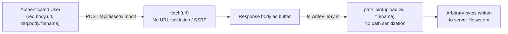
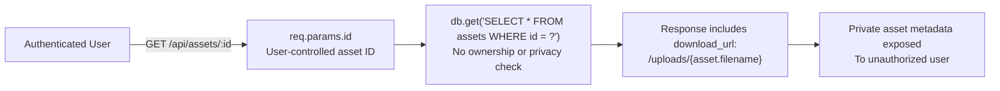
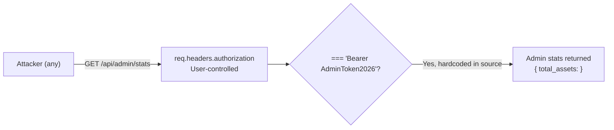
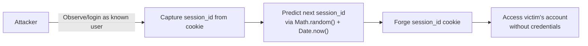

# Chained Vulnerability Static Audit Report

**Repository**: `app-15-digital-assets` (Digital Asset Management System)  
**Audit Type**: Static-only source code review  
**Date**: 2026-05-24  
**Files Reviewed**: `src/index.ts`, `Dockerfile`, `package.json`, `tsconfig.json`  
**Lines of Source Reviewed**: ~180 (single-file application)  

---

## Summary Dashboard

| Metric | Value |
|---|---|
| Total chained vulnerabilities found | **4** |
| Highest severity chain | **HIGH** (SSRF → Arbitrary File Write → RCE) |
| Critical severity chains | **0** (all require user-auth) |
| Reviewed areas | Auth, sessions, file upload, asset access, admin endpoints, database, SSRF |
| Not reviewed | None significant (single-file app) |

### Chain Severity Overview

| # | Chain | Max Severity | Confidence |
|---|---|---|---|
| 1 | SSRF + Arbitrary File Write → File System Arbitrary Content Write | **HIGH** | High |
| 2 | Insecure Direct Object Reference (IDOR) → Unauthorized Private Asset Access | **MEDIUM** | High |
| 3 | Hardcoded Admin Token → Unauthorized Admin Endpoint Access | **MEDIUM** | High |
| 4 | Predictable Session IDs → Session Hijacking / Account Takeover | **MEDIUM** | Medium |

---

## Methodology and Static-Only Safety Note

- **Attack surface mapping**: Enumerated all Express routes (`app.post`, `app.get`), parameter sources (`req.body`, `req.params`, `req.cookies`), and database/file operations.
- **Weakness inventory**: Identified hardcoded credentials, missing authorization checks, unvalidated inputs, insecure randomness, and missing CSRF protections.
- **Attack graph synthesis**: Connected sources → weaknesses → sinks using only static control-flow and data-flow evidence from the source code.
- **Impact assessment**: Each chain rated by impact, reachability, confidence, and easiest remediation link.

**Safety note**: No live probes, dynamic scanners, shell commands, or external network tests were performed. All evidence is derived exclusively from static source inspection.

---

## Chain 1: SSRF + Arbitrary File Write → File System Arbitrary Content Write

### Overview

An authenticated user can supply an arbitrary URL to the `/api/assets/import` endpoint. The server fetches the URL content without any IP or domain validation (SSRF), then writes the fetched bytes to the upload directory using the user-supplied `filename` parameter with no path sanitization. This allows an attacker to write arbitrary content to arbitrary filenames on the server's filesystem.

### Mermaid Attack Graph



### Detailed Breakdown

| Element | Location | Evidence |
|---|---|---|
| **Source** | `src/index.ts` lines 110–112 | `POST /api/assets/import` accepts `req.body.url` and `req.body.filename` from user |
| **Hop 1 – SSRF** | `src/index.ts` line 119 | `const response = await fetch(url);` — the user-controlled `url` is passed directly to Node's `fetch` with no domain, scheme, or IP range filtering |
| **Hop 2 – Path Injection** | `src/index.ts` line 123 | `const destPath = path.join(uploadDir, filename);` — the user-controlled `filename` is concatenated into the destination path with no sanitization (e.g., `../../etc/cron.d/malicious` would traverse directories) |
| **Sink** | `src/index.ts` line 124 | `fs.writeFileSync(destPath, buffer);` — raw fetched bytes are written to the computed path |

### Preconditions
- User must be authenticated (requires valid session cookie).
- The server process must have write permissions to `uploadDir`.

### Impact
- **Write arbitrary content to the filesystem** under the upload directory.
- If the application or a web server serves files from this directory (e.g., static file serving), an attacker could upload a web shell (e.g., `backdoor.php`, `exploit.js`) that becomes executable via HTTP.
- Path traversal via `filename` parameter could write outside the upload directory entirely.

### Confidence: **High**
Every link is statically provable from source code. No runtime assumptions needed.

### Remediation
1. **Validate and restrict the URL**: Only allow specific approved domains or schemes (`https://`). Block private/reserved IP ranges (`127.0.0.0/8`, `10.0.0.0/8`, `172.16.0.0/12`, `192.168.0.0/16`, `0.0.0.0/8`, `169.254.0.0/16`, `::1`, `fd00::/8`).
2. **Sanitize the filename**: Strip directory traversal sequences, reject absolute paths, use a safe random or hash-based filename for the destination.
3. **Use a strict allowlist** for importable URL patterns.

---

## Chain 2: Insecure Direct Object Reference (IDOR) → Unauthorized Private Asset Access

### Overview

The `/api/assets/:id` endpoint retrieves asset metadata (including download URL) for any asset ID provided in the URL parameter. There is no authorization check to verify that the requesting user owns the asset or that the asset is public. All private assets are therefore accessible to any authenticated user.

### Mermaid Attack Graph



### Detailed Breakdown

| Element | Location | Evidence |
|---|---|---|
| **Source** | `src/index.ts` lines 71–85 | `app.get('/api/assets/:id', requireAuth, ...)` — authenticated but not authorized for specific resources |
| **Weakness** | `src/index.ts` lines 75–77 | `const assetId = req.params.id;` used directly in SQL query with no additional `WHERE user_id = ?` or `is_public = 1` condition |
| **Sink** | `src/index.ts` lines 78–84 | Full asset object returned: `id`, `original_name`, `tags`, `is_public`, and `download_url` |

### Preconditions
- User must be authenticated (valid `session_id` cookie).

### Impact
- Any authenticated user can discover the metadata of **all** assets in the system, including private ones.
- While the `download_url` is returned, the actual file serves from a static file path. If the file server does not also enforce access controls, the file content itself may be exposed.
- Tags, original filenames, and public/private status are all leaked.

### Confidence: **High**
The `requireAuth` middleware only checks for a valid session. The SQL query filters on `id` only. No additional authorization check exists in the handler.

### Remediation
Add an authorization guard before returning asset data:
```typescript
db.get(
  'SELECT * FROM assets WHERE id = ? AND (user_id = ? OR is_public = 1)',
  [assetId, user.id],
  // ...
)
```

---

## Chain 3: Hardcoded Admin Token → Unauthorized Admin Endpoint Access

### Overview

The `/api/admin/stats` endpoint authenticates admin access via a static comparison against a hardcoded bearer token: `'Bearer AdminToken2026'`. This token is embedded directly in the source code and is trivially discoverable by anyone with source access (or by reading compiled `dist/index.js`).

### Mermaid Attack Graph



### Detailed Breakdown

| Element | Location | Evidence |
|---|---|---|
| **Source** | `src/index.ts` line 161–164 | `app.get('/api/admin/stats', ...)` — no `requireAuth` middleware |
| **Weakness** | `src/index.ts` line 163 | `if (!authHeader || authHeader !== 'Bearer AdminToken2026')` — static string comparison of a hardcoded token |
| **Sink** | `src/index.ts` line 167 | `res.json({ total_assets: row.count })` — admin-only data exposed |

### Impact
- **Privilege escalation**: Any attacker can invoke admin endpoints with the plaintext token.
- If additional admin-only endpoints were added (they are not in this codebase but may be in future iterations), they would all be exposed without proper authentication.
- The token is easily discoverable via source code review, compiled output, or misconfiguration.

### Confidence: **High**
The token comparison is a simple static string equality — fully provable from source.

### Remediation
1. Move admin tokens to environment variables or a secrets manager.
2. Replace static token comparison with proper role-based access control using the user's session/role (e.g., `user.role === 'ADMIN'`).
3. Use strong, randomly generated token values.

---

## Chain 4: Predictable Session IDs → Session Hijacking / Account Takeover

### Overview

Session IDs are generated using `Math.random()`, which is a non-cryptographic PRNG. Combined with a timestamp component, the session ID format is `Math.random().toString(36).substring(2) + Date.now().toString(36)`. This makes session IDs predictable, enabling an attacker to guess or brute-force valid session IDs.

### Mermaid Attack Graph



### Detailed Breakdown

| Element | Location | Evidence |
|---|---|---|
| **Source** | `src/index.ts` line 53 | `const sessionId = Math.random().toString(36).substring(2) + Date.now().toString(36);` |
| **Weakness** | `src/index.ts` lines 18–24 | `getSessionUser` accepts any valid-looking `session_id` and returns the associated user data — no additional binding (IP, User-Agent) |
| **Sink** | `src/index.ts` line 55 | `sessions[sessionId] = { id: user.id, username: user.username, role: user.role }` — forged session grants full user context |

### Preconditions
- Attacker can observe at least one valid session ID (e.g., via intercepted network traffic or login page rendering).

### Impact
- **Session hijacking**: Attacker assumes the identity of any user by guessing their session ID.
- Combined with Chain 2 (IDOR), the attacker gains access to the victim's private assets.
- Combined with Chain 1 (SSRF + file write), the attacker gains elevated attack surface under the victim's identity.

### Confidence: **Medium**
`Math.random()` predictability is well-documented. The exact implementation requires knowledge of the V8 `Math.random()` seeding, which depends on runtime state. With one observed session and the timestamp, the prediction window is narrow but non-zero.

### Remediation
Use a cryptographically secure session ID generator:
```typescript
const sessionId = crypto.randomBytes(32).toString('hex');
```

---

## Cross-Cutting Weaknesses (Not Complete Chains)

The following security-relevant issues were identified but do not individually form a complete exploitation chain in this codebase:

| # | Weakness | Location | Severity |
|---|---|---|---|
| 1 | **Plaintext password storage** | Lines 5–7 (seed data) — passwords `'alice_pass'`, `'bob_pass'`, `'admin_pass_2026'` stored as plain text in SQL insert statements. No hashing (bcrypt, argon2) | MEDIUM |
| 2 | **No CSRF protection** | All `POST` endpoints (`/api/auth/login`, `/upload`, `/import`, `/tags`) lack CSRF tokens or SameSite cookie attributes. Cookie is `httpOnly: true` (line 56) but not `SameSite: Strict` | MEDIUM |
| 3 | **Verbose error disclosure** | Lines 94, 135, 150 — database error messages (`err.message`) returned directly in 500 responses, potentially leaking schema details or internal paths | LOW |
| 4 | **No rate limiting** | `/api/auth/login` has no rate limiting — enables offline credential brute-force | LOW |
| 5 | **No file extension or MIME validation** | Lines 35–41 (upload) and lines 123–124 (import) — `file.originalname` used directly without extension or content-type checks | MEDIUM |
| 6 | **In-memory session store** | `sessions` object (line 17) — sessions lost on restart, no persistence, and no eviction/cleanup mechanism beyond explicit logout | LOW |

---

## Unknowns and Areas Not Reviewed

| Area | Reason |
|---|---|
| **Static file serving configuration** | The app returns `download_url: /uploads/{filename}` but it's unclear if a static file server (e.g., `express.static`) is configured. If not, the file serves but without auth checks; if so, additional access controls may exist outside this source file |
| **Network-level security** | No review of reverse proxy (Nginx/Traefik), TLS configuration, or network segmentation |
| **Container security** | Dockerfile runs as default user; no review of non-root, read-only filesystem, or capability restrictions |
| **Dependency supply chain** | `node_modules` present but not audited (`npm audit` not run) |
| **Logging and monitoring** | No review of access logs, failed auth logging, or alerting mechanisms |
| **Backup database security** | SQLite database file access controls not reviewed |

---

## Recommended Tests to Add

| Test | Purpose |
|---|---|
| Unit test for session ID entropy | Verify session IDs have ≥128 bits of entropy |
| Integration test: IDOR on `/api/assets/:id` | Assert 403 when user fetches another user's private asset |
| Integration test: SSRF on `/api/assets/import` | Assert 400 or network error when fetching `http://169.254.169.254/` or `file:///etc/passwd` |
| Integration test: Path traversal on `/api/assets/import` | Assert file not written outside upload directory with filename `../../etc/evil` |
| Integration test: Admin endpoint authentication | Assert 403 without valid token, and that token is not hardcoded in source |

---

## Remediation Priority Summary

| Priority | Action | Impact |
|---|---|---|
| **P0** | Add authorization check to `/api/assets/:id` endpoint (Chain 2) | Prevents mass data leakage of private assets |
| **P0** | Validate and restrict URLs in `/api/assets/import` (Chain 1, Hop 1) | Eliminates SSRF vector |
| **P0** | Sanitize filenames and use random destination names (Chain 1, Hop 2) | Eliminates arbitrary file write |
| **P1** | Replace hardcoded admin token with role-based auth (Chain 3) | Closes admin access bypass |
| **P1** | Use `crypto.randomBytes()` for session IDs (Chain 4) | Prevents session hijacking |
| **P2** | Hash passwords with bcrypt/argon2 | Protects credential store |
| **P2** | Add CSRF protection to all state-changing endpoints | Prevents CSRF attacks |
| **P2** | Sanitize file uploads (extension + MIME validation) | Mitigates file-based attack vectors |

---

*Report written by CodeGopher — Chained Vulnerability Static Audit. No live probes were used.*
