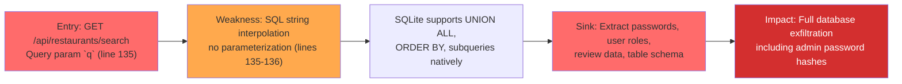
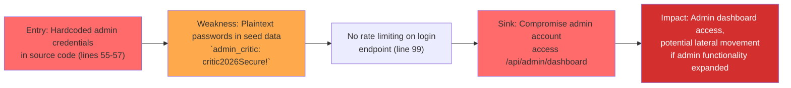
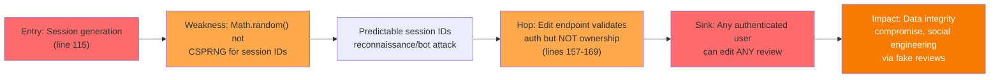
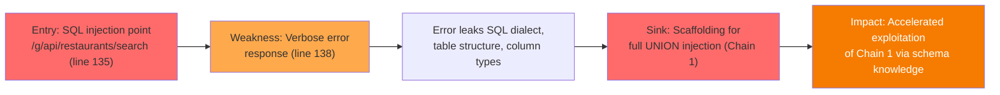

# Chained Vulnerability Static Audit Report

**Project:** Restaurant Review Platform (app-16-restaurant-reviews)  
**Date:** 2026-05-24  
**Scope:** `src/index.js` (complete application)  
**Review Type:** Static-only analysis — no live probes, no dynamic testing, no external tooling

---

## Summary Dashboard

| Metric | Value |
|--------|-------|
| Total chains identified | **4** |
| Maximum severity | **HIGH** |
| HIGH severity chains | 2 |
| MEDIUM severity chains | 2 |
| CONFIDENCE levels | 3 HIGH, 1 MEDIUM |
| Reviewed areas | Express routes, auth, database queries, CORS, sessions, error handling |
| Areas not reviewed | Frontend templates (none found), CI/CD configs, infra-as-code, deployment configs |

---

## Methodology & Safety Note

This review is **static-only**. The methodology follows four phases:

1. **Attack surface mapping** — All routes, middleware, authentication, authorization, data flow paths.
2. **Weakness inventory** — Individual vulnerabilities classified by CWE.
3. **Attack graph synthesis** — Sources linked to sinks via concrete control-flow and data-flow evidence from source code.
4. **Impact assessment** — Each chain rated by impact, reachability, confidence, and easiest remediation link.

No HTTP probes, SQL injection payloads, fuzzers, credential attacks, or live network tests were performed.

---

## Attack Surface Map

| Route | Method | Auth | Description |
|-------|--------|------|-------------|
| `/api/auth/register` | POST | None | User registration |
| `/api/auth/login` | POST | None | User login (cookie session) |
| `/api/auth/logout` | POST | None | User logout |
| `/api/admin/dashboard` | GET | Required + ADMIN role | Admin dashboard |
| `/api/restaurants/search` | GET | None | Restaurant search |
| `/api/restaurants/:id` | GET | None | Single restaurant |
| `/api/reviews` | GET | None | List all reviews |
| `/api/reviews/:id/edit` | POST | Required | Edit a review |

**Dependencies:** Express 4.19, sqlite3 5.1, bcryptjs 2.4, cookie-parser 1.4, cors 2.8  
**Session model:** In-memory object `sessions`, cookie-based `session_id`  
**Database:** In-memory SQLite (no persistence, but schema still applicable to production)

---

## Detailed Chain Breakdowns

### Chain 1: SQL Injection → Complete Database Exfiltration

**Severity:** HIGH  
**Confidence:** HIGH  
**CWE:** CWE-89 (SQL Injection)

#### Attack Graph (Mermaid)



#### Source → Hop → Sink

| Link | File | Line(s) | Evidence |
|------|------|---------|----------|
| **Entry** | `src/index.js` | 135 | `const queryParam = req.query.q || '';` — User-controlled input accepted without sanitization |
| **Hop 1** | `src/index.js` | 136 | `const sql = \`SELECT * FROM restaurants WHERE name LIKE '%${queryParam}%' OR cuisine LIKE '%${queryParam}%'\`;` — Direct string interpolation into SQL, no parameter binding, no escaping |
| **Hop 2** | `src/index.js` | 137 | `db.all(sql, ...)` — SQLite driver executes the raw string |
| **Sink** | `src/index.js` | 51-83 | Tables `users` (id, username, password_hash, role), `restaurants`, `reviews` exist — UNION-based injection can enumerate and extract all columns and rows |

#### Preconditions
- The SQL injection endpoint is publicly accessible at `/api/restaurants/search` with no authentication required.
- SQLite supports standard UNION SELECT syntax, PRAGMA table_info, and subqueries.
- The `details: err.message` verbose error output (line 138) can aid blind/inferential injection.

#### Impact
Complete database exfiltration. An attacker can extract all user credentials (password hashes), review content, and restaurant data. Password hashes could be cracked offline given the weak seed passwords (e.g., `alice123`, `bob456`).

#### Remediation (Easiest link to break)
**Parameterize the query** — Replace line 136 with:
```js
const sql = 'SELECT * FROM restaurants WHERE name LIKE ? OR cuisine LIKE ?';
db.all(sql, [`%${queryParam}%`, `%${queryParam}%`], (err, rows) => { ... });
```

---

### Chain 2: Hardcoded Credentials → Admin Privilege Escalation

**Severity:** HIGH  
**Confidence:** HIGH  
**CWE:** CWE-798 (Use of Hard-coded Credentials), CWE-307 (Improper Restriction of Excessive Authentication Entropy)

#### Attack Graph (Mermaid)



#### Source → Hop → Sink

| Link | File | Line(s) | Evidence |
|------|------|---------|----------|
| **Entry** | `src/index.js` | 55-57 | `admin_critic` with plaintext password `critic2026Secure!` hardcoded in seed data array |
| **Hop 1** | `src/index.js` | 99-115 | Login endpoint accepts any username/password, no rate limiting, returns `role: user.role` confirming admin status |
| **Hop 2** | `src/index.js` | 121-125 | Admin dashboard returns success to any user with `role === 'ADMIN'`, no additional audit or sensitive data shown |
| **Sink** | `src/index.js` | 121 | Admin privilege confirmed — future admin endpoints would be immediately exploitable |

#### Preconditions
- Source code is accessible to the attacker (common in open-source, containers, git repos, or CI artifacts).
- The application runs with the hardcoded seed credentials in production.

#### Impact
Immediate admin account compromise via source code disclosure. While the current admin dashboard only returns a generic welcome message, any future admin endpoints (user management, review moderation, database operations) would be accessible to the attacker.

#### Remediation (Easiest link to break)
**Remove hardcoded credentials** from source. Seed accounts should only exist in isolated development environments or via a separate seed script not included in production builds.

---

### Chain 3: Predictable Sessions + IDOR → Unauthorized Review Modification

**Severity:** MEDIUM  
**Confidence:** MEDIUM  
**CWE:** CWE-330 (Use of Insufficiently Random Values), CWE-639 (Authorization Bypass Through User Control)

#### Attack Graph (Mermaid)



#### Source → Hop → Sink

| Link | File | Line(s) | Evidence |
|------|------|---------|----------|
| **Entry** | `src/index.js` | 115 | `const sessionId = Math.random().toString(36).substring(2) + Math.random().toString(36).substring(2);` — Two concatenated `Math.random()` calls generate 26-char session IDs |
| **Hop 1** | `src/index.js` | 115 | `Math.random()` is the V8 PRNG, not cryptographically secure — session ID space is predictable |
| **Hop 2** | `src/index.js` | 157-169 | `db.run('UPDATE reviews SET review_text = ?, rating = ? WHERE id = ?', [review_text, rating, reviewId], ...)` — Only checks `user.role !== 'ADMIN'` on admin endpoint; the edit endpoint checks `requireAuth` but **never verifies** that `req.user.id` matches the review's `user_id` |
| **Sink** | `src/index.js` | 160-169 | Any authenticated user can rewrite any review's text and rating |

#### Preconditions
- The attacker can obtain or guess a valid session ID (aided by non-cryptographic randomness).
- The attacker registers an account and logs in to authenticate.
- Review IDs are sequential and guessable (autoincrement primary key).

#### Impact
Any authenticated user can modify any review, undermining platform integrity. In a restaurant review platform, this could be used for reputation attacks (deleting negative reviews, injecting fake positive reviews).

#### Remediation (Easiest link to break)
**Add ownership validation** in the edit handler (around line 159):
```js
// Verify ownership
db.get('SELECT * FROM reviews WHERE id = ? AND user_id = ?', [reviewId, req.user.id], (err, review) => {
  if (!review) {
    return res.status(403).json({ error: 'You can only edit your own reviews.' });
  }
  // ... proceed with update
});
```

---

### Chain 4: SQL Injection → Error-Based Schema Enumeration

**Severity:** MEDIUM  
**Confidence:** HIGH  
**CWE:** CWE-209 (Generation of Error Message Containing Sensitive Information)

#### Attack Graph (Mermaid)



#### Source → Hop → Sink

| Link | File | Line(s) | Evidence |
|------|------|---------|----------|
| **Entry** | `src/index.js` | 135 | User-controlled `req.query.q` enters the SQL query |
| **Hop 1** | `src/index.js` | 136 | SQL is built via string interpolation |
| **Hop 2** | `src/index.js` | 138 | `return res.status(500).json({ error: 'Search failed.', details: err.message });` — The `details` field echoes the raw SQLite error message back to the client |
| **Sink** | `src/index.js` | 137 | `db.all(sql, ...)` — Error propagates unfiltered to the HTTP response |

#### Preconditions
- The SQL injection triggers an error (e.g., malformed injection syntax).
- The attacker reads the `details` field in the 500 response.

#### Impact
SQLite error messages reveal table names, column names, types, and schema constraints, making UNION-based attacks (Chain 1) trivially discoverable. This is not an independent data leak but an **accelerant** for Chain 1.

#### Remediation (Easiest link to break)
**Remove error details from production responses** — Log errors server-side and return a generic message:
```js
if (err) {
  console.error('Search DB error:', err);
  return res.status(500).json({ error: 'Search failed.' });
}
```

---

## Cross-Cutting Weaknesses

The following security-relevant issues do not form complete chains to critical sinks in the current codebase but represent real risks:

| Weakness | CWE | File:Line | Description |
|----------|-----|-----------|-------------|
| **No CSRF Protection** | CWE-352 | `src/index.js`: 8-11 | CORS enabled with `credentials: true`, cookie sessions, but no CSRF token middleware on any state-changing endpoint (`/api/auth/register`, `/api/auth/login`, `/api/auth/logout`, `/api/reviews/:id/edit`). Browsers sending cookies could be tricked into sending authenticated requests via cross-site forms. |
| **Verbose Error Responses** | CWE-209 | `src/index.js`: 138 | Database error details (`err.message`) are returned directly to the client, leaking SQL dialect and schema hints. |
| **No Rate Limiting** | CWE-780 | `src/index.js`: 99 | `/api/auth/login` has no rate limiting. Combined with hardcoded weak passwords, brute-force attacks are trivial. |
| **No Input Validation on Reviews** | CWE-20 | `src/index.js`: 160-161 | Review `rating` accepts any integer from the body. Values outside 1-5 are not validated, potentially corrupting data. |
| **No Content Security Policy** | Info | Entire app | No `Content-Security-Policy` header. If any future view rendering is added, XSS risks increase. |
| **In-Memory Sessions Not Persisted** | CWE-359 | `src/index.js`: 92 | `const sessions = {};` — Session data is lost on process restart. In production, a persistent session store (Redis, etc.) is needed, and session cleanup/expiration logic is absent. |
| **Sesssion Expiration Missing** | CWE-613 | `src/index.js`: 112 | No `expires`, `maxAge`, or `secure` flags on session cookies. Session cookies persist across browser restarts and send over non-HTTPS connections. |

---

## Risk Matrix

| Chain | Severity | Confidence | Reachability | Easiest Fix |
|-------|----------|------------|--------------|-------------|
| SQL Injection → DB Exfiltration | HIGH | HIGH | Public, no auth | Parameterize queries |
| Hardcoded Creds → Admin Access | HIGH | HIGH | Source code exposure | Remove hardcoded passwords |
| Predictable Sessions + IDOR | MEDIUM | MEDIUM | Requires login | Add ownership check |
| SQLi Error Leak → Schema Disclosure | MEDIUM | HIGH | Public, no auth | Strip error details |

---

## Unknowns & Not-Reviewed Areas

| Area | Status |
|------|--------|
| Frontend rendering templates | Not present — app is a pure JSON API |
| CI/CD pipeline configs | Not reviewed |
| Infrastructure / deployment configs | Not reviewed |
| Network security (TLS, WAF, network isolation) | Not reviewed |
| SQLite persistence strategy in production | Currently in-memory; unknown if this changes in prod |
| Client-side code | Not reviewed |
| Dependency security audit | `npm audit` not run — known vulnerabilities in express 4.19 or cookie-parser 1.4.6 unknown |
| CORS configuration: `origin: true` | **Suspicious** — `cors({ origin: true })` reflects the requesting Origin header, which in express-cors means it allows any origin. Combined with `credentials: true`, this is a permissive CORS misconfiguration (CORS + credentials reflection). However, no obvious impact without CSRF or a vulnerable frontend. |

---

## Recommended Test Additions

| Test Type | Target | Priority |
|-----------|--------|----------|
| Parameterized query unit test | `/api/restaurants/search` | P0 — verify SQL injection is blocked |
| Ownership validation test | `/api/reviews/:id/edit` | P0 — verify users cannot edit other users' reviews |
| CSRF token test | All POST endpoints | P1 — verify missing CSRF token is rejected |
| Error sanitization test | All endpoints | P1 — verify no SQL error details in 500 responses |
| Session security test | Login flow | P1 — verify session IDs use CSPRNG |
| CORS policy test | `/api/auth/login` | P1 — verify `origin: true` does not over-reflect allowed origins |
| Rate limiting test | `/api/auth/login` | P2 — verify throttling after repeated failed logins |
| Hardcoded secret scan | All source files | P2 — verify no plaintext passwords in non-seed code |

---

## Remediation Priority Summary

1. **Parameterize the SQL query** at `src/index.js:136` — breaks Chains 1 and 4.
2. **Remove hardcoded credentials** from `src/index.js:51-57` — breaks Chain 2.
3. **Add review ownership validation** at `src/index.js:157-169` — breaks Chain 3.
4. **Strip database error details** from responses at `src/index.js:138`.
5. **Add CSRF protection** (csurf or custom token) on all mutating endpoints.
6. **Replace `Math.random()`** for session ID generation with `crypto.randomUUID()` or `crypto.randomBytes()`.
7. **Fix CORS configuration** — replace `origin: true` with explicit allowed origins.
