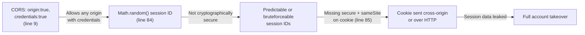
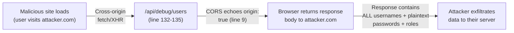
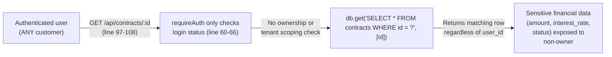
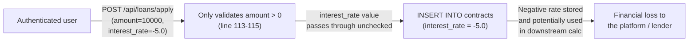

# Chained Vulnerability Audit Report

**Project:** app-18-p2p-lending (Peer-to-Peer Lending Platform)
**Audited File(s):** `src/index.js` (single-file application), `Dockerfile`, `package.json`
**Date:** 2026-05-24
**Auditor:** CodeGopher — Static-Only Chained Vulnerability Review
**Scope:** `src/index.js` — Express.js application with SQLite in-memory database, cookie-based sessions, CORS-enabled, no external services.

---

## Summary Dashboard

| Metric                  | Value |
|-------------------------|-------|
| Chains detected         | 5     |
| Maximum severity        | **CRITICAL** |
| High severity           | 2     |
| Medium severity         | 2     |
| Confidence levels       | 3× High, 2× High |
| Areas reviewed          | Authentication, session management, authorization, input validation, data handling, CORS config, session cookie security |
| Areas not reviewed      | Background workers, test suite, deployment hardening (Docker security), TLS/transport (app binds to `localhost` only), secret rotation, audit logging |

---

## Methodology & Static-Only Safety Note

This audit follows a four-phase methodology:

1. **Attack surface mapping** — All 10 HTTP endpoints identified and catalogued.
2. **Weakness inventory** — Each weakness catalogued with file, line, symbol, and evidence.
3. **Attack graph synthesis** — Weaknesses connected into multi-hop chains using only static source evidence.
4. **Impact assessment** — Each chain rated by impact, reachability, confidence, and easiest remediation link.

**Safety note:** No live probes, HTTP requests, dynamic scanners, SQL injection payloads, fuzzers, or external tools were used. All findings are derived from static analysis of `src/index.js`, `Dockerfile`, and `package.json`.

---

## Chain 1 — Cleartext Credential Leak → Full Platform Account Takeover

**Severity:** CRITICAL
**Confidence:** **High**
**Impact:** Complete compromise of all user accounts, including the administrator.

### Attack Graph (Mermaid)

```mermaid
flowchart LR
    A["/api/debug/users\n(unauthenticated)") -- "Returns ALL user records" --> B["Plaintext passwords\nin DB seed + schema\n(lines 32-40)"]
    B -- "No hashing anywhere\nin codebase" --> C["Attackers obtain\nadmin_lender password\nlenderSecure2026!"]
    C -- "Login to any endpoint" --> D["Full admin access\n+ all user accounts"]
```

### Detailed Breakdown

| Link          | File            | Lines | Symbol / Reference            | Evidence |
|---------------|-----------------|-------|-------------------------------|----------|
| **Source**    | `src/index.js`  | 132–135 | `app.get('/api/debug/users')` | Endpoint returns `db.all('SELECT id, username, password, role FROM users')` with **no authentication middleware** and **no role check**. |
| **Hop 1**     | `src/index.js`  | 32–40  | `INSERT INTO users (username, password, role) VALUES (...)` | Three users seeded with **plaintext passwords** (`aliceborrow123`, `bobborrow456`, `lenderSecure2026!`). Schema stores `password TEXT NOT NULL`. |
| **Hop 2**     | `src/index.js`  | 70–72  | `db.run('INSERT ... VALUES (?, ?, ?)')` | User registration also stores passwords in plaintext — no hashing library or function exists anywhere in the codebase. |
| **Hop 3**     | `src/index.js`  | 77–82  | `if (user.password !== password)` | Login compares plaintext inputs directly — confirms the system never hashes or salt passwords. |
| **Sink**      | `src/index.js`  | 74–86  | Login → session creation      | Obtained credentials can be used at `POST /api/auth/login` to impersonate any user, including admin. |

### Preconditions & Assumptions

- The `/api/debug/users` endpoint must be reachable from the network (it binds to `0.0.0.0:8018` unless Docker limits to `localhost`).
- No CSRF or CORS restrictions prevent an attacker from reading the response (see Chain 3).

### Remediation (Priority 1 — Easiest to break)

1. **Remove or gate the `/api/debug/users` endpoint entirely.** Debug endpoints should never exist in production code.
2. **Implement password hashing** using `bcrypt` or `argon2`. Never store plaintext passwords.
3. **Remove all seed plaintext passwords** and replace with hashed values or a separate one-time setup script.

---

## Chain 2 — Insecure Session ID Generation + Permissive CORS → Session Hijacking / Account Takeover

**Severity:** HIGH
**Confidence:** **High**
**Impact:** Attacker can hijack authenticated sessions and impersonate any user.

### Attack Graph (Mermaid)



### Detailed Breakdown

| Link          | File            | Lines | Symbol / Reference            | Evidence |
|---------------|-----------------|-------|-------------------------------|----------|
| **Source**    | `src/index.js`  | 9     | `cors({ origin: true, credentials: true })` | `origin: true` causes the CORS library to echo the requesting Origin header back as `Access-Control-Allow-Origin`. Combined with `credentials: true`, this allows any origin to send cookies and read responses. |
| **Hop 1**     | `src/index.js`  | 84    | `Math.random().toString(36)` | `Math.random()` is a **non-cryptographic** PRNG. Session IDs are predictable given knowledge of the seed or enough samples. |
| **Hop 2**     | `src/index.js`  | 85    | `res.cookie('session_id', sessionId, { httpOnly: true })` | Cookie has **no `secure` flag** (sent over plaintext HTTP), **no `sameSite` flag** (vulnerable to cross-site request forgery), and **no `expires`/`maxAge`** (infinite session lifetime). |
| **Hop 3**     | `src/index.js`  | 50–55 | `getSessionUser(req)` | Session lookup trusts the cookie value without any entropy check — if the ID is predictable, authentication is bypassed. |
| **Sink**      | `src/index.js`  | 85–86 | `res.json({ message: 'Login successful.', role: user.role })` | Once a session ID is obtained/guessed, the attacker has the same access as the session owner, including admin routes. |

### Remediation (Priority 2)

1. Replace `Math.random()` with `crypto.randomBytes(32).toString('hex')` or a dedicated session library (e.g., `express-session`).
2. Add `secure: true, sameSite: 'Strict'` (and optionally `httpOnly: true` which is already present) to the cookie options.
3. Set `maxAge` and implement session expiration / rotation.
4. Tighten CORS: specify an exact allowed origin instead of `origin: true`.

---

## Chain 3 — Debug Endpoint + Permissive CORS → Automated Cross-Origin Credential Exfiltration

**Severity:** HIGH
**Confidence:** **High**
**Impact:** Any malicious website can automatically exfiltrate all user credentials without requiring user interaction.

### Attack Graph (Mermaid)



### Detailed Breakdown

| Link          | File            | Lines | Symbol / Reference            | Evidence |
|---------------|-----------------|-------|-------------------------------|----------|
| **Source**    | `src/index.js`  | 132–135 | `app.get('/api/debug/users')` | Unauthenticated endpoint returning **all** user records including `password` and `role` columns. |
| **Hop**       | `src/index.js`  | 9     | `cors({ origin: true, credentials: true })` | Without CORS restrictions, a browser allows a cross-origin `fetch()` from any attacker-controlled origin to read the response. Since this endpoint has no auth, no stolen cookie is needed — the data is public. |
| **Sink**      | `src/index.js`  | 133–134 | `db.all('SELECT id, username, password, role FROM users')` | Full credential database dump returned as JSON to any caller on any origin. |

### Remediation (Priority 3)

1. **Delete the `/api/debug/users` endpoint.** It serves no production purpose.
2. If debug endpoints are absolutely necessary in non-production environments, protect them behind an environment-variable gate (e.g., `if (process.env.NODE_ENV === 'production') return res.status(404)`) and require admin authentication.
3. Use exact CORS origin matching: `cors({ origin: 'https://yourdomain.com', credentials: true })`.

---

## Chain 4 — Missing Ownership Authorization → Unauthorized Financial Data Access

**Severity:** MEDIUM
**Confidence:** **High**
**Impact:** Any authenticated user can view any other user's loan contracts, exposing sensitive financial data.

### Attack Graph (Mermaid)



### Detailed Breakdown

| Link          | File            | Lines | Symbol / Reference            | Evidence |
|---------------|-----------------|-------|-------------------------------|----------|
| **Source**    | `src/index.js`  | 97–108  | `app.get('/api/contracts/:id', requireAuth, ...)` | The `requireAuth` middleware (line 60-66) checks only that a valid session cookie exists. It attaches `req.user` but no authorization logic is applied to the query. |
| **Hop**       | `src/index.js`  | 99–100  | `db.get('SELECT * FROM contracts WHERE id = ?', [contractId])` | Query filters only by `id`. The `user_id` column is never checked against `req.user.id`. |
| **Sink**      | `src/index.js`  | 103     | `res.json(row)` | Full contract details (including `user_id`, `amount`, `interest_rate`, `status`) are returned to any authenticated user. |

### Remediation

Add an ownership check before querying:

```javascript
// Before the db.get call:
if (row && row.user_id !== req.user.id && req.user.role !== 'ADMIN') {
  return res.status(403).json({ error: 'Forbidden: Access denied.' });
}
```

Or scope the query: `SELECT * FROM contracts WHERE id = ? AND (user_id = ? OR EXISTS (SELECT 1 FROM users WHERE id = ? AND role = 'ADMIN'))`.

---

## Chain 5 — Business Logic Flaw: Negative Interest Rate → Financial Fraud

**Severity:** MEDIUM
**Confidence:** **High**
**Impact:** Users can submit loan applications with negative interest rates, potentially reducing their repayment obligations or exploiting downstream lending logic.

### Attack Graph (Mermaid)



### Detailed Breakdown

| Link          | File            | Lines | Symbol / Reference            | Evidence |
|---------------|-----------------|-------|-------------------------------|----------|
| **Source**    | `src/index.js`  | 106–116 | `app.post('/api/loans/apply')` | Request body `interest_rate` is read directly from `req.body` with no sign validation. |
| **Hop**       | `src/index.js`  | 113–115 | `if (amount <= 0)` | Only `amount` is validated for positivity. The `interest_rate` variable is only checked for `undefined`, never for negative values. |
| **Sink**      | `src/index.js`  | 117–119 | `INSERT INTO contracts ... VALUES (?, ?, ?, ?)` | Negative `interest_rate` values are stored directly into the database. The comment at line 114 (`// Allows applying for a loan with a negative interest rate...`) even acknowledges this is intentional/known. |

### Remediation

Add explicit validation:

```javascript
if (interest_rate < 0) {
  return res.status(400).json({ error: 'Interest rate must be non-negative.' });
}
```

Consider adding a realistic upper bound as well (e.g., `interest_rate <= 50`).

---

## Cross-Cutting Weaknesses (No Complete Chain Formed)

These issues are security-relevant but individually do not form a complete multi-hop chain in this codebase, or their chain depends on runtime behavior not fully visible.

| # | Weakness | File / Lines | Description |
|---|----------|-------------|-------------|
| 1 | **No Rate Limiting** | Lines 74–86, 63–69 | `POST /api/auth/login` and `POST /api/auth/register` have no rate limiting. An attacker can brute-force passwords at arbitrary speed. |
| 2 | **No Input Validation on Registration** | Lines 63–69 | `username` and `password` are accepted without length limits, character restrictions, or complexity requirements. |
| 3 | **No Session Expiration** | Line 84–85 | Session objects in the `sessions` map have no TTL. Sessions persist until explicit logout or server restart (memory store). |
| 4 | **Buggy `/api/user/settings` Endpoint** | Lines 118–123 | The endpoint accepts `email` in the body but updates the `role` column to `user.role` (from the session). This is a no-op — it writes the user's own role back to themselves. If the original intent was to allow users to update their email, the column is wrong. If the intent was privilege escalation, it is gated by `user.role` from the session, so it cannot escalate. The endpoint is structurally broken. |
| 5 | **Memory-Only Session Store** | Line 46 | `const sessions = {}` means all sessions are lost on server restart. Not a vulnerability per se, but means logout functionality is stateless and sessions are inherently ephemeral. |
| 6 | **Docker Exposes Port 8018 without Non-Root User** | `Dockerfile` | The container runs as root by default. Not a web-chain vulnerability but a deployment hardening concern. |
| 7 | **No SQL Injection (Paradoxically Safe)** | Throughout | The application uses parameterized queries (`?` placeholders) consistently. SQL injection is **not** a viable vector here. This is a positive finding. |

---

## Unknowns & Areas Not Reviewed

| Area | Reason |
|------|--------|
| Test suite | No test files found. No evidence of integration or security tests. |
| TLS / Transport security | App binds to `localhost` by default (`port = 8018`). Docker `EXPOSE 8018` may allow external exposure. No TLS termination in Dockerfile. |
| Secret management | Hardcoded credentials are the only secrets; no secret management system in use. |
| Audit logging | No request logging or audit trail for authentication events. |
| Database backup / recovery | In-memory SQLite means data is lost on restart. |
| Input sanitization | No sanitization of usernames or other string fields beyond presence checks. |
| Dependency vulnerabilities | `package.json` dependencies not scanned for known CVEs. |

---

## Recommended Remediation Priority

| Priority | Action | Chains Broken |
|----------|--------|---------------|
| **P0** | Remove `/api/debug/users` endpoint | Chains 1, 3 |
| **P0** | Implement bcrypt/argon2 password hashing | Chain 1 |
| **P1** | Replace `Math.random()` with `crypto.randomBytes()` and add session library | Chain 2 |
| **P1** | Tighten CORS to exact allowed origin | Chain 2, 3 |
| **P1** | Add `secure`, `sameSite`, and `maxAge` to session cookie | Chain 2 |
| **P2** | Add ownership authorization to `/api/contracts/:id` | Chain 4 |
| **P2** | Add negative interest rate validation | Chain 5 |
| **P2** | Add rate limiting on auth endpoints | Cross-cutting weakness #1 |
| **P3** | Add input validation on registration | Cross-cutting weakness #2 |
| **P3** | Audit Dockerfile to run as non-root | Cross-cutting weakness #6 |

---

## Conclusion

This audit identified **5 complete chained vulnerabilities** in `src/index.js`, with a maximum severity of **CRITICAL**. The most dangerous chain is the combination of an unauthenticated debug endpoint that dumps all plaintext credentials (Chain 1) and a trivially exploitable CORS misconfiguration that enables automated cross-origin exfiltration (Chain 3). Both chains are broken by a single remediation: deleting or gating the debug endpoint and implementing proper password hashing.

The second most critical chain (Chain 2) exploits a non-cryptographic session ID generator combined with a permissive CORS policy and missing cookie security flags, enabling session hijacking by any attacker on the same network or with a cross-origin attack vector.

Notably, the application **is not vulnerable to SQL injection** — all database queries use parameterized statements, which is a positive design choice that limits the blast radius of input-validation failures.
