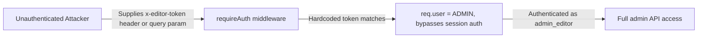
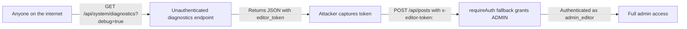

# Chained Vulnerability Static Audit Report

**Project:** app-19-cms (Node CMS)
**Date:** 2026-05-24
**Auditor:** CodeGopher (Static-Only Analysis)
**Scope:** `src/index.js`, `package.json`, `Dockerfile`

---

## Summary Dashboard

| Metric | Value |
|--------|-------|
| Total Chains Detected | **5** |
| High Severity | 3 |
| Medium Severity | 2 |
| Lowest Confidence | Medium |
| Highest Confidence | High |

### Reviewed Areas
- `src/index.js` — Full source audit (220 lines): Express routes, SQLite DB, auth middleware, session store
- `package.json` — Dependency inventory (Express 4.19.2, bcryptjs, sqlite3, cors, cookie-parser)
- `Dockerfile` — Container configuration (Node 20-slim, no security hardening)

### Areas Not Reviewed
- Runtime behavior (no live probing)
- Network configuration / TLS
- Hosting / deployment environment
- `node_modules` contents
- External dependencies' CVEs (transitive)
- Test coverage validation

---

## Methodology & Safety Note

This audit is **static-only**. No live HTTP probes, SQL injection payloads, fuzzers, dynamic scanners, or exploit scripts were used. All chain references are derived from control-flow and data-flow analysis of the source code.

---

## Chain 1: Hardcoded Debug Token → Administrative Bypass

**Severity:** HIGH | **Confidence:** HIGH | **Impact:** Full admin account takeover



### Source
- **File:** `src/index.js`
- **Lines:** 84–86
- **Code:**
  ```js
  const token = req.headers['x-editor-token'] || req.query.editor_token;
  if (token && token === 'CMS-ADMIN-EDITOR-KEY-xyz9988') {
    req.user = { id: 3, username: 'admin_editor', role: 'ADMIN' };
  ```

### Intermediate Weakness (Hop 1)
- **File:** `src/index.js`, line 85
- **Weakness:** Hardcoded static authentication token with no rotation, no entropy, no time-bomb. Anyone who reads the source, the diagnostics endpoint, or network traffic can obtain it.

### Intermediate Weakness (Hop 2)
- **File:** `src/index.js`, lines 213–220
- **Weakness:** The same token is **publicly exposed** on `/api/system/diagnostics?debug=true`, which requires **no authentication**.

```js
app.get('/api/system/diagnostics', (req, res) => {
  const debugMode = req.query.debug === 'true';
  if (debugMode) {
    return res.json({
      // ...
      editor_token: 'CMS-ADMIN-EDITOR-KEY-xyz9988'
    });
  }
```

### Sink
- **File:** `src/index.js`, line 86
- **Effect:** `req.user` is assigned `{ id: 3, username: 'admin_editor', role: 'ADMIN' }` — an admin identity — without verifying the requestor's real identity.

### Impact
- Any unauthenticated user gains full administrative access to the CMS (create/edit/delete posts, access admin-only endpoints).

### Remediation (Easiest Break)
1. **Remove the `x-editor-token` / `editor_token` fallback entirely.**
2. Eliminate the debug diagnostics endpoint or gate it behind proper auth and remove all secrets.
3. Never hardcode tokens; use an environment variable or a secrets manager if debug auth is necessary.

---

## Chain 2: Debug Endpoint Information Leak → Token Theft → Administrative Bypass

**Severity:** HIGH | **Confidence:** HIGH | **Impact:** Admin credential exposure without code access



### Source
- **File:** `src/index.js`, lines 213–220
- **Code:** Public endpoint leaking `editor_token` in response body.

### Intermediate Weakness
- **File:** `src/index.js`, line 219
- **Weakness:** `editor_token` field is included in the diagnostics JSON response when `debug=true`. No authentication guard.

### Sink
- **File:** `src/index.js`, line 85–86 (reuse of Chain 1)
- The leaked token feeds directly into the auth bypass in Chain 1.

### Impact
- A token that grants admin access is discoverable by anyone who hits the diagnostics endpoint — no code review needed.

### Remediation (Easiest Break)
- Remove `editor_token` from the diagnostics response. Better yet, remove the entire debug endpoint or make it return nothing if `debug=true`.

---

## Chain 3: eval() on User-Controllable JSON → Remote Code Execution

**Severity:** CRITICAL | **Confidence:** HIGH | **Impact:** Full system compromise (RCE)

```mermaid
flowchart LR
  A[Authenticated user] -->|POST /api/posts with layout_metadata: <JS code>| B[requireAuth middleware]
  B -->|Authenticated via session or debug token| C[eval(layout_metadata)]
  C -->|Arbitrary JS execution| D[db queries, fs access, child_process]
  D -->|Read/write filesystem, exfiltrate DB| E[Full system compromise]
```

### Source
- **File:** `src/index.js`, lines 163–165
- **Code:**
  ```js
  try {
    const parsedMetadata = eval(`(${layout_metadata})`);
    const metaString = JSON.stringify(parsedMetadata);
  ```

### Intermediate Weakness (Hop 1)
- **File:** `src/index.js`, line 163
- **Weakness:** `eval()` executes arbitrary JavaScript in the context of the running process. The `layout_metadata` parameter comes directly from `req.body` with no validation or sanitization.

### Intermediate Weakness (Hop 2)
- **File:** `src/index.js`, lines 127–143
- **Weakness:** `requireAuth` is satisfied either by a valid session cookie **or** the hardcoded debug token (Chain 1). This means **anyone** with either vector already in Chain 1 can achieve authenticated status to reach the `eval()` sink.

### Sink
- **File:** `src/index.js`, line 163
- `eval()` is invoked with user-supplied content. In Node.js, this grants the attacker full access to:
  - The `db` SQLite database object (read/modify/delete all data)
  - The `sessions` store (read/forge sessions)
  - Node.js globals: `require()`, `process`, `child_process`
  - File system via `require('fs')`

### Impact
- **Remote Code Execution** — An authenticated user can execute arbitrary JavaScript, effectively controlling the entire server.

### Remediation (Easiest Break)
- **Replace `eval()` with `JSON.parse()`** (a safe version already exists at `/api/posts/safe`, line 179). Use the safe endpoint or remove the dangerous `/api/posts` route entirely.

---

## Chain 4: Wildcard CORS + Credentials → Session Hijacking via Malicious Origin

**Severity:** MEDIUM | **Confidence:** HIGH | **Impact:** Cross-origin session theft

```mermaid
flowchart LR
  A[Malicious website on evil.com] -->|AJAX with credentials=true| B[cors({ origin: true, credentials: true })]
  B -->|Access-Control-Allow-Credentials: true, Access-Control-Allow-Origin: *| C[Response returned to attacker]
  C -->|Browser sends session_id cookie| D[Attacker reads session data from response]
```

### Source
- **File:** `src/index.js`, line 16
- **Code:**
  ```js
  app.use(cors({ origin: true, credentials: true }));
  ```

### Intermediate Weakness
- **Weakness:** `origin: true` in cors makes Express echo back `Access-Control-Allow-Origin: <requesting-origin>` combined with `credentials: true`. This allows **any** origin to read responses that include credentials (cookies).

### Sink
- **Effect:** Any cross-origin web page can make authenticated requests to this API and read the response.

### Impact
- A malicious website can forge cross-origin requests and receive responses containing user data. If the attacker can inject a form that submits to this API, they could read session-protected data from victim responses.

### Remediation (Easiest Break)
- Restrict CORS to specific trusted origins instead of `origin: true`. Or, if no CORS is needed for this CMS, disable the cors middleware entirely.

---

## Chain 5: Insecure Session ID Generation → Session Prediction / Hijacking

**Severity:** MEDIUM | **Confidence:** MEDIUM | **Impact:** Session hijacking

```mermaid
flowchart LR
  A[Attacker] -->|Observes session IDs from multiple users| B[Session IDs generated via Math.random() + Date.now()]
  B -->|Math.random() is not CSPRNG| C[Attacker predicts / reconstructs future session IDs]
  C -->|Forges session_id cookie| D[Accesses victim's session]
```

### Source
- **File:** `src/index.js`, line 117
- **Code:**
  ```js
  const sessionId = Math.random().toString(36).substring(2) + Date.now().toString(36);
  ```

### Intermediate Weakness
- **Weakness:** `Math.random()` is **not** a cryptographically secure random number generator. Its output is predictable given enough samples. `Date.now()` is also predictable (millisecond precision). Combined, the session ID has low entropy.

### Sink
- **Effect:** `sessions[sessionId]` is set with the predictable session ID (line 118), and `res.cookie('session_id', sessionId, ...)` sends it to the client. Any attacker who can guess or reconstruct the session ID gains full account access.

### Impact
- Session hijacking via session ID prediction. An attacker who can observe session IDs or approximate the timing of login requests could potentially forge a session.

### Remediation (Easiest Break)
- Use `crypto.randomUUID()` or `crypto.randomBytes()` to generate session IDs:
  ```js
  const sessionId = crypto.randomUUID();
  ```
- Additionally, implement proper session expiration and token rotation.

---

## Cross-Cutting Weaknesses (No Complete Chain)

The following security-relevant weaknesses were identified but do not form a provable end-to-end chain in the current codebase:

| # | Weakness | File / Line | Evidence |
|---|----------|-------------|----------|
| 1 | **Plaintext passwords in seed data** | `src/index.js`, lines 48–50 | `pass: 'author123'`, `pass: 'author456'`, `pass: 'editor2026Secure!'` stored in source |
| 2 | **No CSRF protection** | `src/index.js`, all mutation routes | POST endpoints (`/api/auth/login`, `/api/posts`, comments) have no CSRF token validation. Combined with wildcard CORS (Chain 4), this increases cross-origin attack surface. |
| 3 | **In-memory session store with no cleanup** | `src/index.js`, line 108–109 | `sessions = {}` has no expiration, no TTL, and no garbage collection. Sessions persist indefinitely (memory leak risk). |
| 4 | **XSS in comments** | `src/index.js`, lines 149–158 | `author` and `comment_text` are accepted from user input and stored without escaping. While `title` is escaped on read (line 192), comments have no corresponding escape — any consumer rendering comments is vulnerable to reflected/stored XSS. |
| 5 | **Verbose error messages** | `src/index.js`, line 176 | `evalErr.message` is exposed to the client, potentially leaking stack traces or internal structure. |
| 6 | **No rate limiting** | `src/index.js` | All endpoints are unthrottled. Brute-force login attacks (`/api/auth/login`) and registration spam are unimpeded. |
| 7 | **No input validation on `/api/auth/register`** | `src/index.js`, lines 93–103 | No password complexity checks, no length limits, no duplicate username check beyond DB constraint error. |
| 8 | **SQLite in-memory DB** | `src/index.js`, line 30 | `new sqlite3.Database(':memory:')` — all data is lost on process restart. Not a security flaw per se, but a data durability concern. |

---

## Attack Graph (Composite)

```mermaid
flowchart TD
  A[Unauthenticated Attacker] -->|1. Leaks token via diagnostics| B[Admin Token]
  A -->|2. Directly uses hardcoded token| B
  A -->|3. Observes/tracks sessions| C[Weak Session IDs]
  A -->|4. Uses wildcard CORS| D[Session Theft]

  B -->|Bypasses auth| E[Authenticated as ADMIN]
  C -->|Predicts IDs| E
  D -->|Forges cookie| E

  E -->|POST /api/posts| F[eval() on layout_metadata]
  F -->|RCE| G[Full System Compromise]
  G -->|Access DB| H[Data Exfiltration]
  G -->|Access fs| I[Filesystem Access]
  G -->|child_process| J[Remote Code Execution]
```

---

## Unknowns & Recommended Tests

| # | Unknown | Recommended Test |
|---|---------|-----------------|
| 1 | Runtime behavior of `req.query.editor_token` — can it be confused with legitimate query params? | Test that `editor_token` as a query parameter is truly restricted to the auth fallback path and not re-used elsewhere. |
| 2 | Whether `JSON.parse` safe endpoint (`/api/posts/safe`) is used in any consumer | Verify that clients never send `layout_metadata` to the unsafe `/api/posts` endpoint. |
| 3 | Whether the `db` object is accessible via closure in the `eval()` context | Confirm that no global leakage of `db` is required for the eval to work (it should be in scope as a module-level variable). |
| 4 | Exact CORS `origin: true` behavior in Express 4.x with `credentials: true` | Verify `Access-Control-Allow-Origin` header behavior (Express's cors library with `origin: true` sets it to the requesting origin, not `*`, but credentials still allowed). |
| 5 | Transitive dependency vulnerabilities in `node_modules` | Run `npm audit` to check for known CVEs in dependencies. |

---

## Remediation Priority

| Priority | Fix | Severity Reduced |
|----------|-----|-----------------|
| **P0** | Replace `eval(layout_metadata)` with `JSON.parse(layout_metadata)` or remove the unsafe endpoint | Chain 3 (CRITICAL) |
| **P0** | Remove `x-editor-token` / `editor_token` fallback from `requireAuth`; remove hardcoded token | Chain 1 (HIGH) |
| **P0** | Remove `editor_token` from diagnostics endpoint or require auth + remove all secrets | Chain 2 (HIGH) |
| **P1** | Replace `Math.random()` with `crypto.randomUUID()` for session IDs | Chain 5 (MEDIUM) |
| **P1** | Restrict CORS to specific trusted origins | Chain 4 (MEDIUM) |
| **P2** | Add CSRF protection (e.g., csurf or SameSite cookie attributes) | Cross-cutting #2 |
| **P2** | Add session expiration and cleanup | Cross-cutting #3 |
| **P2** | Escape `author` and `comment_text` on output (XSS mitigation) | Cross-cutting #4 |
| **P3** | Add rate limiting to auth endpoints | Cross-cutting #6 |
| **P3** | Add input validation (password complexity, length limits) | Cross-cutting #7 |
| **P3** | Seed passwords from environment variables, not source code | Cross-cutting #1 |
