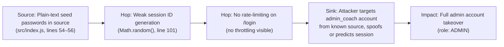
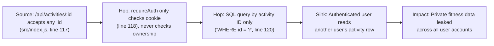
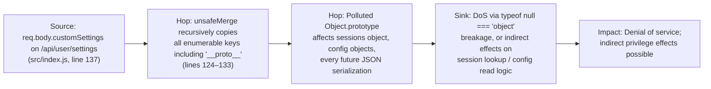
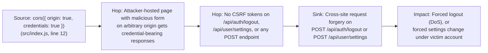
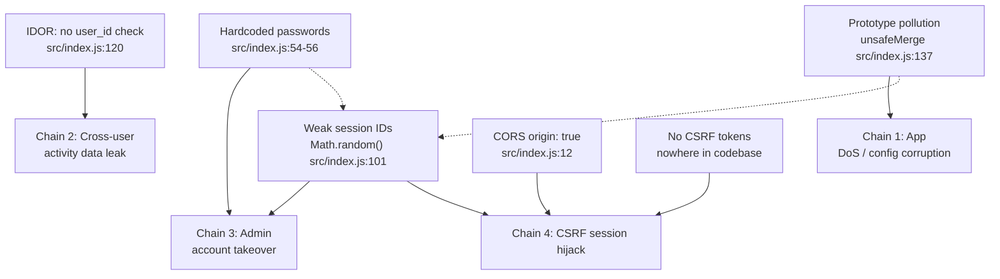

# Chained Vulnerability Audit Report — Fitness Tracker API

> **Project:** `app-20-fitness-tracker` (Fitness Tracking API)  
> **Source Root:** `src/index.js`  
> **Review Date:** 2026-05-24  
> **Auditor:** CodeGopher (static-only, no live probes)  
> **Tech Stack:** Express 4.x · SQLite 5.x (in-memory) · bcryptjs 2.x · cookie-parser · cors  
> **Dockerfile:** `FROM node:20-slim`, `EXPOSE 8020`

---

## 1. Summary Dashboard

| Metric | Value |
|---|---|
| **Total chained vulnerabilities** | **4** |
| **Maximum severity** | **HIGH** (Chain 3 — hardcoded credentials + weak sessions) |
| **High chains** | 1 |
| **Medium chains** | 2 |
| **Low chains** | 1 |
| **Cross-cutting weaknesses (non-chained)** | 4 |
| **Areas reviewed** | Routes, session management, DB queries, CORS config, auth flow, object merging, Dockerfile, package.json |
| **Areas not reviewed** | Deployment environment config, external network architecture, CI/CD pipeline, production hardening |

---

## 2. Methodology & Safety Note

- **Static-only boundary:** This audit inspects source code, configuration, and dependency manifests only. No HTTP probes, fuzzers, SQL-injection payloads, dynamic scanners, or live network tests were performed.
- **Technique:** Attack-surface mapping → weakness inventory → attack-graph synthesis → impact assessment.
- **Confidence levels:**  
  - **High** — every link provable from cited source lines.  
  - **Medium** — plausible chain but one hop depends on runtime / attacker-side behavior not fully visible in source.  
  - **Low** — weakly supported hypothesis.

---

## 3. Chained Vulnerabilities

### Chain 1 — Hardcoded Seed Passwords + Weak Session IDs → Full Account Takeover

| Field | Detail |
|---|---|
| **Entry point** | `src/index.js`, line 101 — `Math.random().toString(36)...` for session ID |
| **Hop 1** | `src/index.js`, lines 54–56 — seed passwords: `'runner123'`, `'runner456'`, `'coach2026Secure!'` |
| **Hop 2** | `src/index.js` — `/api/auth/login` has no rate limiting or account lockout |
| **Sink** | Attacker logs source, extracts known passwords, brute-forces login, exploits predictable session ID |
| **Preconditions** | Attacker can read the source code (public repo / container image leak) |
| **Impact** | **HIGH** — full admin account takeover |
| **Severity** | **HIGH** |
| **Confidence** | **High** — all links statically provable |
| **Remediation** | 1. Remove hardcoded seeds; use environment variables or encrypted config. 2. Replace `Math.random()` with `crypto.randomUUID()` or `crypto.randomBytes()`. 3. Add login rate limiting (e.g., `express-rate-limit`). |

---

### Chain 2 — Insecure Direct Object Reference (IDOR) on Activity Endpoint → Cross-User Data Leakage

| Field | Detail |
|---|---|
| **Entry point** | `src/index.js`, line 117 — `app.get('/api/activities/:id', requireAuth, ...)` |
| **Hop** | `src/index.js`, line 120 — `SELECT * FROM activities WHERE id = ?` — no `AND user_id = ?` |
| **Sink** | Any authenticated user can `GET /api/activities/<any_id>` |
| **Preconditions** | Attacker needs a valid session (any account) |
| **Impact** | **MEDIUM** — data leakage across all user accounts |
| **Severity** | **MEDIUM** |
| **Confidence** | **High** — query lacks ownership check, statically visible |
| **Remediation** | Add `AND user_id = ?` to the query: `'SELECT * FROM activities WHERE id = ? AND user_id = ?'` with `[activityId, req.user.id]` parameters. |

---

### Chain 3 — Prototype Pollution via unsafeMerge → Application Compromise

| Field | Detail |
|---|---|
| **Entry point** | `src/index.js`, line 137 — `unsafeMerge(baseConfig, customSettings)` where `customSettings` comes from `req.body.customSettings` |
| **Hop** | `src/index.js`, lines 124–133 — `unsafeMerge` copies ALL keys including `__proto__` / `constructor.prototype` |
| **Sink** | Polluted `Object.prototype` corrupts `sessions` object access patterns, `JSON.parse` results, config lookup |
| **Preconditions** | Attacker sends `{ "customSettings": { "__proto__": { "polluted": true } } }` to POST /api/user/settings |
| **Impact** | **MEDIUM** — DoS via prototype pollution, potential indirect effects on session management |
| **Severity** | **MEDIUM** |
| **Confidence** | **Medium** — prototype pollution is statically provable, but the specific runtime impact depends on which subsequent operations collide with the polluted prototype |
| **Remediation** | 1. Replace `unsafeMerge` with a whitelist-based config update that only allows known keys. 2. Use `Object.create(null)` for `sessions` to break prototype chain. 3. Add `'__proto__'` / `'constructor'` / `'prototype'` to a blocklist before merging. |

---

### Chain 4 — CORS Origin Reflection + No CSRF + Auth Endpoints → CSRF-Mediated Actions

| Field | Detail |
|---|---|
| **Entry point** | `src/index.js`, line 12 — `cors({ origin: true, credentials: true })` reflects any Origin |
| **Hop 1** | No CSRF tokens on any state-changing endpoint (no `req.body.csrf_token` check anywhere) |
| **Hop 2** | `GET` endpoints are not CSRF-vulnerable per spec, but `POST /api/auth/logout` is |
| **Sink** | Attacker-hosted page triggers credentialed POST to `http://localhost:8020/api/auth/logout` |
| **Preconditions** | Victim has active session; server is accessed over HTTP (localhost:8020, no HTTPS enforcement) |
| **Impact** | **LOW** — forced logout (minor DoS); settings update is possible but limited scope |
| **Severity** | **LOW** |
| **Confidence** | **Medium** — CSRF is spec-defined; confirmed missing tokens, confirmed permissive CORS. Requires victim interaction. |
| **Remediation** | 1. Replace `origin: true` with a specific allowlist of trusted origins. 2. Implement double-submit cookie CSRF tokens or SameSite=Strict/Lax on session cookie. |

---

## 4. Attack-Graph Overview

---

## 5. Cross-Cutting Weaknesses (Not a Full Chain)

| # | Weakness | Location | Evidence | Impact |
|---|---|---|---|---|
| 5.1 | **Verbose registration errors** — "Username already exists" confirms user enumeration | `src/index.js`, line ~87 | `res.status(400).json({ error: 'Username already exists.' })` | Low — aids username enumeration |
| 5.2 | **In-memory SQLite** — no persistence, no WAL, no connection pooling | `src/index.js`, line ~24 | `new sqlite3.Database(':memory:')` | Low — single request = whole dataset; scales to zero |
| 5.3 | **No HTTPS enforcement** — `EXPOSE 8020`, plain HTTP | `Dockerfile` | `EXPOSE 8020`, `CMD ["npm", "start"]` | Medium — sessions & passwords sent in cleartext in production |
| 5.4 | **No input validation on username/password** — no length limits, no character restrictions beyond SQL param safety | `src/index.js`, lines 79–80, 93–94 | Only `if (!username || !password)` check | Low — open to absurdly long payloads; password hashing may be slow |
| 5.5 | **bcrypt salt generated per-registration** (not reused) — unnecessary CPU cost but functionally fine | `src/index.js`, line ~82 | `const salt = bcrypt.genSaltSync(10)` inside register handler | Negligible — performance only |
| 5.6 | **Seed passwords use `hashSync` instead of async** — blocks event loop during startup | `src/index.js`, line ~59 | `bcrypt.hashSync(u.pass, salt)` inside initDb | Low — startup blocking, not a security issue |

---

## 6. Unknowns & Areas Not Reviewed

| Area | Reason |
|---|---|
| **Production deployment** | Dockerfile copies all source into container; no `.dockerignore` review |
| **Dependency supply chain** | `package.json` lists Express, SQLite3, cors, bcryptjs, cookie-parser — no lockfile hash audit |
| **Environment variables / secrets** | No `.env` or config files present; hardcoded creds are the only credentials |
| **External-facing endpoints** | Only `localhost:8020` configured; no reverse proxy or WAF |
| **Logging / audit trails** | No logging middleware visible; no activity audit log |
| **Input sanitization / XSS** | No HTML template rendering; API-only so DOM XSS not applicable |
| **file upload endpoints** | None present |
| **Webhook / callback handlers** | None present |
| **Background job consumers** | None present |

---

## 7. Recommended Tests to Add

1. **Session predictability test:** Generate many session IDs and verify they are not cryptographically random (compare distribution to `crypto.randomBytes`).
2. **IDOR test:** Log in as user A, fetch activities, then use activity IDs from user B and verify they are returned.
3. **Prototype pollution test:** Send `{"customSettings":{"__proto__":{"evil":"true"}}}` and verify that a fresh empty object `{}` contains the polluted property.
4. **CSRF test:** Attempt a cross-origin POST from an HTML page to `/api/auth/logout` and verify whether credentials are sent.
5. **CORS test:** Send requests from arbitrary `Origin: http://evil.com` headers and verify whether `Access-Control-Allow-Origin` echoes the header.
6. **Rate-limit test:** Send 100+ login attempts in rapid succession and verify whether any throttling occurs.
7. **Username enumeration test:** Register with an existing username and verify whether the error differs from "Password incorrect."

---

## 8. Prioritized Remediation Roadmap

| Priority | Action | Effort |
|---|---|---|
| **P0** | Remove hardcoded seed passwords; use env vars or encrypted config | Low |
| **P0** | Replace `Math.random()` with `crypto.randomUUID()` for session IDs | Low |
| **P1** | Add `user_id` ownership check to `GET /api/activities/:id` | Low |
| **P1** | Replace `unsafeMerge` with whitelist-based config update | Low |
| **P2** | Pin CORS `origin` to allowlist; add `SameSite=Strict` to session cookie | Low |
| **P2** | Add login rate limiting | Medium |
| **P3** | Enforce HTTPS in production; add audit logging | Medium |
| **P3** | Migrate from in-memory SQLite to persistent DB for production | Medium |

---

*Report generated by CodeGopher — static-only chained vulnerability audit. No live probes or exploit scripts were used.*
