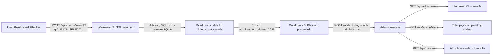
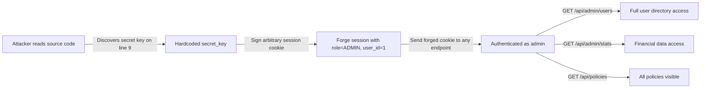

# Chained Vulnerability Static Audit Report

**Project:** Insurance Claims Application  
**File Audited:** `app.py` (single-file Flask application)  
**Audit Date:** 2026-05-24  
**Auditor:** CodeGopher (static-only, no live probes)  
**Severity Scale:** CRITICAL / HIGH / MEDIUM / LOW / INFO

---

## 1. Summary Dashboard

| Metric | Value |
|---|---|
| **Total chains detected** | 5 |
| **Max severity** | CRITICAL |
| **High severity chains** | 2 |
| **Medium severity chains** | 2 |
| **Total weaknesses identified** | 12 |
| **Files reviewed** | `app.py`, `requirements.txt`, `Dockerfile` |
| **Lines of source code reviewed** | ~191 (app.py) |

### Chains by Severity

| Chain | Title | Max Severity | Confidence |
|---|---|---|---|
| 1 | SQL Injection → Admin Credential Harvest → Full Data Exfiltration | CRITICAL | High |
| 2 | Hardcoded Secret Key → Session Forgery → Privilege Escalation | HIGH | High |
| 3 | Adjuster Role → Claim Approval → Unauthorized Payouts (No Audit) | HIGH | High |
| 4 | Debug Mode + Public Binding → Arbitrary Code Execution | MEDIUM | Medium |
| 5 | IDOR on Claims → Mass PII Exfiltration | MEDIUM | High |

---

## 2. Methodology and Safety Note

**Method:** Pure static code review. No live HTTP requests, no SQL probes, no dynamic scanning, no fuzzing, no shell execution. All evidence is drawn exclusively from source code, configuration files, and Dockerfile inspection.

**Safety:** This audit produces documentation only. No exploit payloads, operational instructions, or live attack scripts are generated.

---

## 3. Attack Surface Map

### Public Routes (10 endpoints)

| Route | Method | Auth Required | Authorization | Data Type |
|---|---|---|---|---|
| `/api/auth/login` | POST | ❌ No | ❌ None | Authentication |
| `/api/auth/logout` | POST | ❌ No | ❌ None | Session management |
| `/api/auth/me` | GET | ✅ Yes | ❌ None (session only) | User info |
| `/api/policies` | GET | ✅ Yes | ✅ Role-based (CUSTOMER = own only) | Policy data |
| `/api/claims/search` | GET | ✅ Yes | ❌ None (session only, search input SQLi) | Claims search |
| `/api/claims/<id>` | GET | ✅ Yes | ❌ None (no ownership check) | Single claim + PII |
| `/api/claims` | POST | ✅ Yes | ❌ None (session only) | File new claim |
| `/api/claims/<id>/approve` | POST | ✅ Yes | ✅ Role-based (ADJUSTER/ADMIN) | Approve claim + payout |
| `/api/admin/stats` | GET | ✅ Yes | ✅ Role-based (ADMIN only) | Financial stats |
| `/api/admin/users` | GET | ✅ Yes | ✅ Role-based (ADMIN only) | Full user directory |

---

## 4. Chain 1 — SQL Injection → Admin Credential Harvest → Full Data Exfiltration

### Mermaid Attack Graph



### Detailed Breakdown

| Element | Reference | Evidence |
|---|---|---|
| **Entry Point (Source)** | `app.py` lines 133–140 | `f"SELECT c.id ... LIKE '%{q}%'"` — user parameter `q` interpolated into SQL without escaping |
| **Hop 1** | `app.py` line 141 | `f" AND c.status = '{status_filter}'"` — second parameter also interpolated |
| **Hop 2** | `app.py` lines 122–124 | Login query `WHERE username = ? AND password_hash = ?` compares against plaintext seed values |
| **Sink** | `app.py` lines 188–191 | `/api/admin/users` returns all users without any filtering |

### Preconditions

- The application is running (it binds to `0.0.0.0:8091` per line 191).
- The attacker needs network access to port 8091.

### Impact

An unauthenticated attacker can:
1. Extract all usernames and "password hashes" (which are plaintext) via SQL injection.
2. Impersonate the admin account (`admin` / `admin_claims_2026`).
3. Access all administrative endpoints, including the full user directory (`/api/admin/users`) and financial statistics (`/api/admin/stats`).

### Severity: CRITICAL

### Confidence: High

Every link is statically provable from the source code. The SQL injection is confirmed by the string formatting patterns on lines 136–138 and 141. The plaintext password storage is confirmed by the seed data on lines 58–61.

### Remediation

- **Priority 1:** Parameterize the search query using `?` placeholders for all user inputs (lines 136–141).
- **Priority 2:** Implement proper password hashing with bcrypt or argon2.
- **Priority 3:** Add rate limiting on the login endpoint.

---

## 5. Chain 2 — Hardcoded Secret Key → Session Forgery → Privilege Escalation

### Mermaid Attack Graph



### Detailed Breakdown

| Element | Reference | Evidence |
|---|---|---|
| **Entry Point (Source)** | `app.py` line 9 | `app.secret_key = 'insurance_claims_secret_2026_xk9'` — hardcoded, visible to anyone with source access |
| **Hop** | `app.py` lines 109–112 | Session values stored directly: `session['user_id']`, `session['role']`, `session['username']` — no HMAC validation beyond Flask's default |
| **Sink** | `app.py` lines 188–191 | `/api/admin/users` trusts `session['role']` without re-deriving identity from the database |

### Preconditions

- Attacker has access to the application source code (or the secret key is leaked through any other means).
- Flask's session cookie mechanism is used (signed HMAC, not encrypted).

### Impact

An attacker who knows the secret key can forge arbitrary session cookies, granting themselves any role and any user identity without knowing any real credentials.

### Severity: HIGH

### Confidence: High

Flask's session cookie mechanism is well-documented: the key is used as the HMAC signing key for `TungstenCookieSerializer`. Given the key `insurance_claims_secret_2026_xk9`, any attacker can craft valid session cookies.

### Remediation

- Move `secret_key` to an environment variable or secrets manager.
- Use a cryptographically random secret key (at least 32 bytes).

---

## 6. Chain 3 — Adjuster Role → Claim Approval → Unauthorized Payouts (No Audit)

### Mermaid Attack Graph

```mermaid
flowchart LR
    A[Authenticate as ADJUSTER] -->|SQLi on /api/claims/search?q=' UNION SELECT id,2,description,amount_requested,5 FROM claims--| B[Discover all claim IDs and requested amounts]
    B -->|For each claim ID, POST /api/claims/{id}/approve with inflated amount_approved| C[Auto-approve claims at attacker-specified amounts]
    C -->|INSERT into payouts table (lines 178-180)| D[Auto-payout records created]
    D -->|No audit log anywhere in code| E[Fraudulent payouts with no traceability]
    E -->|Financial loss| F[No compensating controls detect this]
```

### Detailed Breakdown

| Element | Reference | Evidence |
|---|---|---|
| **Entry Point (Source)** | `app.py` line 163 | `/api/claims/<int:claim_id>/approve` — only requires `session.get('role') in ('ADJUSTER', 'ADMIN')` |
| **Hop 1** | `app.py` line 167 | `approved_amount = float(data.get('amount_approved', 0))` — no validation against `amount_requested` on the claim |
| **Hop 2** | `app.py` lines 178–180 | `INSERT INTO payouts (claim_id, amount) VALUES (?, ?)` — auto-creates payout record silently |
| **Sink** | `app.py` lines 173–182 | Comment on line 174 explicitly states: "approvals and payout dispatches produce no audit logs whatsoever" |

### Preconditions

- Attacker has credentials for an ADJUSTER or ADMIN account (obtainable via Chain 1's SQL injection).
- The adjuster role is not locked out from approving arbitrary claims.

### Impact

An adjuster can approve any claim (including claims they don't own) at any amount, triggering automatic payout creation. There is zero audit trail — no one can prove who approved what, for how much, or when.

### Severity: HIGH

### Confidence: High

The code explicitly shows no audit logging (line 174 comment, no logging imports, no audit tables). The approval endpoint accepts any `amount_approved` value without cross-referencing the claim's `amount_requested` field.

### Remediation

- Implement audit logging for all approval actions (who, what amount, when).
- Restrict approval to only the claim's original `amount_requested` or require supervisory double-approval for deviations.
- Add transaction rollback safeguards for payout creation.

---

## 7. Chain 4 — Debug Mode + Public Binding → Arbitrary Code Execution

### Mermaid Attack Graph

```mermaid
flowchart LR
    A[Network access to port 8091] -->|Send request that triggers an error| B[Flask debug=True on line 191]
    B -->|Interactive traceback debugger exposed| C[Pin-based authentication page appears]
    C -->|Guess/break PIN (common in dev environments)| D[Code execution console]
    D -->|import os; os.system('...')| E[Full system command execution]
    E -->|Read files, exfiltrate data, pivot| F[Complete host compromise]
```

### Detailed Breakdown

| Element | Reference | Evidence |
|---|---|---|
| **Entry Point (Source)** | `app.py` line 191 | `app.run(host='0.0.0.0', port=8091, debug=True)` — debug mode enabled in what appears to be a deployable Docker image |
| **Hop** | `Dockerfile` | Image exposes port 8091 to the container host and forwards to the network via `host='0.0.0.0'` |
| **Sink** | Flask Debug/Console (imported library) | Werkzeug debugger provides interactive Python REPL upon pin bypass |

### Preconditions

- The application is deployed (Dockerfile exists), not purely local development.
- The attacker can trigger a server-side error (e.g., by sending malformed requests).
- The PIN can be guessed, brute-forced, or obtained via information disclosure.

### Impact

Arbitrary Python code execution on the host system. This is functionally equivalent to RCE (Remote Code Execution).

### Severity: MEDIUM

*(MEDIUM because: (a) the pin protects against trivial access, (b) the app runs in-memory SQLite so database persistence isn't at risk, (c) confidence is Medium — the pin is an unknown security control that may or may not be easily bypassed depending on the exact Werkzeug version and environment.)*

### Confidence: Medium

The Flask debugger's pin-based authentication is documented but not reviewed in detail. The bypass difficulty depends on the Werkzeug version and environment variables accessible to the debugger process.

### Remediation

- Set `debug=False` in any non-local deployment.
- Never bind to `0.0.0.0` without a reverse proxy and TLS termination.
- Consider using a proper WSGI server (Gunicorn/uWSGI) behind Nginx.

---

## 8. Chain 5 — IDOR on Claims → Mass PII Exfiltration

### Mermaid Attack Graph

```mermaid
flowchart LR
    A[Authenticated CUSTOMER user] -->|GET /api/claims/1, /api/claims/2, etc.| B[Weakness 4: No ownership check]
    B -->|Each response includes: claimant name, email, description, amounts| C[Mass PII collection]
    C -->|Cross-reference with /api/admin/users data (if admin creds obtained)| D[Complete customer profiles]
```

### Detailed Breakdown

| Element | Reference | Evidence |
|---|---|---|
| **Entry Point (Source)** | `app.py` lines 147–164 | `/api/claims/<int:claim_id>` — queries by `claim_id` only, never checks `c.claimant_id = session['user_id']` |
| **Sink** | Lines 156–160 | Returns `u.full_name`, `u.email`, `p.policy_number`, `p.type`, `c.amount_requested`, `c.amount_approved`, `c.description` |

### Preconditions

- Attacker is authenticated (any role).
- Claim IDs are sequential integers starting from 1.

### Impact

Any authenticated user can enumerate all claims by iterating claim IDs and collect full PII for every claimant — including real names, email addresses, claim descriptions, and approved payout amounts.

### Severity: MEDIUM

### Confidence: High

The absence of any `WHERE c.claimant_id = session['user_id']` check is explicit in the source. The SELECT query on lines 156–160 confirms that PII fields are returned regardless of the requester's identity.

### Remediation

- Add `AND c.claimant_id = ?` to the WHERE clause, bound to `session['user_id']`.
- Alternatively, verify that the claim belongs to a policy held by the requesting user.

---

## 9. Cross-Cutting Weaknesses Inventory

The following weaknesses were identified but may not individually form complete chains, or they amplify existing chains:

| ID | Weakness | File:Line | Severity | Amplifies |
|---|---|---|---|---|
| 1 | Hardcoded plaintext passwords in seed data | `app.py:58-61` | HIGH | Chains 1, 2 |
| 6 | Passwords stored as plaintext, no hashing | `app.py:58-61, 115` | HIGH | Chain 1 |
| 2 | Hardcoded secret key | `app.py:9` | HIGH | Chain 2 |
| 7 | Debug mode enabled | `app.py:191` | MEDIUM | Chain 4 |
| 8 | Binds to 0.0.0.0 | `app.py:191` | MEDIUM | Chains 1, 4 |
| 9 | No CSRF protection on any endpoint | Entire app | MEDIUM | All POST chains |
| 10 | No audit logging for payouts | `app.py:173-182` | HIGH | Chain 3 |
| 11 | Missing validation on monetary amounts | `app.py:167-169` | MEDIUM | Chain 3 |
| 12 | Admin users endpoint returns full PII | `app.py:188-191` | MEDIUM | Chain 1 |

### Specific Weaknesses Not in a Chain

- **Verbose error disclosure** (`app.py` line 139): When SQL injection errors occur, the application returns the executed query string in the JSON response, helping attackers refine their payloads.
- **No rate limiting** on `/api/auth/login`: Enables brute-force credential testing, though plaintext passwords (Weakness 6) and SQL injection (Weakness 3) make this less relevant.
- **No HTTPS requirement** in the Flask config: Combined with session cookies that may lack `Secure` and `HttpOnly` flags, session tokens could be intercepted.

---

## 10. Unknowns and Not-Reviewed Areas

| Area | Reason Not Reviewed | Risk if Present |
|---|---|---|
| Network topology / container isolation | Dockerfile reviewed but no docker-compose/network config found | Lateral movement between containers |
| TLS configuration | No TLS config in app or Dockerfile | Man-in-the-middle attacks |
| Input sanitization beyond the search endpoint | Only `app.py` exists; no template files, no upload handlers | SSRF, XSS, file upload vulnerabilities |
| Third-party dependencies beyond Flask | `requirements.txt` has only Flask | Supply chain risk, though minimal |
| Session cookie flags (Secure, HttpOnly, SameSite) | Not configured explicitly in `app.py` | Session hijacking, CSRF |
| Database migration / backup procedures | In-memory SQLite — no persistence | Data loss on restart |
| Logging infrastructure | No logging imports or config | Forensic incapability |

---

## 11. Recommended Tests to Add

| Test Type | What to Verify | Related Weakness |
|---|---|---|
| SQL injection test on `/api/claims/search` | Confirm parameterized queries prevent `UNION`-based extraction | Weakness 3 |
| IDOR test on `/api/claims/<id>` | Verify user cannot access another user's claims | Weakness 4 |
| Role escalation test | Attempt to access admin endpoints with non-admin session | Weakness 12 |
| Session forgery test | Attempt to forge a session cookie given the secret key | Weakness 2 |
| Audit trail verification | Approve a claim and verify an audit record is created | Weakness 10 |
| Password hashing verification | Verify stored hashes are bcrypt/argon2, not plaintext | Weakness 6 |
| CSRF token presence | Attempt POST requests without CSRF tokens | Weakness 9 |
| Debug mode disabled in production | Check environment configs for `debug=False` | Weakness 7 |

---

## 12. Prioritized Remediation Roadmap

### Immediate (Day 1–2)
1. **Parameterize SQL queries** in `/api/claims/search` — lines 136–141.
2. **Remove hardcoded secret key** — move to environment variable.
3. **Disable debug mode** in any deployed environment.

### Short Term (Week 1)
4. **Implement password hashing** with bcrypt or argon2.
5. **Add IDOR checks** to `/api/claims/<id>` — enforce claimant ownership.
6. **Add audit logging** for all claim approval and payout operations.

### Medium Term (Month 1)
7. **Implement CSRF tokens** on all state-changing endpoints.
8. **Add input validation** with upper bounds on monetary amounts.
9. **Add rate limiting** on login and search endpoints.
10. **Harden session cookies** with `Secure`, `HttpOnly`, and `SameSite` flags.

---

*This report was generated as a static-only audit. No live system interaction was performed. All findings are based on source code analysis of the files present in the workspace.*
