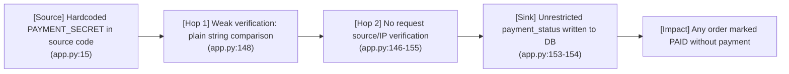
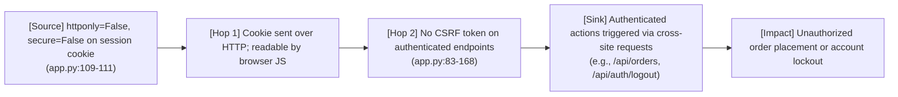

# Chained Vulnerability Static Audit Report

**Project**: Food Delivery Order System (FastAPI)
**Date**: 2026-05-24
**Reviewer**: CodeGopher (Chained Vulnerability Static Audit)
**Scope**: `C:\Users\shamit\AppData\Local\Temp\codegopher-v08-chain-20260524-234855-all50\app-22-food-delivery\workspace`
**Files Reviewed**: `app.py`, `requirements.txt`, `Dockerfile`

---

## Executive Summary

| Metric | Value |
|--------|-------|
| **Total chained vulnerabilities found** | **2** |
| **Maximum severity (chain)** | **High** |
| **Cross-cutting weaknesses** | **5** |
| **Confidence levels** | 2 High, 0 Medium, 0 Low |
| **Static-only boundary** | ✅ Enforced — no live probes, dynamic scanners, or shell commands used |

### Summary Dashboard

- **Chain 1 (High)**: Hardcoded payment secret → Webhook authorization bypass → Arbitrary order payment status manipulation
- **Chain 2 (Medium)**: Insecure session cookie config + missing CSRF → Unauthorized account actions

---

## Methodology

1. **Attack Surface Mapping**: Enumerated all public HTTP routes, API endpoints, webhook handlers, cookie/header/parameter sinks.
2. **Weakness Inventory**: Catalogued individually low/medium weaknesses using source-code evidence only.
3. **Attack Graph Synthesis**: Connected sources to weaknesses, weaknesses to sinks, and sinks to impacts using static code-flow, data-flow, authorization, and configuration evidence.
4. **Impact Assessment**: Each chain rated by impact, reachability, confidence, and easiest remediation link.

**Safety note**: This audit is static-only. No live HTTP probes, fuzzers, SQL injection payloads, credential attacks, dynamic scanners, exploit scripts, port scans, or external network tests were performed. No executable exploit payloads or step-by-step abuse instructions are included.

---

## Attack Surface Map

| Route | Method | Endpoint | Auth | User-Controlled Input |
|-------|--------|----------|------|----------------------|
| `LoginRequest` | POST | `/api/auth/register` | None | `username`, `password` |
| `LoginRequest` | POST | `/api/auth/login` | None | `username`, `password` |
| — | POST | `/api/auth/logout` | Session cookie | — |
| `get_current_user` | GET | `/api/auth/me` | Session cookie | — |
| — | GET | `/api/menu` | None | `category` (query param) |
| `OrderRequest` | POST | `/api/orders` | Session cookie | `items[].menu_item_id`, `items[].quantity` |
| `order_id` path param | GET | `/api/orders/{order_id}` | Session cookie | `order_id` (path) |
| `WebhookRequest` | POST | `/api/payment/webhook` | `auth_token` | `order_id`, `payment_status`, `auth_token` |

**External surface**: One payment webhook (`/api/payment/webhook`) reachable from external payment providers.

---

## Chain 1 — Hardcoded Payment Secret → Webhook Authorization Bypass → Order Payment Status Tampering

**Severity**: High
**Confidence**: High

### Mermaid Attack Graph



### Detailed Breakdown

#### Source: Hardcoded Payment Secret

- **File**: `app.py`, line 15
- **Symbol**: `PAYMENT_SECRET`
- **Evidence**:
  ```python
  PAYMENT_SECRET = "mock_sk_live_51O1W2e3R4t5Y6u7I8o9P0a1S2d3F4g5H6j7K8l9Z0x1C2v3B4n5M"
  ```
- **Assessment**: A payment signing secret is hardcoded directly in the application source code. This key is visible to anyone with source access (e.g., via Git history, Docker image layers, or container filesystem exposure). Production secrets must be stored in a vault or environment variables with restricted access.

#### Hop 1: Weak Webhook Verification — Plain String Comparison Only

- **File**: `app.py`, lines 146-148
- **Symbol**: `payment_webhook` verification block
- **Evidence**:
  ```python
  if req.auth_token != PAYMENT_SECRET:
      raise HTTPException(status_code=401, detail="Unauthorized webhook source")
  ```
- **Assessment**: The webhook authenticator performs only a static string equality check against the hardcoded secret. Real payment providers (e.g., Stripe) sign webhooks with an HMAC computed over the raw request body using a per-event or per-merchant secret. Without an HMAC signature check, an attacker who knows the secret can forge valid-looking webhook requests from any network location. There is also no timestamp or replay-protection mechanism.

#### Hop 2: No Source/IP Verification

- **File**: `app.py`, lines 146-155
- **Symbol**: `payment_webhook` handler
- **Evidence**: The handler does not check `request.client.host` or any `X-Forwarded-For` header.
- **Assessment**: The webhook endpoint accepts requests from any IP address. Combined with the weak token check, this means a remote attacker can call this endpoint from the open internet.

#### Sink: Arbitrary Payment Status Written to Database

- **File**: `app.py`, lines 153-154
- **Symbol**: `payment_webhook` UPDATE statement
- **Evidence**:
  ```python
  cursor.execute(
      "UPDATE orders SET payment_status = ? WHERE id = ?",
      (req.payment_status, req.order_id)
  )
  ```
- **Assessment**: The `payment_status` field is taken directly from the unvalidated `WebhookRequest.payment_status` request body. Any string value (e.g., `"PAID"`, `"REFUNDED"`, `"SHIPPED"`) can be written to any order record that exists in the database.

#### Impact

- **Description**: A remote attacker who reads the source code (or Docker image) obtains `PAYMENT_SECRET`. They can then send arbitrary webhook POST requests to `/api/payment/webhook` with any `order_id` and any `payment_status` value. The most exploitable outcome: an unpaid order can be marked `PAID`, allowing the system to release food or dispatch a driver without actual payment.
- **Confidentiality**: Low — the secret is in plain text in source.
- **Integrity**: **High** — arbitrary order payment states can be set.
- **Availability**: Low — no DoS vector in this chain.
- **Attack vector**: Remote network, no authentication needed beyond knowing the hardcoded secret.
- **Preconditions**: None beyond source/code access (trivially available in a containerized app).

#### Remediation (Easiest Link to Break)

1. **Reject the hardcoded secret (highest impact)**: Store `PAYMENT_SECRET` in an environment variable or secrets manager; never commit to source control.
2. **Adopt HMAC signature verification**: Compute `HMAC-SHA256(body, secret)` from a provider-specific header (e.g., `Stripe-Signature`, `X-Stripe-Signature`) and compare. This is the industry standard and renders a stolen token useless without the exact request body and timestamp.
3. **Add source IP allowlist**: Verify the request originates from known payment provider IP ranges.
4. **Add replay protection**: Require a timestamp or event ID and reject duplicates.

---

## Chain 2 — Insecure Session Cookie Configuration + Missing CSRF → Unauthorized Account Actions

**Severity**: Medium
**Confidence**: High

### Mermaid Attack Graph



### Detailed Breakdown

#### Source: Insecure Session Cookie Flags

- **File**: `app.py`, lines 109-111
- **Symbol**: `response.set_cookie` in `/api/auth/login`
- **Evidence**:
  ```python
  response.set_cookie(
      key="session_id",
      value=session_id,
      httponly=False,
      secure=False
  )
  ```
- **Assessment**:
  - `httponly=False`: The session cookie is exposed to JavaScript (`document.cookie`), meaning any reflected or stored XSS on the application (or a malicious browser extension) can read the session token.
  - `secure=False`: The cookie is sent with every request over unencrypted HTTP, enabling network-level sniffing on shared Wi-Fi or compromised routers.

  Both flags are present in a session-authenticated endpoint, which means session tokens can be exfiltrated through either XSS or network interception.

#### Hop 1: Cookie Exfiltration Surface

- **File**: `app.py`, lines 109-111 (cookie flags)
- **Assessment**: While the current codebase is a pure JSON API without HTML rendering (reducing the direct XSS surface), the `httponly=False` flag is a latent risk. Any future addition of server-side rendering, error pages, proxy headers echoed in responses, or third-party JavaScript injected at a CDN or WAF level would immediately create an XSS-to-session-takeover path. Static evidence shows the flag is wrong for any production deployment.

#### Hop 2: Missing CSRF Protection

- **File**: `app.py`, all authenticated endpoints (lines 83-168)
- **Symbol**: `get_current_user`, `place_order`, `logout`, `get_me`
- **Evidence**: The session is validated solely by the cookie value via `get_current_user`. No CSRF token, `Origin` header check, or `SameSite` cookie attribute is used.
- **Assessment**: All cookie-based authenticated endpoints (`/api/orders`, `/api/auth/logout`, `/api/auth/me`) are vulnerable to cross-site request forgery because:
  1. Browsers automatically include the session cookie on same-origin and cross-origin requests (depending on the target domain).
  2. No additional CSRF token or origin validation is performed.
  3. `SameSite` is not set, defaulting to `Lax` which only protects cross-site requests (not same-site post requests).

#### Sink: Unauthorized Account Actions

- **File**: `app.py`, lines 83-86 (`place_order`), lines 79-82 (`logout`)
- **Evidence**:
  ```python
  @app.post("/api/orders")
  def place_order(req: OrderRequest, user: dict = Depends(get_current_user)):
      ...
  ```
  ```python
  @app.post("/api/auth/logout")
  def logout(request: Request, response: Response):
      ...
  ```
- **Assessment**: An attacker can craft a malicious webpage that, when visited by an authenticated victim, automatically sends a POST to `/api/orders` (placing an order on the victim's behalf) or to `/api/auth/logout` (locking the victim out). Because `httponly=False` also allows JS-based cookie theft, a complete takeover chain is possible if any XSS vector exists.

#### Impact

- **Description**: An attacker can perform actions on behalf of an authenticated user without their knowledge: placing fraudulent orders, logging the user out, or potentially reading their profile. Combined with the cookie flags, if any XSS surface exists, the attacker can steal the session and take over the account entirely.
- **Confidentiality**: Medium (profile data via `/api/auth/me` is exposed if session is stolen).
- **Integrity**: **High** (orders placed without user consent; account locked out).
- **Availability**: Medium (account lockout via logout CSRF).
- **Attack vector**: Local (social engineering — malicious webpage visited by victim).
- **Preconditions**: Victim must be authenticated (have a valid session cookie).

#### Remediation (Easiest Link to Break)

1. **Set `SameSite=Strict` or `SameSite=Lax` on session cookies**: This alone breaks most CSRF attacks. (Line 109-111)
2. **Set `httponly=True`**: Prevents JavaScript access to the cookie, breaking the XSS→session theft path. (Line 109-111)
3. **Set `secure=True` in production**: Ensures cookies are never sent over plain HTTP. (Line 110)
4. **Add CSRF double-submit token** as defense-in-depth for POST endpoints.
5. **Validate `Origin` / `Referer` headers** on state-changing POST requests.

---

## Cross-Cutting Weaknesses (No Complete Chain Found)

These weaknesses are individually notable but do not form a complete static chain to a critical sink in the current codebase.

| # | Weakness | File / Line | Evidence | Risk |
|---|----------|-------------|----------|------|
| 1 | **No session expiration** | `app.py:103-105` | Sessions are stored in memory indefinitely with no TTL. A stolen or leaked cookie remains valid until the process restarts or memory is flushed. | Medium — prolonged session hijack window |
| 2 | **No idempotency on order placement** | `app.py:118-134` | Comment on line 117 explicitly notes: *"Clients can send infinite duplicate order requests, causing denial of service, resource exhaustion, or bulk db entries."* No deduplication key is enforced. | Low-Medium — resource exhaustion / spam |
| 3 | **Hardcoded bcrypt salt is auto-generated** | `app.py:72-76` (seed), `app.py:89` (register) | `bcrypt.gensalt()` is called at register time (correct), but the **seed data passwords are hashed once at import time** (lines 72-76). If the binary/Docker image is extracted, password hashes for seeded accounts are recoverable. | Low — seed data should not contain real credentials |
| 4 | **In-memory SQLite database** | `app.py:22` | `sqlite3.connect(':memory:')` — all data is lost on restart. No persistence, no backup, no audit trail. | Medium — data loss (availability concern) |
| 5 | **Role stored in session without server-side re-validation** | `app.py:101`, `app.py:162-164` | The user role from login time is stored in the session dict. The role check in `/api/orders/{order_id}` reads `user["role"]` from this dict rather than querying the DB. If a session manipulation vector existed, the role could be escalated. | Low-Medium — not exploitable without a session forgery vector |

---

## Areas Not Reviewed / Unknowns

| Area | Reason |
|------|--------|
| **Deployment configuration** (reverse proxy, TLS, rate limiting) | Not visible in workspace; only `Dockerfile` reviewed |
| **Logging / audit trail** | No log files or logging configuration found |
| **Input validation depth** | Pydantic models provide basic type checking but no business-logic validation (e.g., order quantity limits, menu item price overrides) |
| **Third-party dependencies** | Only `requirements.txt` reviewed; no `security audit` or vulnerability scanning of transitive dependencies was performed |
| **Template injection / SSRF** | No HTML templates, URL fetches, or file inclusion endpoints found |
| **Deserialization** | JSON parsing used exclusively; no `pickle`, `yaml.load`, or unsafe deserialization |
| **Database migration / schema evolution** | Single `init_db()` function; no migration framework |

---

## Test Recommendations

| Test | Target | Priority |
|------|--------|----------|
| CSRF token validation on all POST endpoints | `/api/orders`, `/api/auth/logout` | High |
| Cookie flag enforcement (`HttpOnly`, `Secure`, `SameSite`) | `/api/auth/login` | High |
| Webhook HMAC signature verification + replay protection | `/api/payment/webhook` | High |
| Idempotency key enforcement on order placement | `/api/orders` | Medium |
| Session expiration / rotation after login | `/api/auth/login` | Medium |
| Secret management (no hardcoded secrets in source) | `app.py:15` | High |
| Origin/Referer header validation on webhook | `/api/payment/webhook` | Medium |

---

## Remediation Priority Matrix

| Priority | Action | Effort | Impact |
|----------|--------|--------|--------|
| **P0** | Move `PAYMENT_SECRET` to env var + add HMAC signature verification | Low | High (Chain 1) |
| **P0** | Set `httponly=True, secure=True, SameSite=Strict` on session cookie | Low | Medium-High (Chain 2) |
| **P1** | Add CSRF double-submit token or `Origin` validation | Low | Medium (Chain 2) |
| **P1** | Remove hardcoded seed credentials; use runtime provisioning | Low | Medium (Weakness #3) |
| **P2** | Add order idempotency key | Low-Medium | Low-Medium (Weakness #2) |
| **P2** | Add session expiration | Low | Medium (Weakness #1) |
| **P3** | Migrate from in-memory SQLite to persistent DB | Medium | Medium (Weakness #4) |

---

*Report written by CodeGopher — Chained Vulnerability Static Audit Skill (builtin:chained-vulnerability-static-audit). All findings are based on static source-code analysis only.*
