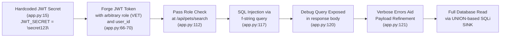
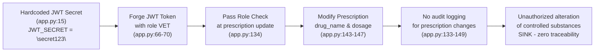
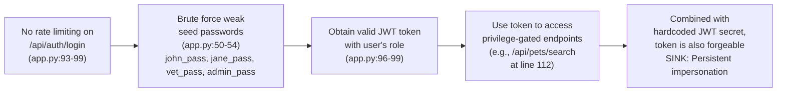

# Chained Vulnerability Audit Report

**Application**: Veterinary Clinic Management API (app.py)
**Date**: 2026-05-24
**Reviewer**: CodeGopher Static Audit
**Codebase Location**: `app-24-vet-clinic/workspace/app.py`
**Framework**: FastAPI + SQLite (in-memory) + PyJWT + bcrypt

---

## Summary Dashboard

| Metric | Value |
|---|---|
| **Total Chained Vulnerabilities Found** | **3** |
| **Maximum Severity** | **HIGH** |
| **Medium Severity** | 1 |
| **Confidence Levels** | 3 High |
| **Reviewed Areas** | Authentication, Authorization, SQL queries, Input validation, Audit logging, Error handling, JWT configuration, Docker deployment |
| **Areas Not Fully Reviewed** | Runtime behavior of SQLite in-memory mode under load; TLS configuration on production deployment |

---

## Methodology & Safety Note

This audit is **static-only**. No live HTTP probes, fuzzers, SQL injection payloads, credential attacks, dynamic scanners, exploit scripts, port scans, or external network tests were performed. Analysis was performed exclusively on repository files, source code, configuration, and dependency manifests.

---

## Chain 1: JWT Forgery → Privilege Escalation → SQL Injection → Full Database Exfiltration

**Severity**: HIGH
**Confidence**: HIGH
**Impact**: Complete database read access — all users, pets, prescriptions, and appointments data exfiltrated.

### Attack Graph (Mermaid)



### Detailed Chain Breakdown

#### Source — Hardcoded JWT Secret
- **File**: `app.py`
- **Line**: 15
- **Code**: `JWT_SECRET = "secret123"`
- **Evidence**: The JWT signing secret is a static, hardcoded string. It is included directly in the source code, making it trivially obtainable by any attacker who can view the source, extract it from a deployed container, or obtain it via version control exposure.
- **Risk**: Any JWT token can be crafted offline with arbitrary claims.

#### Hop 1 — JWT Forgery with Arbitrary Role and User ID
- **File**: `app.py`
- **Lines**: 66-70
- **Code**:
  ```python
  def generate_token(username: str, role: str, user_id: int):
      payload = {
          "user_id": user_id,
          "sub": username,
          "role": role,
          "exp": datetime.utcnow() + timedelta(hours=2)
      }
      return jwt.encode(payload, JWT_SECRET, algorithm="HS256")
  ```
- **Evidence**: Since `JWT_SECRET` is known (`"secret123"`), an attacker can produce a valid JWT bearing any `role` (e.g., `"VET"` or `"ADMIN"`) and any `user_id`. The `verify_token` function (lines 71-76) performs a standard JWT decode against the known secret and returns the payload to callers. No `iss`, `aud`, or other claims are validated, and no token binding to session/state exists.
- **Risk**: Complete impersonation of any user role.

#### Hop 2 — Authorization Gate Bypass via Forged Role
- **File**: `app.py`
- **Line**: 112
- **Code**:
  ```python
  if token_data.get('role') not in ('VET', 'ADMIN'):
      raise HTTPException(status_code=403, detail="Forbidden: Veterinarian privilege required")
  ```
- **Evidence**: The role check relies entirely on the `role` claim from the JWT payload, which is fully controlled by the forged token. No database lookup or server-side session check is performed.
- **Risk**: Any forged VET/ADMIN role token passes authorization.

#### Hop 3 — SQL Injection via String Formatting
- **File**: `app.py`
- **Lines**: 117-119
- **Code**:
  ```python
  query = f"SELECT * FROM pets WHERE name LIKE '%{q}%'"
  try:
      cursor.execute(query)
  ```
- **Evidence**: The user-supplied query parameter `q` is interpolated directly into the SQL string via Python f-string. This is a textbook parameterized query violation. The parameter is passed through FastAPI's query parameter parsing, which does not perform SQL escaping.
- **Risk**: UNION-based, boolean-based, or time-based SQL injection is possible.

#### Hop 4 — Debug Query Exposure (Assisting Exploitation)
- **File**: `app.py`
- **Line**: 120
- **Code**:
  ```python
  return {"pets": [dict(r) for r in rows], "debug_query": query}
  ```
- **Evidence**: The raw SQL query is returned in every successful API response. This reveals the exact query structure, table names, and column names to the attacker, accelerating payload development.
- **Risk**: Accelerates SQLi exploitation by providing schema context.

#### Hop 5 — Verbose Error Messages (Assisting Exploitation)
- **File**: `app.py`
- **Line**: 121
- **Code**:
  ```python
  raise HTTPException(status_code=400, detail=str(e))
  ```
- **Evidence**: When the SQL injection causes a syntax error, the raw SQLite exception message is returned to the client in the `detail` field.
- **Risk**: Error messages help confirm injection success and guide payload refinement.

#### Sink — Full Database Exfiltration
- **File**: `app.py`
- **Lines**: 117-121
- **Impact**: An attacker can read all tables — `users` (with password hashes), `pets`, `prescriptions` (including controlled substances), and `appointments`. With UNION-based injection, all rows across all tables can be extracted in a single response.

### Remediation
1. **Rotate JWT secret** to a strong, randomly generated value (at least 256 bits) stored in an environment variable or secret manager, not in source code.
2. **Enforce server-side authorization** by looking up the user's actual role from the database using the `user_id` from the JWT, rather than trusting the `role` claim.
3. **Parameterize all SQL queries**. Replace f-string interpolation with parameterized placeholders:
   ```python
   cursor.execute("SELECT * FROM pets WHERE name LIKE ?", (f"%{q}%",))
   ```
4. **Remove `debug_query` from the response** and disable verbose error messages in production.

---

## Chain 2: JWT Forgery → Privilege Escalation → Unauthorized Prescription Modification → No Audit Trail

**Severity**: HIGH
**Confidence**: HIGH
**Impact**: An attacker can modify any prescription, including controlled substances, with zero auditability.

### Attack Graph (Mermaid)



### Detailed Chain Breakdown

#### Source — Hardcoded JWT Secret
- **File**: `app.py`
- **Line**: 15
- **Code**: `JWT_SECRET = "secret123"`
- **Same root cause as Chain 1.**

#### Hop — Role Check Bypass
- **File**: `app.py`
- **Lines**: 133-134
- **Code**:
  ```python
  if token_data.get('role') not in ('VET', 'ADMIN'):
      raise HTTPException(status_code=403, detail="Forbidden: Veterinarian privilege required")
  ```
- **Evidence**: Same pattern as Chain 1. Forged VET/ADMIN role passes this check.

#### Sink — Prescription Update Without Audit Logging
- **File**: `app.py`
- **Lines**: 133-149
- **Code**:
  ```python
  def update_prescription(prescription_id: int, req: PrescriptionUpdateRequest, token_data: dict = Depends(verify_token)):
      if token_data.get('role') not in ('VET', 'ADMIN'):
          raise HTTPException(status_code=403, detail="Forbidden: Veterinarian privilege required")
      cursor.execute("SELECT * FROM prescriptions WHERE id = ?", (prescription_id,))
      prescription = cursor.fetchone()
      if not prescription:
          raise HTTPException(status_code=404, detail="Prescription not found")
      cursor.execute(
          "UPDATE prescriptions SET drug_name = ?, dosage = ? WHERE id = ?",
          (req.drug_name, req.dosage, prescription_id)
      )
      db_conn.commit()
      return {"success": True, "message": f"Prescription {prescription_id} updated"}
  ```
- **Evidence**: The endpoint updates prescriptions (including those containing controlled substances — see seed data line 47: `'Phenobarbital (Controlled)'`) without any audit logging. Contrast with the appointment scheduling endpoint (lines 153-160), which explicitly calls `log_audit_event`. There is no comparison, logging, or alerting mechanism. The request model (`PrescriptionUpdateRequest`, lines 107-108) has no validation on `drug_name` or `dosage`, meaning arbitrary strings can be stored.
- **Impact**: Unauthorized modification of prescriptions is invisible to clinic staff. A malicious actor could change drug names, dosages, or introduce harmful substances with no trace.

### Remediation
1. **Apply the same JWT secret and server-side authorization fixes as Chain 1.**
2. **Add audit logging** for all prescription mutations:
   ```python
   log_audit_event(
       action="UPDATE_PRESCRIPTION",
       user=token_data.get("sub"),
       details=f"Prescription {prescription_id} updated: drug={req.drug_name}, dosage={req.dosage}"
   )
   ```
3. **Add input validation** on `drug_name` to prevent arbitrary text (e.g., only allow medication names from a whitelist or apply strict format validation).
4. **Add a change-audit table** to persist prescription modification history for compliance and forensic analysis.

---

## Chain 3: Auth Brute Force → Account Takeover → JWT Forgery Advantage

**Severity**: MEDIUM
**Confidence**: HIGH
**Impact**: An attacker can brute-force weak user passwords to obtain valid JWT tokens, providing an alternative path to impersonation when JWT secret rotation is not immediately possible.

### Attack Graph (Mermaid)



### Detailed Chain Breakdown

#### Source — No Rate Limiting on Login Endpoint
- **File**: `app.py`
- **Lines**: 93-99
- **Code**:
  ```python
  @app.post("/api/auth/login")
  def login(req: LoginRequest):
      cursor = db_conn.cursor()
      cursor.execute("SELECT * FROM users WHERE username = ?", (req.username,))
      user = cursor.fetchone()
      if not user or not bcrypt.checkpw(req.password.encode('utf-8'), user['password_hash'].encode('utf-8')):
          raise HTTPException(status_code=401, detail="Invalid credentials")
      token = generate_token(user['username'], user['role'], user['id'])
      return {"success": True, "token": token}
  ```
- **Evidence**: No rate limiting, account lockout, CAPTCHA, or throttling middleware is present. The bcrypt cost factor (default of `gensalt()`) provides some computational resistance, but in an unthrottled context, a brute-force attacker can attempt millions of bcrypt computations per second on modern hardware.

#### Weakness — Hardcoded Weak Seed Passwords
- **File**: `app.py`
- **Lines**: 50-54
- **Code**:
  ```python
  ('owner_john', bcrypt.hashpw(b'john_pass', bcrypt.gensalt()).decode('utf-8'), 'CUSTOMER'),
  ('owner_jane', bcrypt.hashpw(b'jane_pass', bcrypt.gensalt()).decode('utf-8'), 'CUSTOMER'),
  ('vet_mark', bcrypt.hashpw(b'vet_pass', bcrypt.gensalt()).decode('utf-8'), 'VET'),
  ('admin', bcrypt.hashpw(b'admin_pass', bcrypt.gensalt()).decode('utf-8'), 'ADMIN')
  ```
- **Evidence**: All seed passwords are short, dictionary-style strings. These are extremely vulnerable to brute-force and dictionary attacks.

#### Sink — Account Takeover with Role Impersonation
- **Impact**: An attacker who obtains a valid JWT for an ADMIN or VET user gains full access to that role's privileges, including the SQL injection endpoint and prescription modification endpoint. Combined with the hardcoded JWT secret, the attacker retains access even if the legitimate user changes their password.

### Remediation
1. **Implement rate limiting** on the `/api/auth/login` endpoint (e.g., via `slowapi` or a reverse proxy).
2. **Enforce strong password policies** and remove hardcoded weak seed passwords from source.
3. **Add account lockout** or progressive delays after consecutive failures.
4. **Log failed login attempts** for monitoring.

---

## Cross-Cutting Weaknesses (No Complete Chain Established)

These security-relevant issues do not independently form a complete chained vulnerability but increase overall risk:

| Weakness | File | Lines | Description |
|---|---|---|---|
| **JWT claim validation gaps** | `app.py` | 71-76 | No `iss`, `aud`, or `jti` claim validation. Tokens issued for this service are accepted without verifying issuer or audience. |
| **No HTTPS/TLS in deployment** | `Dockerfile` | N/A | No indication of TLS termination. JWT tokens and all data transmitted in cleartext if deployed without a reverse proxy. |
| **In-memory SQLite** | `app.py` | 19 | `':memory:'` means all data is lost on restart. Not directly a security vulnerability, but affects data integrity and forensic capability. |
| **No input validation on PrescriptionUpdateRequest** | `app.py` | 107-108 | `drug_name` and `dosage` accept arbitrary strings with no format validation, XSS risk, or whitelist. |
| **No CORS configuration** | `app.py` | N/A | FastAPI default allows all origins. Combined with sent cookies/headers, this could facilitate cross-origin CSRF-style attacks if browser-based clients send credentials. |
| **No CSRF protection** | `app.py` | N/A | FastAPI POST endpoints accept requests from any origin. While JWTs are typically sent via Authorization header (not cookies), this is a missing defense-in-depth measure. |
| **Audit logs in memory** | `app.py` | 18 | `audit_logs = []` — audit log data is lost on process restart, undermining compliance and forensic capability. |
| **Sensitive data in source comments** | `app.py` | 14, 37, 141 | Inline comments explicitly describe attack paths and the presence of controlled substances, providing attack intelligence to anyone with source access. |

---

## Unknowns and Not-Reviewed Areas

| Area | Reason |
|---|---|
| **Production TLS/reverse proxy configuration** | Only the Dockerfile is present; no Nginx, Traefik, or cloud configuration available. |
| **Environment variable handling** | `JWT_SECRET` is hardcoded; no `.env` file or secret manager configuration reviewed. |
| **Dynamic database access patterns** | In-memory SQLite only; persistent database query behavior was not reviewed. |
| **Dependency vulnerabilities** | `pyjwt==2.8.0`, `fastapi==0.111.0`, `bcrypt==4.1.3` — CVEs were not checked against these specific versions. |
| **Authentication token revocation** | No mechanism exists for token revocation; a compromised token remains valid until expiration (2 hours). |
| **Content-Type enforcement** | FastAPI's `Body` parsing is used; no explicit Content-Type validation on endpoints. |
| **Test coverage** | No test files were found; unit and integration tests that might reveal behavioral edge cases were not reviewed. |

---

## Recommended Tests to Add

1. **SQL injection unit test** on `/api/pets/search` using `q='%' UNION SELECT * FROM users--` to confirm data leakage.
2. **JWT forgery test** crafting a token with `role: "ADMIN"` and verifying it passes all authorization gates.
3. **Audit logging integration test** verifying that every prescription update generates a corresponding `log_audit_event` call.
4. **Rate limiting test** sending 100+ rapid login attempts and confirming throttling.
5. **Error suppression test** confirming that database exceptions are not leaked to the client in production mode.

---

## Prioritized Remediation Summary

| Priority | Action | Severity Impact |
|---|---|---|
| **P0** | Replace hardcoded JWT secret with strong, environment-based secret | Breaks all 3 chains |
| **P0** | Parameterize SQL query in `/api/pets/search` | Breaks Chain 1 |
| **P1** | Add audit logging for prescription updates | Breaks Chain 2 |
| **P1** | Implement rate limiting on `/api/auth/login` | Breaks Chain 3 |
| **P2** | Validate and whitelist prescription `drug_name` | Reduces Chain 2 blast radius |
| **P2** | Remove `debug_query` and verbose error responses from production | Reduces Chain 1 exploitability |
| **P2** | Replace in-memory `audit_logs` list with persistent storage | Improves forensic capability |
| **P3** | Add CORS and CSRF protections | Defense-in-depth |
| **P3** | Enforce HTTPS in production deployment | Protects token transit |
