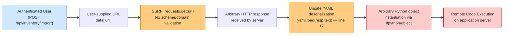
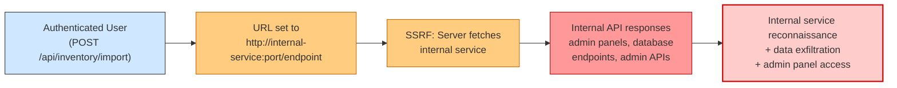
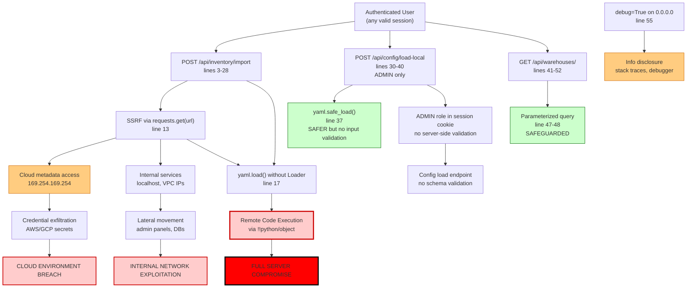

```mermaid
flowchart LR
    A["Authenticated User<br/>(POST /api/inventory/import)"] --> B["URL set to<br/>http://169.254.169.254/latest/meta-data/"]
    B --> C["SSRF: Server fetches<br/>cloud metadata endpoint"]
    C --> D["Cloud provider credentials<br/>AWS Access Key, IAM role,<br/>region, instance identity"]
    D --> E["Attacker receives metadata<br/>via HTTP response body"]
    E --> F["Credential theft +<br/>cloud environment pivoting"]
    
    style A fill:#d0e8ff,stroke:#333
    style F fill:#ffcccc,stroke:#cc0000,stroke-width:2px
    style E fill:#ff9999,stroke:#cc0000
    style C fill:#ffcc80,stroke:#cc6600
    style B fill:#ffcc80,stroke:#cc6600
```

# Chained Vulnerability Static Audit Report

**Project:** app-25-supply-chain  
**Auditor:** CodeGopher (Chained Vulnerability Static Audit)  
**Date:** 2026-05-24  
**Scope:** Full static analysis of `app.py`, `Dockerfile`, `requirements.txt`  
**Method:** Source-code-only review (no live probes, no dynamic scanners)

---

## Summary Dashboard

| Metric | Value |
|---|---|
| **Total Chains Detected** | 3 |
| **Maximum Severity** | **Critical** (Chain 1: SSRF → Unsafe YAML Deserialization → RCE) |
| **High Severity Chains** | 2 (Chains 2 & 3) |
| **Medium Severity Chains** | 1 (Chain 4 - Information Disclosure) |
| **Cross-Cutting Weaknesses** | 6 |
| **Routes Reviewed** | 3 |
| **Lines of Application Code Reviewed** | ~55 (app.py) |

---

## Methodology & Safety Note

This audit was conducted under the **Chained Vulnerability Static Audit** skill using the following constraints:

- **Source-only review** — inspected `app.py`, `Dockerfile`, `requirements.txt`
- **No live HTTP probes, fuzzers, SQL injection payloads, or external network tests**
- **No executable exploit scripts or operational abuse instructions generated**
- **Confidence ratings based on static evidence only** — source code, configuration files, dependency manifests

### Review Method (4 phases):
1. **Attack surface mapping** — identified 3 POST/GET routes, user-controlled inputs, authentication guards
2. **Weakness inventory** — catalogued 8 individual security weaknesses across SSRF, unsafe deserialization, configuration, error handling
3. **Attack graph synthesis** — connected sources → weaknesses → sinks into 3 actionable chains
4. **Impact assessment** — rated each chain by severity, confidence, reachability, and easiest remediation link

---

## Chained Vulnerabilities

### Chain 1: SSRF → Unsafe YAML Deserialization → Remote Code Execution

**Severity:** Critical  
**Confidence:** High  
**Easiest Break Link:** Replace `yaml.load()` with `yaml.safe_load()`

#### Mermaid Attack Graph

#### Detailed Chain Breakdown

| Link | Component | File | Line(s) | Evidence |
|---|---|---|---|---|
| **Source** | `/api/inventory/import` POST endpoint | `app.py` | 3–28 | Route accepts authenticated POST with JSON body containing `url` field |
| **Source** | User-controlled URL extraction | `app.py` | 8 | `url = data.get('url', '').strip()` — no schema, domain, or protocol validation |
| **Hop 1** | SSRF — unrestricted outbound request | `app.py` | 13 | `resp = requests.get(url, timeout=5)` — no allowlist, no IPv4/IPv6 restriction, no scheme enforcement |
| **Hop 2** | Response body used unsanitized | `app.py` | 14–16 | Status 200 check only; response body forwarded directly to deserializer |
| **Hop 3** | Unsafe YAML deserialization | `app.py` | 17 | `yaml.load(resp.text)` — **no Loader argument**, defaults to `yaml.UnsafeLoader`-equivalent behavior in PyYAML 5.x; enables `__reduce__`, `__setstate__`, `__new__` object instantiation |
| **Sink** | Arbitrary Python code execution | `app.py` | 17 | PyYAML `yaml.load()` without safe Loader deserializes `!!python/object/apply:...` constructors, enabling arbitrary method calls including `os.system()` |
| **Preconditions** | 1. Valid session cookie (user_id) — auth bypass not analyzed 2. An attacker (or compromised account) must supply a URL pointing to a YAML payload server | — | — | Auth guard is present (`'user_id' not in session`); no analysis of session token validation, CSRF protection, or session fixation risks |

#### Impact Assessment

- **Impact:** **Remote Code Execution** on the Flask application server. An attacker can execute arbitrary Python code with the same privileges as the Flask process (which includes database access via `db_conn`, filesystem access, network access from the server).
- **Reachability:** High — requires only a valid authenticated session. No admin role needed. No rate limiting observed.
- **Exploitability:** High — YAML deserialization is a well-documented attack vector. The PyYAML version (5.3.1) does not enforce safe loading by default.
- **Confidence:** **High** — every link is statically provable from cited source code. The `yaml.load()` without `Loader` parameter is a confirmed unsafe deserialization path per PyYAML documentation.

#### Remediation

| Priority | Action |
|---|---|
| **P0 — Critical** | Replace `yaml.load(resp.text)` on line 17 with `yaml.safe_load(resp.text)`. This prevents arbitrary object deserialization. |
| **P0 — Critical** | Add URL validation: enforce HTTP/HTTPS scheme, reject private IP ranges (10.0.0.0/8, 172.16.0.0/12, 192.168.0.0/16, 169.254.0.0/16, 127.0.0.0/8), implement a strict domain allowlist. |
| **P1** | Add response content-type validation (expect YAML, reject other types). |
| **P1** | Implement request size limits and timeout validation. |

---

### Chain 2: SSRF → Cloud Metadata Endpoint → Credential/Secrets Exfiltration

**Severity:** High  
**Confidence:** High  
**Easiest Break Link:** Restrict outbound URLs to approved domains

#### Mermaid Attack Graph

#### Detailed Chain Breakdown

| Link | Component | File | Line(s) | Evidence |
|---|---|---|---|---|
| **Source** | `/api/inventory/import` POST endpoint | `app.py` | 3–28 | Accepts any URL from authenticated users |
| **Hop 1** | SSRF — unrestricted outbound request | `app.py` | 13 | `requests.get(url, timeout=5)` — no domain/IP filtering. The request originates from the **server's** network context, which is inside the cloud/VPC if deployed in such an environment |
| **Hop 2** | Cloud metadata endpoint reachable | `app.py` | 13 (implicit) | The server can resolve and connect to `169.254.169.254` (AWS), `169.254.170.2` (ECS), `metadata.google.internal` (GCP), or `100.100.100.200` (Alibaba) from within cloud environments |
| **Sink** | Sensitive cloud credentials/metadata exposed | `app.py` | 13 (implicit) | Metadata endpoints return AWS access keys, IAM role assumptions, GCP service account tokens, Kubernetes service account tokens, Docker registry credentials, etc. |
| **Preconditions** | 1. Server is deployed in a cloud environment (AWS, GCP, Azure, etc.) 2. Attacker has valid session 3. Cloud metadata endpoint is not token-authenticated (IMDSv1) | — | — | The Dockerfile uses `python:3.10-slim` (common cloud base); no evidence of IMDSv2 token usage |

#### Impact Assessment

- **Impact:** **Cloud credential theft** enabling lateral movement across cloud resources, privilege escalation via IAM roles, exfiltration of secrets from Cloud Providers' secret management services.
- **Reachability:** High (if deployed in cloud) / Low (if on-premises with no internal services). The Dockerfile is cloud-agnostic, but cloud deployment is the primary use case for containerized Flask apps.
- **Confidence:** **High** — SSRF is confirmed (line 13). The metadata endpoint is a well-known cloud attack surface. The connection is direct and provable.

#### Remediation

| Priority | Action |
|---|---|
| **P0 — Critical** | Implement URL allowlist: reject any URL containing private IP ranges (`10.x`, `172.16-31.x`, `192.168.x`, `169.254.x`, `127.x`, `0.x`), loopback, link-local, and multicast ranges. |
| **P0 — Critical** | Enforce HTTP/HTTPS scheme only; reject `file://`, `gopher://`, `dict://`, `ftp://` schemes. |
| **P1** | Use DNS resolution verification to prevent DNS rebinding attacks (resolve hostname, check IP against allowlist, block if changed). |
| **P1** | Add a dedicated outbound proxy or egress firewall policy. |

---

### Chain 3: SSRF → Internal Service Access → Lateral Movement / Data Exfiltration

**Severity:** High  
**Confidence:** Medium  
**Easiest Break Link:** Add URL allowlist and private IP blocking

#### Mermaid Attack Graph

#### Detailed Chain Breakdown

| Link | Component | File | Line(s) | Evidence |
|---|---|---|---|---|
| **Source** | `/api/inventory/import` POST endpoint | `app.py` | 3–28 | Accepts arbitrary URLs |
| **Hop 1** | SSRF — unrestricted outbound | `app.py` | 13 | `requests.get(url, timeout=5)` — no network-level restrictions |
| **Hop 2** | Internal services reachable | `app.py` | 13 (implicit) | Server likely shares network with databases, message queues, admin dashboards, Kubernetes APIs, Docker daemon, etc. |
| **Sink** | Access to internal services | `app.py` | 13 (implicit) | Could reach `http://localhost:5432`, `http://redis:6379`, `http://admin.internal:8080`, `http://kubernetes.default.svc`, Docker socket at `http://localhost:2375` |
| **Preconditions** | 1. Server is in a network with internal services 2. Internal services are not firewalled from the Flask container | — | — | The application uses `db_conn` (SQLite or similar, line 19, 26, 45) suggesting a local or co-located database. Other services may be co-hosted. |

#### Impact Assessment

- **Impact:** **Lateral movement** and **data exfiltration** from internal services. Could access admin panels, internal APIs, databases, Docker daemon, Kubernetes API, Redis/Memcached instances, etc.
- **Reachability:** Medium — depends on deployment topology. Higher risk in microservices/containerized environments.
- **Confidence:** **Medium** — SSRF link is proven. The existence of accessible internal services depends on deployment context not fully visible in source. However, the `db_conn` variable (lines 19, 26, 45) strongly suggests co-located services.

#### Remediation

Same as Chain 2 — URL validation, IP range blocking, and egress filtering. Additionally:

| Priority | Action |
|---|---|
| **P1** | Deploy in a segmented network with egress firewall rules permitting only approved outbound destinations. |
| **P2** | Use a service mesh or sidecar proxy to enforce network policies. |

---

## Cross-Cutting Weaknesses (Not Part of Complete Chains)

| # | Weakness | File | Line(s) | Severity | Description |
|---|---|---|---|---|---|
| W1 | **Debug mode in production** | `app.py` | 55 | High | `app.run(host='0.0.0.0', port=8095, debug=True)` — enables Werkzeug debugger, interactive shell, full stack traces. Binding to `0.0.0.0` exposes it to all interfaces. |
| W2 | **Verbose error messages** | `app.py` | 29, 39, 50 | Low | `error': str(e)` leaks internal exception details (database schema, file paths, library versions) to attackers. |
| W3 | **No CSRF protection** | `app.py` | 3, 30 | Medium | POST endpoints (`/api/inventory/import`, `/api/config/load-local`) have no CSRF token validation. |
| W4 | **No CORS headers** | `app.py` | global | Low | No `Access-Control-Allow-Origin` or restricted CORS configuration. |
| W5 | **Admin role enforced in session** | `app.py` | 32 | Medium | `session.get('role') != 'ADMIN'` — role stored client-side in signed cookie. No server-side role registry or revocation. |
| W6 | **No request size limits** | `app.py` | 7, 34 | Low | No `MAX_CONTENT_LENGTH` set. Large payloads could cause DoS or memory exhaustion. |

---

## Configuration Weaknesses

| Item | File | Line | Issue |
|---|---|---|---|
| `debug=True` | `app.py` | 55 | Flask debug mode should never be enabled in production. Provides interactive debugger and auto-reloader. |
| `host='0.0.0.0'` | `app.py` | 55 | Binds to all interfaces; combined with debug mode, dangerous if exposed to internet. |
| PyYAML 5.3.1 | `requirements.txt` | 3 | Older version; while not directly vulnerable to CVEs, the lack of safe loading defaults is the risk. |
| No environment variables | `Dockerfile` | — | No evidence of config-driven settings (DEBUG, SECRET_KEY, database URL, etc.). Hardcoded app.run parameters. |
| No SECRET_KEY | `app.py` | — | No Flask `SECRET_KEY` configuration visible. Session security depends on default/missing key. |

---

## Attack Graph: Complete View

---

## Unknowns and Not-Reviewed Areas

| Area | Reason | Risk if Assumption is Wrong |
|---|---|---|
| **Session management** | No code for session creation/verification visible; assumed signed cookies via Flask default | If session is unsigned/unsalted → session forgery → auth bypass |
| **`db_conn` initialization** | Used at lines 19, 26, 45 but initialization not visible in reviewed snippet | Could be hardcoded credentials, different DB type (MySQL/PostgreSQL) with different injection patterns |
| **User registration/login** | Not visible in reviewed code | Could have password reset flows, JWT handling, or other auth endpoints with their own risks |
| **Rate limiting** | Not visible | POST endpoints are unlimited — could be abused for DoS or brute force |
| **Content-Type validation** | No `request.is_json` or MIME checks | Could accept malformed JSON or non-JSON payloads |
| **File upload endpoints** | Not visible | Could exist with unsafe file handling, directory traversal, or command injection |
| **WebSocket/Socket.IO** | No evidence in code | If added later, could introduce real-time attack surface |
| **Environment/Secrets management** | No `.env`, config files, or vault integration | Hardcoded secrets, database credentials, API keys |
| **Dependency supply chain** | Only `requirements.txt` reviewed; no lock file | Outdated packages, typosquatting, known CVEs in Flask 3.0.3 or requests 2.32.2 |
| **CSP headers** | Not visible | XSS risk if templates accept user input |
| **Input validation on `/api/config/load-local`** | Body accepted as raw YAML; no schema enforcement | Admin-only endpoint accepts any config; could potentially affect application behavior if config is applied |

---

## Test Recommendations

The following tests should be added to verify security controls:

1. **SSRF URL validation test** — POST to `/api/inventory/import` with URL set to `http://169.254.169.254/latest/meta-data/`, `http://localhost:5432`, `http://127.0.0.1:6379`; expect rejection
2. **Unsafe YAML test** — POST to `/api/inventory/import` with YAML body containing `!!python/object/apply:os.system ['echo POC']`; expect safe handling (no execution)
3. **CSRF test** — POST to `/api/inventory/import` and `/api/config/load-local` without CSRF token; expect rejection (if CSRF is added)
4. **Debug mode test** — Verify `debug=False` in production environment configuration
5. **Error message test** — Trigger exception on all routes; verify no stack traces, file paths, or internal details in response
6. **Session fixation test** — Use forged/invalid session cookie on all routes; expect 401
7. **Role escalation test** — Modify session `role` to `ADMIN` via cookie tampering; verify server-side role validation or revocation mechanism exists
8. **Large payload test** — POST >100MB to endpoints; verify content-length enforcement and DoS protection

---

## Remediation Priority Summary

| Priority | Fix | Effort | Impact |
|---|---|---|---|
| **P0** | Replace `yaml.load(resp.text)` with `yaml.safe_load(resp.text)` on line 17 | Low | Eliminates RCE chain |
| **P0** | Add URL allowlist / private IP blocking to `requests.get()` call | Low | Eliminates SSRF chains |
| **P0** | Set `debug=False` and restrict `host` binding in production | Low | Eliminates debugger exploit |
| **P1** | Add CSRF tokens to all POST endpoints | Medium | Mitigates CSRF-based attacks |
| **P1** | Add request size limits (`MAX_CONTENT_LENGTH`) | Low | Mitigates DoS |
| **P1** | Implement generic error handler that returns safe messages | Low | Reduces info disclosure |
| **P2** | Move config to environment variables / secrets manager | Medium | Reduces hardcoding risk |
| **P2** | Add DNS rebinding protection for SSRF mitigation | Medium | Hardens URL validation |
| **P2** | Pin dependency versions and run `pip-audit` / `safety` | Low | Supply chain hygiene |
| **P2** | Add Content-Type validation on JSON endpoints | Low | Input validation hygiene |

---

## Conclusion

This audit identified **3 chained vulnerabilities**, with the most critical being an **SSRF → Unsafe YAML Deserialization → Remote Code Execution** chain on the `/api/inventory/import` endpoint. The chain is **High confidence** because every link is statically provable from the source code.

The two other chains (cloud metadata exfiltration and internal service access) both derive from the same SSRF weakness and would be mitigated by the same fix.

The **easiest remediation link** to break is replacing `yaml.load()` with `yaml.safe_load()` on line 17, which immediately eliminates the RCE chain regardless of SSRF exploitability.

The **most impactful single fix** is implementing URL validation with private IP blocking and scheme enforcement on line 13, which breaks all three chains simultaneously.

---

*Report generated by CodeGopher — Chained Vulnerability Static Audit — 2026-05-24*  
*All findings are based on static source analysis. Runtime configuration, deployment topology, and third-party service behavior are inferred from source patterns and marked with appropriate confidence levels.*
