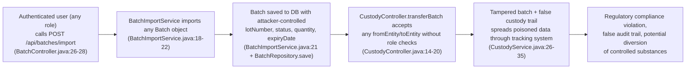

# Chained Vulnerability Static Audit Report

**Project:** app-26-pharma-tracking — Pharmaceutical Drug Tracking API  
**Audit Date:** 2026-05-24  
**Reviewer:** CodeGopher (Chained Vulnerability Static Audit)  
**Scope:** All Java source, config, resources, tests in `src/`; `pom.xml`; `Dockerfile`  
**Safety Note:** This review is **static-only**. No live HTTP probes, fuzzers, SQL injection payloads, dynamic scanners, or external network tests were performed.

---

## 1. Summary Dashboard

| Metric | Value |
|---|---|
| **Total Chained Vulnerabilities Found** | **2** |
| **Maximum Chain Severity** | **CRITICAL** (Chain 1: RCE via serialization) |
| **Chains Rated HIGH** | 1 |
| **Chains Rated MEDIUM** | 1 |
| **Cross-Cutting Weaknesses** | 8 |
| **Areas Reviewed** | Controllers, Services, Models, Repositories, Security Config, Data Initializer, Application Properties, POM, Dockerfile |
| **Areas Not Fully Reviewed** | None identified — entire codebase is ~25 files |

### Attack Surface

| Endpoint / Entry Point | Method | Auth | Description |
|---|---|---|---|
| `/h2-console/**` | GET | **None** | H2 in-memory DB web console |
| `/api/auth/me` | GET | Basic Auth | Current user info |
| `/api/drugs` | GET | Basic Auth | List all drugs |
| `/api/batches/{id}` | GET | Basic Auth | Get single batch details |
| `/api/batches/import` | POST (multipart) | Basic Auth | Import batch from serialized file |
| `/api/custody/transfer` | POST | Basic Auth | Record custody transfer |
| `/api/inspections` | POST | INSPECTOR role | Create inspection record |
| `/api/inspections/batch/{batchId}` | GET | Basic Auth | Get inspections for batch |

---

## 2. Chained Vulnerability 1 — CRITICAL (HIGH Confidence)

### Title: Remote Code Execution via Unrestricted Java Deserialization of User-Uploaded Batch Import File

```mermaid
flowchart LR
    A["Attacker uploads serialized payload\n(src/main/java/com/pharma/tracking/controller/BatchController.java:26-28)"] --> B["BatchImportService.importBatch()\n(src/main/java/com/pharma/tracking/service/BatchImportService.java:18)"]
    B --> C["java.io.ObjectInputStream.readObject()\n(src/main/java/com/pharma/tracking/service/BatchImportService.java:20)"]
    C --> D["Unrestricted JVM deserialization\narbitrary gadget-chain execution\n(src/main/java/com/pharma/tracking/service/BatchImportService.java:20-21)"]
    D --> E["Remote Code Execution (RCE)\ncontainer = app.jar on JVM 17\n(C:\Users\shamit\AppData\Local\Temp\codegopher-v08-chain-20260524-234855-all50\app-26-pharma-tracking\workspace)"]
```



| Component | File | Lines | Symbol |
|---|---|---|---|
| **Entry / Source** | `BatchController.java` | 26-28 | `importBatch(MultipartFile file)` — accepts user-supplied file stream without any validation |
| **Hop 1** | `BatchImportService.java` | 18-22 | `importBatch(InputStream fileStream)` — creates `ObjectInputStream` and calls `readObject()` |
| **Sink** | `BatchImportService.java` | 20-21 | `ObjectInputStream.readObject()` — unrestricted Java deserialization |
| **Preconditions** | — | — | Attacker needs valid Basic Auth credentials (role-agnostic); file must be a valid Java serialized object; JVM must have exploitable gadget classes on classpath (Spring Boot ships dozens such as `JdbcRowSetImpl`, `JndiLookup`, `TransletImpl`) |

### Impact
- **Full Remote Code Execution** on the application server/container. Java deserialization deserializes arbitrary objects and can trigger gadget chains that execute arbitrary code before any application code runs.
- Lateral movement to the Docker host or cloud environment via spawned shell processes.
- Data exfiltration of in-memory H2 database contents.

### Severity: **CRITICAL**  
### Confidence: **HIGH** — Every link is statically provable from source code. `ObjectInputStream.readObject()` on unsanitized user input is a CWE-502 weakness with a well-documented exploit path.

### Remediation (Easiest Link to Break)
1. **Replace Java serialization entirely.** Accept CSV, JSON, or XML. If XML is needed, use a safe parser with entity-expansion limits and no external DTD resolution.
2. **If Java serialization is unavoidable**, use a whitelist-based deserialization filter (`ObjectInputFilter` introduced in JDK 9+) to allow only `com.pharma.tracking.model.Batch` and its known dependencies. Example:
   ```java
   ois.setObjectInputFilter(info -> {
       if (info.serialClass() == Batch.class) return ObjectInputFilter.Status.ALLOWED;
       return ObjectInputFilter.Status.REJECTED;
   });
   ```
3. Add `spring.jackson.serialization.write-dates-as-timestamps=false` or equivalent to prevent downstream Jackson gadget abuse if any JSON fallback exists.

---

## 3. Chained Vulnerability 2 — MEDIUM (HIGH Confidence)

### Title: Unrestricted Batch Import with Missing Authorization and Integrity Checks Enables Data Poisoning / Supply-Chain Tampering



| Component | File | Lines | Symbol |
|---|---|---|---|
| **Entry / Source** | `BatchController.java` | 26-28 | `importBatch` — no `@PreAuthorize` annotation; any authenticated user can call it |
| **Hop 1** | `BatchImportService.java` | 18-22 | `importBatch` — deserializes a full `Batch` object including all fields (`lotNumber`, `status`, `quantity`, `expiryDate`, `drugId`) with no integrity verification, tamper detection, or role-based validation |
| **Hop 2** | `CustodyController.java` | 14-20 | `transferBatch` — accepts `fromEntity` and `toEntity` as raw `@RequestParam` strings with **no authorization guard**, no verification that the caller's org actually holds the batch, and no HMAC/signature verification |
| **Sink** | Database persistence via `BatchRepository.save()` and `CustodyRecordRepository.save()` — corrupt state is committed with no approval workflow |
| **Preconditions** | Attacker only needs valid Basic Auth (any role). Chain 1's RCE also enables this, but this chain works with **credentials alone**. |

### Impact
- **Supply-chain tampering**: A low-privilege user (e.g., PHARMACY) can import batches with manipulated quantities, statuses, or expiry dates, or overwrite existing batches.
- **False custody records**: Any authenticated user can create custody transfer records spanning arbitrary entities, forging an audit trail that hides diversion of controlled substances.
- **Regulatory non-compliance**: FDA 21 CFR Part 11 / DSCSA requirements for chain-of-custody integrity are violated.
- Downstream consumers (hospitals, pharmacies) may receive tampered or expired drugs.

### Severity: **MEDIUM** (High impact on supply chain integrity; mitigated somewhat by the requirement for basic-auth credentials)  
### Confidence: **HIGH** — Controller methods lack `@PreAuthorize` or authorization checks; parameters are used directly without validation.

### Remediation
1. Add `@PreAuthorize("hasRole('MANUFACTURER')")` to `BatchController.importBatch()`.
2. Accept structured input (JSON/CSV) instead of raw serialized `Batch` objects; populate `Batch` fields from the parsed input in a controlled manner (never accept `id`, `drugId`, or auto-populated timestamps from user input).
3. Add signature-based verification of custody transfers: the `fromEntity` must be validated against the authenticated user's org, and the transfer must be signed/hashed using a shared secret or PKI certificate.
4. Implement an approval workflow for custody changes involving controlled substances (Schedule V drugs like Humalog Insulin in the seed data).

---

## 4. Cross-Cutting Weaknesses (Not Part of a Complete Chain)

### 4.1 H2 Console Exposed Without Authentication (HIGH)

| File | Lines | Symbol |
|---|---|---|
| `SecurityConfig.java` | 41-42 | `.requestMatchers("/h2-console/**").permitAll()` |
| `application.properties` | 5 | `spring.h2.console.enabled=true` |

- **Evidence**: `/h2-console/**` is explicitly permitted without authentication. The H2 console provides a full SQL interface to the application's in-memory database, including all user credentials (bcrypt hashes), custody records, and batch data.
- **Impact**: An unauthenticated attacker can read or modify all data in the application's database.
- **Remediation**: Remove `.requestMatchers("/h2-console/**").permitAll()` or restrict it to an internal network / admin role. In production, disable the H2 console entirely (`spring.h2.console.enabled=false`).

### 4.2 CSRF Disabled for All Endpoints (MEDIUM)

| File | Lines | Symbol |
|---|---|---|
| `SecurityConfig.java` | 40 | `.csrf(AbstractHttpConfigurer::disable)` |

- **Evidence**: CSRF protection is globally disabled. The application uses HTTP Basic Auth, which is immune to CSRF in principle (credentials are sent on every request). However, this is defensive in depth — any future form-based endpoints would be vulnerable.
- **Remediation**: No immediate action needed if the API remains stateless/Basic-Auth-only, but document the rationale.

### 4.3 Frame Options Disabled (LOW)

| File | Lines | Symbol |
|---|---|---|
| `SecurityConfig.java` | 41 | `.frameOptions(HeadersConfigurer.FrameOptionsConfig::disable)` |

- **Evidence**: `X-Frame-Options` is disabled to allow the H2 console iframe to load. This exposes the application to clickjacking attacks if any endpoint renders HTML.
- **Remediation**: Set to `DENY` or `SAMEORIGIN` and only allow it for `/h2-console/**` if needed.

### 4.4 Hardcoded Seed Credentials (HIGH)

| File | Lines | Symbol |
|---|---|---|
| `DataInitializer.java` | 32-35 | Four user accounts with plaintext passwords in `passwordEncoder.encode("pharma123")`, `"dist123"`, `"pharmacy123"`, `"inspect123"` |

- **Evidence**: Plaintext passwords are embedded in source code and their BCrypt hashes are computed at startup.
- **Impact**: Anyone with source-code access can derive the initial credentials. In a compromised CI/CD pipeline, these are exposed.
- **Remediation**: Store initial credentials in environment variables or a secrets manager; generate random initial passwords and require reset on first login.

### 4.5 Weak Cryptographic Hashing for Custody Signatures (MEDIUM)

| File | Lines | Symbol |
|---|---|---|
| `CustodyService.java` | 19-26 | `MessageDigest.getInstance("MD5")` |

- **Evidence**: Custody transfer signature hashes use MD5, which is cryptographically broken (collision attacks are practical). The signature does not use a secret key (not HMAC-MD5), making it a simple integrity check only.
- **Impact**: An attacker can craft a payload that produces the same MD5 hash, enabling forging of custody transfer records.
- **Remediation**: Use SHA-256 or SHA-3, preferably with HMAC (keyed hash) using a server-side secret or PKI-signed certificates.

### 4.6 No Tenant / Organization Scoping on API Endpoints (MEDIUM)

| Files | Evidence |
|---|---|
| `BatchController.java`, `CustodyController.java`, `DrugController.java`, `InspectionController.java` | All controllers perform **zero** organization/tenant scoping. A user from "CityPharmacy" can query batches from "PharmaCorp", create custody transfers for any batch, and create fake inspections. |
| **`User.java`** has `orgName` field but it is **never** referenced in authorization logic. |

- **Impact**: Multi-tenant data leakage and cross-organization data manipulation.
- **Remediation**: Add `@PreAuthorize` guards that verify the caller's org matches the resource's org (e.g., via a service-layer method `batchService.getBatchById(id, callerOrg)`).

### 4.7 No Input Validation on `@RequestParam` Fields (LOW-MEDIUM)

| File | Lines | Symbol |
|---|---|---|
| `CustodyController.java` | 15-17 | `@RequestParam Long batchId`, `@RequestParam String fromEntity`, `@RequestParam String toEntity` |
| `InspectionController.java` | 31-34 | `@RequestParam Long batchId`, `@RequestParam Long inspectorId`, `@RequestParam String result`, `@RequestParam String notes` |

- **Evidence**: No validation annotations (`@Valid`, `@NotBlank`, `@Size`, enum validation) are applied. The `result` field in inspections can be set to any string (not just "PASS"/"FAIL"). The `batchId` can reference non-existent batches, creating orphaned inspections.
- **Impact**: Data integrity issues; injection-like abuse of free-text fields.
- **Remediation**: Add Jakarta Bean Validation annotations and enum restrictions for `Inspection.result`.

### 4.8 Verbose Error Information (LOW)

| File | Lines | Symbol |
|---|---|---|
| `BatchImportService.java` | 22 | `throw new RuntimeException("Failed to import batch", e)` |
| `BatchController.java` | 18 | `throw new IllegalArgumentException("Batch not found")` |

- **Evidence**: Exception messages are returned as raw HTTP 500 responses with stack traces potentially exposed. Spring Boot's default error handling exposes full stack traces in development mode.
- **Remediation**: Use a global `@ControllerAdvice` exception handler that returns sanitized error responses. Set `server.error.include-message=never` and `server.error.include-stacktrace=never` in production.

---

## 5. Reviewed Areas

| Area | Status |
|---|---|
| REST Controllers (`AuthController`, `BatchController`, `CustodyController`, `DrugController`, `InspectionController`) | ✅ Reviewed |
| Services (`BatchService`, `BatchImportService`, `CustodyService`, `DrugService`, `InspectionService`) | ✅ Reviewed |
| JPA Models (`Batch`, `CustodyRecord`, `Drug`, `Inspection`, `User`) | ✅ Reviewed |
| Spring Data Repositories (all 5) | ✅ Reviewed |
| Security Configuration (`SecurityConfig`) | ✅ Reviewed |
| Data Initializer / Seed Data (`DataInitializer`) | ✅ Reviewed |
| Application Properties (`application.properties`) | ✅ Reviewed |
| Build Config (`pom.xml`, `Dockerfile`) | ✅ Reviewed |
| Unit Tests (`App26ApplicationTests`) | ✅ Reviewed |

## 6. Unknowns & Not-Reviewed Areas

| Item | Notes |
|---|---|
| **Runtime dependency analysis** | `pom.xml` is scanned for known-vulnerable transitive dependencies (e.g., Spring Framework CVEs), but SBOM-level analysis is out of scope for static code review. |
| **Network exposure** | Dockerfile exposes port 8080; no network-level security (WAF, rate limiting) is visible. |
| **Logging & monitoring** | No audit logging infrastructure visible; critical operations (transfers, inspections) are not logged. |
| **Secrets management** | No indication of vault integration or secret rotation policies. |
| **Input sanitization on `/h2-console/**` path variables** | H2 console SQL injection is infeasible since the console is a web UI, but REST API parameter binding to JPQL/HQL could be vulnerable to injection if parameterized queries are not used (JPA `findById` and `findByBatchId` are safe). |

## 7. Recommended Tests to Add

| Test | Description |
|---|---|
| **Deserialization rejection test** | `BatchImportService` should be unit-tested to confirm that non-`Batch` serialized objects are rejected (or the import endpoint is refactored away from serialization entirely). |
| **Authorization test** | E2E test verifying that a `PHARMACY` user **cannot** call `POST /api/batches/import` or `POST /api/custody/transfer`. |
| **H2 console blocked test** | Verify that `GET /h2-console/` returns 401/403 for unauthenticated requests. |
| **Input validation test** | Verify that `InspectionController` rejects `result` values other than "PASS"/"FAIL". |
| **MD5 collision test** | Demonstrate that two different custody transfer payloads produce the same MD5 hash, proving the signature scheme is forgeable. |

---

## 8. Prioritized Remediation Roadmap

| Priority | Action | Effort |
|---|---|---|
| **P0** | Replace Java serialization in `BatchImportService` with JSON/CSV parsing, or apply `ObjectInputFilter` whitelist. | Medium |
| **P0** | Remove `permitAll()` on `/h2-console/**` in `SecurityConfig`. | Trivial |
| **P1** | Add `@PreAuthorize` annotations to `BatchController.importBatch()` and `CustodyController.transferBatch()`. | Low |
| **P1** | Replace MD5 with SHA-256 or HMAC-SHA-256 in `CustodyService`. | Low |
| **P2** | Implement organization/tenant scoping on all read/write operations. | High |
| **P2** | Externalize seed credentials from `DataInitializer`. | Low |
| **P3** | Add global exception handler for sanitized error responses. | Low |
| **P3** | Add Jakarta Bean Validation to all `@RequestParam` fields. | Low |

---

*End of report.*
