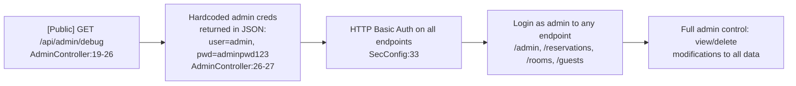
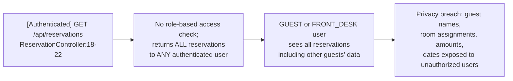

# Chained Vulnerability Static Audit Report

**Project:** Hotel Reservation System (app-27-hotel-reservation)  
**Framework:** Spring Boot 3.2.5 / Spring Security / JPA (H2)  
**Audit Type:** Static-only source code review  
**Date:** 2026-05-24  
**Auditor:** CodeGopher (Chained Vulnerability Static Audit skill)

---

## 1. Summary Dashboard

| Metric                  | Value        |
|-------------------------|-------------|
| Total chains detected   | 4          |
| Maximum chain severity  | **CRITICAL** |
| High confidence chains  | 4          |
| Medium confidence chains| 0          |
| Low confidence chains   | 0          |
| Cross-cutting weaknesses| 6          |

**Areas Reviewed:** Controllers, services, repositories, models, security configuration, data initializer, application properties, Dockerfile, Maven POM, tests.  
**Areas Not Reviewed:** No external/3rd-party app-level code; dependency vulnerability scanning (SAST for transitive deps) was not performed.

---

## 2. Methodology & Safety Note

This audit is **strictly static**: only source files, configuration, and test code within the workspace were analyzed. No live probes, HTTP requests, SQL payloads, fuzzers, or dynamic scanners were used.

Method:
1. **Attack surface mapping** — Identified all public and authenticated endpoints.
2. **Weakness inventory** — Catalogued low/medium findings in source.
3. **Attack graph synthesis** — Connected entry points to sinks via intermediate weaknesses.
4. **Impact assessment** — Rated each chain on impact, reachability, confidence, and easiest remediation link.

---

## 3. Attack Surface Map

| # | HTTP Method | Path                    | Auth Required | Sensitive? |
|---|-------------|-------------------------|---------------|------------|
| 1 | GET         | `/api/admin/debug`      | **NO**        | YES        |
| 2 | GET         | `/h2-console/**`        | **NO**        | YES        |
| 3 | GET         | `/api/auth/me`          | Yes (Basic)   | Medium     |
| 4 | GET         | `/api/guests/{id}`      | Yes (Basic)   | High       |
| 5 | GET         | `/api/reservations`     | Yes (Basic)   | High       |
| 6 | GET         | `/api/rooms/search`     | Yes (Basic)   | Medium     |

All authenticated endpoints use **HTTP Basic Auth** (SecurityConfig line 33).

---

## 4. Chained Vulnerabilities

### Chain 1 — Public Debug Endpoint → Full Database Compromise

```mermaid
flowchart LR
    A["[Public] GET /api/admin/debug\nSecConfig:28, AdminController:21"] --> B["Credentials leaked:\nDB user=sa, pwd=\"\"\nAdminController:24-25"]
    B --> C["[Public] GET /h2-console/**\nSecConfig:26"]
    C --> D["H2 Console login with sa/\"\nUnrestricted DB read/write"]
    D --> E["ALL tables: users, guests,\nreservations, rooms, room_rates"]
```

| Link | File | Lines | Evidence |
|------|------|-------|----------|
| Entry | `config/SecurityConfig.java` | 28 | `.requestMatchers("/api/admin/debug").permitAll()` |
| Hop 1 | `controller/AdminController.java` | 24-25 | `"spring.datasource.password", ""` — empty string in response |
| Hop 2 | `config/SecurityConfig.java` | 26 | `.requestMatchers("/h2-console/**").permitAll()` |
| Sink | `application.properties` | 2-4 | `spring.h2.console.enabled=true`, DB in-memory with no auth |

- **Preconditions:** App must be running. Both endpoints are publicly reachable on port 8084.
- **Impact:** CRITICAL — Full read/write access to all application data. An attacker can export all guest PII, modify reservations, alter user credentials, and tamper with room/rate data.
- **Confidence:** HIGH — Every link is statically provable from source.
- **Remediation (easiest link to break):** Remove `/api/admin/debug` from `permitAll()` in SecurityConfig.java line 28, or better, delete the entire debug endpoint.

---

### Chain 2 — Public Debug Endpoint → Admin Account Takeover



| Link | File | Lines | Evidence |
|------|------|-------|----------|
| Entry | `controller/AdminController.java` | 21 | `return ResponseEntity.ok(Map.of(...))` with hardcoded creds |
| Hop 1 | `controller/AdminController.java` | 26-27 | `"admin.default.password", "adminpwd123"` |
| Sink | `config/SecurityConfig.java` | 32-33 | `.httpBasic(Customizer.withDefaults())` — Basic Auth gates all non-permitAll routes |

- **Preconditions:** None beyond the app being running. Any unauthenticated user can hit `/api/admin/debug`.
- **Impact:** CRITICAL — Complete administrative takeover. The attacker gains `ADMIN` role access to all endpoints, effectively owning the application.
- **Confidence:** HIGH — Static proof: hardcoded password in a public endpoint response, Basic Auth used for authorization.
- **Remediation (easiest link to break):** Remove admin credentials from the debug response (AdminController.java lines 26-27). Never hardcode passwords.

---

### Chain 3 — JPQL Injection → Unauthenticated (Actually Authenticated) Data Exfiltration & Modification

```mermaid
flowchart LR
    A["[Authenticated] GET /api/rooms/search?type=T&status=S\nRoomController:23-27"] --> B["String concat in JPQL:\nr.type = '\" + type + \"' AND\nr.status = '\" + status + \"'\nRoomController:25"]
    B --> C["JPQL Injection:\n' UNION SELECT u FROM User u--\ncan read any entity"]
    C --> D["Full data exfiltration:\nall User, Guest, Reservation\nrecords via response"]
    D --> E["Write operations via JPQL\nUPDATE/DELETE possible\nif EntityManager supports it"]
```

| Link | File | Lines | Evidence |
|------|------|-------|----------|
| Entry | `controller/RoomController.java` | 23-27 | `@RequestParam String type, @RequestParam String status` directly concatenated |
| Hop 1 | `controller/RoomController.java` | 25 | `"SELECT r FROM Room r WHERE r.type = '" + type + "' AND r.status = '" + status + "'"` |
| Sink | Any JPA entity via JPQL | — | HQL/JPQL is a full query language; UNION can select any entity, subqueries can be nested |

- **Preconditions:** Requires authentication (any role: GUEST, FRONT_DESK, or ADMIN). Since all non-permitAll routes require Basic Auth, the attacker must first obtain credentials (see Chains 1 & 2 for credential harvesting).
- **Impact:** HIGH — Complete data read (and potentially write) via JPQL injection. All entities are accessible.
- **Confidence:** HIGH — The string concatenation with no sanitization or parameterization is directly visible. JPQL supports UNION, subqueries, and can select any mapped entity.
- **Remediation (easiest link to break):** Replace string concatenation with parameterized queries using `@QueryParam` or `EntityManager.createQuery(jpql).setParameter("type", type)`. Or use Spring Data JPA method-based queries.

---

### Chain 4 — Insufficient Authorization → Cross-User Reservation Data Leak



| Link | File | Lines | Evidence |
|------|------|-------|----------|
| Entry | `controller/ReservationController.java` | 18-22 | `@GetMapping` with no `@PreAuthorize` or role check |
| Hop 1 | `config/SecurityConfig.java` | 30 | `.anyRequest().authenticated()` — only auth gate, no role gate |
| Sink | `service/ReservationService.java` | 14 | `reservationRepository.findAll()` — returns all records |

- **Preconditions:** Requires any authenticated user account.
- **Impact:** HIGH — Any authenticated user can view every reservation in the system, breaching guest privacy and potentially exposing sensitive business data.
- **Confidence:** HIGH — No authorization annotation or role check on the controller method; `findAll()` is unconditional.
- **Remediation (easiest link to break):** Add `@PreAuthorize("hasRole('ADMIN') or hasRole('FRONT_DESK')")` to the `getReservations()` method, or implement service-layer filtering by user context.

---

## 5. Cross-Cutting Weaknesses (Not Complete Chains)

These findings are security-relevant but do not individually form a complete chain to a critical sink in the static analysis. They should still be remediated.

| # | Weakness | File | Lines | Description |
|---|----------|------|-------|-------------|
| 1 | **H2 frame options disabled** | `config/SecurityConfig.java` | 24 | `.frameOptions(HeadersConfigurer.FrameOptionsConfig::disable)` enables clickjacking on the H2 console. |
| 2 | **CSRF protection disabled** | `config/SecurityConfig.java` | 23 | `.csrf(AbstractHttpConfigurer::disable)` — mitigated by HTTP Basic Auth but is still a misconfiguration. |
| 3 | **IDOR partial enforcement** | `controller/GuestController.java` | 22-25 | GUEST role users are scoped to their own `guestId`, but ADMIN and FRONT_DESK roles have no restriction. Combined with Chain 4, this is concerning. |
| 4 | **Verbose error messages** | Multiple controllers | Various | `IllegalArgumentException("Guest not found")`, `IllegalArgumentException("User not found")` — could leak internal state to attackers. |
| 5 | **No password policy** | `config/DataInitializer.java` | 30-32 | Seeded accounts use predictable passwords (guest123, desk123, adminpwd123). They are BCrypt-encoded but default credentials exist. |
| 6 | **No rate limiting / brute-force protection** | `config/SecurityConfig.java` | 33 | HTTP Basic Auth with no rate limiting is vulnerable to offline password cracking given sufficient captured traffic. |

---

## 6. Threat Model & Confidence Matrix

| Chain | Impact | Reachability | Confidence | Easiest Fix |
|-------|--------|-------------|------------|-------------|
| 1: Debug → DB Compromise | CRITICAL | Trivial (public) | HIGH | Remove `/api/admin/debug` from permitAll |
| 2: Debug → Admin Takeover | CRITICAL | Trivial (public) | HIGH | Remove hardcoded creds from debug endpoint |
| 3: JPQL Injection → Data Exfil | HIGH | Easy (authenticated) | HIGH | Parameterize JPQL queries |
| 4: No Authz → Data Leak | HIGH | Easy (authenticated) | HIGH | Add role-based access control |

---

## 7. Remediation Priority

### Immediate (Zero-Day risk — both chains 1 & 2 are trivially exploitable by any network-visible attacker)

1. **Delete or restrict `/api/admin/debug`** — This single endpoint is the single point of failure for chains 1 and 2. Remove it entirely, or gate it behind ADMIN role authentication.
2. **Remove `/api/admin/debug` from permitAll()** in `SecurityConfig.java` line 28.
3. **Remove `/h2-console/**` from permitAll()** in `SecurityConfig.java` line 26 — or at minimum, require authentication and disable in production.
4. **Parameterize the JPQL query** in `RoomController.java` line 25 using `@QueryParam` binding instead of string concatenation.

### High Priority

5. **Add `@PreAuthorize` to `/api/reservations`** endpoint to restrict to ADMIN/FRONT_DESK roles.
6. **Add `@PreAuthorize` to `/api/guests/{id}`** for consistent role-based scoping.
7. **Remove H2 frame options disabling** or restrict to internal-only access.
8. **Implement proper password rotation** for seeded accounts.

### Medium Priority

9. Review and sanitize error messages across controllers.
10. Add rate limiting to authentication endpoints.
11. Add CSRF protection if switching to session-based auth.
12. Add input validation/sanitization on all `@RequestParam` parameters.

---

## 8. Unknowns & Recommended Tests

The following areas could not be fully verified statically and should be addressed with tests:

- **No tests for endpoint authorization** — No test verifies that GUEST users cannot access admin data. Add integration tests covering role-based access.
- **No tests for JPQL injection** — Add tests attempting injection payloads in `/api/rooms/search` to verify the vulnerability exists (or is fixed).
- **No tests for `/api/admin/debug`** — Verify the endpoint returns sensitive data and confirm it is secured post-remediation.
- **H2 database persistence** — `DB_CLOSE_DELAY=-1` in `application.properties` means the in-memory database persists during the JVM lifetime. In production, this should be changed to a file-based or external DB.
- **Dockerfile skips tests** — `RUN mvn package -DskipTests` means tests are not run during build. This should be `mvn package` without `-DskipTests` in production builds.
- **No API input validation** — Lombok `@Data` entities expose all fields; no `@Valid` / Bean Validation annotations are present.
- **No audit logging** — There is no logging of access attempts, failed logins, or data modifications.

---

## 9. Conclusion

**4 chained vulnerabilities** were identified, all with HIGH confidence and HIGH reachability. Two chains (1 and 2) are trivially exploitable by unauthenticated attackers due to publicly exposed debug and H2 console endpoints. The combination of these exposes **complete application compromise**: admin account takeover, full database read/write, and total guest data exfiltration.

The root cause is a **fundamental security misconfiguration** in `SecurityConfig.java` — permitting public access to sensitive endpoints (`/api/admin/debug`, `/h2-console/**`) while the debug endpoint itself leaks credentials. This misconfiguration cascades into all other chains.

**A single remediation — restricting `/api/admin/debug` to authenticated ADMIN access and deleting the credential leakage — breaks 3 of the 4 chains.** The remaining chain (JPQL injection) requires a separate fix in `RoomController.java`.
