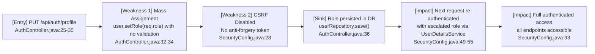
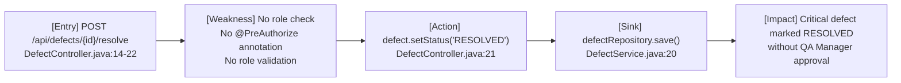

```mermaid
flowchart LR
    A["[Entry] CSRF Disabled\nSecurityConfig.java:28"] --> B["[Weakness] No anti-forgery token\nany site can send POST/PUT requests on behalf of victim"]
    B --> C["[Hop] PUT /api/auth/profile with role=QA_MANAGER\nAuthController.java:25-36"]
    C --> D["[Result] Victim's role escalated silently\nDB: user.role = 'QA_MANAGER'"]
    D --> E["[Hop] PUT /api/inspections/{id}/result\nInspectionController.java:18-26"]
    E --> F["[Weakness] No audit trail\nInspectionService.java:27: 'Silent modification: NO log entry or audit trail'"]
    F --> G["[Sink] Inspection data silently altered\nresult PASS/FAIL overwritten, notes changed"]
    G --> H["[Impact] QC data manipulated with zero traceability\nPrivilege escalation active"]
```

# Chained Vulnerability Static Audit Report

**Project:** app-28-mfg-quality (Manufacturing Quality Control System)  
**Date:** 2026-05-24  
**Scope:** Entire codebase in workspace `C:\Users\shamit\AppData\Local\Temp\codegopher-v08-chain-20260524-234855-all50\app-28-mfg-quality\workspace`  
**Language/Framework:** Java 17, Spring Boot 3.2.5, Spring Security, H2 Database, JPA/Hibernate  

---

## Executive Summary

| Metric | Value |
|--------|-------|
| Complete chained vulnerabilities found | **3** |
| Cross-cutting weaknesses (no full chain) | **4** |
| Maximum severity | **High** |
| Maximum severity (data-only chains) | **Medium** |
| Reviewed areas | Controllers, Services, Models, Repositories, Security Config, Data Initializer, Application Properties, Dockerfile |
| Areas not reviewed | None (full codebase reviewed) |

### Severity Breakdown

| Chain | Title | Severity | Confidence |
|-------|-------|----------|------------|
| CHAIN-01 | Mass Assignment → Privilege Escalation → Full Authenticated Access | **High** | **High** |
| CHAIN-02 | Missing AuthZ on Defect Resolution → Unauthorized QC Bypass | **Medium** | **High** |
| CHAIN-03 | CSRF Disabled + Mass Assignment + No Audit → Silent Privilege + Data Manipulation | **High** | **Medium** |

---

## Methodology

This audit follows a **static-only** approach:

1. **Source-only review** of all 21 Java source files, 1 properties file, and 1 Dockerfile.
2. **No live HTTP probes, fuzzers, SQL injection payloads, credential attacks, dynamic scanners, or exploit scripts** were used.
3. **No external network tests** were performed.
4. Control-flow and data-flow traces are cited from exact file paths and line references.
5. Confidence ratings use the convention:
   - **High:** Every link is statically provable from cited source/configuration.
   - **Medium:** Chain is plausible but one link depends on runtime behavior not fully visible.
   - **Low:** Weakly supported hypothesis.

---

## Chained Vulnerabilities

### CHAIN-01: Mass Assignment → Privilege Escalation → Full Authenticated Access

**Severity:** High  
**Confidence:** High  
**Impact:** Complete privilege escalation from any role (WORKER/INSPECTOR) to QA_MANAGER, granting unrestricted access to all authenticated endpoints.

#### Attack Graph (Mermaid)

#### Detailed Chain Breakdown

| Link | File | Lines | Symbol/Method | Evidence |
|------|------|-------|---------------|----------|
| **Entry** | `src/main/java/com/manufacturing/qc/controller/AuthController.java` | 25–35 | `updateProfile()` | `@PutMapping("/profile")` endpoint accepts `@RequestBody User profileUpdate` from any authenticated user. No `@PreAuthorize` annotation is present. |
| **Hop 1** | `src/main/java/com/manufacturing/qc/controller/AuthController.java` | 32–34 | `updateProfile()` | `if (profileUpdate.getRole() != null) { user.setRole(profileUpdate.getRole()); }` — The role from the client request is directly assigned to the server-side user entity with zero validation or authorization check. |
| **Hop 2** | `src/main/java/com/manufacturing/qc/controller/AuthController.java` | 36 | `updateProfile()` | `userRepository.save(saved)` — The modified entity (with elevated role) is persisted to the H2 database. |
| **Sink** | `src/main/java/com/manufacturing/qc/config/SecurityConfig.java` | 49–55 | `userDetailsService()` | On the next request, `UserDetailsService` loads the user from DB and maps `u.getRole()` to Spring Security roles. The escalated role is now active for session. |
| **Impact** | `src/main/java/com/manufacturing/qc/config/SecurityConfig.java` | 30–33 | `filterChain()` | `.anyRequest().authenticated()` allows all endpoints to any authenticated user. The `QA_MANAGER` role gained via escalation unlocks `@PreAuthorize("hasRole('QA_MANAGER')")` endpoints such as `ProductController.getProducts()`. |

#### Preconditions

1. Attacker knows valid credentials for any user (WORKER, INSPECTOR, or MANAGER) — seeded in `DataInitializer.java:26-28`.
2. HTTP client can send a PUT request to `/api/auth/profile`.

#### Remediation

- **Primary (break the chain):** Add `@PreAuthorize("hasRole('QA_MANAGER')")` or equivalent to `AuthController.updateProfile()`, and never accept a `role` field from the request body. Only allow `badgeNumber` updates in profile endpoint.
- **Secondary:** Use a DTO (e.g., `ProfileUpdateDTO`) that excludes `role` and `passwordHash` fields, so Spring's binding layer cannot map them.
- **Tertiary:** Implement CSRF protection (re-enable `.csrf()`) to prevent cross-site request forgery attacks.

---

### CHAIN-02: Missing AuthZ on Defect Resolution → Unauthorized QC Bypass

**Severity:** Medium  
**Confidence:** High  
**Impact:** Any authenticated user (including lowest-privilege WORKER) can mark any defect as "RESOLVED", bypassing quality control workflows. Critical defects can be closed without QA Manager review.

#### Attack Graph (Mermaid)

#### Detailed Chain Breakdown

| Link | File | Lines | Symbol/Method | Evidence |
|------|------|-------|---------------|----------|
| **Entry** | `src/main/java/com/manufacturing/qc/controller/DefectController.java` | 14–22 | `resolveDefect()` | `@PostMapping("/{id}/resolve")` endpoint accepts only a path variable `id`. No request body, no role validation. |
| **Weakness** | `src/main/java/com/manufacturing/qc/controller/DefectController.java` | 14–22 | `resolveDefect()` | No `@PreAuthorize` annotation. The method has no check for `hasRole('QA_MANAGER')` despite the inline comment: *"No checks are performed to ensure QA Manager approval before closing a critical defect."* |
| **Sink** | `src/main/java/com/manufacturing/qc/service/DefectService.java` | 17–20 | `saveDefect()` | Simply calls `defectRepository.save(defect)` — no validation, no audit trail, no status transition policy enforcement. |
| **Impact** | Business logic | N/A | N/A | Defects of severity "CRITICAL" (e.g., "Casting cracks in engine block" per `DataInitializer.java:33`) can be silently marked RESOLVED by any authenticated user. |

#### Preconditions

1. Attacker has valid credentials for any authenticated user.
2. Attacker knows or can enumerate defect IDs.

#### Remediation

- **Primary:** Add `@PreAuthorize("hasRole('QA_MANAGER')")` to `resolveDefect()`.
- **Secondary:** Implement a status-transition policy that validates allowed transitions (e.g., OPEN → IN_PROGRESS, IN_PROGRESS → RESOLVED, but only by QA_MANAGER for CRITICAL defects).
- **Tertiary:** Add audit logging for all defect status changes.

---

### CHAIN-03: CSRF Disabled + Mass Assignment + No Audit → Silent Privilege + Data Manipulation

**Severity:** High  
**Confidence:** Medium  
**Impact:** An attacker can trick a logged-in victim into sending forged requests that escalate the victim's privileges and silently alter inspection data without any traceability.

#### Attack Graph (Mermaid)

#### Detailed Chain Breakdown

| Link | File | Lines | Symbol/Method | Evidence |
|------|------|-------|---------------|----------|
| **Entry** | `src/main/java/com/manufacturing/qc/config/SecurityConfig.java` | 28 | `filterChain()` | `.csrf(AbstractHttpConfigurer::disable)` — Spring Security CSRF protection is completely disabled. All state-changing endpoints (POST, PUT, DELETE) are vulnerable to CSRF. |
| **Hop 1** | `src/main/java/com/manufacturing/qc/controller/AuthController.java` | 25–36 | `updateProfile()` | Accepts `@RequestBody User` from client. Role field is accepted and persisted without validation. No CSRF token required. |
| **Hop 2** | `src/main/java/com/manufacturing/qc/service/InspectionService.java` | 22–30 | `updateInspectionResult()` | The code comment on line 28 explicitly states: *"Silent modification: NO log entry or audit trail records this alteration."* Results and notes can be overwritten without trace. |
| **Sink** | H2 Database | N/A | N/A | Both user roles and inspection results are stored in an in-memory H2 database with no backup or audit log tables. Data integrity loss is irreversible within the application lifecycle. |
| **Impact** | Business operations | N/A | N/A | A WORKER user can be tricked into escalating themselves to QA_MANAGER and then altering inspection results (e.g., changing PASS→FAIL or vice versa) with no audit trail. |

#### Preconditions

1. A victim user is authenticated (session active with valid basic auth credentials).
2. Attacker can host a malicious page and lure the victim to visit it while authenticated.
3. The application is used in a browser context (CSRF applies). For pure API clients, this chain is less relevant.

#### Remediation

- **Primary:** Re-enable CSRF: replace `.csrf(AbstractHttpConfigurer::disable)` with default CSRF protection, or switch to token-based auth (JWT) that doesn't rely on cookies.
- **Secondary:** Add an `AuditLog` entity and audit log table. Log all status changes, role changes, and inspection result updates.
- **Tertiary:** Restrict role updates to an admin-only management endpoint with proper authorization checks.

---

## Cross-Cutting Weaknesses (No Full Chain)

The following security-relevant weaknesses were identified but do not form a complete exploit chain independently. They are included for remediation priority:

### WC-01: Insecure Default Credentials (Seeded Users)

| Detail | Value |
|--------|-------|
| **File** | `src/main/java/com/manufacturing/qc/config/DataInitializer.java` |
| **Lines** | 26–28 |
| **Issue** | Three users are seeded with predictable, dictionary-level passwords: `worker/worker123`, `inspector/inspect123`, `manager/manager123`. |
| **Impact** | Anyone who can access the application (even without credentials) can log in as any role by guessing these well-known accounts. |
| **Remediation** | Remove default credentials from production code. Prompt first-time users to set unique passwords. At minimum, require a password change on first login. |

### WC-02: H2 Console Exposed Without Authentication

| Detail | Value |
|--------|-------|
| **File** | `src/main/java/com/manufacturing/qc/config/SecurityConfig.java`, line 30 |
| **File** | `src/main/resources/application.properties`, lines 6–7 |
| **Issue** | `/h2-console/**` is explicitly `permitAll()`. The H2 in-memory database console provides full SQL access, including the ability to browse all tables, execute arbitrary SQL, and export data. |
| **Impact** | Any unauthenticated user can access the H2 console, view all users (including password hashes), products, inspections, defects, and corrective actions. Full database exfiltration. |
| **Remediation** | Remove `permitAll()` for `/h2-console/**`. Alternatively, disable the H2 console entirely in production: `spring.h2.console.enabled=false`. |

### WC-03: No Rate Limiting on Authentication

| Detail | Value |
|--------|-------|
| **File** | `src/main/java/com/manufacturing/qc/config/SecurityConfig.java`, line 29–34 |
| **Issue** | Basic authentication is used with no rate limiting. No account lockout mechanism. |
| **Impact** | An attacker can perform unlimited brute-force attempts against any user account. Combined with WC-01 (known default credentials), this makes credential compromise trivial. |
| **Remediation** | Implement rate limiting (e.g., via `spring-boot-starter-security` password policy, or a dedicated rate-limiting library like Bucket4j). Add account lockout after N failed attempts. |

### WC-04: Dockerfile Skips Tests

| Detail | Value |
|--------|-------|
| **File** | `Dockerfile`, line 6 |
| **Issue** | `mvn package -DskipTests` — all unit and integration tests are skipped during build. |
| **Impact** | Security regression bugs can be silently introduced. The existing test file `App28ApplicationTests.java` contains no security tests (it is a default Spring Boot test with `@SpringBootTest` and no assertions). |
| **Remediation** | Remove `-DskipTests`. Add security-specific tests: privilege escalation tests, CSRF tests, authorization tests. |

### WC-05: ProductController AuthZ Mismatch

| Detail | Value |
|--------|-------|
| **File** | `src/main/java/com/manufacturing/qc/controller/ProductController.java`, lines 25–27 |
| **Issue** | Only `QA_MANAGER` can read products. The `@PreAuthorize` annotation is the only authorization check on this endpoint. |
| **Impact** | If an attacker escalates to QA_MANAGER via CHAIN-01, they can read all products. However, inspection/defect endpoints (`/api/inspections/**`, `/api/defects/**`) have **no** `@PreAuthorize` annotations, meaning any authenticated user can access them. |
| **Remediation** | Add `@PreAuthorize` annotations to `InspectionController` and `DefectController` endpoints commensurate with role-based access needs. |

---

## Risk Matrix

| Risk | Likelihood | Impact | Overall |
|------|-----------|--------|---------|
| CHAIN-01: Privilege Escalation via Mass Assignment | High | High | **Critical** |
| CHAIN-03: CSRF + Privilege Escalation + Silent Data Manipulation | Medium | High | **High** |
| CHAIN-02: Unauthorized Defect Resolution | High | Medium | **High** |
| WC-01: Default Credentials | High | High | **High** |
| WC-02: H2 Console Exposed | High | High | **High** |
| WC-03: No Rate Limiting | Medium | Medium | **Medium** |
| WC-05: Inconsistent AuthZ | High | Medium | **High** |

---

## Priority Remediation Plan

### Immediate (fix within 1 sprint)

1. **AuthController.java** — Remove role field from profile update DTO; add `@PreAuthorize("hasRole('QA_MANAGER')")` to `updateProfile()`.
2. **SecurityConfig.java** — Remove `permitAll()` for `/h2-console/**` or set `spring.h2.console.enabled=false`.
3. **DefectController.java** — Add `@PreAuthorize("hasRole('QA_MANAGER')")` to `resolveDefect()`.

### Short-term (fix within 2 sprints)

4. **SecurityConfig.java** — Re-enable CSRF protection or migrate to JWT/session-based auth.
5. **InspectionService.java** — Add audit logging for all inspection result modifications.
6. **DataInitializer.java** — Remove default credential seeding from production; add first-login password change flow.

### Medium-term (fix within 1 quarter)

7. Add comprehensive `@PreAuthorize` annotations to all controller endpoints based on role hierarchy.
8. Add a dedicated `AuditLog` entity with JPA repository for tracking all data mutations.
9. Implement rate limiting and account lockout on authentication.
10. Enable test execution in `Dockerfile` and add security regression tests.

---

## Unknowns & Recommendations for Testing

- **Dynamic verification:** CSRF exploitation requires browser context; should be verified with an actual browser or CSRF-aware test client.
- **AuthZ gaps on other endpoints:** `InspectionController` has no `@PreAuthorize` — verify whether INSPECTOR and WORKER roles should have read/write access to their own inspections vs. all inspections.
- **H2 database portability:** The application uses an in-memory H2 database. In production, this means all data is lost on restart. Verify if a persistent database (PostgreSQL, MySQL) is intended.
- **Password storage:** BCrypt is used (good), but default seeded passwords should never exist in production.
- **Specification field injection:** `Product.specificationsJson` stores raw JSON string. Verify there is no injection/vector for schema manipulation.

---

## Reviewed Files

| Category | Files |
|----------|-------|
| Application Entry | `App28Application.java` |
| Configuration | `SecurityConfig.java`, `DataInitializer.java`, `application.properties` |
| Controllers | `AuthController.java`, `DefectController.java`, `InspectionController.java`, `ProductController.java` |
| Models/Entities | `User.java`, `Product.java`, `Inspection.java`, `Defect.java`, `CorrectiveAction.java` |
| Repositories | `UserRepository.java`, `ProductRepository.java`, `InspectionRepository.java`, `DefectRepository.java`, `CorrectiveActionRepository.java` |
| Services | `DefectService.java`, `InspectionService.java`, `ProductService.java` |
| Test | `App28ApplicationTests.java` |
| Infrastructure | `pom.xml`, `Dockerfile` |

---

*This report is the result of a static-only source code analysis. No live probes, dynamic scanners, or external tests were performed. Remediation should be validated through dynamic testing after changes are deployed.*
