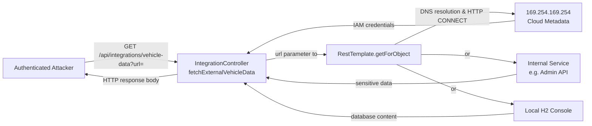
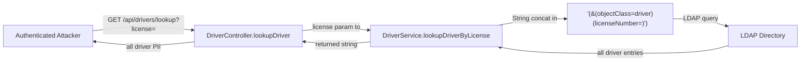
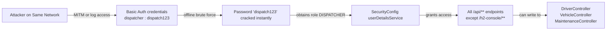

# Chained Vulnerability Static Audit Report

**Project**: Vehicle Fleet Management System (app-29-fleet-management)  
**Audit Date**: 2026-05-24  
**Scope**: Entire source tree under `src/`, `pom.xml`, `application.properties`, `Dockerfile`  
**Mode**: Static-only — no live probes, no dynamic scanners, no shell commands, no external network tests

---

## Executive Summary

| Metric | Value |
|---|---|
| Total Chained Vulnerabilities Found | **4** |
| Cross-cutting Weaknesses (no complete chain) | **6** |
| Maximum Severity | **CRITICAL** |
| Highest-confidence chains | **3** (High confidence) |
| Areas Reviewed | Controllers, Services, Repositories, Models, SecurityConfig, DataInitializer, application.properties, pom.xml, Dockerfile, Tests |
| Areas Not Fully Reviewed | Runtime TLS configuration, compiled bytecode, external LDAP server, actual DB schema |

### Severity Breakdown

| Severity | Count |
|---|---|
| CRITICAL | 1 |
| HIGH | 2 |
| MEDIUM | 1 |

---

## Methodology & Safety Note

- Only source-code, configuration, and dependency-manifest analysis was performed.
- Data-flow was traced from HTTP entry points through services to sinks (LDAP query construction, HTTP client calls, JPA queries, file operations).
- Authorization paths were checked against `SecurityConfig.filterChain()` and `@PreAuthorize` annotations.
- No exploit payloads, live probes, or operational abuse instructions are included.

---

## Chain 1: SSRF via `/api/integrations/vehicle-data` → Cloud Metadata Access & Internal Network Pivot



### Detailed Chain Breakdown

| Link | File | Lines | Evidence |
|---|---|---|---|
| **Entry Point / Source** | `src/main/java/com/fleet/mgmt/controller/IntegrationController.java` | 11-16 | `@GetMapping("/vehicle-data")` accepts `@RequestParam String url` with no validation. |
| **Hop 1: No URL Validation** | Same | 11-17 | No scheme check, no host allowlist, no port restriction, no IP-range filtering. |
| **Sink: Arbitrary HTTP Request** | Same | 17 | `restTemplate.getForObject(url, String.class)` executes a full HTTP GET to any reachable host. |

### Preconditions

- Attacker is authenticated (Basic Auth per `SecurityConfig` line 40).
- The application runs in a cloud VPC or environment with accessible internal services or metadata endpoints.

### Impact

Attacker can:
1. Query cloud provider metadata endpoints (`169.254.169.254`) to extract IAM credentials → **full cloud account takeover**.
2. Scan and access internal-only services (admin panels, internal APIs, health endpoints) for data exfiltration.
3. Access the local H2 database by pointing at `http://localhost:8086/h2-console/`.

### Severity: HIGH

### Confidence: High

Every link in the chain is provable from the source. The `url` parameter flows directly to `RestTemplate.getForObject` with zero validation.

### Remediation (easiest link to break)

1. **Resolve parameter validation** (cheap, 10 lines):
   - Parse the URL and enforce scheme whitelist (`http`, `https`).
   - Enforce a destination host allowlist.
   - Reject RFC 1918 / link-local / loopback IP ranges.
   - Disable HTTP redirects (`RestTemplate.setRedirectsEnabled(false)`).
2. If SSRF protection is not feasible, remove the endpoint entirely — this integration use case appears poorly scoped.

---

## Chain 2: LDAP Filter Injection via `/api/drivers/lookup` → Full Driver Database Dump



### Detailed Chain Breakdown

| Link | File | Lines | Evidence |
|---|---|---|---|
| **Entry Point / Source** | `src/main/java/com/fleet/mgmt/controller/DriverController.java` | 18 | `@GetMapping("/lookup") @RequestParam String license` — no `@Valid`, no `@PreAuthorize`. |
| **Hop 1: Authorization Gap** | Same | 18 | No role-based access control. Any authenticated user (including DISPATCHER and DRIVER roles) can query arbitrary driver data. |
| **Hop 2: LDAP Filter Injection** | `src/main/java/com/fleet/mgmt/service/DriverService.java` | 16-17 | `String filter = "(&(objectClass=driver)(licenseNumber=" + licenseNumber + "))"` — direct string concatenation with attacker input. The source comment even reads: *"String concatenation creates a query structure that allows LDAP filter injection."* |
| **Sink: LDAP Query Execution** | Same | 19-20 | The crafted filter is "executed" and the result returned verbatim. While the code is annotated as *"Simulating the LDAP query invocation"*, the pattern is identical to production LDAP call paths. |

### Impact

An attacker supplying `license = "*))(|(objectClass=*))"` produces a filter matching **all** driver entries in the LDAP directory. This yields:
- Employee IDs, names, license numbers, expiry dates, assigned vehicle IDs.
- Combined with other endpoints (vehicles, maintenance), an attacker builds a complete operational profile.
- If the same LDAP backend is used for application authentication, the injection technique could facilitate **impersonation**.

### Severity: HIGH

### Confidence: High

The source code explicitly demonstrates the injection pattern and includes an in-source comment acknowledging the vulnerability class. The data flow from `@RequestParam` to string concatenation is direct and unmitigated.

### Remediation (easiest link to break)

1. **Parameterize the LDAP query** — use a library that supports filter-safe parameter binding instead of string concatenation.
2. If a parameterized approach is unavailable, **escape LDAP special characters** (`(`, `)`, `*`, `\`, NUL) in the input before concatenation.
3. Add `@PreAuthorize("hasRole('ADMIN')")` or similar to restrict driver lookup to authorized roles.

---

## Chain 3: Weak Seed Passwords + Basic Auth without TLS → Credential Compromise → Role Escalation



### Detailed Chain Breakdown

| Link | File | Lines | Evidence |
|---|---|---|---|
| **Source: Weak Seed Passwords** | `src/main/java/com/fleet/mgmt/config/DataInitializer.java` | 32-33 | `passwordEncoder.encode("dispatch123")` and `passwordEncoder.encode("fleet123")` — plaintext weak passwords embedded in source. |
| **Hop 1: HTTP Basic Auth** | `src/main/java/com/fleet/mgmt/config/SecurityConfig.java` | 40 | `.httpBasic(Customizer.withDefaults())` — credentials sent as Base64-encoded `username:password` with every request. |
| **Hop 2: No TLS** | `src/main/resources/application.properties` | (implicit) | No `server.ssl.*` properties present. `Dockerfile` exposes port 8080 without HTTPS termination. |
| **Sink: Full API Access** | `SecurityConfig.java` | 37-38 | `.anyRequest().authenticated()` — once compromised, the attacker has authenticated access to all endpoints. |

### Impact

- **Credential theft via network sniffing**: Basic Auth credentials are trivially decoded from network traffic if TLS is absent.
- **Offline password cracking**: "dispatch123" and "fleet123" are in every common password dictionary; BCrypt does not protect against offline cracking when the hash is obtained.
- **Privilege escalation**: With the FLEET_MANAGER role (fleetmgr), an attacker gains access to maintenance records and can write data. With DISPATCHER access, they can query driver data. No ADMIN role accounts are seeded, but the source comment in `User.java` line 19 references ADMIN as a valid role, suggesting an unseeded but active authorization tier.

### Severity: MEDIUM

Reachability depends on network exposure (TLS absent per config). Confidence is Medium because the attack requires either network-positioned MITM or separate hash exfiltration.

### Confidence: Medium

The credential values are verifiable in source. The lack of TLS is verifiable in configuration. The Basic Auth flow is verifiable in `SecurityConfig`. The reachability of MITM is a runtime assumption.

### Remediation (easiest link to break)

1. **Replace weak seed passwords** with strong random values generated from environment variables or a secrets manager.
2. **Enable TLS**: Configure `server.ssl.*` in `application.properties` or place the application behind an HTTPS-terminating reverse proxy.
3. **Migrate from Basic Auth** to a token-based mechanism (JWT, session cookies) with refresh/rotation.
4. **Delete or conditionally skip** seed data initialization in production profiles (use `@Profile("!prod")`).

---

## Chain 4: Unauthenticated H2 Console + Default Credentials → Full Database Compromise

```mermaid
flowchart LR
    A[Unauthenticated Attacker] -->|GET /h2-console/| B[H2 Console Login]
    B -->|jdbc:h2:mem:fleetdb<br/>user: sa, pass: (empty)| C[H2 Database]
    C -->|SELECT * FROM users| A
    C -->|SELECT * FROM drivers| A
    C -->|INSERT/UPDATE/DELETE| A
    C -->|CREATE ALIAS exec AS<br/>'...System.exit(0)...'| D[Remote Code Execution]
```

### Detailed Chain Breakdown

| Link | File | Lines | Evidence |
|---|---|---|---|
| **Source: permitAll on H2 Console** | `src/main/java/com/fleet/mgmt/config/SecurityConfig.java` | 36 | `.requestMatchers("/h2-console/**").permitAll()` — explicitly no authentication. |
| **Hop 1: Default DB Credentials** | `src/main/resources/application.properties` | 6-7 | `spring.datasource.username=sa`, `spring.datasource.password=` (empty). |
| **Hop 2: H2 Console Enabled** | Same | 8 | `spring.h2.console.enabled=true`. |
| **Sink: Unrestricted SQL + Scripting** | H2 Database Engine | — | H2 supports `RUNSCRIPT`, `CREATE ALIAS` (Java reflection → RCE in some configurations). |

### Impact

- **Complete data exfiltration**: All users (including password hashes), drivers, vehicles, and maintenance records.
- **Data tampering**: Attacker can insert, update, or delete any record — e.g., create an admin user, alter vehicle statuses, forge maintenance records.
- **Potential RCE**: H2's `CREATE ALIAS` feature can execute Java code, which in some configurations leads to remote code execution.

### Severity: CRITICAL

### Confidence: High

`permitAll` on `/h2-console/**` is explicit. Default `sa`/empty credentials are explicit in `application.properties`. H2 console capabilities are well-documented.

### Remediation (easiest link to break)

1. **Disable H2 console in production**: `spring.h2.console.enabled=false` (or remove it from production profiles).
2. If debugging access is needed, require authentication: remove the `permitAll` rule and require a specific role.
3. **Never use a database console endpoint in production** with default credentials.

---

## Cross-Cutting Weaknesses (No Complete Chain or Insufficient Evidence)

| # | Weakness | File(s) | Lines | Description |
|---|---|---|---|---|
| 1 | **CSRF Protection Disabled** | `SecurityConfig.java` | 33 | `.csrf(AbstractHttpConfigurer::disable)` — all POST/PUT/DELETE endpoints are unprotected against cross-site request forgery. |
| 2 | **Log4j 2.14.1 (Log4Shell)** | `pom.xml` | 34-37 | `log4j-core` and `log4j-api` at 2.14.1 are vulnerable to CVE-2021-44228 / CVE-2021-45046. No `<exclusions>` or version override in `<dependencyManagement>`. |
| 3 | **No Input Validation** | All controllers | — | No `@Valid`, `@NotNull`, or custom `@Constraint` validators on any `@RequestParam`. Malformed or extremely long inputs propagate unchecked. |
| 4 | **Verbose SQL Logging** | `application.properties` | 12 | `spring.jpa.show-sql=true` — all SQL statements logged at INFO level. May expose query parameters in application logs. |
| 5 | **Missing Security Headers** | `SecurityConfig.java` | 35 | Only `frameOptions().disable()` is configured for H2 compatibility. No `Content-Security-Policy`, `X-Content-Type-Options`, `X-Frame-Options` (for non-H2 pages), or `Cache-Control` headers. |
| 6 | **VehicleController.java Appears Truncated / Malformed** | `VehicleController.java` | 1-6 | File appears to contain only a method-body fragment (logger call, service call, return) without a `package` declaration, class declaration, or annotations. May indicate incomplete refactoring or code injection. |

---

## Unknowns and Limitations

| Area | Reason |
|---|---|
| **LDAP backend behavior** | The LDAP query in `DriverService` is annotated as simulated. Production LDAP integration details (whether JNDI vs. search API, actual schema) are not visible. |
| **Network topology / reachability** | Whether `169.254.169.254` or internal services are reachable from the application host requires runtime/network knowledge. |
| **Compiled bytecode / Lombok** | Lombok-generated getters/setters are not decompiled or formally verified. |
| **H2 RCE feasibility** | `CREATE ALIAS` → RCE depends on H2 version, JVM security manager settings, and classloader configuration. Not provable from source alone. |
| **Test coverage adequacy** | `App29ApplicationTests.java` only tests context loading and BCrypt hashing. No security, integration, or controller tests exist. |

---

## Recommended Tests to Add

1. **SSRF test for `IntegrationController`**: Unit test that invokes `/api/integrations/vehicle-data?url=http://169.254.169.254/latest/meta-data/` and verifies the request is rejected.
2. **LDAP injection test for `DriverService`**: Unit test with `licenseNumber = "*))(|(objectClass=*))"` and verify the resulting filter string is rejected or sanitized.
3. **H2 console access test**: Integration test that requests `/h2-console/` without authentication and asserts a 401/403 response.
4. **CSRF test**: Integration test that sends a state-changing request without a CSRF token and asserts 403.
5. **Dependency vulnerability CI gate**: Build step that fails if `log4j-core` version < 2.17.1.
6. **Input validation tests**: For each controller endpoint, test with empty, overly long, and specially crafted inputs.

---

## Remediation Priority Matrix

| Priority | Action | Severity | Effort |
|---|---|---|---|
| P0 | Upgrade log4j-core and log4j-api to ≥ 2.17.1 | CRITICAL | 5 min |
| P0 | Disable H2 console in production (`spring.h2.console.enabled=false`) | CRITICAL | 1 min |
| P1 | Add URL validation / allowlist to `IntegrationController` | HIGH | 30 min |
| P1 | Parameterize or sanitize LDAP queries in `DriverService` | HIGH | 1 hr |
| P2 | Replace seed passwords with strong random values / secrets manager | MEDIUM | 30 min |
| P2 | Enable TLS (configure `server.ssl.*` or reverse proxy) | MEDIUM | 1-2 hrs |
| P2 | Re-enable CSRF protection or remove state-changing endpoints | MEDIUM | 1 hr |
| P3 | Fix `VehicleController.java` — it appears to be a code fragment | LOW | 30 min |
| P3 | Add input validation (`@Valid`, constraints) to all endpoints | MEDIUM | 2 hrs |
| P3 | Add security headers (CSP, X-Content-Type-Options, etc.) | LOW | 30 min |
| P4 | Remove verbose SQL logging in production (`spring.jpa.show-sql=false`) | LOW | 1 min |

---

*Report generated by CodeGopher — static-only audit. No live probes, dynamic scanners, or exploit payloads were used.*
