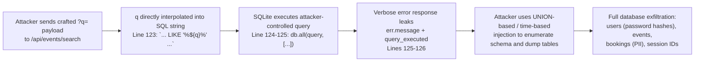
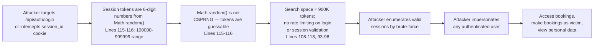
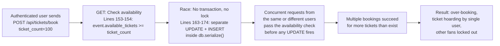
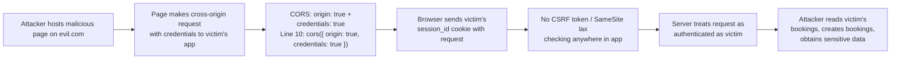
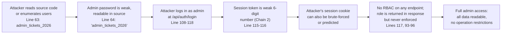

# Chained Vulnerability Audit Report — Event Ticketing Platform

**Audit type**: Static-only source code review (no live probes, no dynamic scanners)  
**Date**: 2026-05-24  
**Codebase**: `app-31-event-ticketing` — single-file Express/SQLite application  
**Reviewed file**: `src/index.ts` (340 lines)

---

## Summary Dashboard

| Metric | Value |
|---|---|
| **Total chained vulnerabilities found** | **5** |
| **Maximum severity (chain)** | **High** |
| **Cross-cutting weaknesses** | 4 |
| **Reviewed areas** | Auth flows, event search, booking flow, CORS, session management, DB init, security middleware |
| **Areas not reviewed** | Frontend code (none present), external services/webhooks, deployment security beyond Dockerfile, fuzz testing, penetration tests |

**Severity breakdown of chains:**

| # | Title | Severity | Confidence |
|---|---|---|---|
| 1 | SQL Injection via search → Full DB exfiltration | **High** | High |
| 2 | Weak session tokens → Account takeover via brute-force | **High** | High |
| 3 | TOCTOU race condition → Ticket hoarding / double-booking | **High** | High |
| 4 | Permissive CORS + No CSRF → Cross-origin session hijack | **Medium** | Medium |
| 5 | Hardcoded weak admin password + weak sessions + no RBAC → Full admin takeover | **High** | High |

---

## Methodology & Safety Note

- This audit was performed **statically** against source files only.
- No HTTP probes, SQLi payloads, fuzzing, or network tests were executed.
- Chain links were traced via data-flow, control-flow, and configuration evidence in the source code.
- All references cite specific file paths and line numbers.

---

## Chain 1 — SQL Injection in Search → Full Database Exfiltration

### Mermaid Attack Graph



### Detailed Breakdown

| Phase | File | Line(s) | Evidence |
|---|---|---|---|
| **Entry Point** | `src/index.ts` | 121–122 | `const q = req.query.q || '';` — user-controlled parameter directly from URL |
| **Hop 1** | `src/index.ts` | 123 | `const query = \`SELECT * FROM events WHERE name LIKE '%${q}%' OR description LIKE '%${q}%'\`` — template literal interpolation into SQL, no parameterization |
| **Hop 2** | `src/index.ts` | 125–126 | `return res.status(400).json({ error: err.message, query_executed: query });` — on error, returns both the raw SQL query and the engine error message, aiding in crafting and confirming injection payloads |
| **Sink** | `src/index.ts` | 124 | `db.all(query, [], (err, rows)` — passes the unsanitized query string to SQLite3 |
| **Impact** | — | — | Full read access to SQLite database: all user records (password hashes), event data, booking records (including PII and booking references), and any future tables |

### Preconditions & Assumptions
- The search endpoint is reachable (no auth gate).
- SQLite3 does not distinguish statement contexts — a UNION-based injection can access any table.

### Confidence: **High** — Every link is provable from source.

### Remediation
1. Parameterize the query:
   ```typescript
   const searchParam = `%${q}%`;
   db.all('SELECT * FROM events WHERE name LIKE ? OR description LIKE ?', [searchParam, searchParam], ...);
   ```
2. Never return `query_executed` or raw SQL errors to the client.
3. Log errors server-side only.

---

## Chain 2 — Weak Session Tokens → Account Takeover via Brute-Force

### Mermaid Attack Graph



### Detailed Breakdown

| Phase | File | Line(s) | Evidence |
|---|---|---|---|
| **Entry Point** | `src/index.ts` | 108–118 | `/api/auth/login` — any unauthenticated user can POST credentials |
| **Hop 1** | `src/index.ts` | 115 | `const sessionId = Math.floor(Math.random() * 900000 + 100000).toString();` — 6-digit numeric token from `Math.random()` (non-cryptographic PRNG) |
| **Hop 2** | `src/index.ts` | 93–96 | `getSessionUser()` checks cookie against in-memory `sessions` map with no additional validation (no IP binding, no User-Agent check) |
| **Hop 3** | `src/index.ts` | 108–118 | No rate limiting, no account lockout, no CAPTCHA on login |
| **Sink** | `src/index.ts` | 93–96, 115–117 | Session store serves as sole auth mechanism; session validation accepts any valid 6-digit token |
| **Impact** | — | — | An attacker can brute-force the ~900K possible token space and gain full access to any user's account, including their bookings and the ability to make new bookings |

### Preconditions & Assumptions
- The application runs with sufficient concurrent sessions that a brute-force attack would find active sessions.
- No other mitigations (IP-based session binding, token rotation) are present.

### Confidence: **High** — Token space size, RNG weakness, and session validation gap are all statically visible.

### Remediation
1. Use a CSPRNG:
   ```typescript
   const sessionId = crypto.randomUUID();  // v4 UUID, 122 bits of entropy
   ```
2. Implement rate limiting on `/api/auth/login`.
3. Bind sessions to client fingerprint (IP + User-Agent).

---

## Chain 3 — TOCTOU Race Condition → Ticket Hoarding / Double-Booking

### Mermaid Attack Graph



### Detailed Breakdown

| Phase | File | Line(s) | Evidence |
|---|---|---|---|
| **Entry Point** | `src/index.ts` | 148–152 | `/api/tickets/book` — authenticated user provides `event_id` and `ticket_count` in request body |
| **Hop 1 (TOCTOU check)** | `src/index.ts` | 153–154 | `db.get('SELECT * FROM events WHERE id = ?', [event_id], ...)` reads current `available_tickets` |
| **Hop 2 (No isolation)** | `src/index.ts` | 163–174 | Two separate `db.run()` calls inside `db.serialize()` — the UPDATE and INSERT are **not** wrapped in a transaction (`BEGIN`/`COMMIT`) |
| **Hop 3** | `src/index.ts` | 155–156 | `if (event.available_tickets < ticket_count)` — the check result is cached in the callback; the actual availability may have changed by the time the UPDATE executes |
| **Hop 4** | `src/index.ts` | 152 | No rate limiting on booking endpoint; no per-user booking cap |
| **Sink** | `src/index.ts` | 165–166 | `UPDATE events SET available_tickets = available_tickets - ? WHERE id = ?` — the decrement can exceed actual stock due to concurrent reads |
| **Impact** | — | — | A single attacker can book all available tickets for a popular event by sending parallel requests, or achieve overbooking by racing other legitimate users |

### Preconditions & Assumptions
- SQLite's default locking is file-level (provides some serialisation) but in-memory databases with concurrent Node.js callbacks can still produce race conditions at the JavaScript level between the check callback and the execute callbacks.
- The comment on lines 160–161 explicitly admits: "No transaction block, locking mechanism, or rate limits on booking."

### Confidence: **High** — The comment itself is a smoking gun; the code structure (check-then-update without transactions) is a textbook TOCTOU pattern.

### Remediation
1. Wrap the check-and-update in an explicit transaction:
   ```typescript
   db.run('BEGIN TRANSACTION', (err) => {
     db.run('UPDATE events SET available_tickets = available_tickets - ? WHERE id = ? AND available_tickets >= ?',
       [ticket_count, event_id, ticket_count],
       function(updateErr) { ... }
     );
     db.run('COMMIT', (commitErr) => { ... });
   });
   ```
2. Add per-user booking limits.
3. Add rate limiting to the booking endpoint.

---

## Chain 4 — Permissive CORS + No CSRF → Cross-Origin Session Hijack

### Mermaid Attack Graph



### Detailed Breakdown

| Phase | File | Line(s) | Evidence |
|---|---|---|---|
| **Entry Point** | `src/index.ts` | 10 | `app.use(cors({ origin: true, credentials: true }));` — `origin: true` (in `cors` package) reflects the `Origin` header back as `Access-Control-Allow-Origin`, and `credentials: true` sets `Access-Control-Allow-Credentials: true` |
| **Hop 1** | `src/index.ts` | 9–10 | No `SameSite` attribute set on session cookie (default `SameSite=Lax` may provide some protection in modern browsers, but this is not explicit) |
| **Hop 2** | `src/index.ts` | 108–118, 148–189 | No CSRF token validation on any endpoint (`/api/auth/login`, `/api/tickets/book`, `/api/bookings`) |
| **Sink** | `src/index.ts` | 93–96, 108, 148 | Authenticated actions are performed based solely on cookie presence, which can be sent cross-origin with credentialed CORS requests |
| **Impact** | — | — | Attacker-controlled pages can make authenticated cross-origin requests on behalf of any logged-in user, reading booking data or creating bookings |

### Preconditions & Assumptions
- The CORS `origin: true` pattern in the `cors` package mirrors the `Origin` request header. If the attacker sends an `Origin: evil.com` header, the response includes `Access-Control-Allow-Origin: evil.com` with `credentials: true`, satisfying browser CORS checks.
- Sensitive endpoints (login, booking) are POST but CSRF can still work via form submission or fetch/XMLHttpRequest from a crafted page.

### Confidence: **Medium** — CORS is explicitly misconfigured, and CSRF protections are absent. However, modern browsers' default `SameSite=Lax` on cookies provides partial protection, making full exploitation slightly harder but not impossible (e.g., via embedded `<iframe>` tricks or specific fetch flows).

### Remediation
1. Set CORS to explicit allowed origins:
   ```typescript
   app.use(cors({ origin: ['https://myapp.example.com'], credentials: true }));
   ```
2. Implement CSRF tokens for all state-changing endpoints (POST/PUT/DELETE).
3. Set explicit `SameSite=Strict` on session cookies.

---

## Chain 5 — Hardcoded Weak Admin Password + Weak Sessions + No RBAC → Full Admin Takeover

### Mermaid Attack Graph



### Detailed Breakdown

| Phase | File | Line(s) | Evidence |
|---|---|---|---|
| **Entry Point** | `src/index.ts` | 63–64 | `const users = [{ username: 'alice_customer', pass: 'alice_pass_123', role: 'CUSTOMER' }, { username: 'bob_customer', pass: 'bob_pass_456', role: 'CUSTOMER' }, { username: 'admin', pass: 'admin_tickets_2026', role: 'ADMIN' }]` — plaintext passwords visible in source; admin password is weak and dictionary-friendly |
| **Hop 1** | `src/index.ts` | 108–118 | `/api/auth/login` accepts username/password and authenticates via bcrypt — attacker can simply supply the plaintext admin password directly |
| **Hop 2** | `src/index.ts` | 115–116 | Session token generated with `Math.random()` — weak (same as Chain 2) |
| **Hop 3** | `src/index.ts` | 117 | `res.json({ success: true, user: { username: user.username, role: user.role } })` — the role is returned to the client, suggesting role-based logic was intended but **never enforced** on any route |
| **Sink** | `src/index.ts` | 108–189 | All routes are either unauthenticated (`/api/events/search`, `/api/events/:id`) or authenticated (`requireAuth` blocks all access equally). There is **no** role-based route guard. |
| **Impact** | — | — | Complete admin takeover with zero effort — just submit the known admin password at login. The weak session adds a secondary brute-force path. With admin access, an attacker could modify any data, access all bookings, and in a production deployment, escalate to broader system access |

### Preconditions & Assumptions
- Source code is accessible (in production, compiled/transpiled, but in development/debug scenarios the seed passwords would still be present in the transpiled output).
- No additional admin-only endpoints exist, but the role mechanism is acknowledged in the schema and login response.

### Confidence: **High** — The plaintext admin password in source code is trivially visible; the lack of RBAC enforcement is provable from the absence of any role-checking middleware.

### Remediation
1. **Remove all seed credentials from source code.** Use environment variables or a secrets manager for any admin account setup.
2. Add role-based route guards:
   ```typescript
   function requireRole(role: string) {
     return (req: Request, res: Response, next: NextFunction) => {
       const user = getSessionUser(req);
       if (!user || user.role !== role) {
         return res.status(403).json({ message: 'Forbidden.' });
       }
       next();
     };
   }
   ```
3. Use environment variables for all sensitive configuration.

---

## Cross-Cutting Weaknesses Inventory

| # | Weakness | File | Line(s) | Risk |
|---|---|---|---|---|
| CW-1 | Hardcoded seed credentials (plaintext passwords) | `src/index.ts` | 63–64 | Credential theft, password reuse attacks |
| CW-2 | Verbose error responses leak SQL queries and engine errors | `src/index.ts` | 125–126, 47, 130 | Aids SQL injection, info disclosure |
| CW-3 | No rate limiting on any endpoint | `src/index.ts` | Throughout | Enables brute-force, DoS, ticket hoarding |
| CW-4 | In-memory session store (not persistent, not distributed) | `src/index.ts` | 92 | Session loss on restart; not scalable; not resilient |

---

## Unknowns & Areas Not Reviewed

- **Dockerfile** (`Dockerfile`): No Docker security hardening (runs as root by default, no non-root user).
- **Dependencies**: `bcryptjs@^2.4.3` (known issue: uses synchronous bcrypt which can block the event loop under high load), `sqlite3@^5.1.7` — dependency version analysis not performed.
- **Error handling**: All DB errors return `err.message` to the client (Lines 47, 130, 179) — potential information disclosure.
- **HTTPS**: No TLS configured; the server listens on HTTP only.
- **Input validation**: Only basic null checks on booking parameters; no sanitization or length limits on usernames, event names, etc.
- **Logging**: No audit logging of login events, bookings, or admin actions.
- **Database**: Uses an in-memory SQLite database (`:memory:`) — all data is lost on restart; not suitable for production.

---

## Recommended Tests to Add

1. **SQL injection unit test** for `/api/events/search` — verify that UNION-based and tautology-based payloads do not return data beyond the `events` table.
2. **Session token entropy test** — verify that generated session IDs have ≥128 bits of entropy and use a CSPRNG.
3. **Concurrency test** for `/api/tickets/book` — send 100 parallel requests for 100 tickets and verify that exactly 100 bookings succeed (no overbooking).
4. **CORS test** — verify that `Access-Control-Allow-Origin` does not mirror arbitrary origins when `credentials: true`.
5. **CSRF test** — verify that POST endpoints reject requests without a valid CSRF token.
6. **Credential test** — verify that seed/admin credentials are not present in the compiled output or container image.

---

## Remediation Priority Summary

| Priority | Chain | Fix |
|---|---|---|
| **P0** | Chain 1 (SQLi) | Parameterize all queries; remove verbose error responses |
| **P0** | Chain 2 (Weak sessions) | Replace `Math.random()` with `crypto.randomUUID()` |
| **P0** | Chain 3 (TOCTOU) | Wrap booking in `BEGIN`/`COMMIT` transaction with conditional UPDATE |
| **P0** | Chain 5 (Admin creds) | Remove plaintext seed passwords; implement RBAC |
| **P1** | Chain 4 (CORS/CSRF) | Restrict CORS origins; add CSRF tokens; set `SameSite=Strict` |
| **P2** | Cross-cutting | Add rate limiting; structured server-side logging; HTTPS |
