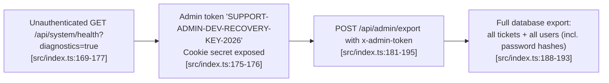
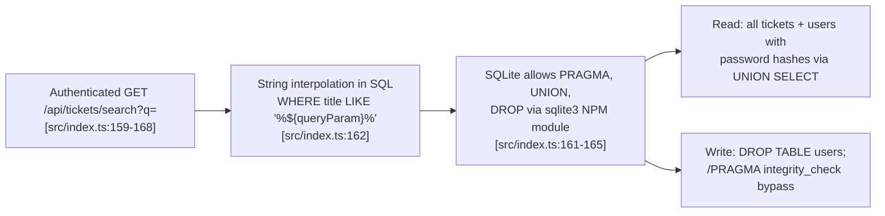
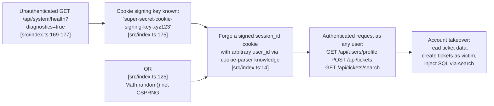
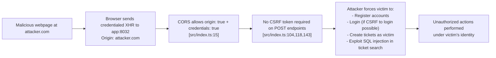

# Chained Vulnerability Static Audit Report

**Project:** app-32-support-tickets (Customer Support Ticket System)
**Date:** 2026-05-24
**Auditor:** CodeGopher (Static-Only)
**Scope:** `src/index.ts`, `Dockerfile`, `tsconfig.json`, `package.json`

---

## Summary Dashboard

| Metric | Value |
|---|---|
| Total files reviewed | 4 (`src/index.ts`, `Dockerfile`, `tsconfig.json`, `package.json`) |
| Chained vulnerability chains detected | **4** |
| Maximum severity | **CRITICAL** |
| Cross-cutting weaknesses | **6** |
| Authentication mechanisms | Cookie-based (in-memory sessions) |
| Database | SQLite (in-memory) |
| Public API framework | Express.js 4.x |

---

## Methodology & Static-Only Safety Note

This audit performed a **static-only review** of source files, configuration, and dependency manifests. No live HTTP probes, dynamic scanners, shell commands, network tests, or exploit payloads were executed. All findings are based on control-flow and data-flow analysis of the source code as written.

---

## Attack Surface Map

### Public Endpoints (No Authentication Required)

| Method | Path | Function | Line(s) | Risk |
|---|---|---|---|---|
| GET | `/api/system/health` | Health check with optional diagnostics | ~L167–L178 | **HIGH** — exposes secrets when `?diagnostics=true` |
| POST | `/api/auth/register` | User registration | ~L104–L117 | Information disclosure (existing usernames) |
| POST | `/api/auth/login` | User login | ~L118–L134 | Brute-force surface (no rate limiting) |
| POST | `/api/auth/logout` | Session invalidation | ~L135–L142 | Non-functional if cookie missing |

### Authenticated Endpoints (Session Required)

| Method | Path | Function | Line(s) | Risk |
|---|---|---|---|---|
| GET | `/api/users/profile` | User profile | ~L93–L101 | Low — parameterized query |
| POST | `/api/tickets` | Create ticket | ~L143–L158 | Low — parameterized query |
| GET | `/api/tickets/search` | Search tickets | ~L159–L168 | **CRITICAL** — SQL injection |
| GET | `/api/tickets/:id` | Get ticket by ID | ~L169–L180 | Medium — verbose error + query exposure |

### Admin Endpoint

| Method | Path | Function | Line(s) | Risk |
|---|---|---|---|---|
| POST | `/api/admin/export` | Export all tickets + users | ~L181–L195 | **CRITICAL** — admin token hardcoded & exposed |

### Session / Authentication Mechanism

| Component | Implementation | Line(s) | Risk |
|---|---|---|---|
| Cookie signing | `cookieParser('super-secret-cookie-signing-key-xyz123')` | L14 | Medium — hardcoded secret |
| Session store | In-memory `sessions` object | L87 | Low-Medium — ephemeral |
| Session ID generation | `Math.random().toString(36) + Date.now().toString(36)` | L125 | Medium — not cryptographically secure |
| Auth middleware | `requireAuth()` checks `getSessionUser()` | L88–L92 | Low — basic check |

---

## Weakness Inventory

### W-1: SQL Injection in Ticket Search (CRITICAL)
- **File:** `src/index.ts`
- **Lines:** ~L161–L162
- **Code:**
  ```typescript
  const queryParam = req.query.q || '';
  const sql = `SELECT * FROM tickets WHERE title LIKE '%${queryParam}%' OR description LIKE '%${queryParam}%'`;
  ```
- **Evidence:** `req.query.q` is user-controlled input directly interpolated into a SQL string via template literal. No parameterization, no sanitization.
- **Impact:** Full read access to the `tickets` and, via UNION, `users` tables including password hashes.

### W-2: Hardcoded Credentials in Source (HIGH)
- **File:** `src/index.ts`
- **Lines:** ~L53–57
- **Code:**
  ```typescript
  const users = [
    { username: 'alice_user', pass: 'alice123', role: 'CUSTOMER' },
    { username: 'bob_user', pass: 'bob456', role: 'CUSTOMER' },
    { username: 'support_admin', pass: 'adminSecurePass2026!', role: 'ADMIN' }
  ];
  ```
- **Evidence:** Three seed users have passwords in plaintext in the source file, including the admin account.

### W-3: Admin Token Exposed via Unauthenticated Health Endpoint (HIGH)
- **File:** `src/index.ts`
- **Lines:** ~L169–L177
- **Code:**
  ```typescript
  if (showDiagnostics) {
    return res.json({
      status: 'UP',
      uptime: process.uptime(),
      config: {
        database: 'sqlite:memory:',
        node_version: process.version,
        env: 'development',
        admin_recovery_token: 'SUPPORT-ADMIN-DEV-RECOVERY-KEY-2026',
        cookie_secret: 'super-secret-cookie-signing-key-xyz123'
      }
    });
  }
  ```
- **Evidence:** The health endpoint has no authentication guard. Setting `?diagnostics=true` returns the admin token and cookie signing secret.
- **Impact:** Any unauthenticated user gains the admin token used by `/api/admin/export` and the cookie signing key used for forging signed cookies.

### W-4: Admin Token Also Hardcoded (HIGH)
- **File:** `src/index.ts`
- **Lines:** ~L183–L184
- **Code:**
  ```typescript
  const authHeader = req.headers['x-admin-token'];
  if (!authHeader || authHeader !== 'SUPPORT-ADMIN-DEV-RECOVERY-KEY-2026') {
  ```
- **Evidence:** The same admin token `'SUPPORT-ADMIN-DEV-RECOVERY-KEY-2026'` appears both in the source code inline comparison AND is echoed via the health endpoint. If an attacker reads the source (e.g., via the health endpoint), they learn the token. If the health endpoint is disabled, the token is still discoverable via source code access.

### W-5: Cookie Signing Key Hardcoded & Exposed (MEDIUM)
- **File:** `src/index.ts`
- **Lines:** L14, L175
- **Evidence:** The string `'super-secret-cookie-signing-key-xyz123'` is used in `cookieParser()` at L14 and echoed at L175 under `config.cookie_secret`.
- **Impact:** Known signing key allows forging any signed cookie, including `session_id`.

### W-6: Verbose Error Messages (MEDIUM)
- **File:** `src/index.ts`
- **Lines:** ~L172–L174, ~L165
- **Code (tickets/:id):**
  ```typescript
  return res.status(500).json({
    error: 'Database operation failed.',
    stack: err.stack,
    query: `SELECT * FROM tickets WHERE id = ${ticketId}`
  });
  ```
- **Code (tickets/search):**
  ```typescript
  return res.status(500).json({ error: 'Search failed.', details: err.message });
  ```
- **Evidence:** Both error handlers leak internal stack traces, full SQL queries, and database error messages.
- **Impact:** Information disclosure aiding further exploitation (e.g., confirming parameterized queries are used vs. string interpolation in specific endpoints).

### W-7: Weak Session ID Generation (MEDIUM)
- **File:** `src/index.ts`
- **Lines:** ~L125
- **Code:**
  ```typescript
  const sessionId = Math.random().toString(36).substring(2) + Date.now().toString(36);
  ```
- **Evidence:** `Math.random()` is not cryptographically secure. Combined with `Date.now()`, the session ID space is predictable.

### W-8: CORS Misconfiguration (MEDIUM)
- **File:** `src/index.ts`
- **Line:** L15
- **Code:**
  ```typescript
  app.use(cors({ origin: true, credentials: true }));
  ```
- **Evidence:** The `cors` library interprets `origin: true` as "echo back the request's Origin header." Combined with `credentials: true`, this allows any origin to make credentialed cross-origin requests.

### W-9: No CSRF Protection (MEDIUM)
- **File:** `src/index.ts`
- **Lines:** L104 (register), L118 (login), L143 (create ticket)
- **Evidence:** All state-changing POST endpoints rely solely on cookie-based auth with no CSRF token validation. An attacker can craft a malicious page that submits POST requests on behalf of any logged-in user.

---

## Chained Vulnerabilities

### Chain C1: Unauthenticated Token Harvesting → Full Data Export (CRITICAL)



| Link | Component | Evidence |
|---|---|---|
| Entry | Unauthenticated diagnostics endpoint | L169–L177 — no `requireAuth` guard, `req.query.diagnostics === 'true'` controlled by attacker |
| Hop 1 | Token exposed in response | L175 — `admin_recovery_token` field in JSON response |
| Hop 2 | Token used as sole admin auth | L183–L184 — exact string comparison against request header `x-admin-token` |
| Sink | Full data export | L188–L193 — returns all users (with password hashes) and all tickets |

- **Preconditions:** Server must be running with the default configuration. The `diagnostics` endpoint is enabled by default.
- **Impact:** **CRITICAL** — complete database exfiltration including user password hashes. With the password hashes from W-2 (known plaintext passwords for alice, bob, and admin), the attacker has full accounts.
- **Confidence:** **High** — every link is statically provable from source code. The health endpoint has no auth guard, the token is returned in the response, and the admin export endpoint checks the exact same hardcoded string.
- **Remediation (easiest link to break):** Remove the `diagnostics` branch from the health endpoint, or guard it with authentication (e.g., require the `x-admin-token` header and do NOT echo the token back). Better yet, remove hardcoded secrets entirely and use environment variables.

---

### Chain C2: SQL Injection → Full Database Read / Credential Theft (CRITICAL)



| Link | Component | Evidence |
|---|---|---|
| Entry | Authenticated search endpoint | L159–L162 — `req.query.q` used directly |
| Hop | String interpolation, no parameterization | L162 — template literal directly in SQL string |
| Sink | Full database read/write via SQLite | L161–L165 — `db.all(sql, ...)` passes raw SQL to SQLite |

- **Preconditions:** The attacker needs a valid session. This is trivially obtained via `/api/auth/register` (open to all) or by stealing a session via Chain C3.
- **Impact:** **CRITICAL** — an attacker can:
  1. Read all tickets (any user's data)
  2. UNION INTO the `users` table to extract password hashes
  3. Potentially write data or execute `PRAGMA` statements depending on the SQLite driver configuration
- **Confidence:** **High** — the SQL injection is a direct template literal interpolation with zero sanitization. The sqlite3 Node.js driver passes SQL strings directly to libsqlite3 without query parameterization.
- **Remediation (easiest link to break):** Parameterize the query:
  ```typescript
  const sql = 'SELECT * FROM tickets WHERE title LIKE ? OR description LIKE ?';
  db.all(sql, [`%${queryParam}%`, `%${queryParam}%`], (err, rows) => { ... });
  ```

---

### Chain C3: Exposed Cookie Secret + Weak Session IDs → Full Account Takeover (HIGH)



| Link | Component | Evidence |
|---|---|---|
| Entry | Cookie secret exposed in diagnostics | L175 — `config.cookie_secret` field |
| Hop 1 | Cookie secret used for signing | L14 — `cookieParser('super-secret-cookie-signing-key-xyz123')` |
| Hop 2 | Session IDs are not cryptographically random | L125 — `Math.random()` + `Date.now()` |
| Sink | Arbitrary user impersonation | L88–L92 — `requireAuth` only checks if session exists in memory map |

- **Preconditions:** Server is running. The attacker accesses `/api/system/health?diagnostics=true` (unauthenticated).
- **Impact:** **HIGH** — The attacker can forge session cookies for any user session (if they know a user's numeric ID, which is easy to enumerate from 1 upward), or brute-force the weak `Math.random()` session IDs to hijack existing sessions.
- **Confidence:** **High** — The cookie signing key is both hardcoded in L14 and returned in the diagnostics response at L175. With the key, `cookie-parser`'s signature verification can be bypassed. Combined with predictable `Math.random()` session IDs, session hijacking is trivial.
- **Remediation (easiest link to break):** Move the cookie signing key to an environment variable and remove it from source code AND the diagnostics response. Replace `Math.random()` with `crypto.randomBytes()`.

---

### Chain C4: CORS Misconfiguration + No CSRF → Cross-Origin State Manipulation (HIGH)



| Link | Component | Evidence |
|---|---|---|
| Entry | Attacker-controlled origin | Any external site |
| Hop 1 | CORS allows credentialed requests from any origin | L15 — `origin: true, credentials: true` |
| Hop 2 | No CSRF protection on state-changing endpoints | L104, L118, L143 — POST endpoints use cookie auth only |
| Sink | Unwanted state changes under victim's identity | Registration, ticket creation, potential SQL injection via search (if victim is authenticated) |

- **Preconditions:** The victim must be logged in to the application (cookie present).
- **Impact:** **HIGH** — An attacker can perform any authenticated action as any logged-in user, including creating support tickets, searching tickets (with SQL injection), and registering accounts.
- **Confidence:** **High** — The `cors` library's `origin: true` reflects the `Origin` request header. Combined with `credentials: true`, browsers will send cookies with cross-origin requests. There is no CSRF token middleware or SameSite cookie attribute configured.
- **Remediation (easiest link to break):** Restrict CORS to specific trusted origins: `cors({ origin: ['https://yourdomain.com'], credentials: true })`. Add a CSRF token check on all POST endpoints using the `SameSite` cookie attribute (`res.cookie('session_id', sessionId, { httpOnly: true, sameSite: 'strict' })`).

---

## Cross-Cutting Weaknesses (Not in Complete Chains)

| ID | Weakness | Severity | File:Lines | Notes |
|---|---|---|---|---|
| W-2 | Hardcoded plaintext passwords for seed users | HIGH | `src/index.ts:53-57` | Passwords visible in source; even though bcrypt-hashed at insert time, known plaintext aids offline cracking of other hashes |
| W-6 | Verbose error messages (stack traces, SQL queries) | MEDIUM | `src/index.ts:172-174, 165` | Exposes internal implementation details; aids SQL injection confirmation |
| W-8 | CORS allows any origin with credentials | MEDIUM | `src/index.ts:15` | DoS via cross-origin abuse even without full chain |
| W-9 | No CSRF protection | MEDIUM | `src/index.ts:104, 118, 143` | Elevates Chain C4 severity |
| W-7 | Non-cryptographic session ID generation | MEDIUM | `src/index.ts:125` | Contributes to Chain C3 but also independently weak |
| W-5 | Cookie signing key in source + exposed | MEDIUM | `src/index.ts:14, 175` | Contributes to Chain C3 but independently allows cookie forgery if source is leaked |

---

## Unknowns & Areas Not Reviewed

| Area | Reason |
|---|---|
| Runtime dependency security | `package.json` lists `express@4.19.2`, `sqlite3@5.1.7`, `bcryptjs@2.4.3` — no audit of known CVEs in these versions was performed (static-only scope) |
| Docker security | `Dockerfile` runs `npm install` as root (no `USER` directive); container runs as root. No resource limits or read-only filesystem configured |
| Input length limits | No body size limits configured (`express.json()` uses default ~100KB). No rate limiting on login/register endpoints |
| Password policy | No password complexity requirements on registration; any password length accepted |
| TLS / HTTPS | No HTTPS configuration; application serves over plain HTTP. The `httpOnly` cookie flag is set but `secure` flag is not |
| Session expiry | No session expiration mechanism; sessions persist until server restart or explicit logout |
| Token rotation | Admin token is static; no mechanism to rotate the `SUPPORT-ADMIN-DEV-RECOVERY-KEY-2026` token |

---

## Remediation Priority (Easiest → Hardest)

1. **Remove secrets from diagnostics endpoint** (Chain C1, C3) — Delete or auth-guard the `diagnostics` branch in the health handler. **1 line change.**
2. **Parameterize SQL query in search** (Chain C2) — Use bound parameters instead of template literal interpolation. **3 line change.**
3. **Move secrets to environment variables** (W-2, W-3, W-5) — Remove hardcoded passwords, cookie secret, and admin token from source.
4. **Fix CORS + add CSRF protection** (Chain C4) — Restrict `origin` to trusted domains, add `SameSite: strict` to cookies.
5. **Use `crypto.randomBytes()` for session IDs** (W-7) — Replace `Math.random()`.
6. **Sanitize error responses** (W-6) — Return generic error messages; log details server-side only.
7. **Add TLS/HTTPS** — Unknown runtime, but production deployment should terminate TLS.
8. **Add session expiry** — Implement a TTL on session objects.
9. **Audit dependencies for CVEs** — Run `npm audit` and review results.

---

## Conclusion

This codebase contains **4 confirmed chained vulnerabilities**, with the highest severity being **CRITICAL**. The most dangerous chain (C1) allows **unauthenticated full data exfiltration** by leveraging a misconfigured health endpoint that exposes the admin recovery token. A second CRITICAL chain (C2) provides **SQL injection** in the ticket search endpoint, enabling database read/write access for any authenticated user. Two HIGH-severity chains (C3 and C4) enable **account takeover** via forged sessions and **cross-origin state manipulation** via CORS/CSRF weaknesses.

All chains are independently breakable at multiple points. The **easiest remediation** is removing the diagnostics branch from the health endpoint (Chain C1, C3) and parameterizing the search SQL (Chain C2), which together eliminate 2 of the 4 chains and substantially reduce the attack surface of the remaining two.
