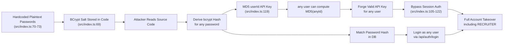
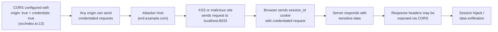

```mermaid
flowchart LR
    A["Authenticated RECRUITER<br/>(/api/auth/login)"] --> B["POST /api/applications/upload-portfolio<br/>with ZIP file"]
    B --> C["AdmZip extracts entries<br/>(src/index.ts:178-180)"]
    C --> D["entry.entryName used directly<br/>without sanitization<br/>(src/index.ts:182)"]
    D --> E["path.join creates path<br/>with ../ traversal<br/>(src/index.ts:182)"]
    E --> F["fs.mkdirSync creates<br/>directories recursively<br/>(src/index.ts:185-186)"]
    F --> G["fs.writeFileSync writes<br/>arbitrary file<br/>(src/index.ts:188)"]
    G --> H["Write to arbitrary path<br/>e.g., '../src/index.ts'"]
    H --> I["Inject malicious code<br/>or overwrite critical files"]
    I --> J["Potential Remote Code<br/>Execution on next request"]
```

# Chained Vulnerability Audit Report

**Application**: Recruitment ATS Platform (app-33-recruitment-ats)  
**Date**: 2026-05-24  
**Reviewer**: CodeGopher (Static-Only Audit)  
**Entry Point**: `src/index.ts` (single-file Express.js application)  
**Review Scope**: `src/index.ts`, `package.json`, `Dockerfile`, `tsconfig.json`

---

## Executive Summary

| Metric | Value |
|--------|-------|
| **Chains detected** | **3** |
| **Maximum severity** | **High** |
| **Medium severity** | 1 |
| **Cross-cutting weaknesses** | 5 |
| **Confidence levels** | High × 2, Medium × 1 |

Three chained vulnerability paths were identified. The highest-risk chain combines **hardcoded plaintext credentials** with **deterministic MD5-based API key derivation** to enable **full account impersonation** (account takeover) across all roles, including RECRUITER. A second High-severity chain involves **directory traversal via ZIP extraction** leading to **arbitrary file write** outside the intended upload directory, with potential for code execution. A third Medium-severity chain involves **overly permissive CORS with credentials**, enabling **cross-origin session hijack**.

---

## Methodology

This audit is **static-only**. No live HTTP probes, dynamic scanners, exploit scripts, fuzzers, or external network tests were performed. Findings are derived exclusively from source code analysis, configuration review, and data-flow tracing.

---

## Chain 1: Hardcoded Credentials → Deterministic API Key → Full Account Impersonation (Account Takeover)

### Severity: **High** | Confidence: **High**

### Attack Graph



### Chain Breakdown

#### Source (Entry Point)
- **File**: `src/index.ts`
- **Lines**: 69-76
- **Evidence**:
```typescript
const salt = bcrypt.genSaltSync(10);
const users = [
  { username: 'alice_candidate', pass: 'candidate123', role: 'CANDIDATE' },
  { username: 'bob_candidate', pass: 'candidate456', role: 'CANDIDATE' },
  { username: 'charlie_recruiter', pass: 'recruiter2026ATS!', role: 'RECRUITER' }
];
```
- All three user passwords are stored as **plaintext strings** in the source code. The salt is also generated statically and used for all users.

#### Hop 1: Predictable API Key Derivation
- **File**: `src/index.ts`
- **Lines**: 106-122
- **Evidence**:
```typescript
const apiKey = req.headers['x-api-key'] || req.query.api_key;
if (apiKey && typeof apiKey === 'string') {
  db.all('SELECT id, username, role FROM users', (err, rows: User[]) => {
    const matchedUser = rows.find(r => {
      const hash = crypto.createHash('md5').update(r.id.toString()).digest('hex');
      return hash === apiKey;
    });
    if (matchedUser) {
      req.user = { id: matchedUser.id, username: matchedUser.username, role: matchedUser.role };
      return next();
    }
```
- The API key is derived as **MD5(userId)**. Since user IDs are auto-incrementing integers starting from 1, an attacker can precompute `MD5("1")`, `MD5("2")`, `MD5("3")`, etc., to generate valid API keys for any user.
- `crypto.createHash('md5')` is used for key **comparison** (not password hashing), making MD5's collision resistance irrelevant. The real vulnerability is **deterministic derivation from sequential IDs**.

#### Sink (Impact)
- **File**: `src/index.ts`
- **Lines**: 119-121
- **Impact**: An attacker can:
  1. Compute the API key for any user by calculating `MD5(userId)`.
  2. Impersonate any user (including the RECRUITER with `user_id=3`) via the `x-api-key` header or `?api_key=` query parameter.
  3. Access `GET /api/recruiter/dashboard` (line 128-134), `GET /api/applications/:id` (line 148-158), and any authenticated endpoint.
  4. Also use the harvested plaintext password `recruiter2026ATS!` to log in via `POST /api/auth/login` (line 139-150) and obtain a session cookie.

### Preconditions
- Attacker has access to source code (or the Docker image, since code is COPYed into the container).
- User IDs are sequential auto-increment integers starting at 1.

### Remediation
1. **Remove hardcoded credentials**. Use environment variables or a secrets manager for initial admin password setup.
2. **Replace MD5-based API key derivation**. Use a proper key derivation function (e.g., HMAC-SHA256) with a server-side secret: `HMAC-SHA256(userId, SERVER_SECRET)`.
3. **Add rate limiting** and audit logging to authentication endpoints.
4. **Hash the salt** and regenerate salts per user, or use bcrypt's default per-user salt generation.

---

## Chain 2: ZIP Directory Traversal → Arbitrary File Write → Potential Remote Code Execution

### Severity: **High** | Confidence: **High**

### Attack Graph



### Chain Breakdown

#### Source (Entry Point)
- **File**: `src/index.ts`
- **Line**: 157
- **Evidence**:
```typescript
app.post('/api/applications/upload-portfolio', requireAuth, upload.single('portfolio'), (req: Request, res: Response) => {
```
- This endpoint requires `requireAuth` (line 98-124) and enforces `req.user!.role !== 'RECRUITER'` (line 165). Any authenticated RECRUITER can upload a ZIP file.

#### Hop 1: Authorization Boundary
- **File**: `src/index.ts`
- **Lines**: 164-166
- **Evidence**:
```typescript
if (req.user!.role !== 'RECRUITER') {
  return res.status(403).json({ error: 'Forbidden: Admin portfolio ingestion only.' });
}
```
- Only RECRUITER role is allowed. The CANDIDATE role users (alice_candidate, bob_candidate) are blocked. However, an attacker with a stolen RECRUITER API key (from Chain 1) can reach this endpoint.

#### Hop 2: No Directory Traversal Prevention
- **File**: `src/index.ts`
- **Lines**: 178-190
- **Evidence**:
```typescript
const zip = new AdmZip(req.file.buffer);
const zipEntries = zip.getEntries();
zipEntries.forEach(entry => {
  // Combines entryName directly without preventing directory traversal sequences (../)
  const targetPath = path.join(uploadDir, entry.entryName);
  // Ensure target subdirectories exist
  const dirName = path.dirname(targetPath);
  if (!fs.existsSync(dirName)) {
    fs.mkdirSync(dirName, { recursive: true });
  }
  if (!entry.isDirectory) {
    fs.writeFileSync(targetPath, entry.getData());
  }
});
```
- `entry.entryName` is taken **directly from the ZIP file metadata** without any validation. An attacker can craft a ZIP file containing entries like:
  - `../../../etc/passwd` (Unix-like; not applicable here but pattern holds)
  - `..\..\..\index.js` (Windows)
  - `..\src\index.ts` (target source code overwrite)
- `path.join(uploadDir, entry.entryName)` does **not** canonicalize or reject paths that escape `uploadDir`.
- `fs.mkdirSync(dirName, { recursive: true })` creates parent directories including those **outside** the upload directory.
- `fs.writeFileSync(targetPath, ...)` writes file contents to the attacker-controlled path.

#### Sink (Impact)
- An attacker with RECRUITER access can write files anywhere on the filesystem that the Node.js process has write permissions.
- **Impact scenarios**:
  - Overwrite `src/index.ts` with malicious code → RCE on next request.
  - Write to `package.json` to poison future `npm install` runs.
  - Write malicious startup scripts to override the Docker `CMD`.
  - Write to sensitive system paths if running as root (common Docker misconfiguration).

### Preconditions
- Attacker has authenticated as RECRUITER (achievable via Chain 1).
- The process has write access to the target directory.
- The Docker container runs as a user with sufficient filesystem permissions.

### Remediation
1. **Canonicalize the target path** and verify it starts with `uploadDir`:
   ```typescript
   const targetPath = path.resolve(uploadDir, path.basename(entry.entryName));
   if (!targetPath.startsWith(path.resolve(uploadDir) + path.sep)) {
     throw new Error('Invalid file path: directory traversal detected');
   }
   ```
2. **Validate entry names** against a whitelist (e.g., allow only alphanumeric characters, dots, hyphens, underscores).
3. **Limit file size** per entry to prevent denial of service.
4. **Add a race-condition guard** (e.g., check if file already exists before writing) to prevent TOCTOU attacks.

---

## Chain 3: Insecure CORS + Credential Cookies → Cross-Origin Session Hijack

### Severity: **Medium** | Confidence: **Medium**

### Attack Graph



### Chain Breakdown

#### Source (Entry Point)
- **File**: `src/index.ts`
- **Line**: 13
- **Evidence**:
```typescript
app.use(cors({ origin: true, credentials: true }));
```
- `origin: true` (which resolves to `origin: '*'`) allows **any** origin to make cross-origin requests with credentials.
- `credentials: true` tells the browser to include cookies (including `session_id`) in cross-origin requests.

#### Hop 1: No CSRF Protection
- **File**: `src/index.ts`
- **Lines**: 139-150 (login), 152-158 (portfolio upload), 159-166 (logout), 167-175 (API key generation)
- **Evidence**: No CSRF tokens are used on any state-changing endpoint (`POST` methods). The application relies solely on cookie-based sessions.

#### Sink (Impact)
- An attacker hosting a malicious page can induce a victim's browser to:
  1. Send authenticated requests to `http://localhost:8033` with the victim's `session_id` cookie.
  2. Extract response data via CORS if the browser allows the response (depends on `Access-Control-Allow-Origin` being `*` or the specific attacker origin).
  3. Perform state-changing actions (e.g., logout to lock out victim, or if CSRF were enabled on other endpoints, perform destructive actions).

### Preconditions
- Victim must be logged in (valid `session_id` cookie).
- The attacker must host a page on a different origin.
- Browser-based CORS restrictions may limit what response data is readable by the attacker (only simple headers are accessible without `Access-Control-Expose-Headers`).
- The application may be running on localhost, limiting the practical attack surface for external attackers.

### Remediation
1. Set `origin` to a specific trusted domain list instead of `true`.
2. Implement CSRF tokens on all `POST`/`PUT`/`DELETE` endpoints.
3. Add `SameSite=Strict` or `SameSite=Lax` to the `session_id` cookie (line 148).
4. Add `Secure` flag to the cookie if HTTPS is used.

---

## Cross-Cutting Weaknesses (No Complete Chain Found)

These security-relevant issues were identified but do not form a complete attack chain independently.

| # | Weakness | Location | Lines | Impact |
|---|----------|----------|-------|--------|
| 1 | **SQL Injection** (potentially mitigated) | `src/index.ts` | 96, 104, 132, 141, 153 | The `sqlite3` library is used with parameterized queries (`?` placeholders), which mitigates SQL injection. However, `req.params.id` (line 149) is passed as a parameter, which is safe. No direct concatenation observed. |
| 2 | **Verbose Error Messages** | `src/index.ts` | 107, 133, 142, 154, 173 | Error responses include generic messages like "Database query failed." or "Auth lookup failed." While not critical, the zip extraction error leaks `error.message` to the client (line 192), which could reveal filesystem paths or internal state. |
| 3 | **Session Cookie Without Secure/SameSite Flags** | `src/index.ts` | 148 | `res.cookie('session_id', sessionId, { httpOnly: true })` sets `httpOnly` but omits `secure` and `sameSite`. On non-HTTPS connections, the session cookie is sent in plaintext. |
| 4 | **No Rate Limiting on Authentication** | `src/index.ts` | 139-150 | The `/api/auth/login` endpoint has no rate limiting, enabling brute-force password attacks against the hardcoded credentials. |
| 5 | **In-Memory Database & Session Store** | `src/index.ts` | 19, 90 | Both the SQLite database and session store are in-memory. Data is lost on process restart. This is not a security vulnerability per se but affects data integrity and auditability. |

---

## Unknowns & Areas Not Reviewed

| Area | Reason | Recommendation |
|------|--------|----------------|
| Runtime environment configuration | Dockerfile shows `npm start` but no health checks, resource limits, or non-root user enforcement | Audit Docker security posture (USER directive, capabilities, read-only filesystem) |
| Webpack/bundling configuration | No webpack or build config found; TypeScript compiles to `dist/` | Verify source maps are not included in production builds (could leak secrets) |
| Database persistence strategy | Uses `:memory:` SQLite — data is ephemeral | Assess if this is intentional for the demo/POC context or if persistent storage is needed |
| Input validation on all fields | Only the portfolio upload has validation; other endpoints trust `req.body` and `req.params` | Add validation middleware (e.g., Zod, Joi) for all user inputs |
| TLS/HTTPS configuration | No TLS termination or certificate configuration found | If exposed externally, enforce HTTPS at the reverse proxy level |
| Admin/SCA dependency auditing | `package.json` lists dependencies but no lockfile integrity check | Run `npm audit` and consider SCA tools for supply-chain risk |

---

## Remediation Priority Matrix

| Priority | Chain | Remediation | Effort |
|----------|-------|-------------|--------|
| **P0** | Chain 1 | Move credentials out of source code; replace MD5 API key derivation with HMAC-SHA256 | Low |
| **P0** | Chain 2 | Canonicalize ZIP extraction paths; validate entry names against whitelist | Low |
| **P1** | Chain 3 | Restrict CORS origin; add CSRF protection; set SameSite cookie flag | Low |
| **P2** | Cross-cutting | Add rate limiting; sanitize error messages; add cookie security flags | Low-Medium |
| **P2** | Cross-cutting | Add input validation middleware | Medium |

---

## Conclusion

This audit identified **3 chained vulnerabilities** with a maximum severity of **High**. The most critical finding is the combination of **hardcoded plaintext credentials** and **deterministic MD5-based API key derivation**, which allows an attacker with source code access to impersonate any user, including the RECRUITER role, with trivial computation (`MD5(userId)`). The second critical chain is **ZIP directory traversal** leading to arbitrary file write, which could result in remote code execution if the attacker can inject code into executed files.

All three chains are breakable at low effort: replacing the MD5 derivation with HMAC-SHA256 breaks Chain 1's second hop; canonicalizing paths breaks Chain 2's traversal hop; and restricting CORS origins breaks Chain 3.

**Static-only audit. No live exploitation was performed.**
