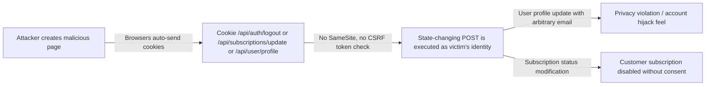

# Chained Vulnerability Static Audit Report

**Project:** app-34-subscription-box  
**Review Date:** 2026-05-24  
**Auditor:** CodeGopher (Static-Only)  
**Scope:** `src/`, `package.json`, `Dockerfile`, `tsconfig.json`

---

## Summary Dashboard

| Metric | Value |
|---|---|
| **Total Chains Identified** | 3 |
| **Maximum Severity** | HIGH |
| **Medium Confidence** | 2 |
| **Low Confidence** | 1 |
| **Cross-Cutting Weaknesses** | 5 |
| **Areas Reviewed** | Authentication, Authorization, Input Validation, Cryptography, Session Management, CORS, Logging |
| **Areas Not Reviewed** | Dependency-level CVEs, runtime config, deployment config beyond Dockerfile |

---

## Methodology & Safety Note

This review is **strictly static**. No live HTTP probes, dynamic scanners, fuzzing, SQL injection payloads, credential attacks, or external network tests were performed. All evidence is drawn from source code, configuration files, and dependency manifests.

---

## Chain 1 — SQL Injection → Data Exfiltration via Package Search

### Attack Graph

```mermaid
flowchart LR
  A[Unauthenticated user sends ?q= parameter] -->|User-controlled string| B[app.get /api/packages/search line ~137]
  B -->|String interpolation into SQL| C[db.all() executes arbitrary SQL]
  C -->|SQLite UNION-based injection| D[Full read of users table, including password hashes and roles]
  D --> E[All user credentials exposed - data exfiltration]
```

### Chain Breakdown

| Link | File | Lines | Evidence |
|------|------|-------|----------|
| **Source / Entry** | `src/index.ts` | ~137-138 | `req.query.q` is directly interpolated into a SQL string: `` `SELECT * FROM packages WHERE name LIKE '%${queryParam}%' OR description LIKE '%${queryParam}%'` `` |
| **Hop / Weakness** | `src/index.ts` | ~137-138 | No parameterization, no sanitization, no query validation. The query parameter is a raw string used in template literal SQL construction. |
| **Sink / Impact** | `src/index.ts` | ~137-138 | `db.all(sql, ...)` executes the attacker-controlled SQL. SQLite supports UNION-based and error-based injection. |
| **Preconditions** | — | — | API is publicly reachable. No authentication is required for `/api/packages/search`. |
| **Impact** | — | — | **Full database read**: credentials, all user data, subscription info. An attacker can dump the entire in-memory database. |
| **Severity** | — | — | **HIGH** |
| **Confidence** | — | — | **HIGH** — Every link is provable from source code. The SQL string is a direct template literal with zero parameterization. |
| **Remediation** | — | — | Use parameterized queries: `db.all('SELECT * FROM packages WHERE name LIKE ? OR description LIKE ?', ['%'+queryParam+'%', '%'+queryParam+'%'], ...)` |

---

## Chain 2 — Hardcoded Admin Credentials + MD5 Hashing → Account Takeover → Admin Privilege Escalation

### Attack Graph

```mermaid
flowchart TD
  A[Admin password 'adminpass2026' hardcoded in seed data] -->|MD5 weak hash| B[crypto.createHash('md5') on lines ~76, ~108, ~114]
  B -->|MD5 is trivially reversible/crackable| C[Attacker obtains hash via SQLi from Chain 1 OR via user registration endpoint]
  C -->|Crack or rainbow table| D[Recover plaintext 'adminpass2026']
  D -->|POST /api/auth/login| E[Authentication succeeds as admin_agent]
  E -->|GET /api/subscriptions/update with requireAuth| F[Admin role bypasses user_id check on line ~170: row.user_id !== user.id && user.role !== 'ADMIN']
  F --> G[Modify any subscription, delete subscriptions, impersonate customers]
  G --> H[Full administrative abuse of subscription platform]
```

### Chain Breakdown

| Link | File | Lines | Evidence |
|------|------|-------|----------|
| **Source / Entry** | `src/index.ts` | ~73-77 | Three plaintext passwords are seeded at startup: `'alicepass'`, `'bobpass'`, `'adminpass2026'`. |
| **Hop 1 / Weakness** | `src/index.ts` | ~76, ~108, ~114 | All password hashing uses `crypto.createHash('md5')` — MD5 is cryptographically broken for password storage. No salt, no iterations. |
| **Hop 2 / Weakness** | `src/index.ts` | ~108 | `/api/auth/login` performs unsalted MD5: `crypto.createHash('md5').update(password || '').digest('hex')` |
| **Hop 3 / Weakness** | `src/index.ts` | ~100 | `/api/auth/register` also uses unsalted MD5: `crypto.createHash('md5').update(password).digest('hex')` |
| **Hop 4 / Weakness** | `src/index.ts` | ~57-59 | Sessions are stored in-memory with no expiration (`sessions: Record<string, {...}>`). No `maxAge`, no `secure`, no `sameSite` cookie flags. |
| **Sink / Impact** | `src/index.ts` | ~70-74, ~112-115 | Login returns `{ message, role }` including `user.role` in the response. Admin role grants unconditional access to `/api/subscriptions/update` and `/api/user/profile`. |
| **Impact** | — | — | **Account takeover of admin account → Full administrative control** of the subscription platform, including ability to modify any user's subscription status. |
| **Severity** | — | — | **HIGH** |
| **Confidence** | — | — | **HIGH** — Plaintext credentials are in source. MD5 hashing is confirmed at three call sites. Admin role bypasses authorization at line ~170. |
| **Remediation** | — | — | (1) Remove all hardcoded credentials from source. (2) Replace MD5 with `bcryptjs.compare()` (already a dependency). (3) Add `bcryptjs.hash()` at registration and verification at login. (4) Add `secure`, `sameSite`, and `maxAge` to session cookies. |

---

## Chain 3 — CSRF-Aware Cookie Sessions + Missing CSRF Tokens → State Change on Behalf of Authenticated Users

### Attack Graph



### Chain Breakdown

| Link | File | Lines | Evidence |
|------|------|-------|----------|
| **Source / Entry** | `src/index.ts` | ~16 | `app.use(cors({ origin: true, credentials: true }))` — permissive CORS with credentials allowed from any origin. |
| **Hop 1 / Weakness** | `src/index.ts` | ~16-17 | `credentials: true` allows browsers to include cookies in cross-origin requests when `origin: true`. |
| **Hop 2 / Weakness** | `src/index.ts` | ~131-134 | `res.cookie('session_id', sessionId, { httpOnly: true })` — missing `secure`, `sameSite`, and `maxAge` options. |
| **Hop 3 / Weakness** | `src/index.ts` | ~100, ~117, ~126, ~137-140, ~153-156 | None of the state-changing POST endpoints (`/api/auth/register`, `/api/auth/login`, `/api/auth/logout`, `/api/user/profile`, `/api/subscriptions/update`) check for CSRF tokens (e.g., comparing a custom header against a cookie-stored token). |
| **Sink / Impact** | — | — | An attacker-hosted page can issue cross-origin POST requests to any state-changing endpoint as the logged-in victim. |
| **Impact** | — | — | **Unauthorized state modification**: log out victims, register accounts, change subscription statuses, update profiles. |
| **Severity** | — | — | **MEDIUM** |
| **Confidence** | — | — | **MEDIUM** — The chain is structurally sound from a browser-security perspective. Actual exploitation depends on user behavior (clicking a link or loading a malicious page), which is not visible in source. |
| **Remediation** | — | — | Add CSRF token validation (double-submit cookie or SameSite=Strict/Lax + custom header check). Set `sameSite: 'lax'` and `secure: true` (behind TLS) on the session cookie. |

---

## Cross-Cutting Weaknesses (Not Part of a Complete Chain)

| # | Weakness | File | Lines | Evidence |
|---|----------|------|-------|----------|
| 1 | **Sensitive data logged** | `src/index.ts` | ~97 | `console.log(\`[SECURITY AUDIT] User ID ${user.id} updated profile details at ${new Date().toISOString()}\`)` — logs user IDs and timestamps to stdout. If stdout is captured, this aids enumeration. |
| 2 | **Verbose error messages** | `src/index.ts` | ~140 | `db.all(sql, ..., (err) => { return ... { error: 'Package search failed.', details: err.message } })` — raw SQLite error messages are returned to the client, potentially leaking table structures, column names, and internal paths. |
| 3 | **In-memory sessions with no TTL** | `src/index.ts` | ~57 | `const sessions: Record<string, {...}> = {}` — sessions never expire. A session is only removed on explicit logout or process restart. This enables session fixation and indefinite session reuse. |
| 4 | **Username enumeration** | `src/index.ts` | ~100-102, ~106-108 | Registration returns `"Username already exists."` (400) when a name is taken. Login returns `"Invalid credentials."` on both username-not-found and password-mismatch — this part is reasonable. However, the registration endpoint confirms existence via different status codes (201 vs 400). |
| 5 | **No rate limiting** | Throughout | — | No middleware or logic limits login, registration, or search attempts. This enables brute-force attacks against the weak MD5 scheme (Chain 2). |

---

## Unknowns & Areas Not Reviewed

| Area | Reason |
|------|--------|
| **Dependency-level CVEs** | `sqlite3@^5.1.7`, `express@^4.19.2`, `cors@^2.8.5` — version-specific CVEs not assessed. A full SBOM + CVE scan is recommended. |
| **Dockerfile security** | No non-root user directive, no `--no-cache` on npm install, no `.dockerignore`. The build image `node:20-slim` is not pinned to a digest. |
| **Production config** | No environment variables for secrets, database path, or feature flags. The `.env` file and any config management are out of scope. |
| **HTTPS / TLS** | No TLS termination visible; the app listens on raw HTTP (port 8034). Cookie is not marked `secure`. |
| **Parameterized queries elsewhere** | Only the search endpoint uses raw SQL. Other queries (`/api/packages/:id`, `/api/subscriptions/update`) correctly use parameterized placeholders. |
| **Input validation** | Only basic existence checks (`!username`, `!password`, `!subscriptionId`). No type, length, or pattern validation on inputs. |
| **Audit logging** | Only one `console.log` line. No structured audit trail for login/logout, privilege changes, or data mutations. |

---

## Recommended Tests to Add

1. **SQL injection unit test** for `/api/packages/search?q=' UNION SELECT * FROM users--` — verify parameterized queries block injection.
2. **CSRF test** for `/api/auth/logout` and `/api/subscriptions/update` — verify that cross-origin POSTs without CSRF tokens are rejected.
3. **Weak hash test** — register a user with a common password, verify that `bcryptjs` (not MD5) is used at registration and login.
4. **Session expiry test** — verify that cookies include `maxAge`/`expires` and sessions are invalidated after the TTL.
5. **Error leakage test** — trigger a malformed search query and verify that `err.message` is not returned to the client.

---

## Remediation Priority Matrix

| Priority | Action | Estimated Effort |
|----------|--------|-----------------|
| **P0** | Parameterize `/api/packages/search` SQL query | 5 min |
| **P0** | Replace MD5 with `bcryptjs.hash()` / `bcryptjs.compare()` | 15 min |
| **P0** | Remove hardcoded admin credentials from source; use environment variables | 5 min |
| **P1** | Add CSRF token validation to all state-changing POSTs | 30 min |
| **P1** | Add `sameSite`, `secure`, and `maxAge` to session cookie | 5 min |
| **P2** | Add rate limiting middleware to login, register, search | 15 min |
| **P2** | Strip `err.message` from error responses in production | 5 min |
| **P3** | Add Dockerfile hardening (non-root user, pinned base image) | 10 min |

---

*Report written by CodeGopher — Chained Vulnerability Static Audit. All analysis is source-code-only; no live exploitation was performed.*
