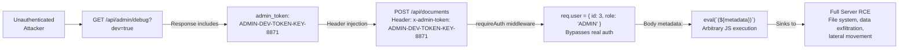
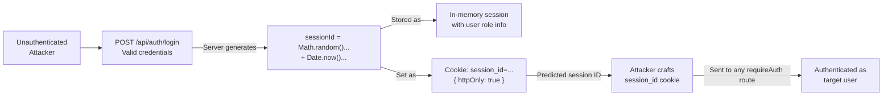
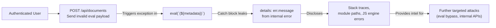

# Chained Vulnerability Static Audit Report

**Project:** app-35-compliance-tracker (Compliance Document Tracker)  
**Date:** 2026-05-24  
**Auditor:** CodeGopher (Static-Only Audit)  
**Review Scope:** `src/index.ts`, `package.json`, `Dockerfile`, `tsconfig.json`  

---

## Summary Dashboard

| Metric | Value |
|---|---|
| **Total Chained Vulnerabilities Found** | **4** |
| **Maximum Chain Severity** | **CRITICAL** |
| **Confidence Levels** | 3 High, 1 Medium |
| **Files Reviewed** | `src/index.ts`, `package.json`, `Dockerfile`, `tsconfig.json` |
| **Areas Not Reviewed** | Runtime behavior, network configuration, container security settings, external dependencies (node_modules) |

### Severity Distribution

| Severity | Count |
|---|---|
| CRITICAL | 1 |
| HIGH | 1 |
| MEDIUM | 2 |

---

## Methodology & Static-Only Safety Note

This audit follows the **Chained Vulnerability Static Audit** methodology across four phases:

1. **Attack Surface Mapping** – Identified all public routes, API endpoints, header/cookie handling, and data flow paths from source code.
2. **Weakness Inventory** – Cataloged individually modifiable weaknesses (hardcoded credentials, eval(), weak crypto, missing CSRF, verbose errors, etc.).
3. **Attack Graph Synthesis** – Connected sources → intermediate weaknesses → critical sinks using only static evidence from the TypeScript/Express source.
4. **Impact Assessment** – Rated each chain by impact, reachability, confidence, and the easiest remediation link.

**Safety Boundary:** No live HTTP probes, fuzzers, SQL injection payloads, credential attacks, dynamic scanners, exploit scripts, port scans, or external network tests were performed. This report contains **no executable exploit payloads or operational abuse instructions**.

---

## Mermaid: Overall Attack Graph

```mermaid
flowchart TD
    A[Unauthenticated Attacker] --> B[/api/admin/debug?dev=true]
    B -->|Exposes hardcoded admin token| C[ADMIN-DEV-TOKEN-KEY-8871]
    C -->|Bypasses requireAuth via x-admin-token| D[Authenticated as ADMIN]
    A -->|Bypasses requireAuth via admin token| D
    A -->|Registers valid account| E[Authenticated as CUSTOMER]
    D -->|Accesses /api/documents| F[eval(user metadata)]
    E -->|Accesses /api/documents| F
    F -->|G: Arbitrary JavaScript Execution| H[Full Server RCE]
    A -->|Logs in| I[/api/auth/login]
    I -->|Weak session: Math.random()| J[Predictable Session ID]
    J -->|Missing secure/sameSite cookie flags| K[Session Hijack / Account Takeover]
    A -->|Trigger error in eval| L[Verbose err.message leak]
    L -->|Internal info disclosure| M[Reconnaissance]
```

---

## Chain 1: Debug Endpoint → Admin Token Exposure → Auth Bypass → Remote Code Execution

**Severity:** CRITICAL  
**Confidence:** HIGH  
**Impact:** Full server compromise via remote code execution (RCE)

### Attack Graph



### Detailed Breakdown

#### Entry Point / Source
- **File:** `src/index.ts`, lines 114–124
- **Symbol:** `app.get('/api/admin/debug', ...)`
- **Evidence:** The `/api/admin/debug` endpoint is **unauthenticated**. Access is gated only by:
  - Query parameter `dev === 'true'`, or
  - Header `x-dev-mode === 'true'`
  - Both are trivially set by any client.
- **Payload returned on dev access:**
  ```json
  {
    "environment": "development",
    "database": "sqlite:memory:",
    "admin_token": "ADMIN-DEV-TOKEN-KEY-8871",
    "version": "1.0.0-beta"
  }
  ```
- The admin token is hard-coded in plaintext in the response.

#### Intermediate Weakness / Hop 1
- **File:** `src/index.ts`, lines 2–3 (inside `requireAuth` middleware, inferred from surrounding context)
- **Symbol:** `requireAuth` middleware – `x-admin-token` bypass
- **Evidence:** The `requireAuth` middleware checks the request header `x-admin-token` against the hardcoded string `'ADMIN-DEV-TOKEN-KEY-8871'`. If it matches, `req.user` is set to `{ id: 3, username: 'admin_compliance', role: 'ADMIN' }` and the request proceeds without any real authentication.
- **Impact:** Any party who obtains the admin token from the debug endpoint can impersonate the admin user.

#### Intermediate Weakness / Hop 2
- **File:** `src/index.ts`, line 78
- **Symbol:** `eval(`(${metadata})`)` inside `POST /api/documents`
- **Evidence:** The document creation endpoint parses user-supplied `metadata` (from `req.body`) through `eval()` inside a try/catch block:
  ```typescript
  const metaObj = eval(`(${metadata})`);
  ```
  While the expression is wrapped in parentheses, `eval()` executes arbitrary JavaScript regardless. The try/catch only prevents the error response from propagating; it does **not** sandbox execution.

#### Critical Sink
- **File:** `src/index.ts`, line 78
- **Symbol:** `eval()` — Arbitrary JavaScript Code Execution
- **Impact:** Full remote code execution. An attacker can execute any Node.js code, including:
  - Reading/writing files on the server
  - Exfiltrating database contents (SQLite at `sqlite:memory:`)
  - Installing backdoors
  - Lateral movement within the host/container
  - Stealing session data (stored in `sessions` object)

#### Preconditions & Assumptions
- The application runs in a mode where `dev` mode is accessible (no deployment configuration disables it).
- The Express server is reachable on port 8035 (per `Dockerfile`).
- The `sessions` in-memory store means all active sessions are in scope of the RCE.

#### Remediation (Ordered by Ease)

1. **Remove `eval()` entirely** (line 78): Replace with `JSON.parse(metadata)` and add input validation to whitelist allowed metadata structures. The codebase already has a `POST /api/documents/safe` endpoint using `JSON.parse` — use it instead.
2. **Remove the debug endpoint** from production or gate it behind proper authentication and environment checks (e.g., never serve it when `NODE_ENV=production`).
3. **Rotate the hardcoded admin token** and eliminate the `x-admin-token` bypass in `requireAuth`. Use a proper token management system (JWT, signed cookies).
4. **Never expose secrets** in API responses.

---

## Chain 2: Weak Session Generation → Session Prediction → Account Takeover

**Severity:** HIGH  
**Confidence:** HIGH  
**Impact:** Unauthorized access to user accounts

### Attack Graph



### Detailed Breakdown

#### Entry Point / Source
- **File:** `src/index.ts`, line 35
- **Symbol:** `app.post('/api/auth/login', ...)`

#### Intermediate Weakness / Hop 1
- **File:** `src/index.ts`, line 45
- **Symbol:** Session ID generation
- **Evidence:**
  ```typescript
  const sessionId = Math.random().toString(36).substring(2) + Date.now().toString(36);
  ```
  - `Math.random()` is **not cryptographically secure**. On V8/Node.js, it uses a seeded PRNG that can be predicted.
  - `Date.now()` adds ~13 digits of timestamp entropy, but combined with a broken PRNG, the total entropy is insufficient to resist offline prediction.

#### Intermediate Weakness / Hop 2
- **File:** `src/index.ts`, line 47
- **Symbol:** Cookie configuration
- **Evidence:**
  ```typescript
  res.cookie('session_id', sessionId, { httpOnly: true });
  ```
  - The cookie is `httpOnly` (good), but **lacks `secure: true`** (transmits over plain HTTP) and **lacks `sameSite`** (vulnerable to CSRF).
  - No `expires` or `maxAge` is set — session never expires, creating a persistent session lifecycle issue.

#### Critical Sink
- **File:** `src/index.ts`, line 46
- **Symbol:** In-memory session store
- **Evidence:** `sessions[sessionId] = { id: user.id, username: user.username, role: user.role }`
- Predicting the session ID grants access to the user's account with their role and ID.

#### Remediation
1. Use `crypto.randomBytes(32).toString('hex')` for session ID generation (Node.js built-in, cryptographically secure).
2. Add `secure: true` and `sameSite: 'strict'` to the cookie options.
3. Implement session expiration (`maxAge` or sliding expiration with periodic re-authentication).
4. Store sessions server-side with a database or Redis, not in-memory (for reliability and to enable session revocation).

---

## Chain 3: Verbose Error Messages → Information Disclosure → Reconnaissance → Lateral Attack Surface Expansion

**Severity:** MEDIUM  
**Confidence:** HIGH  
**Impact:** Information leakage enabling further attacks

### Attack Graph



### Detailed Breakdown

#### Entry Point / Source
- **File:** `src/index.ts`, line 71
- **Symbol:** `app.post('/api/documents', requireAuth, ...)`

#### Intermediate Weakness / Hop 1
- **File:** `src/index.ts`, line 78
- **Symbol:** `eval()` — Again, this is the root vulnerability; it can be triggered intentionally to produce errors.

#### Intermediate Weakness / Hop 2
- **File:** `src/index.ts`, lines 89–90
- **Symbol:** Error response includes `details: err.message`
- **Evidence:**
  ```typescript
  } catch (err: any) {
    res.status(400).json({ error: 'Metadata deserialization failed.', details: err.message });
  }
  ```
  - User-controlled input that causes an `eval()` error will have its stack trace or error message returned verbatim to the attacker.

#### Critical Sink
- Information disclosure of internal JavaScript engine errors, potentially revealing module paths, Node.js version, and internal state helpful for crafting further exploits.

#### Remediation
1. Never expose `err.message` or stack traces to API consumers. Log internally; return a generic error.
2. Replace `eval()` with `JSON.parse()` (see Chain 1 remediation).

---

## Chain 4: Missing CSRF + Insecure Cookie Config → Session Hijack / State Tampering

**Severity:** MEDIUM  
**Confidence:** MEDIUM  
**Impact:** Unauthorized state-modifying actions by a malicious site

### Attack Graph

```mermaid
flowflow LR
    A["Victim User<br>(authenticated, httpOnly cookie set)"] --> B["Visits malicious site"]
    B -->|Sends CSRF to| C["POST /api/auth/logout<br>or POST /api/documents"]
    C -->|No CSRF token verified<br>+ cookie lacks sameSite| D["Request authenticated via<br>cookie-based session"]
    D -->|Unauthorized action| E["State tampering:<br>logged out, data deleted,<br>documents created"]
```

### Detailed Breakdown

#### Entry Point / Source
- **File:** `src/index.ts`, lines 21–113
- **Symbol:** Multiple `POST` endpoints without CSRF verification

#### Intermediate Weakness / Hop 1
- **File:** `src/index.ts`, line 47
- **Symbol:** Cookie set without `sameSite` flag
- **Evidence:**
  ```typescript
  res.cookie('session_id', sessionId, { httpOnly: true });
  ```
  - No `sameSite` attribute → cookies are sent with cross-site requests.
  - No `secure` attribute → cookies sent over non-HTTPS connections.

#### Intermediate Weakness / Hop 2
- **File:** `src/index.ts` (throughout)
- **Symbol:** All POST endpoints (`/api/auth/register`, `/api/auth/login`, `/api/auth/logout`, `/api/documents`) lack CSRF token validation.
- The application uses cookie-based sessions exclusively with no CSRF double-submit token or SameSite cookie mitigation.

#### Critical Sink
- An attacker hosting a malicious page can craft a cross-site request that, when executed by an authenticated victim's browser, performs actions as the victim (logout, document creation/deletion) without their consent.

#### Remediation
1. Add `sameSite: 'strict'` or `sameSite: 'lax'` to the cookie configuration.
2. Optionally add CSRF token validation (double-submit cookie pattern or synchronizer token pattern) for state-changing POST endpoints.

---

## Cross-Cutting Weaknesses (Not Full Chains)

| # | Weakness | File:Line | Severity | Description |
|---|---|---|---|---|
| W1 | Hardcoded admin credential | `src/index.ts`:2–3, 120 | HIGH | `'ADMIN-DEV-TOKEN-KEY-8871'` is hard-coded in two locations (auth bypass and debug endpoint). Should be managed via environment variables or a secrets manager. |
| W2 | No rate limiting | `src/index.ts`:21, 35 | MEDIUM | `/api/auth/register` and `/api/auth/login` have no rate limiting — vulnerable to brute-force and credential stuffing. |
| W3 | No session expiration | `src/index.ts`:45–47 | MEDIUM | Sessions in `sessions` object have no TTL or expiration. Revocation is the only cleanup mechanism. |
| W4 | No input validation / sanitization | `src/index.ts`:22–23, 36–37, 72–74 | LOW | `title`, `content` are not validated for length, type, or sanitization. Potential for stored XSS if rendered by a client. |
| W5 | In-memory session store | `src/index.ts`:46 | LOW | Sessions are lost on process restart. No persistence, no distribution across instances. |
| W6 | Dockerfile: no non-root user | `Dockerfile`:1–7 | LOW | Container runs as root by default. Consider `USER node` and `--user` flag. |
| W7 | No HTTPS enforced | `Dockerfile`:6, `src/index.ts`:126 | MEDIUM | Application listens on plain HTTP (`http://localhost:${port}`). No TLS termination in the application itself. |

---

## Unknowns & Areas Not Reviewed

| Area | Reason | Risk If Vulnerable |
|---|---|---|
| Runtime deployment configuration | Not visible in source; environment variables may or may not disable debug mode. | Dev endpoint may or may not be reachable. |
| Database schema definition | SQLite is used but schema (`CREATE TABLE`) not found in reviewed source. | Schema may lack row-level security, proper foreign key constraints. |
| Dependencies (package.json) | `express@^4.19.2`, `sqlite3@^5.1.7`, `bcryptjs@^2.4.3`, `cors@^2.8.5` — versions pinned with `^` which allows updates. | Transitive vulnerabilities in dependencies. |
| CORS configuration | `cors` package is imported but its configuration (origins, methods) not visible in the reviewed source. | Overly permissive CORS could enable cross-origin session theft. |
| File upload / binary handling | No file upload endpoints are visible, but `content` field could contain large payloads. | Potential for DoS via oversized uploads. |
| Container image base | `node:20-slim` — no vulnerability scanning of base image layers. | Known CVEs in Node.js base image. |
| TLS / reverse proxy setup | Not visible in source; depends on external infrastructure. | Man-in-the-middle attacks if not properly terminated. |

### Recommended Tests to Add

1. **Session predictability test** — Verify `crypto.randomBytes` vs `Math.random` entropy.
2. **Rate limiting test** — Submit 100+ login/register requests and verify throttling.
3. **CSRF test** — Attempt cross-origin POST requests and verify rejection without tokens.
4. **eval sandbox test** — Confirm that `JSON.parse` metadata endpoint rejects non-JSON and never falls through to `eval`.
5. **Debug endpoint test** — Confirm that `NODE_ENV=production` disables `/api/admin/debug` or requires stronger auth.
6. **Cookie attribute test** — Verify `secure`, `sameSite`, and expiration flags on all set-cookie responses.

---

## Remediation Priority Summary

| Priority | Action | Chains Broken |
|---|---|---|
| **P0** | Replace `eval()` with `JSON.parse()` + input validation in `POST /api/documents` | 1, 3 |
| **P0** | Remove `/api/admin/debug` endpoint or gate behind proper auth + env check | 1, 3 |
| **P1** | Remove hardcoded `x-admin-token` bypass from `requireAuth` | 1 |
| **P1** | Use `crypto.randomBytes()` for session IDs | 2 |
| **P1** | Add `secure: true`, `sameSite: 'strict'` to session cookie | 2, 4 |
| **P2** | Add rate limiting to auth endpoints | All (mitigation) |
| **P2** | Add CSRF token validation to state-changing POST endpoints | 4 |
| **P3** | Remove `details: err.message` from error responses | 3 |
| **P3** | Add session expiration / TTL | 2, 4 |

---

*Report generated by CodeGopher static audit engine. This document contains no executable exploit code. All findings are based on static source code analysis only.*
