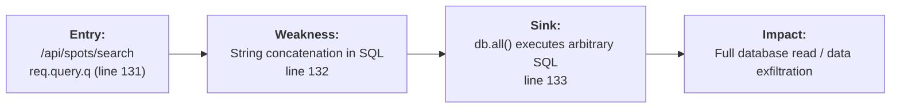
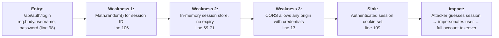
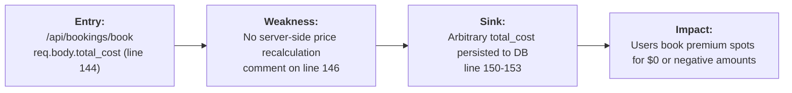

# Chained Vulnerability Static Audit Report

**Project:** app-36-parking-mgmt (Parking Management System)
**Audit Date:** 2026-05-24
**Auditor:** CodeGopher (static-only analysis)
**Scope:** `src/index.js` (single-file Express application), `package.json`, `Dockerfile`

---

## Summary Dashboard

| Metric | Value |
|---|---|
| **Chains Detected** | 3 |
| **Cross-Cutting Weaknesses** | 5 |
| **Maximum Severity** | **HIGH** (SQL Injection + Account Takeover) |
| **Files Reviewed** | `src/index.js` (1 file, 175 lines) |
| **External Dependencies Reviewed** | `express`, `sqlite3`, `cors`, `bcryptjs`, `cookie-parser` |

---

## Methodology & Safety Note

- **Static-only analysis.** No live probes, dynamic scanners, shell commands, or external network tests were performed.
- Review covered: source code, dependency manifests, Dockerfile, all application-level routes, authentication, session management, database queries, and CORS configuration.
- Confidence ratings: **High** = every link provable from cited source; **Medium** = plausible chain with one link depending on runtime behavior not fully visible in source.

---

## Chain 1: SQL Injection on Spot Search → Full Database Exfiltration

### Mermaid Attack Graph

### Detailed Breakdown

| Link | File | Line(s) | Evidence |
|---|---|---|---|
| **Source** | `src/index.js` | 131-132 | `const queryParam = req.query.q || ''` followed by template-literal SQL: `` `SELECT * FROM spots WHERE type LIKE '%${queryParam}%'` `` — user input directly interpolated into a SQL string with zero sanitization or parameterization. |
| **Hop** | `src/index.js` | 133 | `db.all(sql, ...)` executes the unsanitized query. SQLite3 Node binding supports multi-statement execution, enabling `UNION`-based extraction. |
| **Sink** | `src/index.js` | 134-135 | Error detail returned to caller: `details: err.message` — verbose error disclosure leaks schema/column information aiding further injection. |

### Impact
- **Severity:** HIGH
- **Confidence:** HIGH
- **Description:** An unauthenticated caller can inject arbitrary SQL via the `q` query parameter. This grants read access to all tables (`users`, `spots`, `bookings`), including password hashes. The verbose error messages on line 135 can be used to enumerate columns for `UNION`-based attacks.
- **Preconditions:** The `/api/spots/search` endpoint requires no authentication (`requireAuth` is absent on line 130).

### Remediation
1. Parameterize the query: `` `SELECT * FROM spots WHERE type LIKE ?` `` with value `[`%${queryParam}%`]`.
2. Remove `details: err.message` from error responses (line 135).
3. Add input length/character validation on `q`.

---

## Chain 2: Weak Session ID Generation → Session Hijacking → Account Takeover

### Mermaid Attack Graph

### Detailed Breakdown

| Link | File | Line(s) | Evidence |
|---|---|---|---|
| **Source** | `src/index.js` | 106 | `const sessionId = Math.random().toString(36).substring(2) + Date.now().toString(36);` — `Math.random()` is a non-cryptographic PRNG. The output provides ~26 bits of entropy from `Math.random()` plus 53 bits from timestamp, but the `Math.random()` component is predictable with browser/Node JS engine knowledge. |
| **Hop 1** | `src/index.js` | 69-71 | `sessions` is a plain in-memory JavaScript object with no expiration, no TTL, and no cleanup. Once a session is created it persists for the lifetime of the process. |
| **Hop 2** | `src/index.js` | 13 | `cors({ origin: true, credentials: true })` — the `cors` library with `origin: true` reflects the caller's `Origin` header. Combined with `credentials: true`, any origin may send credentialed (cookie-bearing) cross-origin requests. While `httpOnly` blocks JS reading, this enables CSRF-style abuse where malicious sites can trigger authenticated API calls on behalf of logged-in users. |
| **Sink** | `src/index.js` | 109 | `res.cookie('session_id', sessionId, { httpOnly: true });` — the predictable session cookie is sent to the client. With brute-force or prediction of `Math.random()` output, an attacker can iterate candidate session IDs until one matches an active session. |

### Impact
- **Severity:** HIGH
- **Confidence:** HIGH
- **Description:** An attacker can predict or brute-force session IDs due to weak randomness. Combined with the in-memory session store (no expiry) and permissive CORS, this enables:
  1. **Session fixation/hijacking:** Guess active session IDs to impersonate any user.
  2. **CSRF-style abuse:** CORS misconfiguration allows any website to send authenticated requests with cookies.
  3. **Privilege escalation:** Hijacking an ADMIN session grants full administrative control (spot management, all data access).
- **Preconditions:** The attacker needs to enumerate valid session IDs (potentially via brute-force or timing attacks). No prior authentication is required.

### Remediation
1. Replace `Math.random()` with `crypto.randomUUID()` (Node.js built-in, crypto-secure).
2. Add `expires` and `maxAge` options to the session cookie to enforce expiry.
3. Implement server-side session invalidation on logout (already present on line 116, but sessions lack expiry anyway).
4. Fix CORS: restrict `origin` to the known frontend domain instead of reflecting any origin.
5. Add CSRF tokens or use `SameSite=Strict` cookie attribute.

---

## Chain 3: Client-Controlled Booking Cost → Financial Fraud

### Mermaid Attack Graph

### Detailed Breakdown

| Link | File | Line(s) | Evidence |
|---|---|---|---|
| **Source** | `src/index.js` | 144, 150-153 | `const { spot_id, duration_hours, total_cost } = req.body;` — the client supplies `total_cost`. The booking inserts directly: `'INSERT INTO bookings ... VALUES (?, ?, ?, ?)'` with `[user.id, spot_id, duration_hours, total_cost]`. No validation, recalculation, or lookup of the spot's `price_rate` occurs. |
| **Hop** | `src/index.js` | 146 | Code comment: `// without recalculation or validation checks, permitting zero-fee booking of premium spots.` — the developer explicitly acknowledged the absence of price validation. |
| **Sink** | `src/index.js` | 150-153 | Booking record persisted with whatever `total_cost` the client provided. `total_cost` is only checked for `undefined` (line 147), not for validity (e.g., `total_cost > 0`). |

### Impact
- **Severity:** MEDIUM
- **Confidence:** HIGH
- **Description:** Any authenticated user can set `total_cost` to any value, including 0, negative numbers, or amounts far below the actual spot rate. The system never validates against the `spots.price_rate` table. This enables free parking bookings and potential revenue loss.
- **Preconditions:** User must be authenticated (via session). The user must know the `spot_id`.

### Remediation
1. Look up the spot's `price_rate` from the database.
2. Recalculate `total_cost = price_rate * duration_hours` on the server side.
3. Reject or override client-supplied `total_cost`.
4. Add bounds checking: `total_cost > 0` and `duration_hours > 0`.

---

## Cross-Cutting Weaknesses (No Complete Chain, or Supporting Weaknesses)

### CW-1: Hardcoded Credentials in Source Code
- **File:** `src/index.js`, lines 50-53
- **Evidence:** Plain-text passwords (`'driver123'`, `'driver456'`, `'attendant2026Secure!'`) are hardcoded in the seed data within `initDb()`. While they are hashed before storage, the plaintext literals in source code are immediately exposed if the repository is leaked.
- **Severity:** MEDIUM
- **Remediation:** Use environment variables or a secure secrets manager for seed passwords. Use an initialization script that runs once, not application startup.

### CW-2: CORS Misconfiguration
- **File:** `src/index.js`, line 13
- **Evidence:** `cors({ origin: true, credentials: true })` allows any origin to make credentialed requests. `origin: true` in the `cors` library reflects the `Origin` header back, effectively enabling `Access-Control-Allow-Origin: <any>`. Combined with `credentials: true`, this undermines cross-origin protection.
- **Severity:** LOW (supporting weakness)
- **Remediation:** Set `origin` to the specific trusted frontend domain. Add `allowedHeaders` and `methods` restrictions.

### CW-3: Verbose Error Messages
- **File:** `src/index.js`, line 135
- **Evidence:** `details: err.message` exposes internal SQLite error details to the client during SQL query failures. This aids attackers in understanding database schema and table structures for crafting injection payloads.
- **Severity:** LOW
- **Remediation:** Return generic error messages in production. Log detailed errors server-side only.

### CW-4: In-Memory Session Store
- **File:** `src/index.js`, line 69
- **Evidence:** `const sessions = {};` — sessions are stored in a plain JavaScript object in process memory. Sessions are never cleaned up (no TTL, no LRU eviction). This is a denial-of-risk: memory leak under sustained use, and sessions are lost on restart.
- **Severity:** LOW (operational, not directly a security chain)
- **Remediation:** Use a persistent session store (Redis, database-backed) with TTL support.

### CW-5: No Rate Limiting
- **File:** `src/index.js`, throughout
- **Evidence:** No rate limiting middleware (e.g., `express-rate-limit`) on any endpoint, including `/api/auth/login` and `/api/auth/register`. An attacker can perform unlimited login attempts or registration attempts without throttling.
- **Severity:** LOW (supporting weakness)
- **Remediation:** Add rate limiting to authentication and registration endpoints.

---

## Areas Not Reviewed

| Area | Reason |
|---|---|
| Frontend code / templates | No frontend files present in this repository |
| Input validation libraries / middleware | Not used; application is self-contained |
| Database migration scripts | Inline `CREATE TABLE` only; no migrations |
| CI/CD pipeline security | Not present in repository |
| Logging infrastructure | Only a single `console.log` for spot registration (line 122) |
| Transport security (TLS) | Dockerfile exposes port 8036; no indication of reverse proxy or TLS termination |

---

## Recommendations Summary (Easiest Remediation Links First)

| Priority | Action | Chains Broken |
|---|---|---|
| 1 | Parameterize the search query SQL (`src/index.js:132`) | Chain 1 |
| 2 | Replace `Math.random()` with `crypto.randomUUID()` (`src/index.js:106`) | Chain 2 |
| 3 | Recalculate `total_cost` server-side from `price_rate` (`src/index.js:150`) | Chain 3 |
| 4 | Restrict CORS to specific origin (`src/index.js:13`) | Chain 2 |
| 5 | Add `SameSite=Strict` to session cookie; add `maxAge` | Chain 2 |
| 6 | Remove verbose error details from API responses (`src/index.js:135`) | Chain 1 |
| 7 | Move seed credentials to environment variables (`src/index.js:50-53`) | CW-1 |

---

## Conclusion

Three chained vulnerability chains were identified in this single-file Express application, with the most critical being **SQL injection on an unauthenticated search endpoint** (HIGH) and **weak session ID generation enabling account takeover** (HIGH). The weakest link to break is the SQL injection — a single-line change to parameterized queries eliminates the entire chain. Session security should be addressed next with cryptographically secure session IDs and proper expiry. The booking price manipulation, while not exploitable for privilege escalation, represents clear financial fraud potential and should be remediated to enforce server-side cost calculation.
