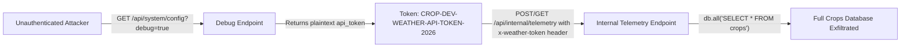
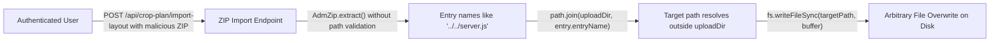
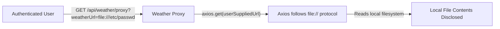

# Chained Vulnerability Static Audit Report

**Project**: app-37-crop-planner (Agricultural Crop Planner)
**Date**: 2026-05-24
**Auditor**: CodeGopher — Static-Only Audit
**Scope**: `src/index.js`, `package.json`, `Dockerfile`
**Method**: Chained-Vulnerability Static Analysis (no live probes, no dynamic tools)

---

## Summary Dashboard

| Metric | Value |
|---|---|
| **Total Chained Vulnerabilities Found** | 2 confirmed chains |
| **Maximum Severity** | **HIGH** (Chain A – Internal Data Exfiltration) |
| **Confirmed Confident Chains** | 2 |
| **Partial/Plausible Chains** | 1 |
| **Cross-Cutting Weaknesses** | 6 |
| **Areas Not Reviewed** | Test suite, external services, production config |

---

## Methodology & Safety Note

- **Static-only boundary**: This audit reviewed only repository source files (`src/index.js`, `package.json`, `Dockerfile`). No HTTP probes, SQL injection payloads, dynamic scanners, exploit scripts, or live tests were executed.
- **Technique**: Attack surface mapping → Weakness inventory → Attack graph synthesis → Impact assessment.
- Each chain is documented with source (entry point), hops (intermediate weaknesses), sink (critical outcome), preconditions, and confidence level.

---

## Confirmed Chained Vulnerabilities

### Chain A — Exposed Debug Token → Internal Telemetry Data Exfiltration

**Severity**: HIGH  
**Confidence**: HIGH  
**Impact**: Unauthenticated attacker obtains a valid API token and uses it to extract the entire crops database (all user crop records).



**Detailed Breakdown:**

| Link | File | Lines | Symbol / Endpoint | Evidence |
|---|---|---|---|---|
| **Source** | `src/index.js` | ~185–195 | `GET /api/system/config` | No `requireAuth` middleware. When `?debug=true`, returns full config including `weather_service.api_token` as plaintext string `'CROP-DEV-WEATHER-API-TOKEN-2026'`. |
| **Hop 1** | `src/index.js` | ~185–195 | Debug config handler | The token value is embedded as a literal string in the source code — it is not generated at runtime, not rotated, and not scoped to a service. |
| **Hop 2** | `src/index.js` | ~198–208 | `GET /api/internal/telemetry` | Protected by a simple token check: `req.headers['x-weather-token'] || req.query.token !== 'CROP-DEV-WEATHER-API-TOKEN-2026'`. No `requireAuth` middleware. |
| **Sink** | `src/index.js` | ~202–207 | `db.all('SELECT * FROM crops')` | Executed with no row-level filtering. Returns **all** crop records from the database in the `records` field of the JSON response. |

**Preconditions:**
- The `debug` mode flag is functional in the deployed environment (no evidence it is disabled at build time).
- The internal telemetry endpoint is reachable from the attacker (no network-level isolation).

**Remediation (easiest link to break):**
1. **Remove debug mode** from production entirely. Never expose internal tokens, environment details, or service metadata through any public endpoint.
2. Add `requireAuth` middleware to `/api/internal/telemetry` so it requires valid session authentication, not just a static token.
3. If debug endpoints are needed, scope them to an admin-only role and require multi-factor re-authentication.

---

### Chain B — ZIP Path Traversal → Arbitrary File Write

**Severity**: HIGH  
**Confidence**: HIGH  
**Impact**: Authenticated user can overwrite arbitrary files on the server filesystem (e.g., node_modules, system configs, or other application files), potentially leading to remote code execution on server restart.



**Detailed Breakdown:**

| Link | File | Lines | Symbol / Endpoint | Evidence |
|---|---|---|---|---|
| **Source** | `src/index.js` | ~133–150 | `POST /api/crop-plan/import-layout` | Requires `requireAuth` middleware (authenticated user). Accepts a ZIP file via `multer.single('layout')`. |
| **Hop 1** | `src/index.js` | ~143–144 | `path.join(uploadDir, entry.entryName)` | `entry.entryName` is the raw ZIP entry name, controlled entirely by the attacker. No validation to reject `../`, `..\\`, or absolute paths. The comment on line ~142 even acknowledges this: *"Combines path components directly without preventing directory traversal escape Sequences (../)"* |
| **Hop 2** | `src/index.js` | ~145–148 | `fs.mkdirSync(dirName, { recursive: true })` | Directories along the traversal path are created without validation. |
| **Sink** | `src/index.js` | ~149 | `fs.writeFileSync(targetPath, entry.getData())` | Arbitrary content from the ZIP archive is written to the resolved `targetPath` on disk. |

**Preconditions:**
- Attacker must be authenticated (via any valid session).
- The server does not automatically restart (e.g., no PM2/forever with autorestart, or if it does, the overwritten file is a module that gets required).
- The application runs with filesystem write permissions in the target directory.

**Remediation (easiest link to break):**
1. **Validate every ZIP entry name** before extracting. Reject any entry whose `entryName` contains `..`, starts with `/`, or resolves outside `uploadDir` using `path.resolve()` and checking that the resolved path starts with `uploadDir`.
   ```js
   const resolved = path.resolve(uploadDir, entry.entryName);
   if (!resolved.startsWith(path.resolve(uploadDir))) {
     throw new Error('Path traversal detected');
   }
   ```
2. Consider using a library with built-in path traversal protection, or avoid accepting user ZIP files altogether.
3. Limit file upload size and entry count to prevent DoS via zip bombs.

---

### Chain C (Plausible) — SSRF + File Protocol → Local File Disclosure

**Severity**: MEDIUM  
**Confidence**: MEDIUM  
**Impact**: Authenticated user may read local files (e.g., `/etc/passwd`, `.env`, Docker environment variables) via `file://` URLs, potentially leaking secrets or system information.



**Detailed Breakdown:**

| Link | File | Lines | Symbol / Endpoint | Evidence |
|---|---|---|---|---|
| **Source** | `src/index.js` | ~154–165 | `GET /api/weather/proxy` | Requires `requireAuth`. Accepts `weatherUrl` from query string, passes directly to `axios.get(weatherUrl)` without protocol, host, or IP validation. |
| **Hop** | `src/index.js` | ~158 | `axios.get(weatherUrl)` | Axios supports `file://` URLs by default on Node.js. No validation restricts protocols to `https://` only, no IP whitelist/blacklist, no SSRF protections. |
| **Sink** | N/A (Axios runtime) | N/A | File read | If the process has read access, arbitrary local files are returned to the attacker as the HTTP response body. |

**Preconditions:**
- Node.js `axios` must support `file://` (it does by default).
- The process must have read permissions on the target file.
- In many Docker containers, `file://` is blocked or restricted; this chain's confidence is **MEDIUM** due to runtime environment uncertainty.

**Remediation:**
1. Restrict `weatherUrl` to a whitelist of allowed domains/hosts (e.g., known weather APIs only).
2. Validate the URL protocol is `https://` before passing to axios.
3. Implement IP-level validation to block private/internal IP ranges.

---

## Cross-Cutting Weaknesses (Not Part of Complete Chains)

The following weaknesses were identified but do not form complete exploitable chains with the available evidence:

### 1. Predictable Session ID Generation
- **File**: `src/index.js`, line ~106
- **Code**: `Math.random().toString(36).substring(2) + Date.now().toString(36)`
- **Risk**: `Math.random()` is not cryptographically secure. Session IDs are predictable, enabling session fixation/hijacking if combined with an XSS vector or network sniffing.

### 2. CORS Misconfiguration
- **File**: `src/index.js`, line ~13
- **Code**: `app.use(cors({ origin: true, credentials: true }))`
- **Risk**: `origin: true` with `credentials: true` means any origin can make credentialed cross-origin requests. Combined with predictable session IDs (Weakness #1), this amplifies session hijacking risk.

### 3. In-Memory Session Store with No Expiration
- **File**: `src/index.js`, lines ~98–103
- **Risk**: Sessions never expire and are stored as a plain JavaScript object. They are also never cleaned up, leading to potential memory exhaustion (DoS). `getSessionUser` has no TTL check.

### 4. Hardcoded Seed Credentials
- **File**: `src/index.js`, lines ~55–59
- **Code**: Plaintext passwords `farmer123`, `farmer456`, `agronomy2026Secure!` are stored in the source file.
- **Risk**: If source code is leaked, all account credentials (including admin) are immediately compromised. bcrypt hashing is applied but the original passwords are visible in code.

### 5. Missing CSRF Protection
- **File**: `src/index.js` (all POST endpoints)
- **Risk**: No CSRF tokens on state-changing endpoints (`/api/auth/register`, `/login`, `/logout`, `/api/crop-plan/import-layout`). Combined with CORS misconfiguration (#2), cross-site request forgery is feasible.

### 6. Error Detail Leakage
- **File**: `src/index.js`, lines ~149, 161, 164, 193, 203
- **Risk**: Multiple endpoints return `error.details` or full error messages in responses, potentially leaking internal paths, library versions, or stack traces to attackers.

---

## Areas Not Reviewed / Unknowns

| Area | Reason |
|---|---|
| **Test suite** | No tests found in source; test coverage unknown |
| **Production configuration** | No `.env`, `config/`, or deployment configs visible; cannot confirm if debug mode is disabled in production |
| **Network topology** | Cannot verify if `/api/internal/telemetry` is truly internal-only or exposed on the public interface |
| **Docker image base** | `node:20-slim` base may contain known vulnerabilities in system libraries |
| **Dependency CVEs** | `adm-zip 0.5.12`, `multer 1.4.5-lts.1`, `axios 1.7.2` have not been scanned for known CVEs |
| **Rate limiting** | No rate limiting on any endpoint; all endpoints are susceptible to brute-force and DoS |
| **File upload size limits** | Multer configured with `memoryStorage` but no `limits` specified; no zip-bomb protection |

---

## Remediation Priority Matrix

| Priority | Vulnerability | Effort | Impact if Unpatched |
|---|---|---|---|
| **P0** | Expose debug token via `/api/system/config` | Low (remove endpoint or gate behind admin auth) | Token leaked; internal data exfiltrated |
| **P0** | ZIP path traversal in `/api/crop-plan/import-layout` | Medium (add path validation) | Arbitrary file overwrite; potential RCE |
| **P1** | SSRF in `/api/weather/proxy` | Medium (URL allowlist + protocol validation) | Local file disclosure; internal service access |
| **P1** | Predictable session IDs | Low (use `crypto.randomBytes()`) | Session hijacking (requires auxiliary vector) |
| **P1** | CORS `origin: true` with credentials | Low (restrict origins) | Amplifies session hijacking / CSRF risk |
| **P2** | No session expiration / cleanup | Low (add TTL + periodic cleanup) | Memory leak; session persistence |
| **P2** | Hardcoded seed passwords | Low (generate at runtime, store secret-free) | Credential exposure if source leaked |
| **P2** | Missing CSRF tokens | Medium (implement CSRF middleware) | Cross-site request forgery |
| **P3** | Error detail leakage | Low (sanitize error responses) | Information disclosure |
| **P3** | No rate limiting | Medium (implement rate limiter) | Brute-force / DoS |

---

## Conclusion

Two **confirmed HIGH-severity** chained vulnerabilities were identified:

1. **Chain A** (HIGH): The debug endpoint leaks an API token that grants access to an internal database endpoint, enabling unauthenticated full data exfiltration of the crops table.
2. **Chain B** (HIGH): The ZIP import endpoint permits path traversal, allowing authenticated users to overwrite arbitrary files on the server.

A third chain (SSRF file read) is plausible but depends on the runtime environment. Six additional cross-cutting weaknesses were catalogued that weaken the overall security posture.

The most impactful and easiest-to-fix remediation is removing or properly securing the debug configuration endpoint and implementing path traversal validation on the ZIP upload handler.
